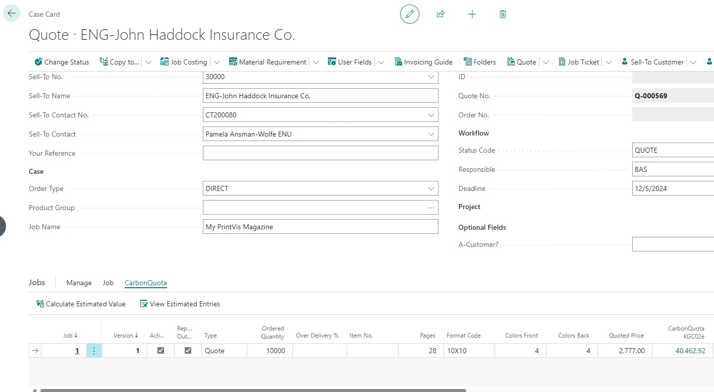
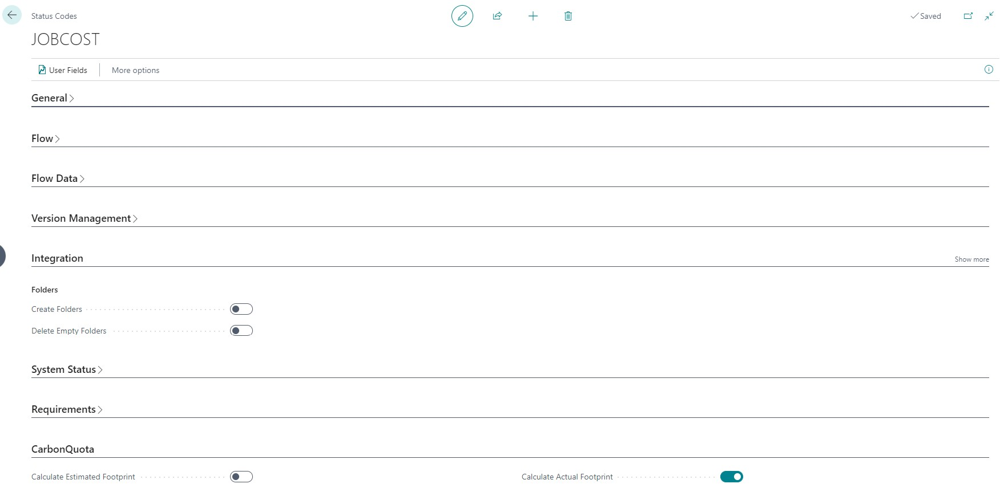
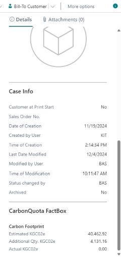

# Sending data to CarbonQuota

The CarbonQuota integration will send job details to CarbonQuota to calculate the carbon footprint of a job. It is possible to manually send jobs to CarbonQuota for calculation or to automatically send for calculation during a status code change. During a status code change it is also possible to send actual job costing data to CarbonQuota to calculate a carbon footprint based on actual time spent and materials consumed.

## Sending to CarbonQuota manually

On the PrintVis Case Card, in the Jobs section there is a new menu called CarbonQuota. In this menu it is possible to send each job manually to CarbonQuota to get the carbon footprint of the job using the **Calculate Estimated Value** action.

Once processed, a message will appear confirming the calculation was retrieved successfully or will return an error if one occurs.

## Sending to CarbonQuota automatically during status code change

If you want to automatically send a request to CarbonQuota to calculate estimated and/or actual carbon footprint values for a job, this can be done on the status code setup page in the CarbonQuota section.

Checking the Calculate Estimated Footprint checkbox will send all jobs for the case to CarbonQuota to calculate the estimated carbon footprint. 

Checking the Calculate Actual Footprint checkbox will send the case job costing data to CarbonQuota to calculate an actual carbon footprint based on time recorded and materials consumed for the job. 

## Viewing CarbonQuota carbon calculations within PrintVis

There are several places on the PrintVis case card where it is possible to view the CarbonQuota calculated values. 

- It is possible to add CarbonQuota KGC02e and CarbonQuota Additional Quantity KGCO2e values directly to the job line. These are the KGCO2e values calculated based on the job estimate.

- In the CarbonQuota menu in the jobs section of the case card, it is possible to **View Estimated Entries** to see the KGC02e values. If upgraded to the CarbonQuota CarbonConnect+ product, here is where the detailed breakdown of the KGCO2e values will reside.

- In the Case Card factbox there is a CarbonQuota Factbox section. This section will show the Estimated KGC02e and additional quantity KGCO2e values for the selected job line and will also show the actual, or job costing, KGCO2e value for the case.

## CarbonQuota data on Quote / Order Confirmation reports

On the Service Connections, CarbonQuota Setup option there is an action that can be used to **Update PrintVis Report Setup** automatically.

Using this automatic function ensures the quote and order confirmation reports conform to the CarbonQuota requirements for using their data on these external reports.

It is possible to manually add the CarbonQuota carbon data to these reports using the **PrintVis Report Setup** functionality and selecting the CarbonQuota KGC02e values from the Jobs table. When doing it manually it is important to follow these CarbonQuota requirements for using their data on these external reports.

- Use a **Powered by** CarbonQuota logo on any document that features their data.

- The unit of measure (KGCO2e) must be used when displaying the carbon footprint value. Example: 25,434 KGCO2e

- Correctly label or caption the value (Carbon Footprint). Example: Carbon Footprint: 25,434 KGCO2e
