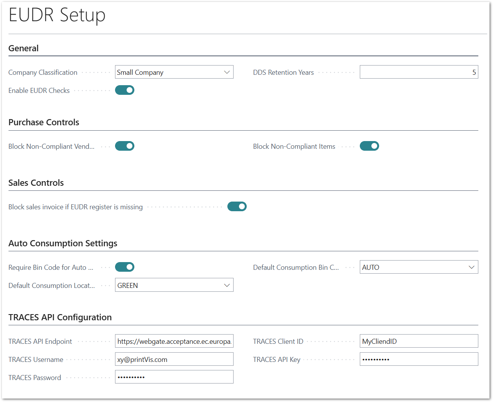
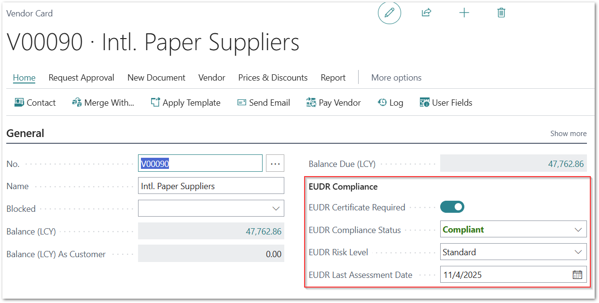
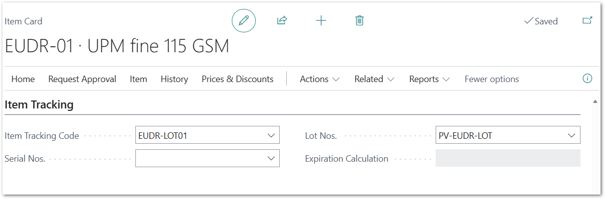
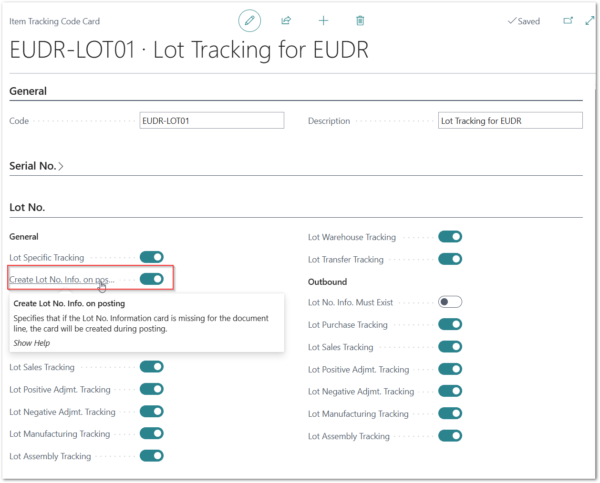
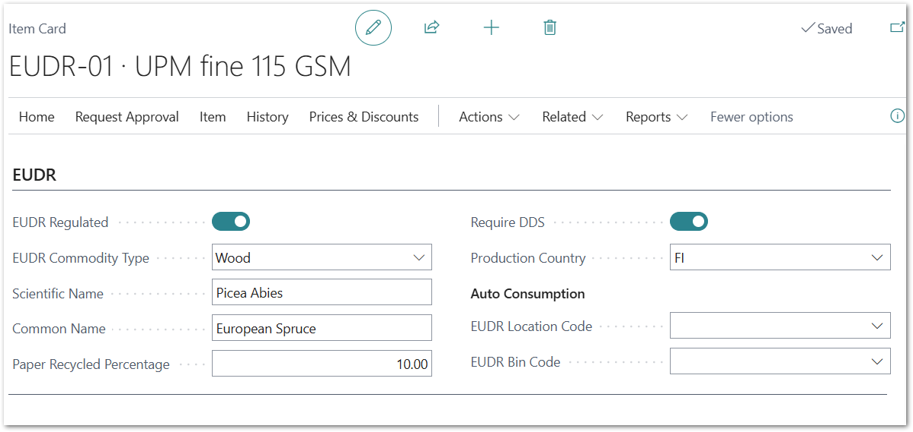
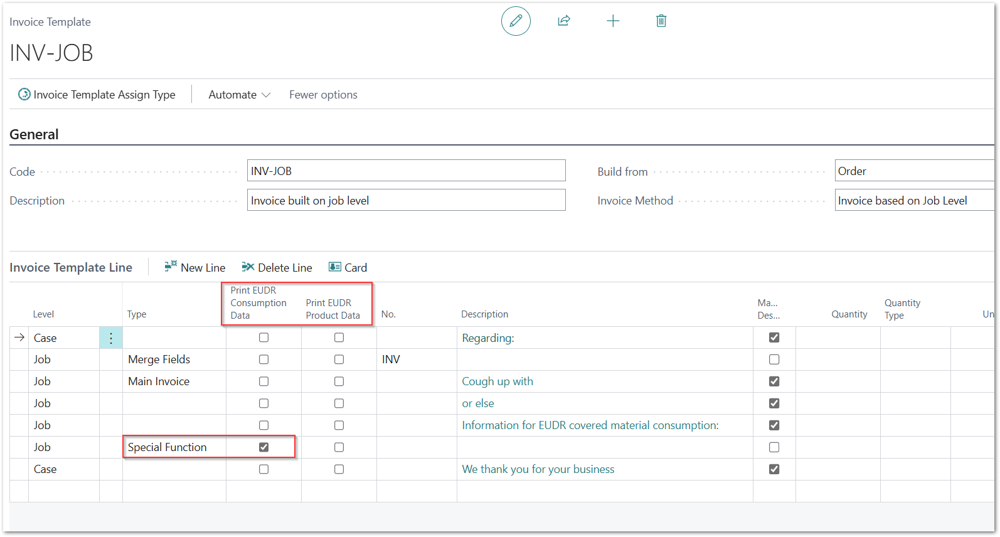

# Set up PrintVis EUDR

The following description guides you through the setup steps required to
activate the PrintVis EUDR functionality.

The most significant impact on the current material workflow is that the
item tracking functionality (lot tracking) in Business Central 365 must
be enabled for all products (items) covered by the EUDR. This ensures
that all EUDR Due Diligence Statement (DDS) numbers are tracked for
every transaction in the PrintVis EUDR Registers.

# EUDR Setup

The EUDR Setup is required to activate the PrintVis EUDR functionality.

The main settings define your company’s classification and enable
compliance checks with the EUDR, including the option to block
processing of non-compliant items.

## General Sales Controls

Select your company’s classification and enable the EUDR Checks field.

The DDS Retention Years field is set to 5 by default but can be changed
if necessary.

## Purchase Controls

It is recommended to enable both options under Purchase Controls to
block non-compliant vendors and non-compliant items.

## Sales Controls

It is recommended to block the creation of sales invoices if EUDR
registers are missing for the current order.

## Auto Consumption Settings

PrintVis Auto Consumption / Auto Job Costing can still be used with the
EUDR functionality.

Materials to be auto-consumed must be stored in a specific location/bin.
PrintVis automatically posts the consumption of estimated quantities on
a FIFO (First-In, First-Out) basis, taking lots one by one from the
defined location/bin.

## Traces API Configuration

To apply for DDS verifications or to validate existing DDS
verifications, you must have an account and authorization to use the EU
TRACES system.

You need to register with the EU to receive a user account and access
keys that allow you to use the TRACES system.

# Vendor Information

For vendors supplying products that include EUDR-covered materials,
compliance information must be maintained on the Vendor Card.

Enable EUDR Certificate Required, set the Compliance Status and Risk
Level.

The Last Assessment Date will update automatically whenever a change is
made.

# Item Setup

## Item Tracking

Lot tracking is required for each item that includes EUDR-covered
materials.

Create and select an Item Tracking Code and a Lot No. Series.

When setting up item tracking codes, ensure that the field Create Lot
No. Info on Posting is enabled. This is mandatory to capture the
required information throughout the system.

## Item specific EUDR settings

Complete the EUDR specifications for each item.

The number of available fields depends on the selected Commodity Type.

If the item is used for Auto Consumption / Auto Job Costing, you can
define an individual location/bin for each item if it differs from the
general EUDR setup.

# Invoice Templates

If EUDR tracking information should appear on invoices, you can include
it in the Invoice Template Setup in PrintVis.

Create a new line, set Type to SpecialFunction, and select whether EUDR
Consumption Data and/or EUDR Product Data should be displayed.

