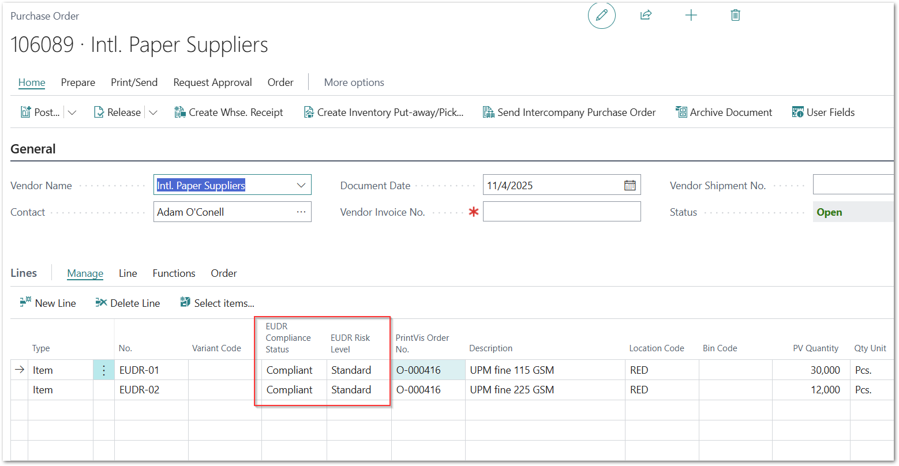
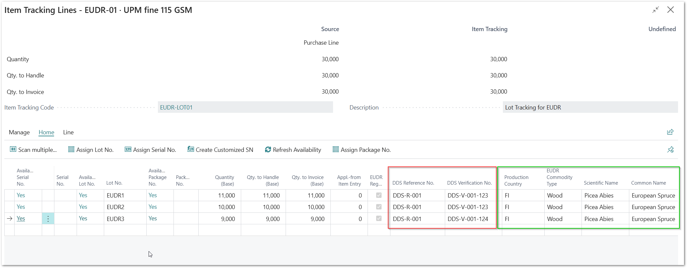
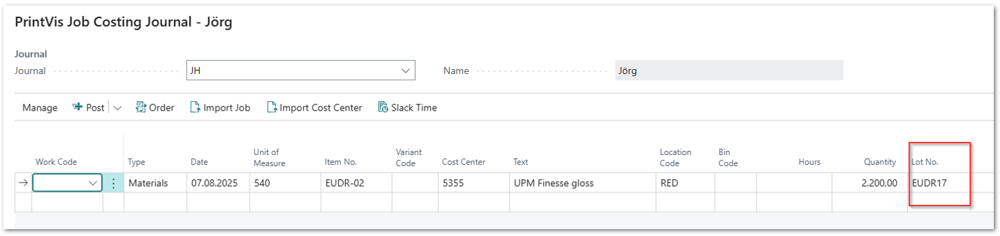
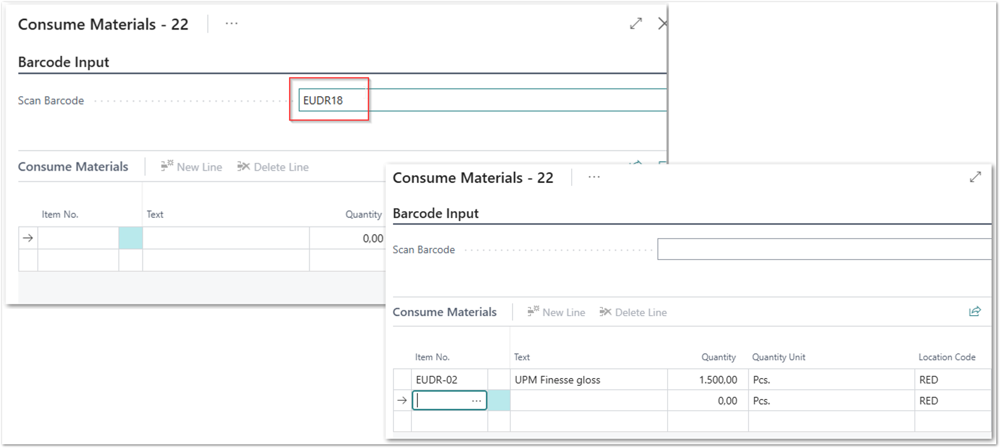
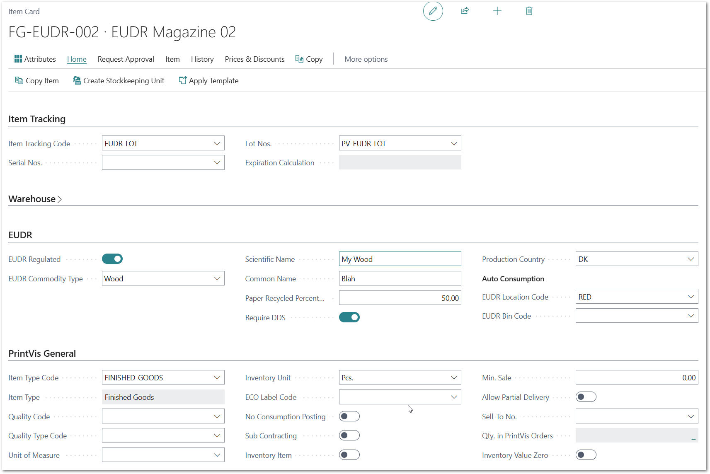
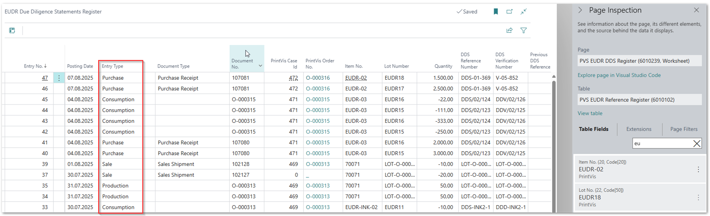
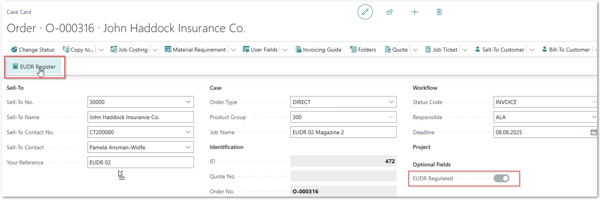
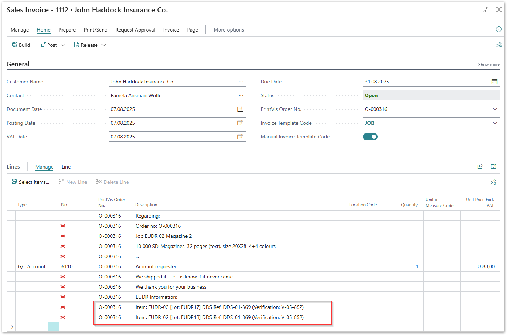

This usage guide describes all steps that can be performed with the
**PrintVis EUDR** functionality.

# Purchase Order and Purchase Lines

The EUDR Compliance Status and Risk Level can be selected for each
vendor.

Each lot-tracked item requires corresponding Item Tracking Lines.

## Item Tracking Lines.

For each item tracking line, the DDS Reference No. and DDS Verification
No. must be entered for EUDR tracking.

The remaining EUDR fields are automatically filled with the values from
the Item Card, ensuring that all required information is stored in the
item tracking lines.

After posting the purchase order, all tracking information is stored in
the Item Ledger Entries and the PrintVis EUDR Due Diligence Statements
Register.

# Consumption on PrintVis Orders

When posting Job Costing Journals or consuming lots on the PrintVis Shop
Floor, EUDR information is tracked in the related Item Ledger Entries
and in the PrintVis EUDR Due Diligence Statements Register.

## Job Costing Journal

Lot numbers must be provided for each posting involving lot-tracked
items.

In the PrintVis Job Costing Journal, the Lot No. field can be displayed
through personalization if it is not already visible.

## Shop Floor

On the Shop Floor Consume Lot page, enter or scan the barcode for a Lot
No. The corresponding quantity from that lot will be retrieved and can
then be posted.

## Auto Job Costing / Auto Consumption

PrintVis Auto Job Costing is supported with the EUDR functionality.

Postings are automatically processed and tracked according to the
configured locations and bins in your setup.

# EUDR Information for PrintVis Finished Good Items

If items are added to inventory/stock, they must be lot-tracked. It is
also necessary to register these products in the EU TRACES system to
obtain the DDS Reference No. and DDS Verification No. that must be
entered in each item tracking line.

Items that are covered by EUDR cannot be added to stock if the required
DDS Reference and Verification numbers are missing.

Example:

For an EUDR-covered finished good item, when posting the item to stock
(PrintVis Release Finished Goods), the DDS Reference No. and DDS
Verification No. must be entered in the item tracking lines.

# EUDR Due Diligence Statements Register.

All postings for EUDR-covered items are tracked in the EUDR Due
Diligence Statements Register for traceability and reporting.

The different Entry Types represent the covered processes. Using this
information, all required reporting can be completed.

## EUDR DDS Register information on the case card

The DDS Register can be opened directly from the Case Card, displaying
all related data for that case.

## EUDR DDS Register information with PrintVis Invoice Build on sales invoices

When building sales invoices through PrintVis Invoice Build, all related
EUDR tracking information is displayed on the invoice lines.

