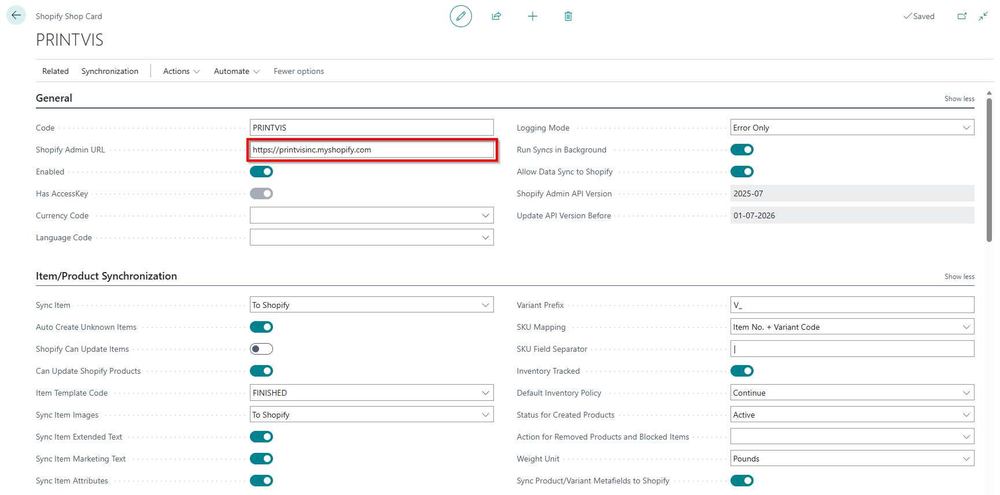
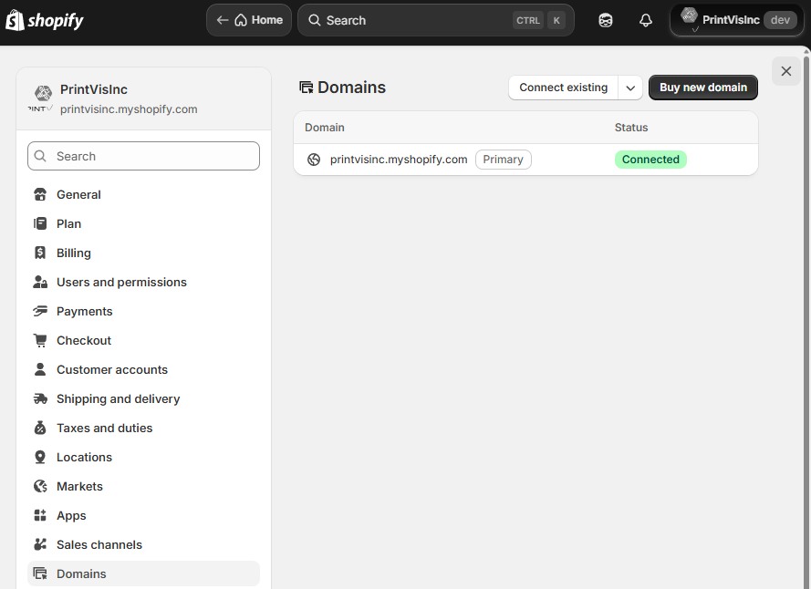
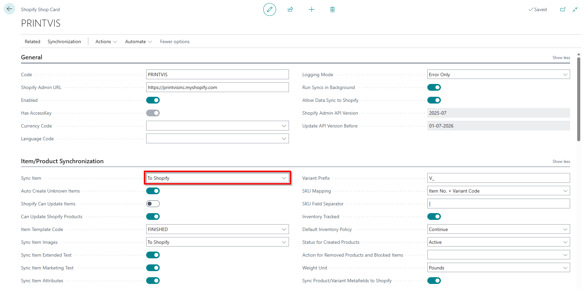
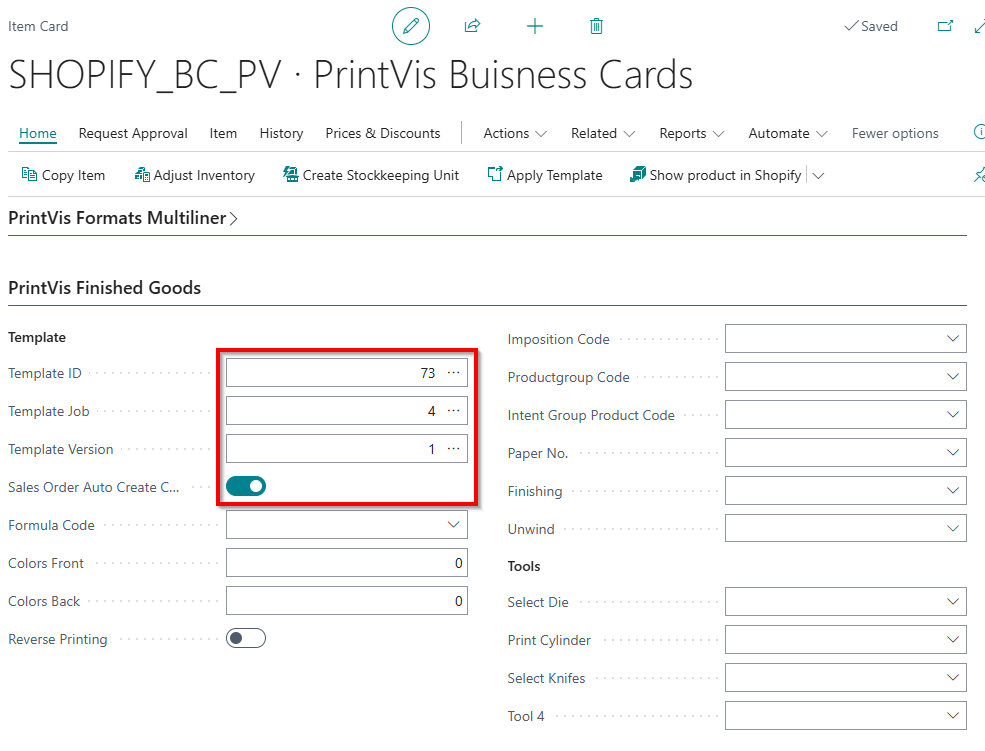
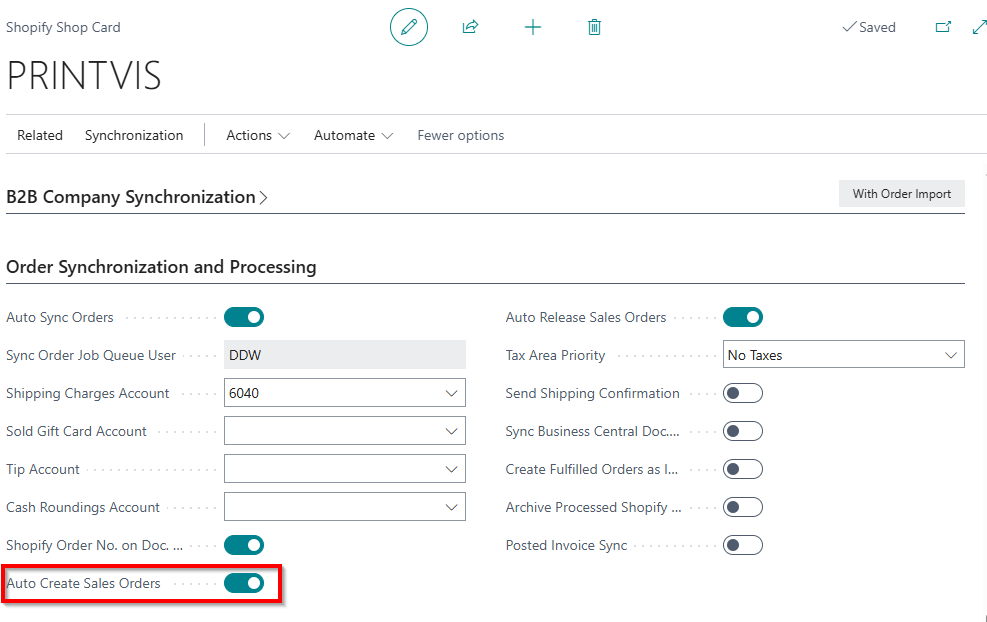
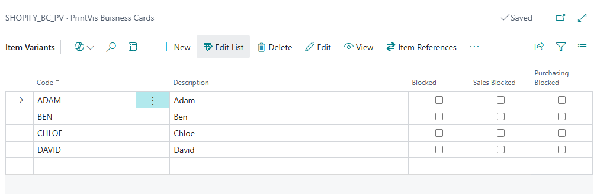
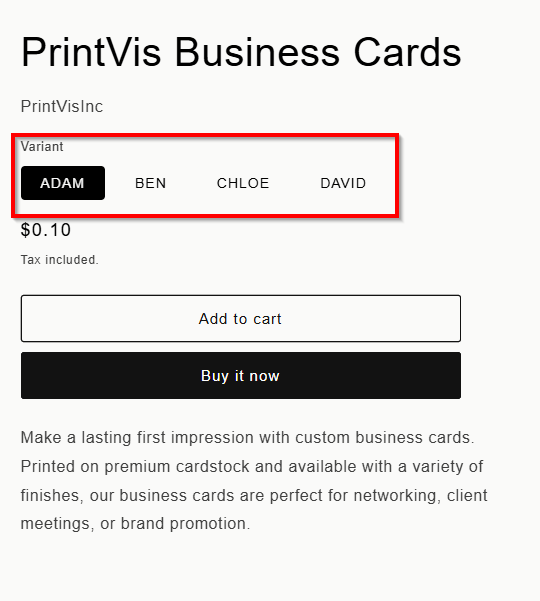
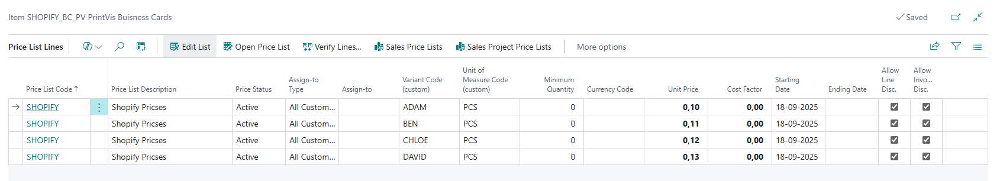
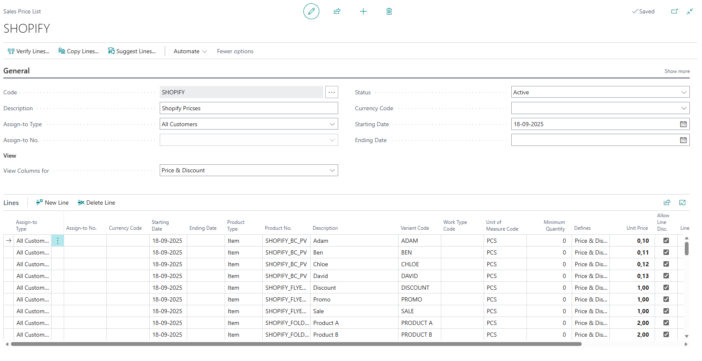

# Shopify – PrintVis Integration Documentation

Shopify can be integrated with PrintVis through standard Microsoft and PrintVis functionality.

PrintVis focuses on MIS and production management inside Business Central, while Shopify handles the online storefront experience. Using Microsoft’s standard Shopify Connector, orders placed in Shopify can flow into Business Central and then automatically convert into PrintVis Cases.

Shopify can seamlessly be integrated with **PrintVis**, by using
standard functionality. The integration consists of two main steps:

1.  Connecting Shopify with Business Central using Microsoft’s standard
    Shopify connector.

2.  Converting the resulting Business Central sales orders into PrintVis
    cases using the standard Sales Order to PrintVis Case functionality.

Here is the flow of information from Shopify to PrintVis:

Shopify Order
        ↓
Business Central Sales Order (via Shopify Connector)
        ↓
PrintVis Case (via Template + Auto Create Case)

## Step 1: Connect Shopify to Business Central

Business Central includes a **standard Shopify connector** that enables
synchronization of:

-   Customers

-   Items / products

-   Prices

-   Orders

-   Payments and shipping information

Once the connector is configured, Shopify orders can automatically be
created as **Sales Orders** in Business Central.

**Reference Documentation**

Microsoft Shopify Connector overview:
<https://learn.microsoft.com/en-us/dynamics365/business-central/shopify/shopify-connector-overview>

## Step 2: Convert Sales Orders to PrintVis Cases

After a Shopify order has been created as a **Sales Order**, it can be
processed using **PrintVis standard Sales Order integration**.

PrintVis provides standard functionality to manually or automatically
convert an item on a sales order into a PrintVis Case. By using
templates, you can streamline this process.

This means Shopify orders can flow directly into PrintVis.

**Reference Documentation**

PrintVis Sales Order integration:
<https://learn.printvis.com/PrintVis/SalesOrderIntegration/>

PrintVis Work with Templates:
<https://learn.printvis.com/Legacy/Estimation/WorkTemplates/>

## PrintVis example setup

After installing the **Shopify Connector Extension** in Business Central, the
next step is to create and set up a **Shopify Shop** in Business Central
and connect it to your Shopify store URL.

To automate the creation of a PrintVis case, we recommend creating the
items in Business Central first and letting them sync to Shopify.

On the **Item Card**, assign a **Template** and check **“Sales Order
Auto Create Case”**.

In **Shopify Shop**, check **“Auto Create Sales Order”**.

Now, when an order comes in from Shopify:

-   The **Shopify Shop** automatically creates a sales order.

-   If the items on the order have the setting enabled, the **Item
    Card** will automatically create a **PrintVis Case**.

It is also possible to have variants of an item, but you cannot assign
separate templates for the variants, all variants will follow the
template of the main item.

In Shopify it will look like this

Sales Prices are also handled in BC and can be synced to Shopify, either
from the Item Card

or from a Sales Price List

