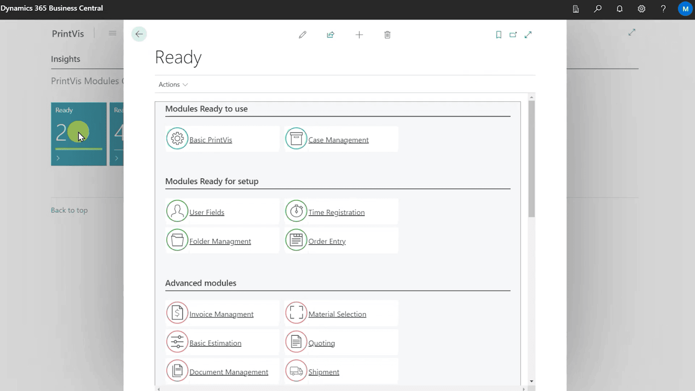

# PrintVis Onboarding – Overview

Setting up PrintVis usually requires manual setup from the PrintVis
partners' side. Often this setup time is spent on basic settings which
do not provide additional value to the specific customer but are more
generic and address the customer's industry or type of business. This
can be costly for the customer and a bottleneck for partners.

PrintVis Onboarding attempts to facilitate a do-it-yourself experience
with the system, as Microsoft does with their own onboarding experience
for Business Central.

PrintVis Prospects can easily get started with a trial of PrintVis and
Business Central and, following our easy onboarding steps, go live in
increments. The idea is to think of PrintVis as a complete system built
of interconnected modules, some of which are reliant on information from
other modules and must be set up according to their dependencies. Some
of the more advanced modules require help from an experienced PrintVis
Implementation Partner.

Available entry-level modules are:

-   Basic Setup

-   Case Management

-   Folder Management

-   User Fields

-   Time Registration

-   Order Entry

# PrintVis Self-Service Modules

We are continuously working on more modules to improve the customer
experience and provide more and more do-it-yourself modules. The
overview of modules is documented below and separately for each module.
A detailed setup and usage documentation is provided.

## Get Started Intro Video and Setup Structure

The PrintVis Onboarding Profile displays the following information:

When clicking on the “Get started” button, an intro video is provided
that describes the idea and an overview of the setup. Watching the
3-minute video is a great start with PrintVis.

The tiles below the “Get started” section change dynamically based on
the setup progress. All modules have dependencies, and the setup can
only be started if the setup of preceding modules has been finalized.
Click on any tile to see the available modules. Depending on the tile
the modules will be listed in a different sequence.

The status for a module can be:

-   Ready

    -   The setup is finished but can be opened again for changes.

-   Setup in progress

    -   The setup is started and can be opened again to be finalized.

-   Ready for setup

    -   The setup can be started because the setup for all preceding
        modules has been finalized.

-   Requires other modules

    -   The setup cannot be started until all preceding modules have
        been finalized.

## Modules Overview

Click on any tile to see the available modules. Based on the tile
selected the modules will be listed in a different sequence. The
selected modules will be shown at the top of the list.

Click on the desired module to open the setup.

Please note: To set up “Advanced modules” it is required to involve a
certified PrintVis partner. Information about PrintVis partners can be
found here: <https://printvis.com/solution/how-to-buy/>.

Please contact PrintVis (<Info@PrintVis.com>) for support in
finding/selecting a partner.

## <a href="../0100-PVSOnboarding-Basic-Setup/" target="_self">Basic Setup Module</a>

With this module you will create:

-   Your basic company information and settings such as

    -   Name, Address, Bank information

-   Individual users based on their job profile

This setup is a prerequisite to start any other module.

## <a href="../0200-PVSOnboarding-CaseMgmt/" target="_self">Case Management Module</a>

With this module you will create:

-   The structure for requests, quotes, and orders, such as

    -   Departments

    -   Product groups

    -   Status codes

    -   Etc.

## <a href="../0500-PVSOnboarding-FolderMgmt/" target="_self">Folder Management Module</a>

With this module you can set up PrintVis to create a folder structure
and to store files on your company’s Microsoft SharePoint or Microsoft
OneDrive storage.

## <a href="../0300-PVSOnboarding-UserFields/" target="_self">User Fields Module</a>

With this module you can set up fields for any kind of use. These fields
can contain predefined text blocks such as information to a customer or
to the production floor about prepress, print, and other areas - based
on the existing departments.

## <a href="../0400-PVSOnboarding-TimeReg/" target="_self">Time Registration Module</a>

With this module you can set up a simple time registration input for
your staff. Basic work types can be created and the time spent can be
registered. This module is a limited module used only for time
registration.

This module does not cover production costs or full shop floor data
collection. These can be set up in a later step with the shop floor
module which requires the setup of cost centers and their hourly rates.
