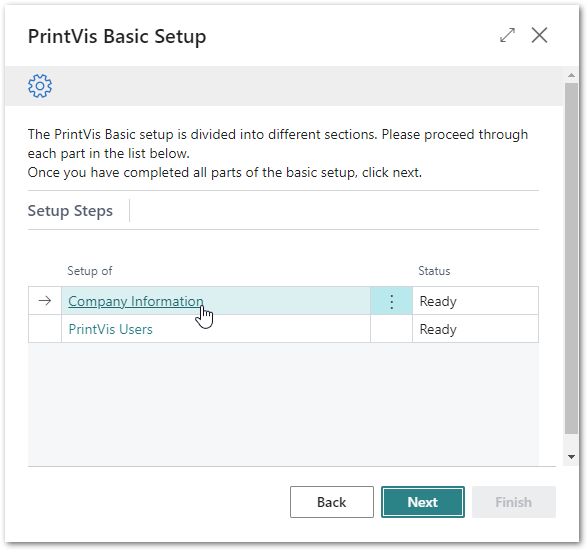

# PrintVis Onboarding – Basic Setup

This documentation is a supporting manual on how to use the PrintVis
Onboarding – Basic Setup. It describes the required setup steps for this
module.

### Basic Setup Module

This setup is a prerequisite for starting any other module.

Click on the “Ready” Tile to see the modules.

And then on “Basic PrintVis” to get started.

The “Welcome” screen will be displayed.

Please read the instructions and hit the “Next” button when you are
ready to start.

Please note:  
Plan enough time to be able to finish a full step for each setup. This
may require 15- 30 minutes.

In some cases you will see another screen because of the new company
setup.

Press “OK”, accept the terms & conditions after reviewing them and hit
the button “Get started”

With this module you will create:

-   Your basic company information and settings such as:

    -   Name, Address, Bank information

-   Individual users based on their job profile

On the next screen you can click on the available setup steps.  
The status column shows either:

-   Ready for setup

    -   If this step has not been started or finished.

-   Ready

    -   If this step has been finished.

After finalizing the setup of the PrintVis Basic Module the following
module is available for setup:

-   Case Management Module
