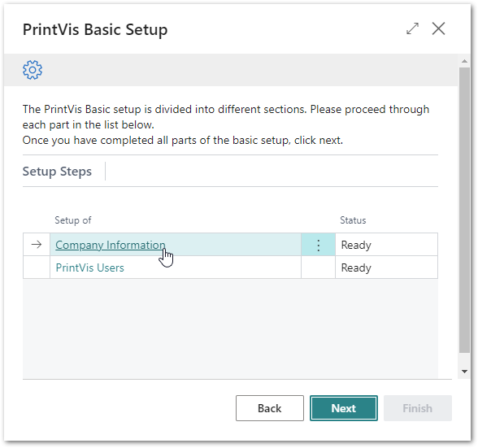
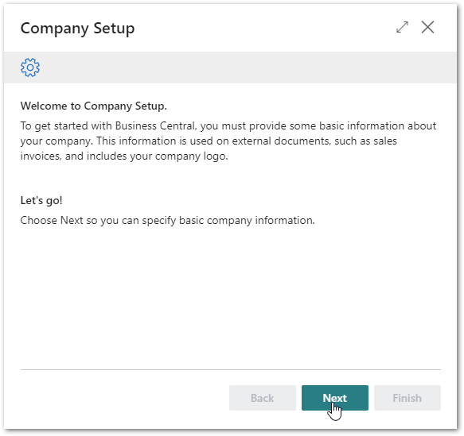
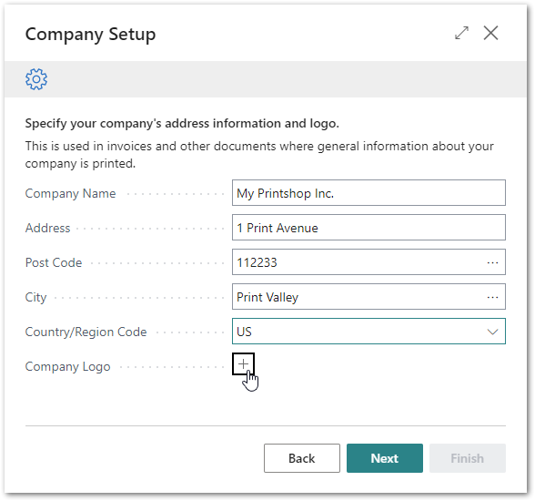
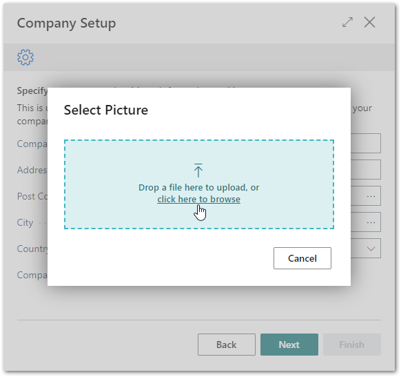
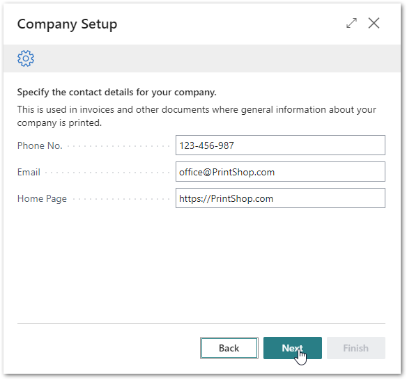
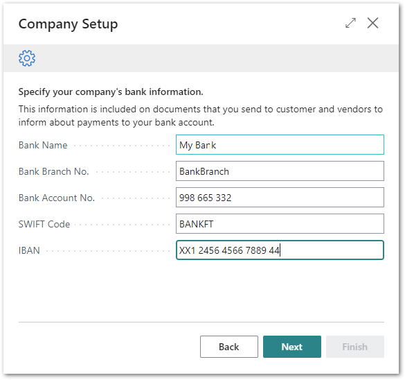
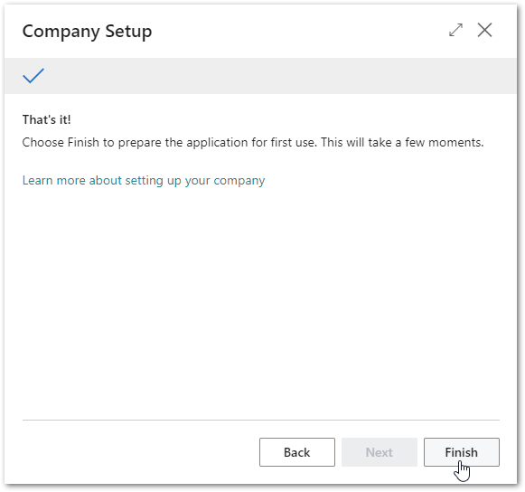

# PrintVis Onboarding – Company Information

This documentation is a supporting manual on how to use the PrintVis
Onboarding – Basic Setup – Company Information. It describes the
required setup steps for this module.

### Company Information Setup

Click on “Company Information” to get started. In this setup your basic
company information and settings such as Name, Address, and Bank
information must be entered.

Please note: This environment is set up only for your personal test and
trial experience. The data is secure and not available to the public!
Learn more about security by searching for “[Business Central
security](https://learn.microsoft.com/en-us/dynamics365/business-central/dev-itpro/security/security-application)”
in your browser.

You also have the option to upload your company logo to be displayed on
customer facing documents and other places.

**Status Information**

-   Ready for setup

    -   If this setup topic has not been started or finished.

-   Ready

    -   If this setup topic has been finished.

The “Welcome” screen will be displayed. Please read the instructions and
hit the “Next” button when you are ready to start.

Please note:  
Plan enough time to be able to finish a full step. This may require
15-30 minutes.

Please enter your data into the field as shown below.

If you click on the + icon next to the Company logo caption, you can
choose a file of type PNG or JPG.

**Company Logo**

Drop a file or choose by clicking “click here to browse”.

After hitting “Next” enter your contact information:

After hitting “Next” enter your bank information. Your information is
kept secure and will not be shared. (You may also choose to set this up
later). The fields may look different depending on your region:

After hitting “Next” and then “Finish” the setup is complete and marked
as “Ready.”

Now you can proceed with the next setup topic, by clicking on it.
