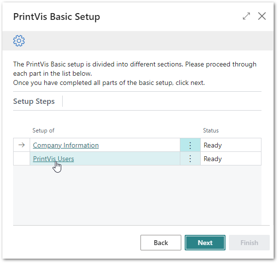
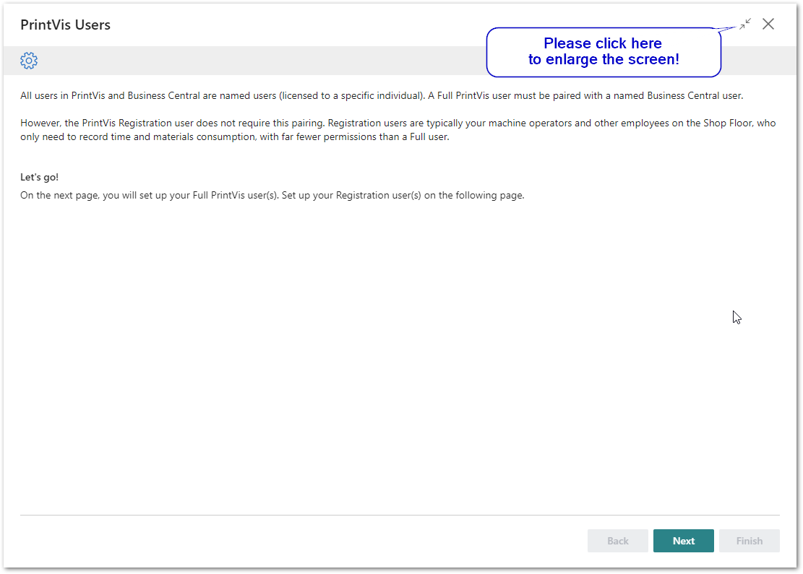
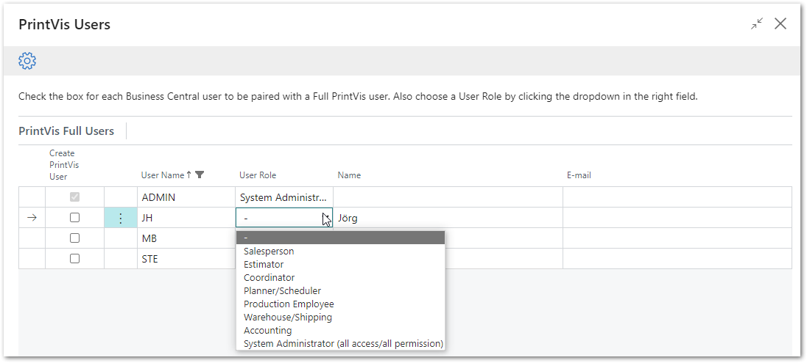
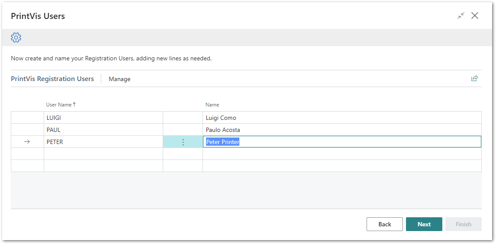
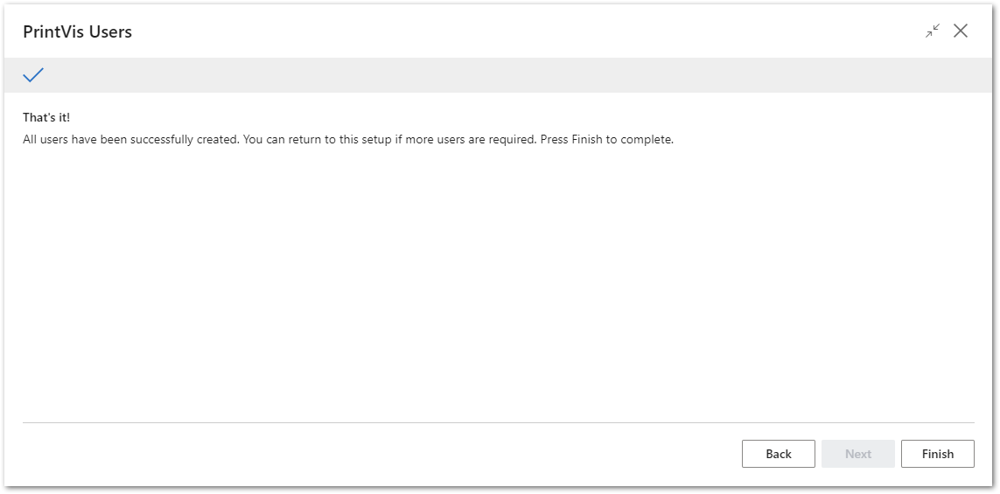
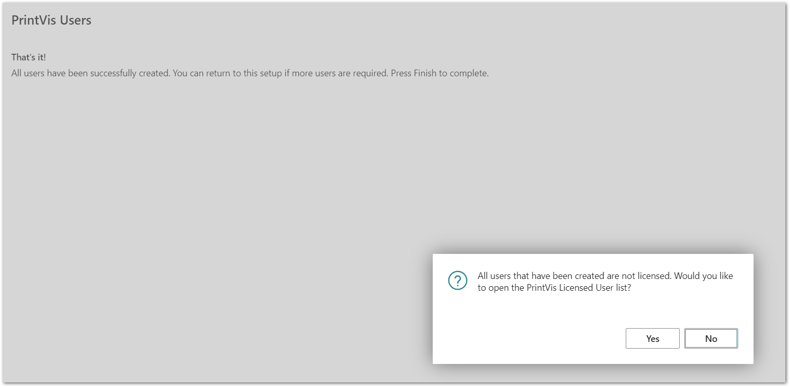
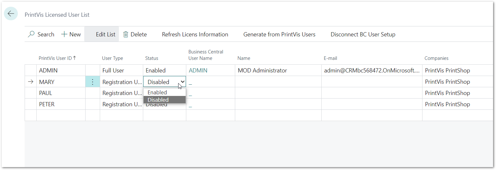

# PrintVis Onboarding – Basic Setup – PrintVis Users

This documentation is a supporting manual on how to use the PrintVis
Onboarding – Basic Setup – PrintVis Users. It describes the required
setup steps for this module.

### PrintVis Users Setup

Click on “PrintVis Users” to get started.

With this setup the User(s) can be configured based on their role in
your company.

There are 2 sections in the setup that will be processed separately:

-   PrintVis Full Users

-   PrintVis Registration Users

The “Welcome” screen will be displayed. Please read the instructions and
hit the “Next” button when you are ready to start.

Please note:  
Plan enough time to be able to finish a full step for each setup. This
may require 15-30 minutes.

## PrintVis Full Users

All users in PrintVis and Business Central are named users (licensed to
a specific individual). A Full PrintVis user must be paired with a named
Business Central user; these are created from the Business Central Admin
Center.

The setup is to select the Business Central user and assign a User Role
for them in PrintVis.

Choose from the existing users (enable “Create PrintVis User”) and
choose a user role from the drop-down.

Available user roles are:

-   Salesperson

    -   For internal and external account managers who can start and
        edit estimates and quotes.

-   Estimator

    -   Estimators in the customer service area.

-   Coordinator

    -   This is the typical role for all other users in customer
        service. With this role, most areas in PrintVis can be used and
        edited; Such as case management, estimates, scheduling if
        already set up.

-   Planner/Scheduler

    -   Staff working in scheduling or material planning.

-   Production Employee

    -   Production employees on the shop floor who also need to perform
        front office functions.

    -   This user role requires a full PrintVis user. Registration
        users, who have fewer permissions but do not require a PrintVis
        full user, can be set up in the next step.

-   Warehouse/Shipping

    -   For warehouse shipping employees.

-   Accounting

    -   For staff in the accounting department, who require access to
        PrintVis. If no access to PrintVis is required, there is no need
        to create a PrintVis user for them.

-   System Administrator (all access/all permissions)

    -   User for administration and setup tasks.

## PrintVis Registration Users / Shop Floor Users

The PrintVis Registration user does not require pairing with a Business
Central user. Registration users are typically your machine operators
and other employees on the Shop Floor, who only need to record time and
materials consumption with far fewer permissions than a Full user.

Please enter a User Name (Code) and enter the name for each required
registration user as shown below.

After hitting “Next” and then “Finish,” the setup is complete and marked
as “Ready.”

In some cases, the users are not yet enabled which is required when the
following message appears:

Please click “Yes” to enable the users.

After the trial, each user will be charged, so it is important to enable
the required users. Select on the “Status” field the option “Enabled” to
enable the user.

After entering the information above, hit the back arrow button at the
upper left-hand side of the page. The page will close, and you are back
on the final page to complete the setup by hitting “Finish.”

When the Company Information and PrintVis Users setup is finished, the
basic setup module is completed. You can choose the next available
module for setup.

PrintVis will now suggest setting up the “Case Management” module which
is the first module that enables you to create run-time data.
