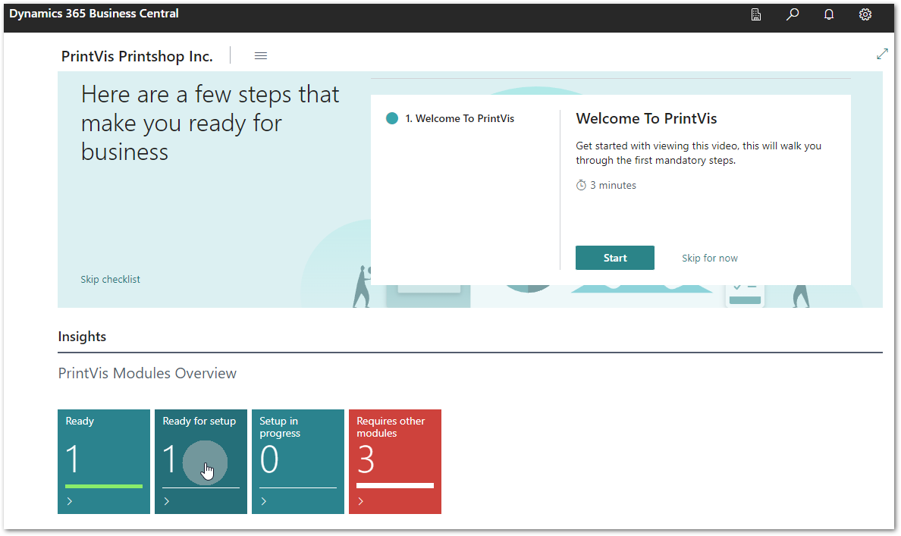
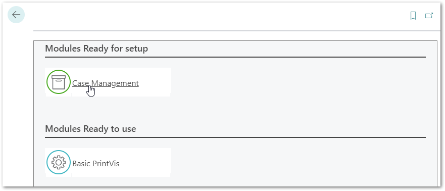
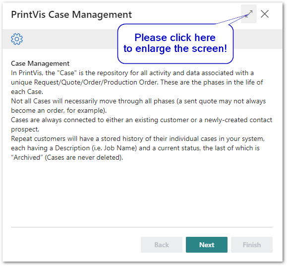
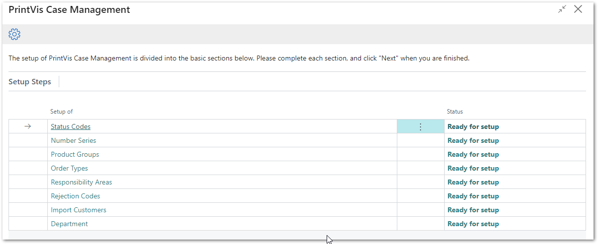
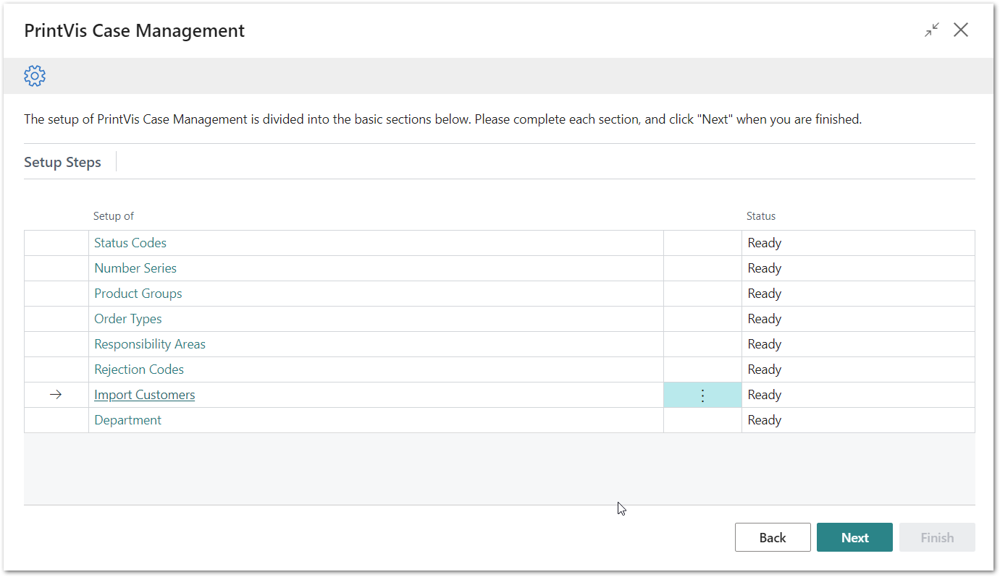

# PrintVis Onboarding – Case Management

This documentation is a supporting manual on how to use the PrintVis
Onboarding – Case Management. It describes the required setup steps for
this module.

### Case Management Module

After the Basic Setup is completed the Case Management is ready for
setup. This setup is a prerequisite to start other modules.

### What can you use Case Management for?

In PrintVis, a "Case" is the repository for all activity and data
associated with a unique Request/Quote/Order/Production Order. These are
the phases in the life of each Case.

Not all Cases will necessarily move through all phases (a sent quote may
not always become an order, for example). Cases are always connected to
either an existing customer or a newly created contact prospect.

Repeat customers will have a stored history of their individual cases in
your system, each having a description (i.e., Job Name) and the current
status, the last of which is “Archived” (Cases are never deleted).

This means Case Management provides an overview of all cases with
regards to:

-   Active and archived cases.

-   Actual status: A status flow setup defines all the steps and phases
    for a case. If it is in quote status, it can be converted into an
    order. The status can be “Ready for Shipment” or “Invoicing” after
    production is completed.

-   Responsibility: Users can be designated as responsible for the case
    based on its status and that User’s role in the company. For
    example, once an estimate is completed it may require review and
    approval from a different User, so the case is pushed to their
    individual queue when the status is changed.

-   Deadline: A case can have a deadline in relation to a status. If,
    for example, a sales representative did not follow up on a quote
    that was sent within a given period, the case becomes delayed in
    their queue and will be displayed as such.

### Get started

Click on the “Ready for setup” tile to see the module.

And then on “Case Management” to get started.

The “Welcome” screen will be displayed.

Please read the instructions and hit the “Next” button when you are
ready to start.

Please note:

Plan enough time to be able to finish a full step for each setup. This
may require 30-60 minutes.

With this module you will create a basic structure for PrintVis Case
Management, which requires several steps and data. Details are displayed
in the screenshot below.

On the next screen you can see the available setup steps which can be
entered with a click on the link.

**The status column shows either:**

-   Ready for setup

    -   If this setup topic has not been started or finished.

-   Ready

    -   If this setup topic has been finished.

You will find a manual for each step on the individual setup page.

After all steps have been completed, PrintVis Case Management is ready
to be used.

PrintVis Case Management is now ready to be used. Please watch the video
that is provided when you click “Next.” After you have clicked “Finish”
the Case Management module is tagged as complete, and the next module is
ready for setup.

After finalizing the setup of the PrintVis Case Management Module the
following modules are available for setup:

-   User Fields

-   Time Registration

-   Folder Management
