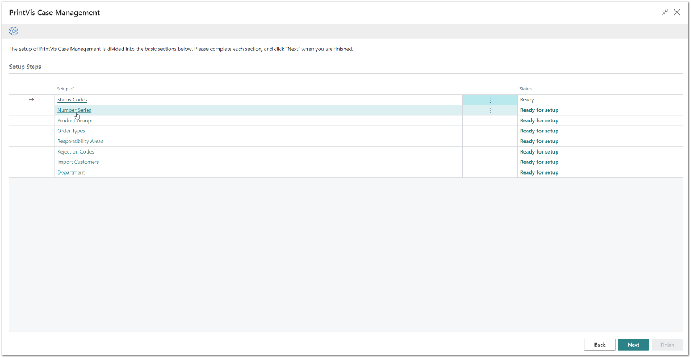
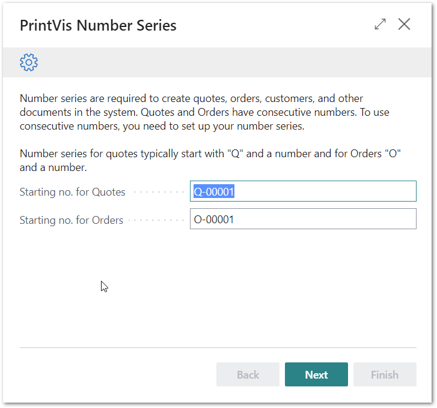
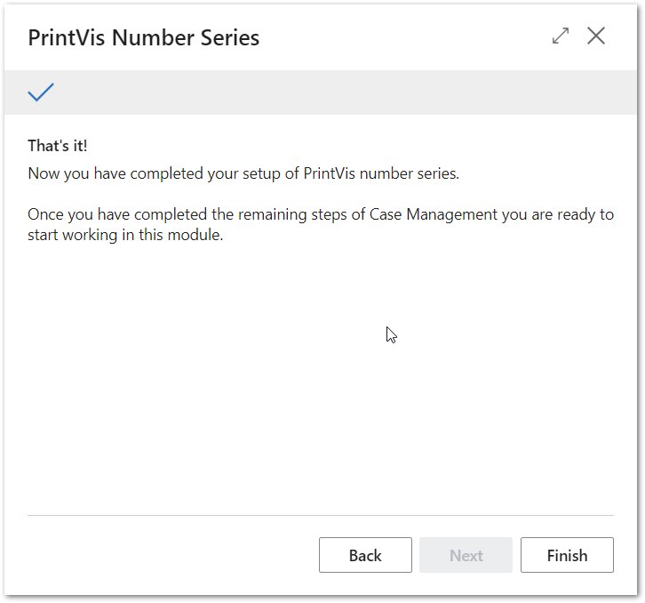

# PrintVis Onboarding – Case Management – Number Series

This documentation is a supporting manual on to use the PrintVis
Onboarding Setup. It describes the required setup steps for this module.

# Number Series Setup

Please click on “Number Series” to get started.

The “Welcome” screen will be displayed. Please read the instructions.

A starting number for quote and order numbers is suggested with the
letters “Q” and “O” as index for Quote and Order respectively. You can
keep the starting number or change it. Please note that it must end with
a number!

After hitting “Next” and then “Finish” the setup is complete and marked
as “Ready”.

