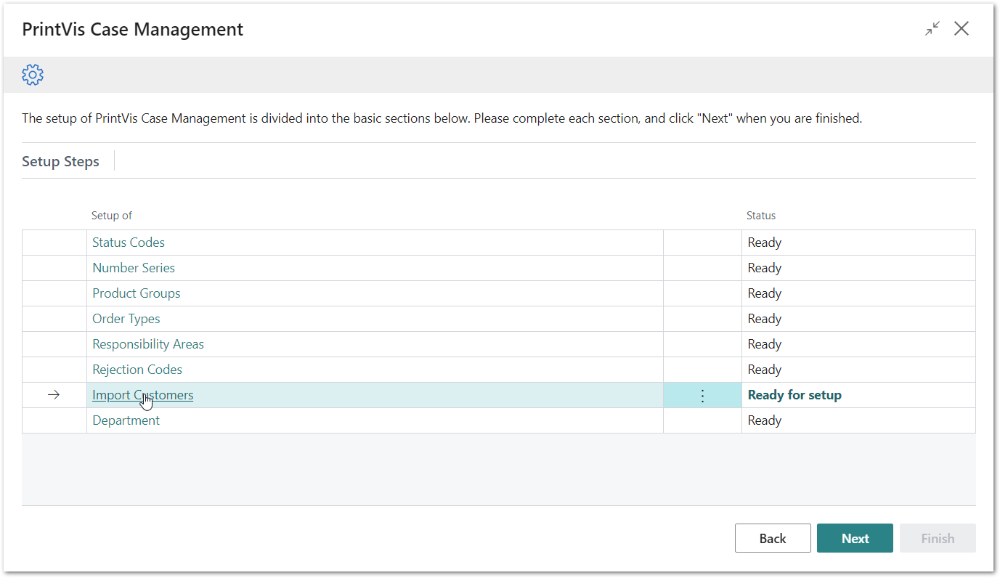
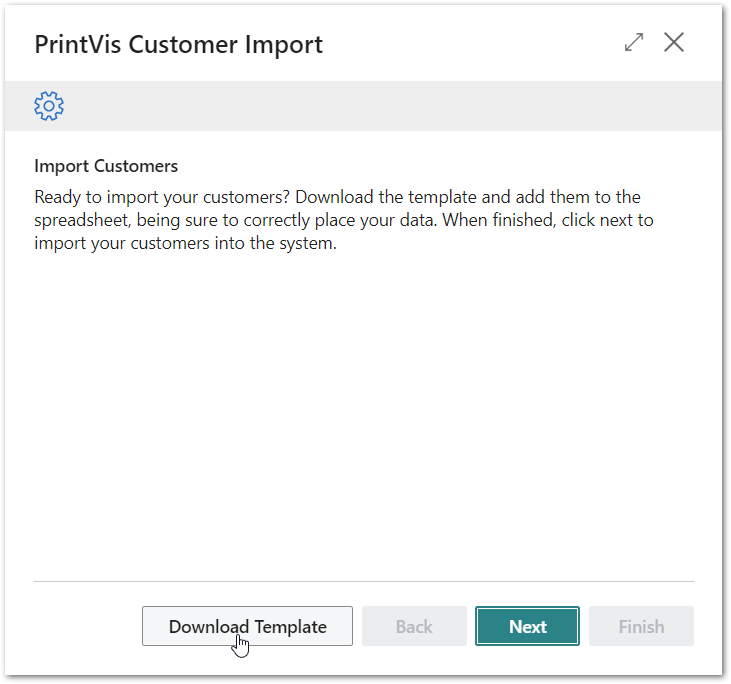
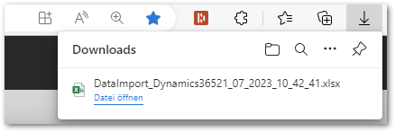
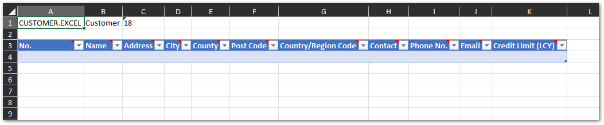
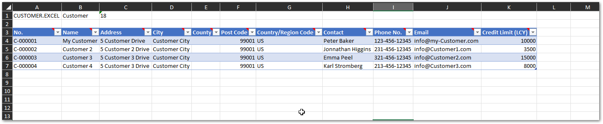
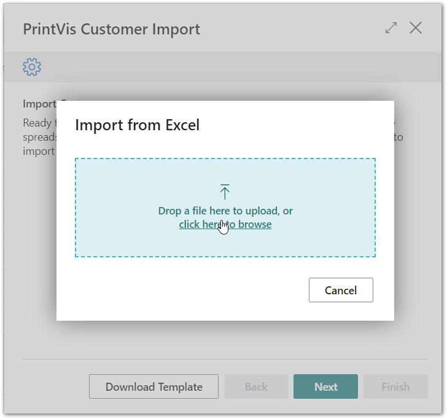
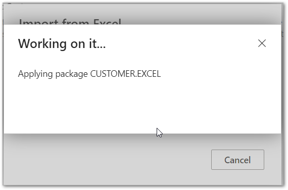
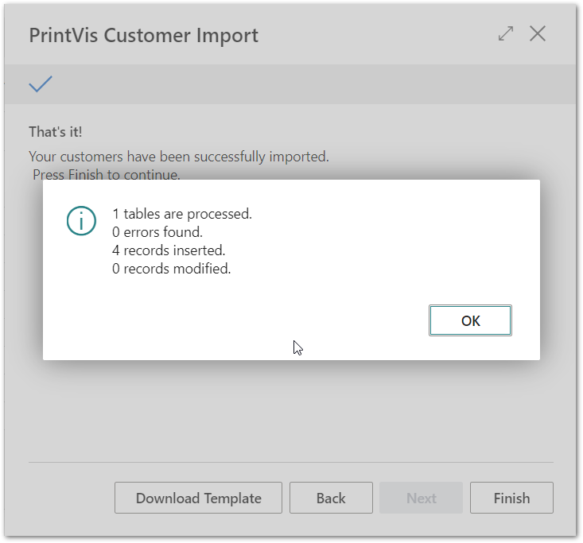
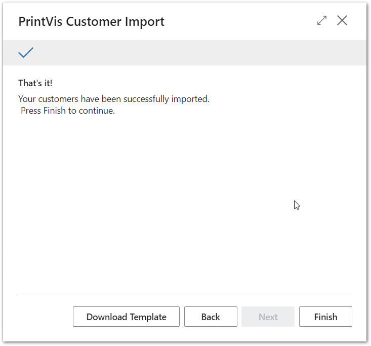

# PrintVis Onboarding – Case Management – Import Customers

This documentation is a supporting manual on how to use the PrintVis
Onboarding Setup. It describes the required setup steps for this module.

# Creating Your Customers by Importing Them

This setup step is different from the ones you have walked through
before. Data will not be entered into a screen but into a Microsoft
Excel file, after which the data can be imported to PrintVis and
Business Central.

In the following steps you will export an Excel template and fill in
your list of existing customers with their data. It is also possible to
export customers from your existing system using the copy and paste
process into the template.

Please do not change the MS Excel file structure, or you will provoke
errors when importing the data. When pasting data into the file, please
do not copy the formatting but only the data.

The export / import functionality is covered by configuration packages
of Business Central. You can learn more about this functionality when
clicking the
[link](https://learn.microsoft.com/en-us/search/?terms=Configuration%20Packages&scope=BusinessCentral&category=Documentation).

Please click on “Import Customers” to get started.

The “Welcome” screen will be displayed.

Please hit the button “Download template.”

The file is downloaded to your download folder.

Click on “Open file” to open the file in Microsoft Excel.

# Microsoft Excel File Structure to Import Customers

The file will appear as below.

-   You must trust the file security and enable editing.

-   In line 1 you will find technical information such as the table name
    and number.

    -   Please do not change this!

-   Lines 3 and 4 are the table area to create data, framed in blue.

-   Line 3 shows the column heading with a note about what type and
    number of characters allowed in that field/column.

-   Line 4 is the first line to enter data.

<table>
<colgroup>
<col style="width: 18%" />
<col style="width: 81%" />
</colgroup>
<thead>
<tr>
<th><strong>Field</strong></th>
<th><strong>Description</strong></th>
</tr>
</thead>
<tbody>
<tr>
<th>No.</th>
<td>
Enter a number or code which is the unique identifier to the
customer.

Later when creating a new customer, the no. is either filled
automatically from a defined number series or you enter the number
manually because you have enabled manual number entry in the number
series setup.

The maximum number of characters is 20. If you enter more characters,
the import is not possible and will error.
</td>
</tr>
<tr>
<th>Name</th>
<td>
Specifies the customer's name. This name will appear on all sales
documents for the customer.

The maximum number of characters is 100. If you enter more
characters, the import is not possible and will error.
</td>
</tr>
<tr>
<th>Address</th>
<td>
Specifies the customer's address. This address will appear on all
sales documents for the customer.

The maximum number of characters is 100. If you enter more
characters, the import is not possible and will error.
</td>
</tr>
<tr>
<th>City</th>
<td>
Specifies the customer's city.

The maximum number of characters is 30. If you enter more characters,
the import is not possible and will error.
</td>
</tr>
</tbody>
</table>

<table>
<colgroup>
<col style="width: 18%" />
<col style="width: 81%" />
</colgroup>
<thead>
<tr>
<th><strong>Field</strong></th>
<th><strong>Description</strong></th>
</tr>
</thead>
<tbody>
<tr>
<th>County</th>
<td>
Specifies the customer's county if existing in the country.

The maximum number of characters is 30. If you enter more characters,
the import is not possible and will error.
</td>
</tr>
<tr>
<th>Post Code</th>
<td>
Specifies the postal code of the customer.

The maximum number of characters is 20. If you enter more characters,
the import is not possible and will error.
</td>
</tr>
<tr>
<th>Country/ Region Code</th>
<td>
Specifies the region of the customer.

The maximum number of characters is 10. If you enter more characters,
the import is not possible and will error.
</td>
</tr>
<tr>
<th>Contact</th>
<td>
Specifies the contact person of the customer.

The maximum number of characters is 100. If you enter more
characters, the import is not possible and will error.
</td>
</tr>
<tr>
<th>Phone No.</th>
<td>The maximum number of characters is 30. If you enter more
characters, the import is not possible and will error.</td>
</tr>
<tr>
<th>Email</th>
<td>The maximum number of characters is 80. If you enter more
characters, the import is not possible and will error.</td>
</tr>
<tr>
<th>Credit Limit (LCY)</th>
<td>This field allows decimal values only if you enter any other
characters, the import is not possible and will error.</td>
</tr>
</tbody>
</table>

There are more fields available on the customer card and the data could
be extended later because more data is not required and this point.

If you prefer to build your own import with additional fields, you could
create your own Business Central Configuration Package. Please find more
info with the link on page 1 or search for “Business Central
Configuration Package” on a search engine or video platform.

The customer table ID is 18.

Example data:

When you are done save your file and close MS Excel.

# Importing the Data

If already closed, please reopen your new Business Central/PrintVis
environment and click on:

-   Tile “Setup in Progress”

-   Case Management

-   Click “Next”

-   Click on Import Customers

-   Click “Next”

With the next dialog you can upload your Excel file that contains all
customers.

Either drag and drop the file on the dialog or click on “click here to
browse” and find and select your file.

The file will be processed.

If no errors are found, a display will show how many customer
records/entries have been created.

If an error occurs, please check your file again.

-   Make sure the customer no. is unique.

-   Make sure the data in the columns is valid, allowed type, and under
    the maximum length.

-   Make sure there are no empty lines in the MS Excel inside of the
    blue bordered table.

-   If all is ok, please download a new file and copy paste the data
    from the first file to the new one, by only pasting values and no
    formatting!

After hitting “Next” then “Finish,” the setup is complete and marked as
“Ready.”

Congratulations!

This was the last step of the PrintVis Case Management setup if you have
completed all other steps.

PrintVis Case Management is now ready to be used. Please watch the video
that is provided when you click “Finish.” The Case Management module is
tagged as complete, and the next module is ready for setup.
