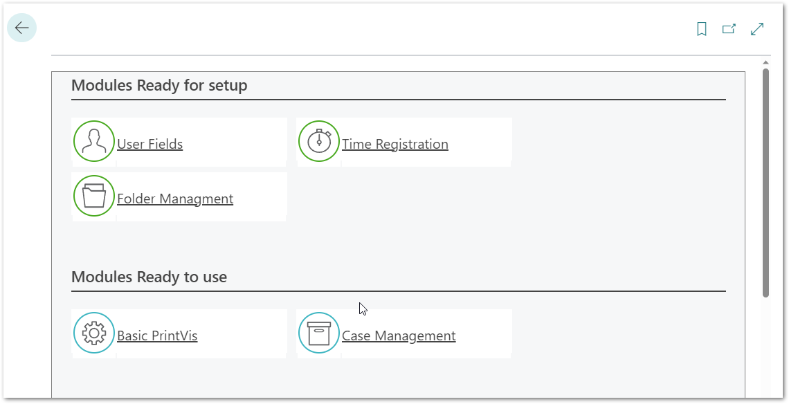
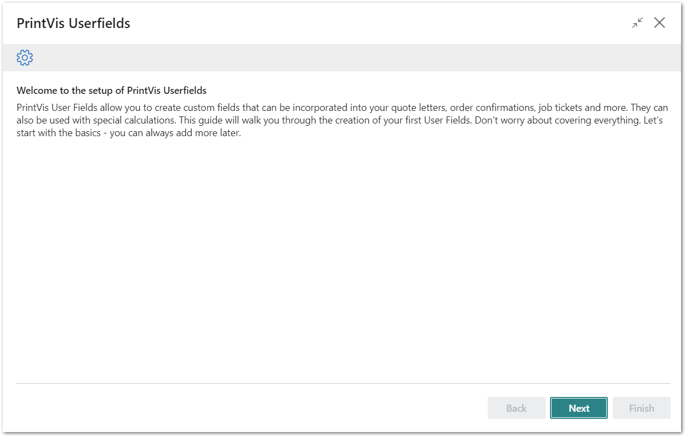
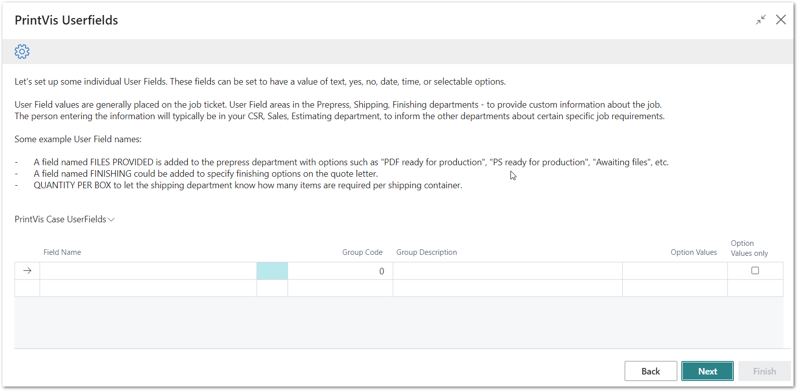
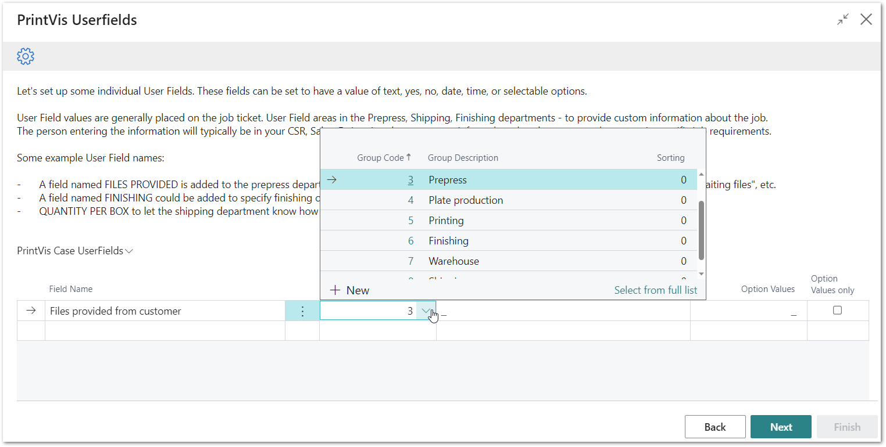
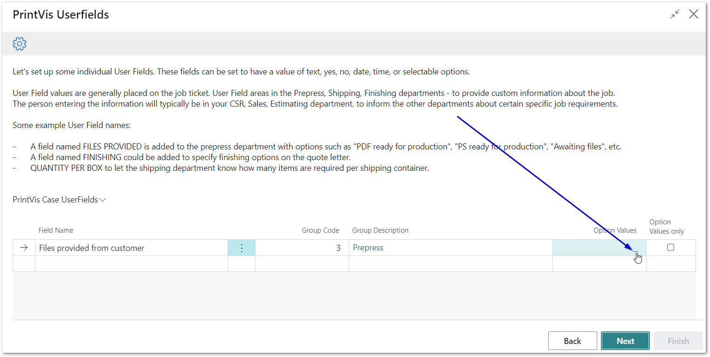
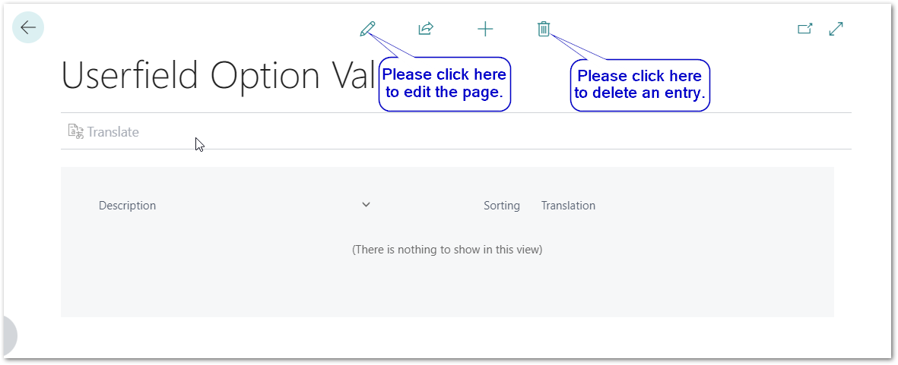
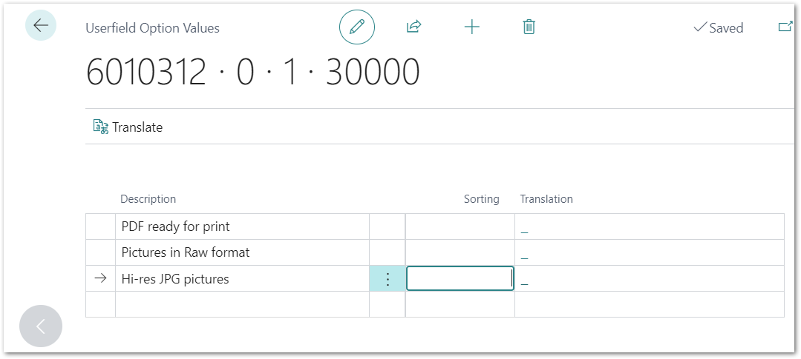
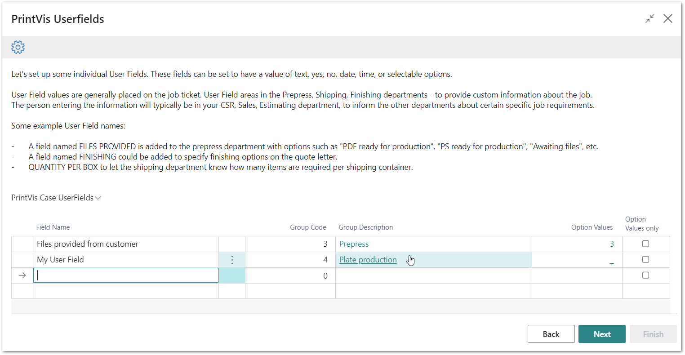
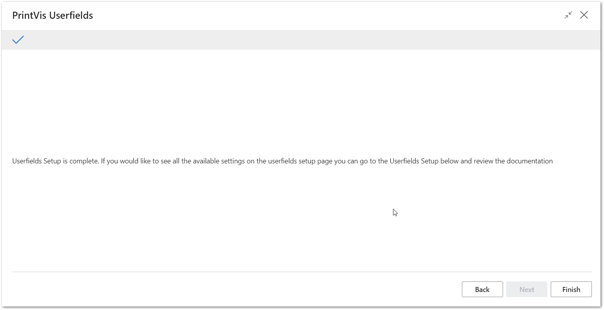

# PrintVis Onboarding – User Fields

This documentation is a supporting manual on how to use the PrintVis
Onboarding Setup. It describes the required setup steps for this module.

# PrintVis User Fields

PrintVis User Fields allow you to create custom fields to include in
quote letters, order confirmations, job tickets and more. They can also
be used for special calculations. This guide will walk you through
creating your first User Fields.

Don't worry about covering everything. Let's start with the basics - you
can always add more later.

Click on the Role Center Tile “Ready for setup.” Once the PrintVis Case
Management Module has been completed, the User Fields setup is available
for setup.

Click on User Fields and the “Welcome” screen will be displayed. Please
read the instructions and hit the “Next” button when you are ready to
start.

Please click on “Next” to get started.

Please note:  
It would be ideal to plan enough time to finish a full step for each
setup. This may require 15 minutes or more. Sometimes it helps to
evaluate existing structures of your company and consider whether they
should be modified, adapted, or cleaned up.

## Set Up Your User Fields

Please follow these steps based on the given example:

-   Start by entering a field name that should be displayed to the user
    (CSR/Sales) to select or be displayed on a job ticket or
    customer-facing documents.

    -   You can decide later field by field what should be displayed on
        customer-facing documents.

    -   For example, enter “Files provided from customer.”

        -   This is the info displayed to the customer, based on what
            data the prepress might charge, cost and prices.

        -   This is the internal information of what data to expect.

-   Select a Group Code

    -   Groups are important for entering data (the user can filter by
        group).

    -   Groups can be selected on the job ticket setup, to appear in a
        certain department section.

    -   The default group list is based on the departments that have
        been setup during the PrintVis Case Management Module setup.

        -   Those can be changed, renamed or new ones can be added
            later.

-   The Group Description will be displayed as soon the Group Code is
    selected and the screen is updated.

    -   If this does not happen automatically, please click the Button
        “Back” and then “Next” again.

-   It is possible (but not mandatory) to add text suggestion/blocks for
    the user as Option Values.

    -   If you require Option Values, click on the small link in the
        field

-   If there is no entry yet, please click the small “pen” icon on the
    header of the page.

-   Enter your Options as shown below  
    

    -   If you require specific sorting, please enter the sorting number
        into the “Sorting” field.

    -   You can click on the link in the “Translation” field to add
        translations for your multi-language output documents.

-   Click the arrow on the upper left-hand side corner to get back to
    the User Fields.

-   Enable “Option Values only” if the user can only choose from options
    and not enter text manually.

    -   If the field is not enabled, any text can be entered by the
        user.

Add more User Fields as required and see the final list.

Hit “Next” when your list is completed. You can always add more User
Fields later.

After hitting “Next” you are done and by hitting “Finish” the setup is
complete and marked as “Ready.”

