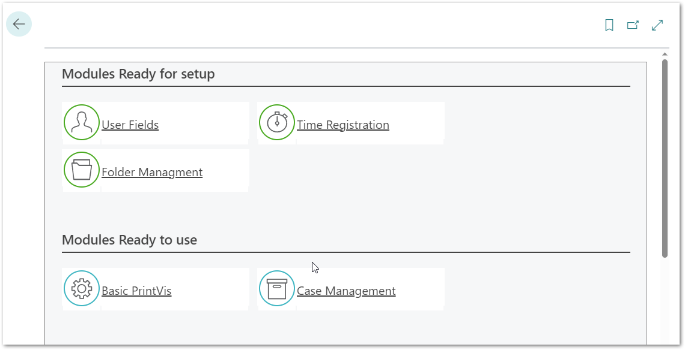
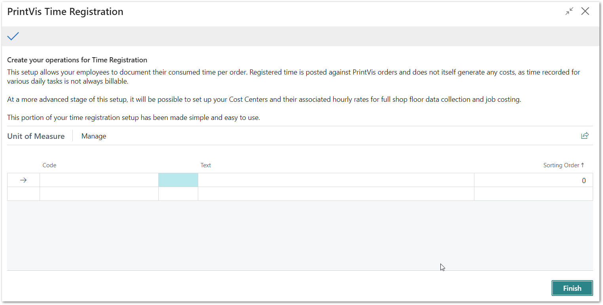
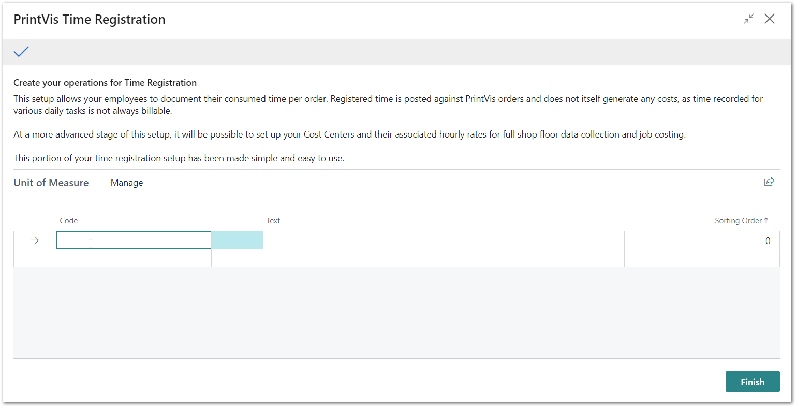
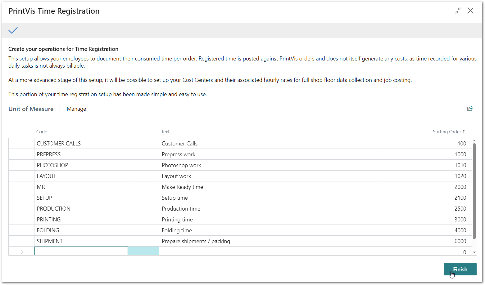

# PrintVis Onboarding – Time Registration

This documentation is a supporting manual on how to use the PrintVis
Onboarding Setup. It describes the required setup steps for this module.

# PrintVis Time Registration

This setup allows your employees to document their time consumed per
order. Registered time is posted against PrintVis orders. However, it
does not itself generate any costs. At the stage of PrintVis Job Costing
setup, it will be possible to set up your Cost Centers and their
associated hourly rates for full shop floor data collection and job
costing.

This portion of your time registration setup has been made simple and
easy to use.

Please click on the Role Center Tile “Ready for setup.” If the PrintVis
Case Management Module has been completed, the Time Registration setup
is available.

Click on Time Registration and the “Welcome” and setup screen will be
displayed. Please read the instructions and hit the “Next” button when
you are ready to start.

## Set Up Your Time Registration

In the screen below you can enter a code and text description for the
options that you want to record in a time sheet.

A list could look like the following:

After hitting “Finish,” the page will close. The setup is completed and
marked as “Ready.”
