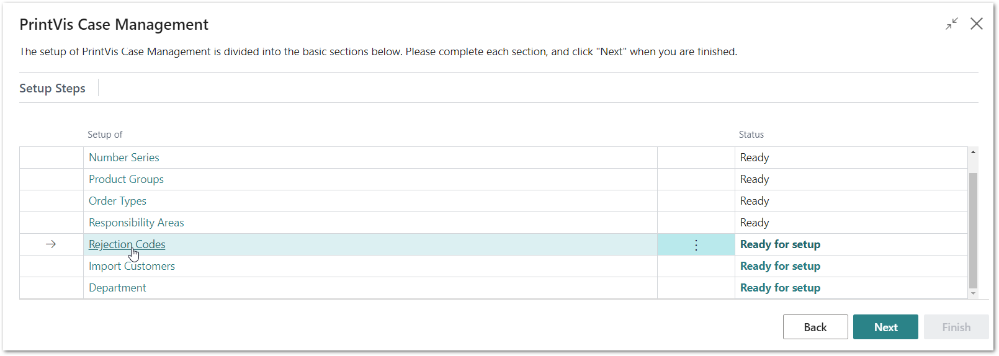
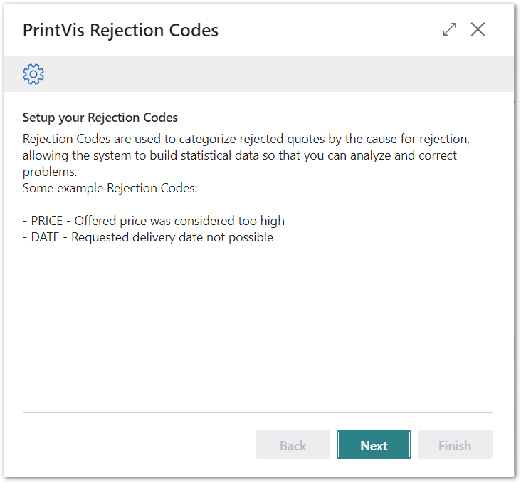
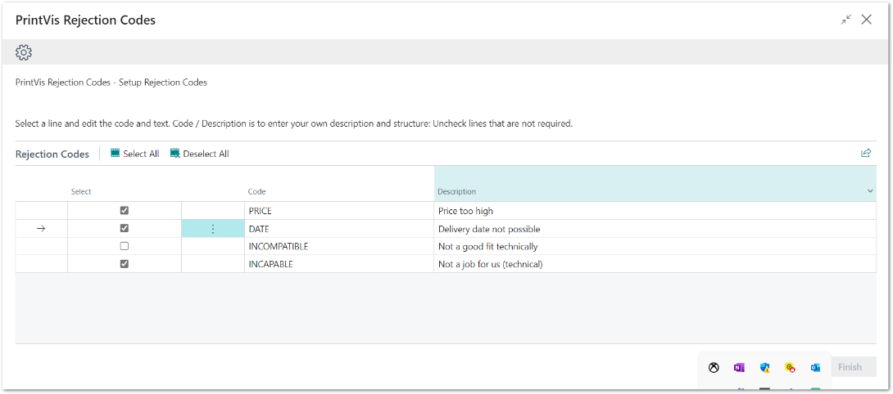
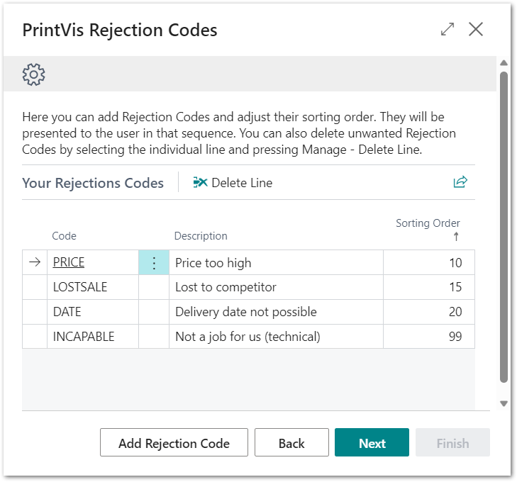
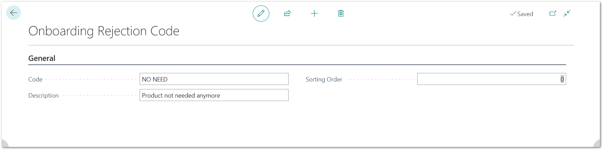
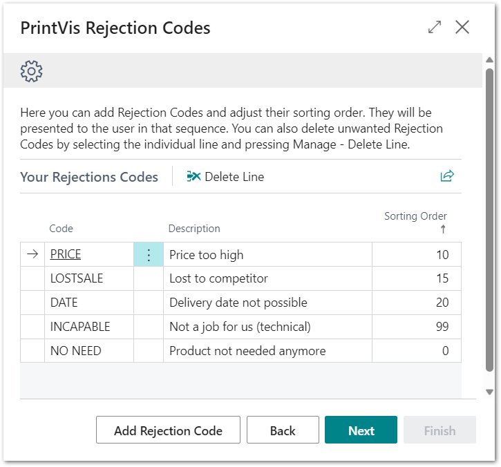
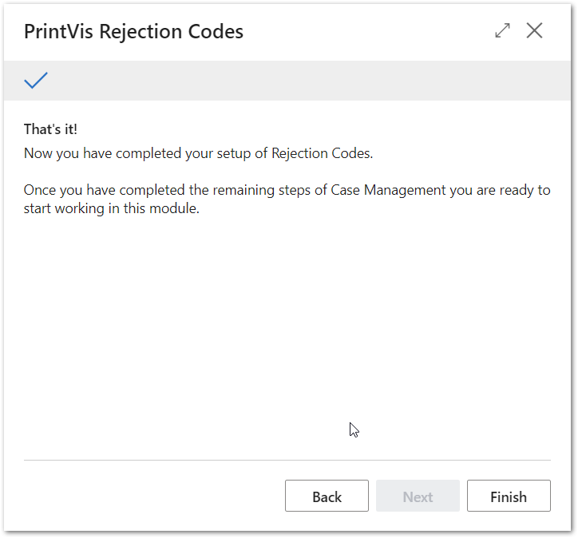

# PrintVis Onboarding – Case Management – Rejection Codes

This documentation is a supporting manual on how to use the PrintVis
Onboarding Setup. It describes the required setup steps for this module.

# PrintVis Rejection Codes Setup

The Rejection Code is used to indicate the reason a quote was rejected.

This information can be collected for statistical analysis to summarize
the different reasons for rejecting a quote, e.g., price, date or lack
of materials. Rejection Codes are also used for relationship management
to keep track of lost opportunities. The Status Code “REJECTED”,
suggested in the standard Status Code setup, includes a setting making
it impossible to cancel a case without selecting a Rejection Code.

Please click on “Rejection Codes” to get started.

The “Welcome” screen will be displayed. Please read the instructions and
hit the “Next” button when you are ready to start.

## Building a Set of Suggested PrintVis Rejection Codes

After a data import, PrintVis displays a potential list.

You can also overwrite the list with your Rejection Codes.

On this screen you have the following options:

1.  You can change the Code and Description.

2.  You can delete existing lines.

-   Hit the 3 dots next to the Code column and select “Delete Line”.

1.  On the next screen you can add your own Rejection Codes.

Hit next when you are done.

## Add your own Rejection Codes

At the bottom of the page, you can hit the button “Add Rejection Code”
for the ability to create additional codes.

Please enter the data for the additional Rejection Codes.

After entering the information above, hit the back arrow button at the
upper left-hand side of the page. The page will close, and you will see
the new list. It could be that the sorting is not properly displayed. In
this case, please press the F5 key to refresh.

After hitting “Next” then “Finish” the setup is complete and marked as
“Ready.”

