# Apparel Installation and Setup

PrintVis must be installed prior to installing the Apparel app.

## Installation
1. Go to the Extension Marketplace and search PrintVis. Select “Get it now” below the PrintVis Apparel app and agree to the terms.

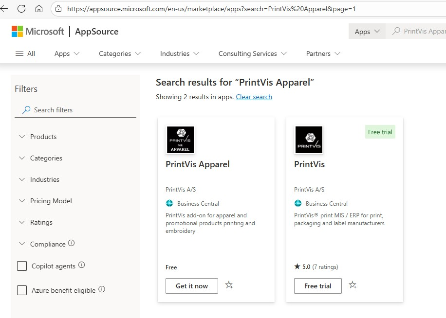

## General Setup
1. Search for “Industry Captions” and select the PrintVis Industry Captions page.
2. Click + New and create a caption set with the Industry Segment set to Apparel. The Caption Set and Description can be set to whatever you would like it to be. Once the Industry Segment is selected, click Manage -> Generate Industry Lines to set the default caption fields for the selected industry. Once completed you can return to the previous screen.
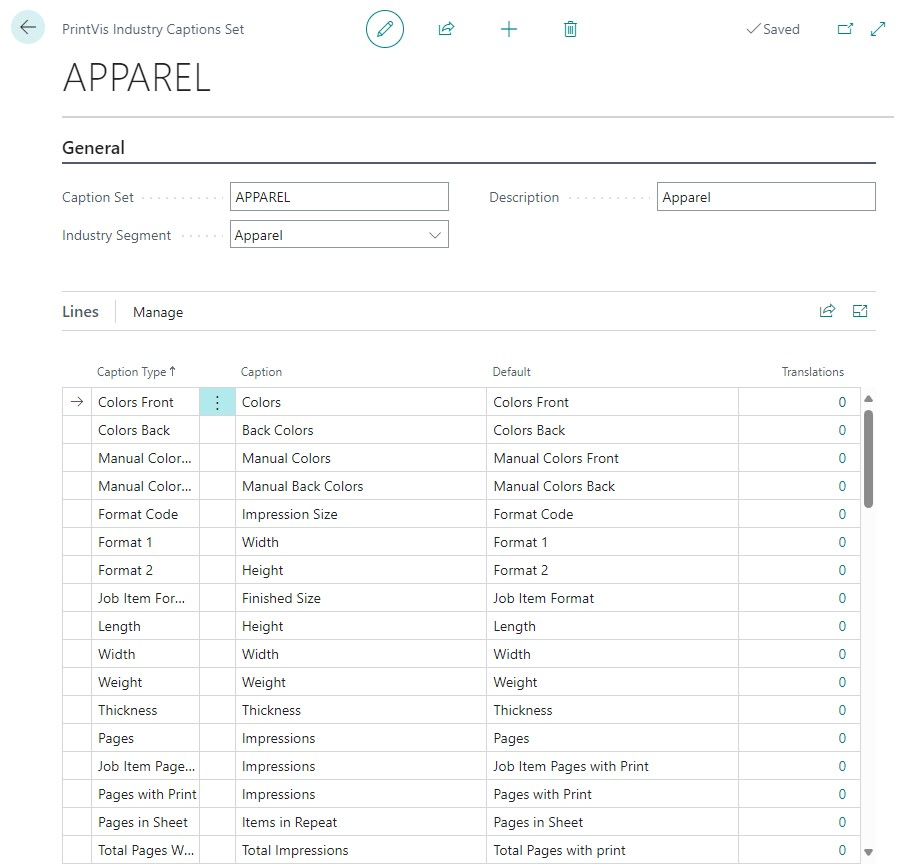
3. Click Usage on the PrintVis Industry Captions page. If your company is an apparel only company, leave Order Type and Product Group blank and select your newly created apparel caption set:
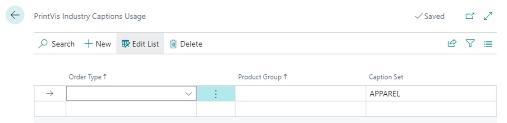
   
   If your company has apparel and non-apparel products, different caption sets can be set based on Order Type or Product Group. Always include a line with a blank Order Type and Product Group that will be used as the default caption set.

## Apparel Setup Structure
If you have worked with PrintVis for other types of companies before there are a couple of new setup tables to know and a use of existing fields, tables and pages to learn to use in a different way.

The apparel business is unique in the way that the quantities are small, the processes takes an extraordinarily long time per piece produced and several different decoration processes are performed on the same substrate.

Here is an overview of the tables involved in the Apparel specific manufacturing process:

1. We create jobs in the same way as in normal printing, BUT in apparel, the Quantity Ordered field will be a drill-down to a new page (Jobs/materials) where you can add more garments in several sizes to the estimation. One item per size of a garment is best practice.
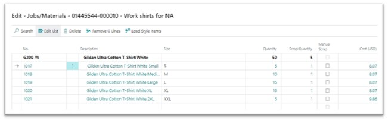
2. New table: Style is for handling a certain garment in several sizes. For example, the Style can be ‘Short Sleeve Polo in blue’. This style can have several sizes from XS to 4L and these are all tied in with it from setup. If you pick a Style, you will get all items within this style presented on the Jobs/materials page.

3. New use of the Products table, now called Designs and Decorations. A Design is a BOM of decorations. Decorations are also using the Product table and are the real placeholders for product information. A good deal of information is tied to the decoration, which will flow into the job item when chosen on a decoration/job item line.
   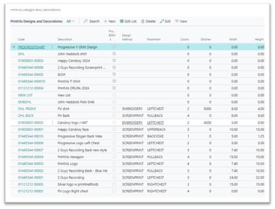

4. Placements - This is a new table, explained below.
5. Decoration Types - This is a new table, explained below.
6. Gender - This is a new table, explained below.
7. Sizes - This is a new table, explained below.

It will be helpful to see a video on how to input an apparel estimation and follow the super user script on how to create a PrintVis Apparel quote and order in an Apparel company, before moving into setup.

### The new setup areas:

#### Decoration Setup
PrintVis Apparel uses Decoration Types and Decoration Placements and other smaller supporting tables to determine methods that can be used on each raw material type and where on that material artwork can be placed. 

**Set up Decoration Types:**
1. Search for “Decoration Types” and select the PrintVis Decoration Types page.
2. Click + New and enter a code and description for each of the decoration types possible in your company. It is also possible to set a default list of units, finishing type, scrap %, minimum scrap, or item type code for each decoration type. These defaults are automatically added to the case when the decoration type is selected.

**Set up Placements:**
Placements is an assisting table which refers to where the decoration is placed. For example Front, Left sleeve or Side panel – depending on what type of garment or material we are decorating.
1. Search for “Placements” and select the PrintVis Placements page.
2. Click + New and enter a code and description for each of the different places artwork can be placed on your different products. Here, we should have a complete list. It is also possible to set default max width, max height, and item type code for each placement. These defaults are used to perform checks to make sure artwork does not exceed the max size for the placement.
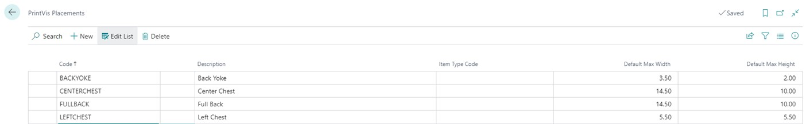

#### Set up Sizes
Freely definable supporting table for sizes, which can be sizes for all types of products, for example the normal S/M/L, children's sizes, bag or cap sizes etc. It will be normal to have a longer list of sizes which are used in different contexts. This is used on the Items setup.
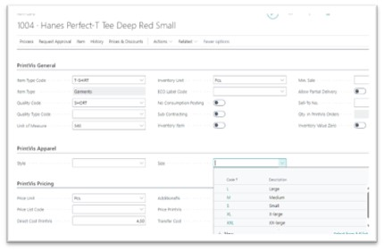

#### Set up Gender
Freely definable supporting table for managing ladies’ or men’s wear – or children or unisex. This is used on the Styles setup. It will in many cases replicate the naming convention used from the vendor of the garments.

#### Set up Brands
Freely definable supporting table for clothing brands as they are presented by the vendor. Same vendor can easily have a dozen different brands. This is used on the Styles setup.
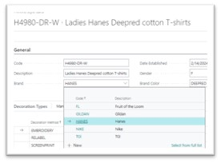

#### Set up Brand Color
Brand Color is a given from the vendor. The style has both Brand Color and Color.
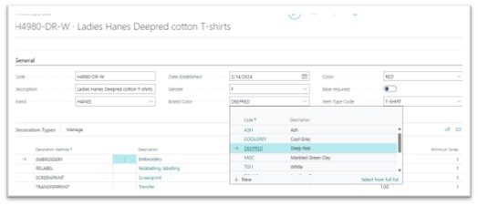

#### Set up Styles
1. PrintVis Apparel uses a setup field for items called Style.
2. The Style is tied to the item through a field on the Item record.
   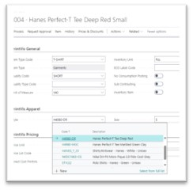
3. The PrintVis Styles list page.
   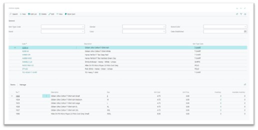
4. The PrintVis Style Card.
   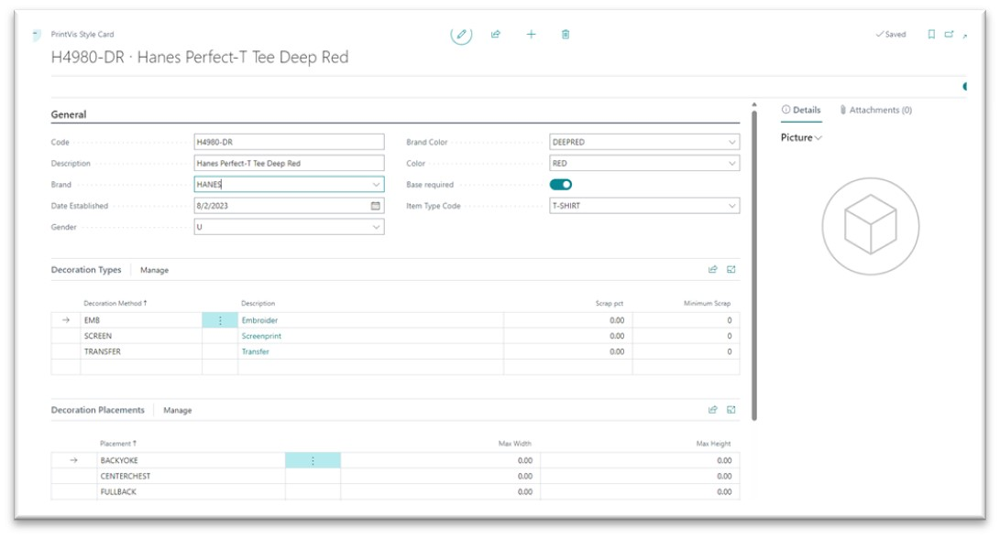

The style card is where we associate items and styles.

#### Size

The size of the garment or item.
PrintVis Apparel supports each size being unique items or variants on a single item.
a. If you are using an item for every size, you will assign the style to each size item for that style and add the size in the PrintVis apparel section of the item card.
b. If you are using variants on a single item for size, you will have a 1-to-1 relationship between style and item. Use the variant code and/or description to represent the size of each item.

#### Calculation Setup
**Material Calculation Unit**

The way we handle the garment items is completely different from normal PrintVis. It can take a bit of time to get used to. Possibly investigate the Apparel Company demo setup for reference.

1. A calculation unit needs to be set up that will be the carrier for all materials used on an apparel job. We recommend creating a cost center and configuration specifically for this to avoid any confusion. Assign for example the the Admin department, have a dedicated cost center/configuration and leave the process type blank. No details are required on this unit besides code, text description, department, cost center, and configuration. No calculation detail lines should be setup on this particular unit.
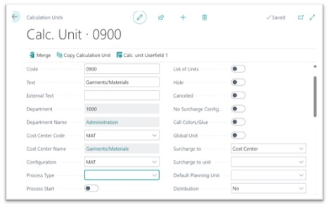
2. Apply the materials calculation unit to the Apparel setup. Search "PrintVis Apparel Setup" and on this page assign the above calculation unit to the "Calculation unit for Material Lines" field.
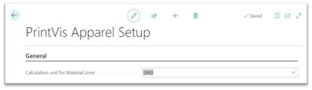

**Apparel Calculation Formula**

With the extension is also brought some specific calculation formulas for fetching data to the estimation.

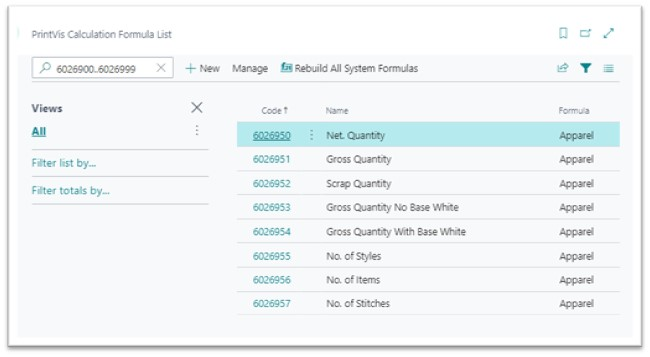