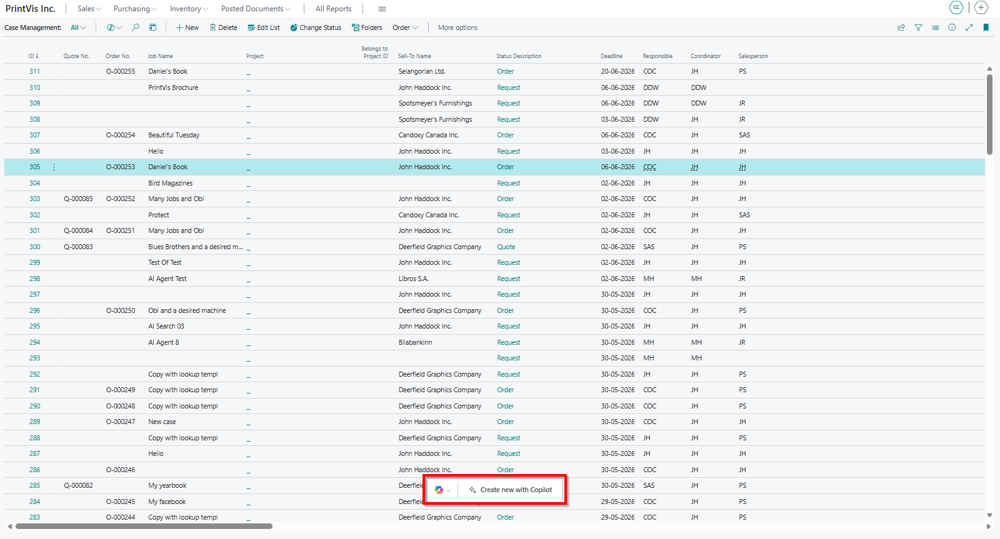
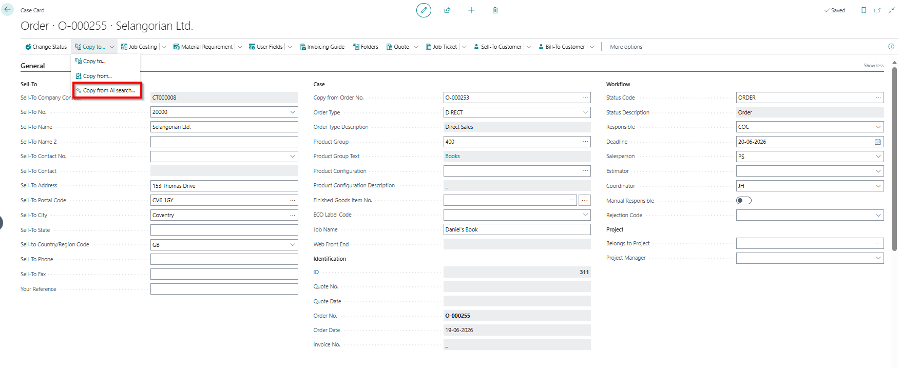
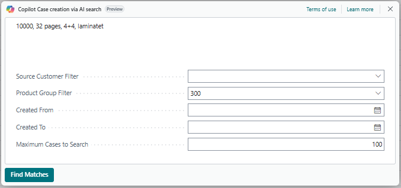
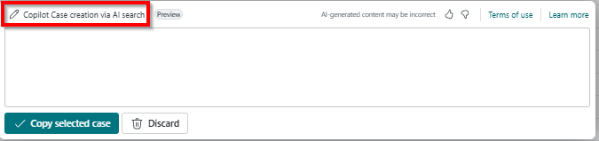
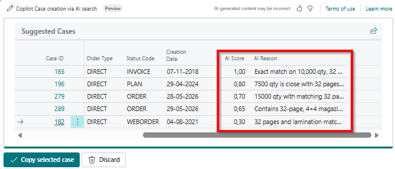
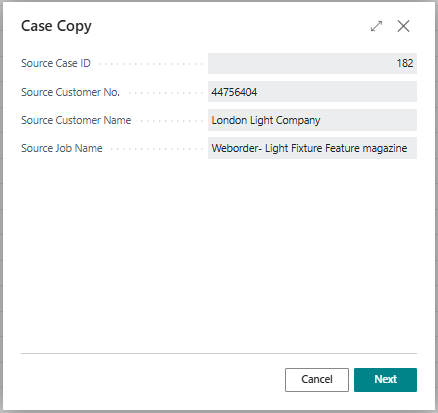
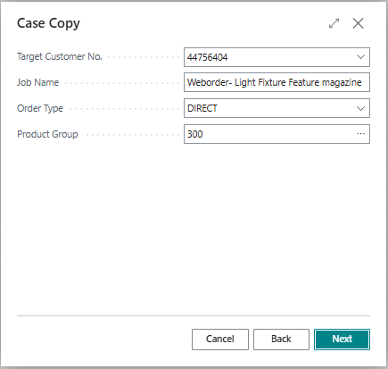


# Use AI Search to find and copy matching cases

The AI Search tool helps you quickly find, compare, and copy existing cases when creating a new case. Based on your search criteria, the tool analyzes previous cases and identifies the most relevant matches.

The tool can be accessed from:

- Case Management List as a Copy To function
- Case Card as a Copy From function

Although the entry point differs, the AI Search experience is the same in both locations.

## Search for matching cases

### Step 1: Open AI Search

Open the AI Search window from either the Case Management List or the Case Card.

### Step 2: Enter search criteria

1. In the prompt window, enter a description of the case you want to find.
2. Below the search text box, you can specify additional filters to limit the search area.

These filters are hard filters, meaning AI Search will not analyze cases outside the selected criteria. This differs from the prompt in the text field, where AI Search attempts to find the best match.

## How AI Search works

AI Search analyzes existing cases from the newest to the oldest in the range provided.

AI Search evaluates cases until one of the following limits is reached:

- The beginning of the selected date range is reached
- The Maximum Cases to Search value is reached

In the beginning, you may need to experiment with the prompt text and filters to find what works best for your company. This can vary significantly depending on workflow and field usage.

## Cases and fields analyzed by AI Search

Copilot only looks at cases that are active and have a production calculation. It uses information from the following fields to identify the best matches.

### Case

- Case ID
- Customer No.
- Job Name
- Product Group (Code)
- Order Type (Code)
- Status Code (Code)
- Creation Date
- Filter for Copy Protection
- Case Description (Rich text field)

### PVS Job

- Ordered Quantity
- Pages
- Format Code
- Colors (Front/Back)
- External Description
- Item No.

### PVS Job Items/Sheet

- Component Type
- Description
- List of Units
- Finishing
- Item No.
- Imposition Type / Description
- Tool / Description
- Tool 2 / Description
- Tool 3 / Description
- Tool 4 / Description

### PVS Job Calculation Unit

- Unit
- Text

### Step 3: Find matches

1. Select **Find Matches** to start the analysis.
2. Review the returned matches.

If no matches are returned:

- The search criteria may be too broad, causing the analysis to time out before completion.
- The search criteria may be too narrow, resulting in no cases meeting the minimum relevance threshold.

To modify your search, select the Pen icon or the prompt name in the upper-left corner to return to the search window.

## Review search results

When suitable matches are found, AI Search displays up to 10 results ranked from best match to lowest.

On the far right, an AI score is shown from 0.3 to 1.0, where 1.0 represents a perfect match. Results with a score below 0.3 are not displayed.

The system also provides a reason explaining why each score was assigned.

## Copy a selected case

You can select a case number in the list to open the case card and review the case before copying.

After identifying the case you want to use:

1. Select the case.
2. Choose **Copy Selected Case**.
3. Confirm the source case that will be copied.
4. Select **Next**.

## Modify new case information

On the next page, review and update information for the new case as needed.

When finished, select **Next**.

## Confirm and create the case

1. Review the summary of selected values.
2. Verify all information is correct.
3. Select **Create Case**.

The system creates a new case based on the selected source case and the values you specified.

## Tips for better results

To improve search quality:

- Use detailed descriptions in the search text
- Limit the search period using date filters
- Restrict the search to relevant case types when possible
- Avoid searching across large numbers of historical cases

Smaller search scopes typically produce faster and more accurate results.
