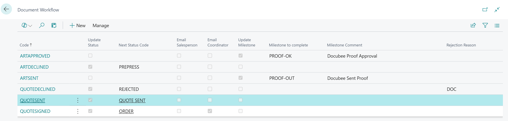
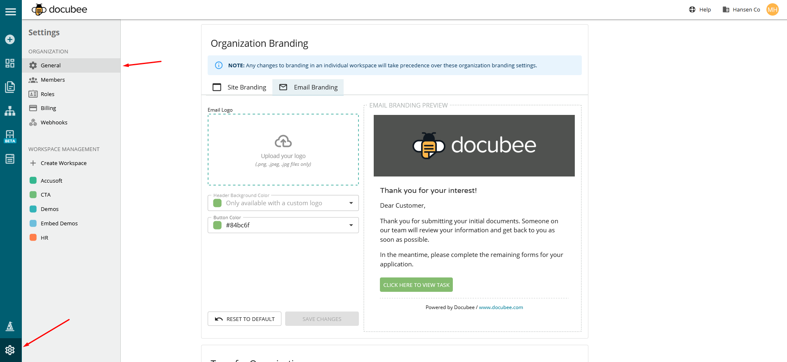

# Docubee Setup

These setup steps will make the overall connection to Docubee for
sending PrintVis documents to Docubee for signature.

## Setting up the free trial

-   **Install PrintVis Docubee Integration app** from AppSource

-   Go to Service Connections, open the Docubee Setup option, and click
    **Create Trial Subscription**

-   A wizard will appear walking through the free trial registration
    process.

-   Click **Create User** to establish your Docubee trial user.

-   The first page will ask for your email, first and last name.

-   The second page will ask you to enter a verification number sent to
    the previously entered email address.

-   Clicking **Finish** will return you to the free trial signup wizard.

-   Click **Create Organization** to establish your company for the
    trial

-   Enter your company name and a default workspace name (these can be
    the same)

> 

-   Clicking **Finish** will return you to the free trial signup wizard.

-   Clicking **Finish** on the last wizard page will create and start
    your free trial

## Converting your free trial into a Docubee subscription

At any time during the trial process, it is possible to convert your
free trial into a Docubee subscription.

*Note: At the end of the free trial, Docubee will stop processing
document signature requests and instead a subscription expiration
message will appear. To stop the expiration message, go to Service
Connections, open the Docubee setup option, and uncheck the Enable
checkbox to disable the service.*

-   To create a full subscription go to Service Connections, open the
    Docubee Setup option, and click **Convert Trial to Paid** in the
    Create Trial Subscription menu.

-   This will link to an external Docubee website where you can complete
    a form to convert your trial to a paid subscription.

## Docubee Subscription Questions

For questions about your Docubee subscription, login to your Docubee
account at <https://docubee.app> or contact support@docubee.com

## Setting up the Docubee options

### Adding Docubee Fields

In order for Docubee to add interactive fields to a PrintVis report
these fields need setup.

-   Go to Service Connections, open the Docubee Setup option, and click
    **Document fields** in the menu

-   Anchor strings are values that when added to a report layout will
    turn that anchor into a Docubee fillable field. Create all the
    fields that you will want customers to be able to complete on the
    report layout and determine whether the field is required or
    optional.

-   Edit the report layouts you want to use for Docubee as you would
    normally edit a report layout by going to Report Layouts and
    clicking Export Layout

-   Edit the layout, adding the anchor string values where you want
    Docubee to add the user entered fields.

-   When done, return to the Report Layouts page, click Replace Layout
    and upload your updated document

### Creating Docubee Workflows

When Docubee documents are returned signed, declined, or expired it is
possible to setup workflows in PrintVis to update information on the
case or notify the salesperson or coordinator.

-   Go to Service Connections, open the Docubee Setup option, and click
    **Document Workflows** in the menu

-   Click **New** to create a new workflow. 

Each workflow represents a unique process for when a document is sent, signed, declined, or expired. For example: When a quote is signed you might want to update the case status to ORDER and email the salesperson and coordinator. Or if you send an artwork approval document, you might want to mark a proof sent milestone as completed. These are some of the unique workflows you might want to setup for each step in the process. On the Document workflow card, you can also set the default email subject and body for that process in the workflow. The tooltips provide the available % codes that can be used to fill in information from the case. Currently, Docubee only supports plain text entry for these email values.

### Assigning Reports as Docubee Reports

In order for PrintVis to know that you want to use Docubee for a
specific report, you must assign each report as available for Docubee

-   Go to **PrintVis Report Selection Setup**

-   Select the Report Type you want to use and then on the Report ID
    line check the Use for Docubee Signature checkbox, assign the
    appropriate document workflows (if applicable), and determine
    whether you want Docubee to add a Decline button or allow a user to
    delegate the signing to someone else

-   Do this for each report type that you want to use Docubee for signatures

-   For the Artwork Approval report, you will need to go to **PrintVis Docubee Report Selection Setup** until we can update the PrintVis Report Selection
    Setup page to allow for outside customizations and apps to extend the list.

### Adding Docubee Documents to PrintVis Folders

It is possible to automatically add sent, signed, or declined documents
to PrintVis folders.

-   Go to **PrintVis Folder Groups Setup**, select the Folder Group,
    then click **Folders**

-   For each folder it is possible to assign which Docubee Sent, Signed,
    or Declined document type you want added to each folder

-   On the **PrintVis Report Setup** page for each report you will also need to make sure the Folder Group Code is filled in with the appropriate folder group

### Creating a Job Queue Entry to check for document status

For PrintVis to automatically check sent document for status updates, a
job queue entry is required.

-   Go to Service Connections, open the Docubee Setup option, and click
    **Create/Check Job Queue Entry** in the menu

-   A job queue entry is created and will be set by default to check
    every 5 minutes

### Branding the Docubee email and signature page

-   Go to <https://docubee.app>

-   Login with the same credentials you used when setting up the Docubee
    application in PrintVis.

-   Click the Gear icon for "Settings" in the bottom left corner

-   Make sure you have selected "General" under the settings list on the
    left navigation.

-   Scroll down to the "Organization Branding" section

-   Make updates to your branding and click the "Save" button when
    completed.

## Tracking Docubee Usage

On the Docubee Service Connections page, there is a counter for the
number of documents sent via Docubee during the current 12 month
subscription period.

In the menu, click **Billing Periods** to view historical usage and
documents sent during the previous subscription periods.

If you begin to reach your annual document limit, Docubee will reach out
to the email address attached to the subscription to notify you of your
options and plans with additional documents.
