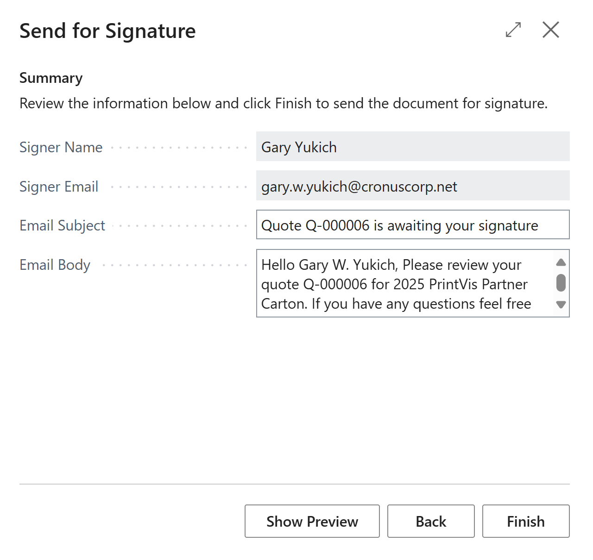

# Docubee Usage

Once Docubee is setup (see Docubee Setup article) using Docubee is very
straight-forward.

## Sending a document for signature

On the PrintVis case card where the Quote and other documents are listed
is a new action called **Send for Signature**

A list will display all the report types that were enabled for Docubee
during setup. Select the report type to send and click **OK**.

Next, a list of different report layouts available for that report type
is displayed. Select the report layout to use and click **OK**.

Next, the name and email address assigned to the contact of the case
will display and can be changed if needed.

Also, on this page it is possible to attach an additional PDF to this
report by clicking **Add additional PDF**

It is also possible to **Show Preview** to see what the document will
look like in Docubee

Click **Next** to continue and then click **Finish** on the summary page
to send the document

A small dialog will appear showing the status of the document being sent
to Docubee and will close when finished returning to the Case Card

## Document Status

As part of the setup process, it is possible to create a job queue entry
to automatically check and update the status of all documents sent for
signature. By default, this job queue checks for updates every 5 minutes
but can be set to check more or less often.

If you manually want to check the status of a sent document or see all
the documents sent for signature on a case, in the same menu as Send for
signature there is another action called **Docubee Documents**

This page will show all documents sent for signature through Docubee and
their current status.

**Refresh Status** will immediately check the status of the selected
document

**Download Document** allows the user to download a copy of the signed
or declined Document

**Delete Document** deletes the document from the PrintVis Docubee
list**.** *Be aware this does not cancel the document within Docubee or
stop the signature process but only removes it from the list of
documents PrintVis checks the status on.*

**Error Details** will display any errors that Docubee returns related
to a document or its status

**Activity Log** will display all the activity related to a document
such as sending the document to Docubee and each time the system checked
for a status
