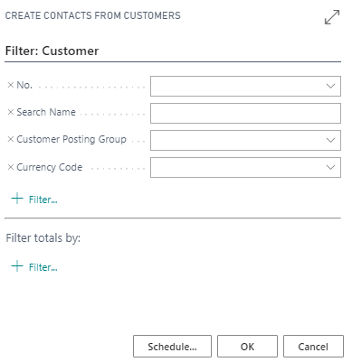
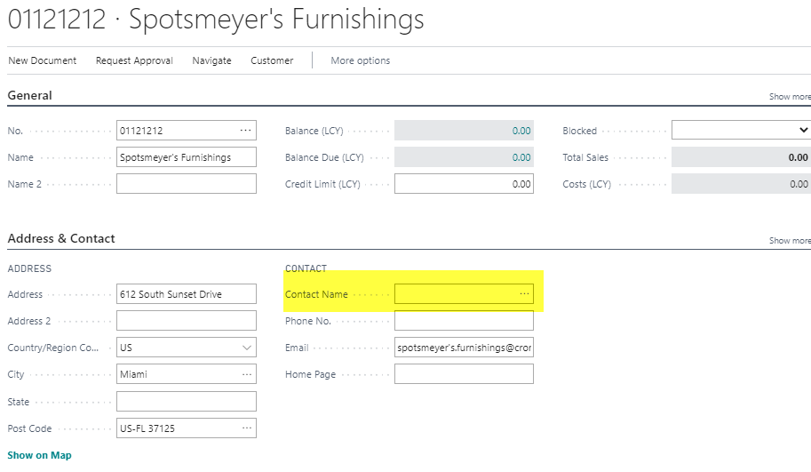
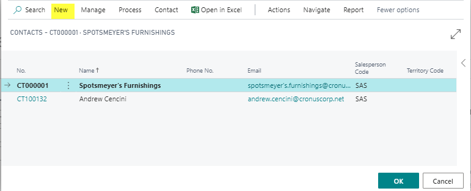
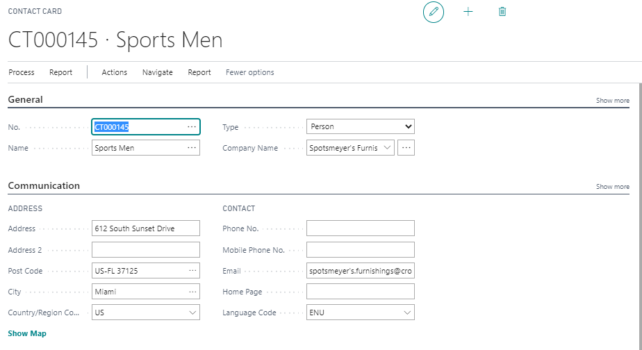

# Create new Contact

## Summary

You can create a contact for each new company you interact with, such as a customer, vendor, prospective customer, bank, law firm, consultant, and so on. There are two main methods to create a contact:

1. **From Scratch**
2. **From an Existing Customer, Vendor, or Bank Account**

**Note:** Before creating a contact, you may want to check the settings in the Marketing Setup window.

 Create a Company Contact from Scratch

1. **Use the Search Field**: Open the contact list.

2. **Choose the New Action**: Click on the "New" button.

3. **Enter a Number**: In the **No.** field, enter a number for the contact.
   
    *Alternatively*, if you have set up a number series for contacts in the Marketing Setup window, press the Enter key to select the next available contact number.

4. **Set Type**: Change the type to **Company**.

5. **Fill in the Other Fields**: Complete the other required fields.

## Create a Company Contact from a Customer, Vendor, or Bank Account

If you have existing customers, vendors, or bank accounts, you can create contacts based on this data. The contact information will synchronize with the customer, vendor, or bank account information.

**Note:** Before creating contacts this way, ensure you have specified a business relation code for customers, vendors, and bank accounts in the Marketing Setup window. If creating contacts from bank accounts, you must also specify number series for bank accounts in the General Ledger Setup window.

1. **Use the Search Field**: Enter one of the following, depending on where you want to create contacts, and then choose the related link:

    - [Create Contacts from Customers](path-to-link)
    - [Create Contacts from Vendors](path-to-link)
    - [Create Contacts from Bank Accounts](path-to-link)

2. **Set Filters**: In the batch job window that opens, set filters if you want to create contacts from specific customers, vendors, or bank accounts.

3. **Start Creating Contacts**: Choose the **OK** button to begin creating contacts.

4. **Assign Contact Numbers**: The next contact numbers in the number series are assigned to the new contacts. The business relation for vendors specified in the Marketing Setup window is assigned to the newly created contacts.

## Create a Person Contact from a Customer, Vendor, or Bank Account

**Example from Customer Card:**

1. **Open the Customer Card**: Access the customer card.

2. **Open the Contact List**: Navigate to the contact list.

3. **Use the New Function**: Click on the "New" button.

4. **Fill in the Contact Card**: Complete all the necessary fields on the contact card.

