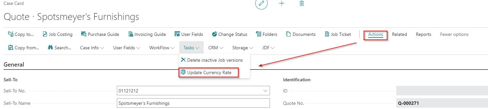
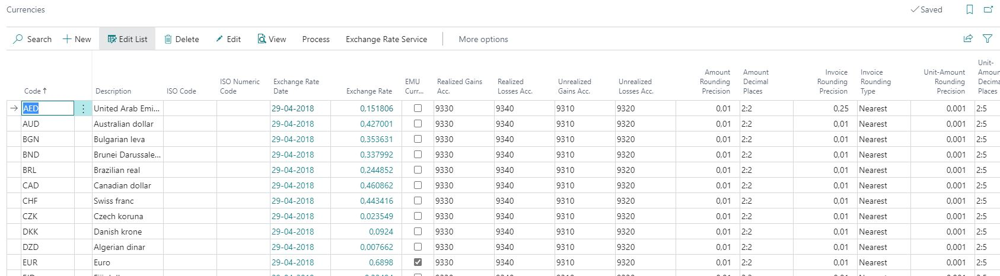
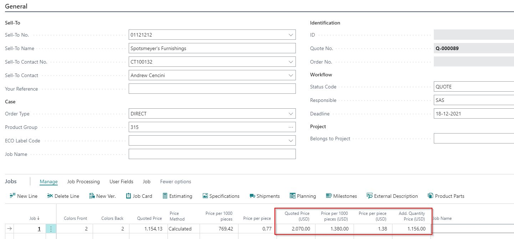
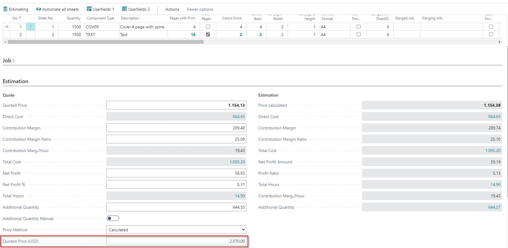
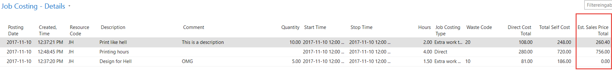
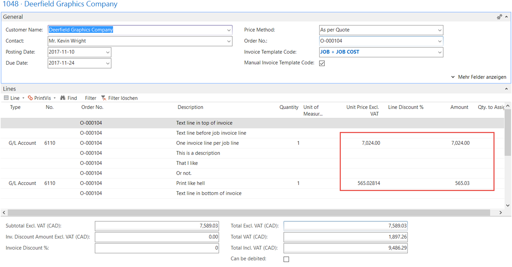

# Currency Management in PrintVis

## Summary

This article summarizes how PrintVis handles multiple customer currencies, allowing you to visualize and edit sales prices in the customer’s currency.

### PrintVis Case with Foreign Currency is Being Used

1. **Currency Control**
   - The currency for a case is managed by the Currency Code on the customer card and the setup of currency exchange rates.
   - If a foreign currency is used, the Currency Code and exchange rate (based on the working date) are transferred to the case.
   - The exchange rate is stored in the “Currency Factor” field on the case and is not updated automatically. This is because the quoted price is valid for a period despite exchange rate fluctuations.

### Update Currency Rate on Case
   - To update the exchange rate, press the “Update Currency Rate” button on the Actions tab.
   - This will update the “Currency Factor” field with the latest exchange rate based on the working date.
   

   - **Note:** Regular updates of currency exchange rates in the 365 Business Central setup are recommended.

### PrintVis Job if a Foreign Currency is Being Used

1. **Job Lines on Case Card**
   - **Quoted Price (<Currency Code>):** Displays the quoted price in the customer’s currency. This field is editable and can be overwritten. If manually entered, it updates the local currency price based on the exchange rate. Set “Price Method” to “Calculated” to revert to a calculated price.
   - **Price per Piece (<Currency Code>):** Shows the price per piece in the customer’s currency. This field is not editable.
   - **Price per 1000 Pieces (<Currency Code>):** Displays the price per 1000 pieces in the customer’s currency. This field is not editable.
   - **Additional Quoted Price (<Currency Code>):** Shows the additional quoted price in the customer’s currency. This field is editable. To revert to a calculated price, set “Manual Add. Quoted Price” to “No.”

   - These fields are visible only if the customer has a foreign currency.

### Estimating Tab on Job Card

- The estimating tab shows the **Quoted Price (<Currency Code>)** in the “Quote” column.
  - This field is editable and can be overwritten. If manually entered, the local currency price updates based on the exchange rate. The field “Price Method” is set to “Fix Quoted Price” to prevent further modifications.
  - To revert to a calculated price, set the “Price Method” to “Calculated.”

### Invoicing a Case for a customer in a Foreign Currency

- The Build function of the sales invoice creates sales lines based on the customer’s currency.
- **Example:** The invoice draft displays a confirmed total price and job costing entries with a waste code (Can be debited = Yes). All amounts are converted to the customer’s currency, with rounding applied to the confirmed price based on the invoice rounding set in the currency setup. Job costing lines are not rounded.

  - **Note:** Job costing is visible only in local currency.
  

- **Note:** All values on the invoice draft are in the customer’s currency.

