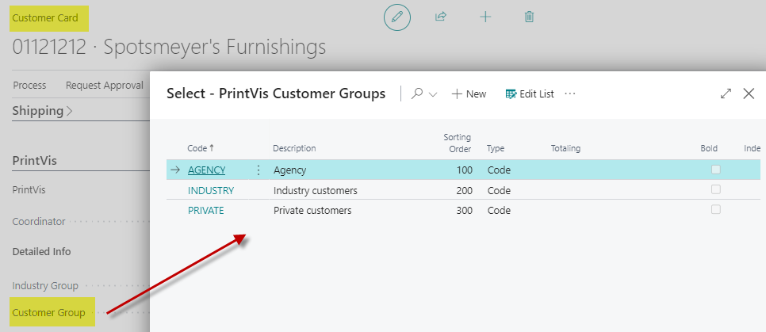

# Customer Groups

## Summary

The customer group is primarily used as a statistics dimension, allowing the grouping of company customers and facilitating the extraction of information.

## Customer Group List

| **Field**       | **Description**                                                                                                                                                                                                                                                                       |
|-----------------|---------------------------------------------------------------------------------------------------------------------------------------------------------------------------------------------------------------------------------------------------------------------------------------|
| **Code**        | Code is a system primary key for the Customer Group.                                                                                                                                                                                                                                  |
| **Description** | Customer Group Description.                                                                                                                                                                                                                                                           |
| **Sorting Order** | With this field, an alternative Sorting Order can be entered. The LookUp forms will usually select this Sorting Order. If no sorting order is defined, the lists will be ordered by the default primary key order.                                                               |
| **Type**        | Select if the line is **Normal**, a **Heading**, or a **Totaling**.   Setup example: <ul><li>First: line of type *Heading*</li><li>Then: lines of type *Normal*</li><li>Finally: a line of type *Totaling*</li></ul>                                                                |
| **Totaling**    | If the line is of type *Totaling*, use this field to select the *Normal* type lines that should be totaled. Opens a window to choose the lines.                                                                                                                                        |
| **Bold**        | Select **Yes** (or check mark) if the text for this Customer Group should be shown in **bold**.                                                                                                                                                                                       |
| **Indentation** | Used to indent text for the Customer Group:  `0` = no indentation  `1` = level 1  `2` = level 2  ...                                                                                                                                                                       |

## Used in ...

By assigning a color in the "EQ Color Code" field and configuring the "EQ-Color" in "General Setup - Register Production" for Customer Groups, the color can be used for announcements in EQ planning.

Customer groups are also utilized in:

- **Responsibility Areas**: For controlling Status Codes.
- **Cost Center Rates**: Used in rate definitions.
- **Additional Rates**: Applied in setting up additional rates.
- **Commission Rates**: Relevant in calculating commissions.
- **Discount Rates**: Used in defining discount rates.
- **Folder Management**: Applied for managing folders.
- **Web Job**: Used in web job functionalities.

