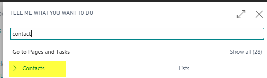
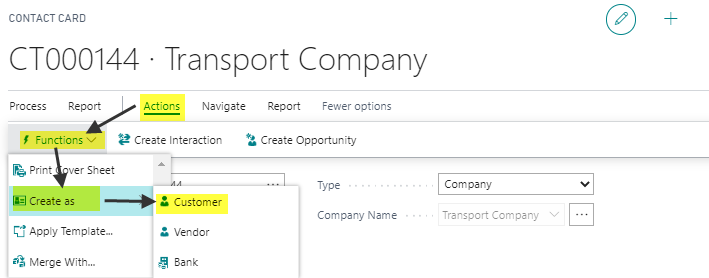
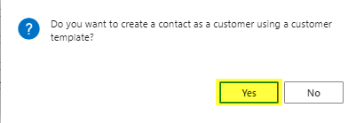
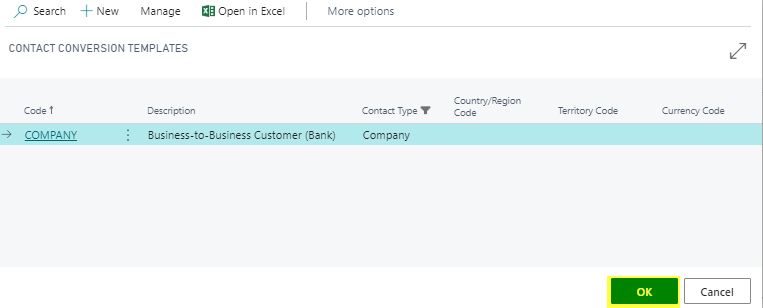
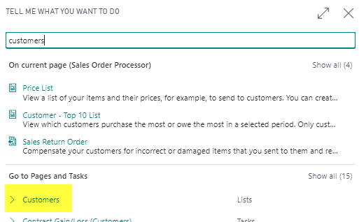
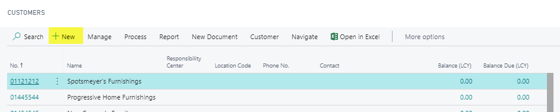
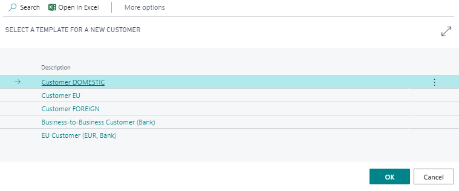
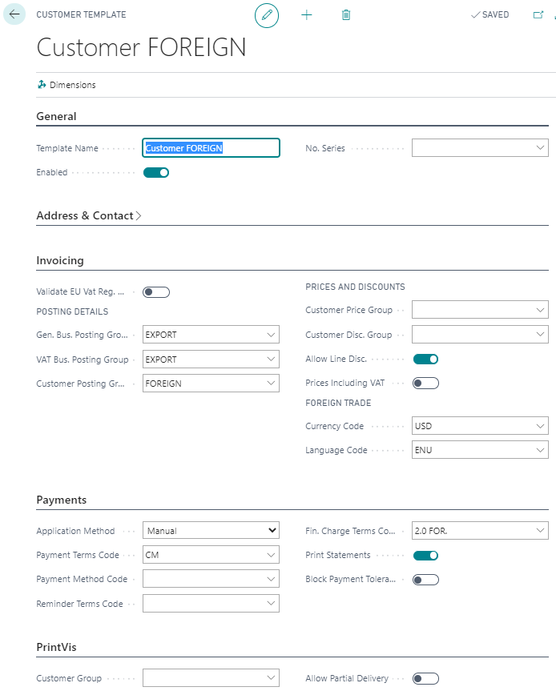
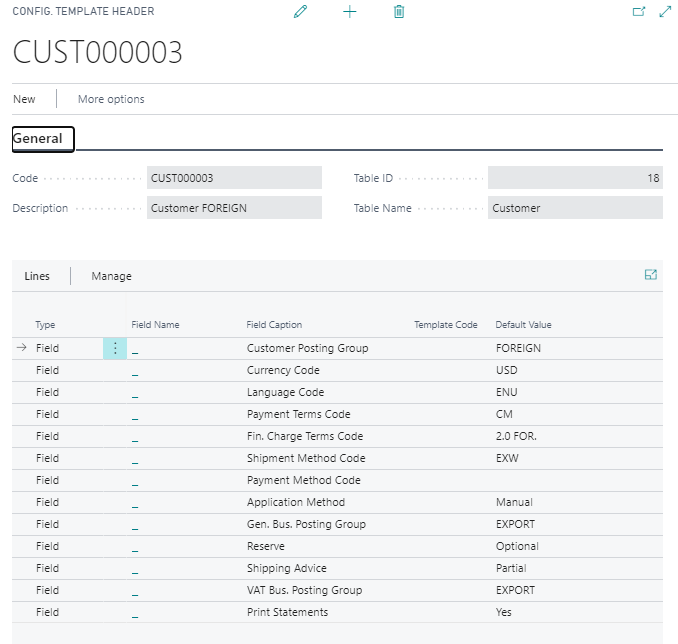

# Create new Customer

## New Customer from Existing Contact

1. **Go to the Contact List**:
   - Use the search field to find the contact you want to convert.

2. **Open the Contact**:
   - Select the contact and open the "Actions" menu.
   - Choose "Functions" and then "Create as."

3. **Create the Contact as Customer**:
   - Select the option to create the contact as a customer.
   

   - Choose the appropriate customer template.

## New Customer from Customer List

1. **Go to the Customer List**:
   - Use the search field to find the customer list.

2. **Create New Customer**:
   - Click on the option to create a new customer.

3. **Select the Customer Template**:
   - Choose the customer template you want to use.

4. **Fill in All Required Fields**:
   - Complete all necessary fields for the new customer.

## Example Templates

### Customer Template: 

### Configuration Template:

