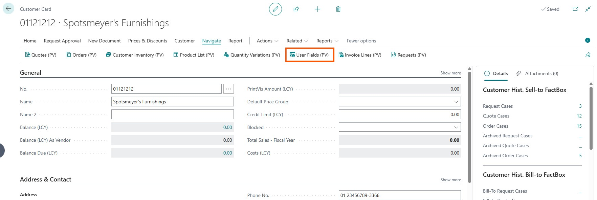
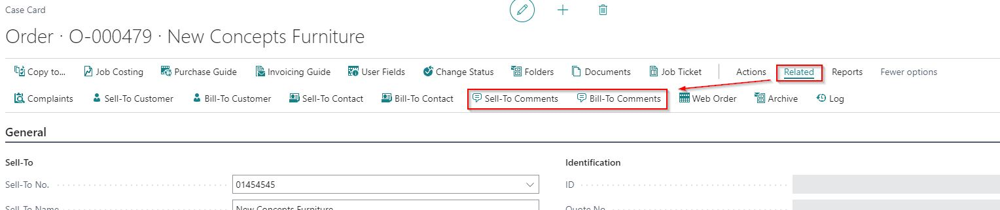

# Customer User Fields and Comments on Case Card

## Summary 

When working with cases, having quick access to customer information, such as user fields and comments, can be very helpful.

### Customer User Fields

Customer User Fields can be accessed directly from the Case Card under the "Navigate" menu.

### Customer Comments

- **Sell-To Customer Comments**: Available from the "Related" section on the Case Card.
- **Bill-To Customer Comments**: Also available from the "Related" section on the Case Card.

