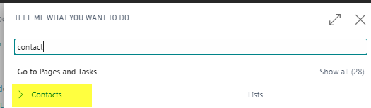
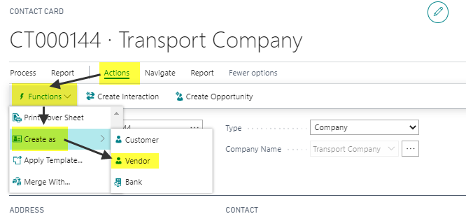
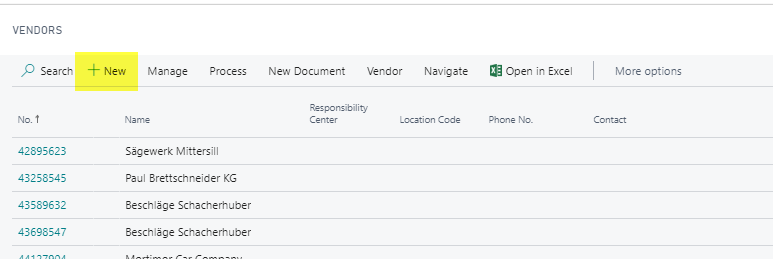
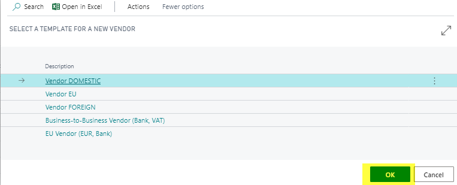
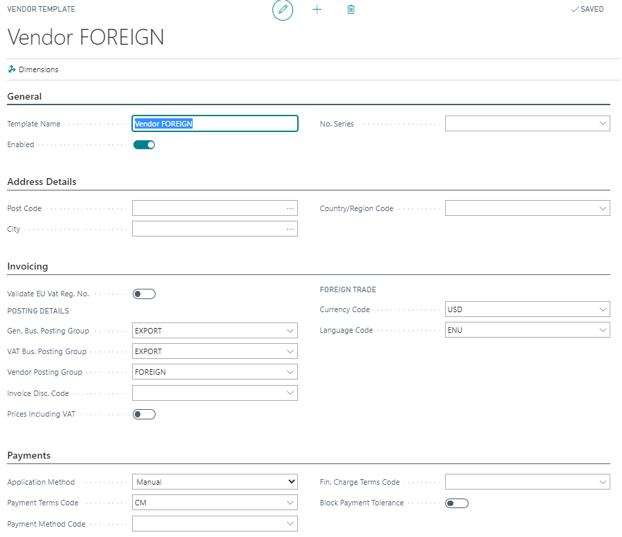
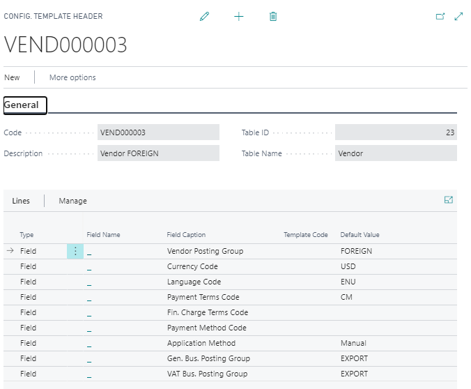

# Create new Vendor

## New Vendor from Existing Contact

1. **Go to the Contact List**: Use the search field to find the contact.

2. **Open the Contact**: Navigate to **Actions** > **Functions** > **Create as**.

## New Vendor from Vendor List

1. **Go to the Vendor List**: Use the search field to locate the vendor.

2. **Select the Vendor Template**: Choose the appropriate vendor template.

3. **Fill in All Required Fields**: Complete the necessary information.

## Example Templates

### Vendor Template:
  

### Configuration Template:
  

