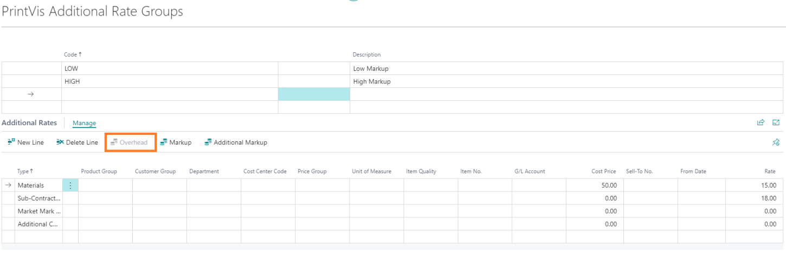
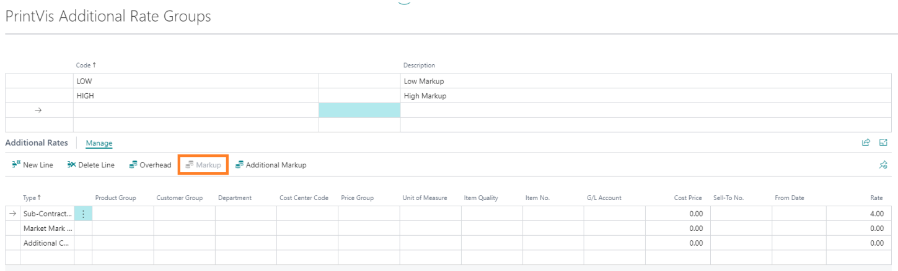
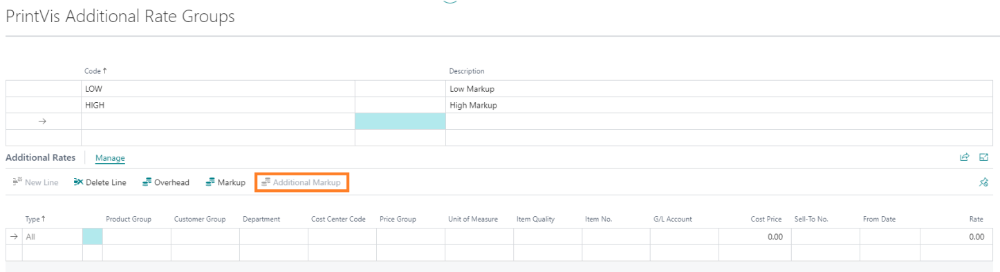
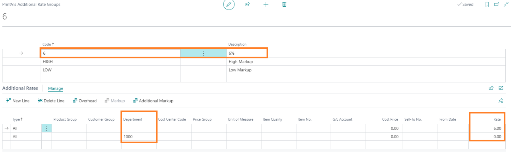
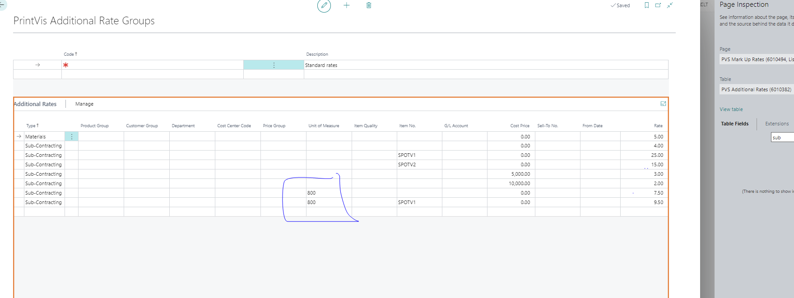

# Additional Rates Setup

## Introduction

PrintVis Additional Rates allow for the setup of overhead and profit mark-ups for job costing and calculation. They streamline the management of overhead and profit margins by applying predefined rates rather than individual item prices.

## Note
The logic behind Additional Rate Group is that you fill in a column with a blank line and a rate %. This allows anything that is not specified by a specific customer group, sell to number, prod group, etc. will pull in the rate % from the blank line.

## Overhead Setup:
  - Overhead is typically split into overheads for raw materials and subcontracting costs.
  - **Formula**:

 
   - Item Cost + Overhead = Total (Self) Cost

## Markup Setup:
  - Markup is added to the total cost to determine the sales price.
  - **Formula**:

  

  - Total (Self) Cost + Markup (Profit) = Sales Price

## Additional Markup Setup:
 
 

 - Used to adjust the sales price through additional markups or discounts.
  - Can be applied periodically, such as during low seasons, to manage workload or offer discounts.

### Types of Additional Markups

| Type                          | Description                                                                                                                                                                                                                     |
|-------------------------------|-----------------------------------------------------------------------------------------------------------------------------------------------------------------------------------------|
| **All**                       | The selected additional rate is calculated for all calculation details which comply with any other delimitation. The surcharge is calculated for Hourly Rates, Materials, and Sub-contracting.                               |
| **Materials**                 | The selected additional rate is calculated for material items which are not of type "Sub-Contracting." Typically, an item's cost price is read from the Item Card or from a Price List attached to the item, while the surcharges are calculated via this setup. |
| **Sub-Contracting**           | The selected additional rate is calculated for material items which are of type "Sub-Contracting." Typically, you will get the prices of sub-contracting by asking the sub-suppliers directly, and the cost price is often entered directly in the calculation or taken from a price list. On the basis of the entered price, the Total Cost and Prices will be calculated. |
| **Market Mark Up Total**      | The selected additional rate is calculated as a total surcharge for the total calculated sales price of the job and is included in the calculated Net Profit Ratio of the job. The market mark up is calculated as a surcharge after the calculation of any other surcharges and/or discounts (negative markup). |
| **Additional Cost for Stock Items** | The selected additional rate is calculated for all calculation details which calculate material consumption of inventory items and which comply with any other delimitation. The surcharge is calculated as a handling surcharge for the company's inventory items and is included in the calculation of the Contribution Margin Ratio of the job. |

### Other Table Fields

| Type               | Description                                                                                                                                                                                                                           |
|--------------------|-----------------------------------------------------------------------------------------------------------------------------------------------------------------------------------------------|
| **Product Group**  | By a look-up in the field, you may select a specific Product Group. The selected additional rate will only be calculated for the selected Type on jobs attached to the selected Product Group.                                       |
| **Customer Group** | By a look-up in the field, you may select a specific Customer Group. The selected additional rate will only be calculated for the selected Type on jobs attached to the selected Customer Group.                                     |
| **Department**     | By a look-up in the field, you may select a specific Department. The selected additional rate will only be calculated for the selected Type on calculation details attached to the selected Department.                              |
| **Cost Center**    | By a look-up in the field, you may select a specific Cost Center. The selected additional rate will only be calculated for the selected Type on calculation details attached to the selected Cost Center.                            |
| **Price Group**    | By a look-up in the field, you may select a specific Price Group. The selected additional rate will only be calculated for the selected Type on jobs attached to the selected Price Group.                                           |
| **Unit of Measure**| By a look-up in the field, you may select a specific Unit of Measure. The selected additional rate will only be calculated for the selected Type on calculation details attached to the selected Unit of Measure.                    |
| **Item Quality**   | By a look-up in the field, you may select a specific Item Quality. The selected additional rate will only be calculated for calculated material lines associated with items attached to the selected Quality.                         |
| **Item No.**       | By a look-up in the field, you may select a specific Item No. The selected additional rate will only be calculated for calculated material lines associated with the selected Item No.                                               |
| **G/L Account**    | By a look-up in the field, you may select a specific G/L Account. The selected additional rate will only be calculated for calculation details associated with the selected account number. Typically, a G/L Account number is attached to a Unit of Measure. |
| **Customer No.**   | By a look-up in the field, you may select a specific Customer No. The selected additional rate will only be calculated for the selected Type on jobs attached to the selected Customer.                                              |
| **From Date**      | If you want the additional percentage of a line to change on a specific date, you can create a line with the desired additional rate and specify the date from which the new rate must apply.                                       |
| **Rate**           | In this field, you enter the desired additional percentage according to the other selections made. You may use up to 2 decimals for the percentage.                                                                                  |

## Additional Information

- **Default Rate Line**: Set up a blank line with a rate percentage to ensure a default rate is applied when no other specific conditions are met.
- **Sequence of Parameters**: Ensure correct rate application by considering the filtering sequence:
  - Alternative Rate Code
  - Price Group
  - Department
  - Cost Center Code
  - Product Group
  - Sell-To No.
  - Item Quality
  - G/L Account
  - Unit of Measure
  - Item No.
  - From Date

### Example

An Additional Rate Group with a 6% markup might be set up to apply 6% additional markup to all calculation units. If there’s no additional markup for items in the Administration department, a separate line with a rate of 0% is added for that department.

