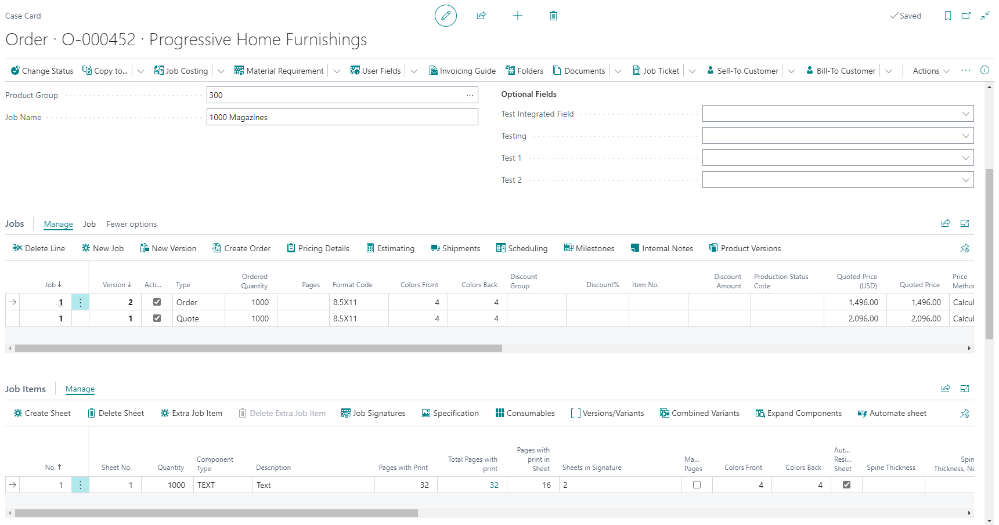
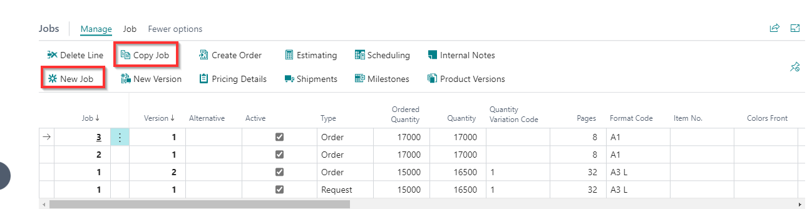
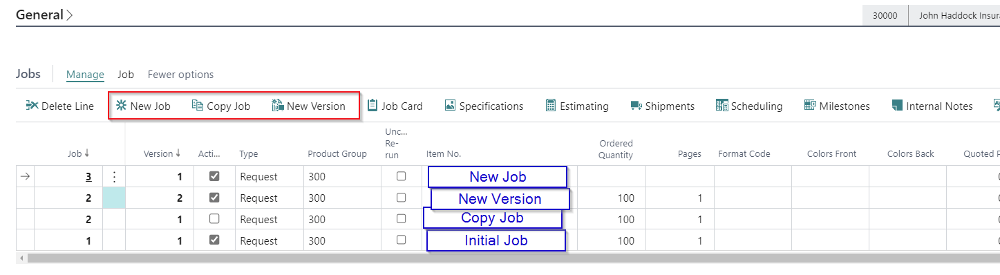
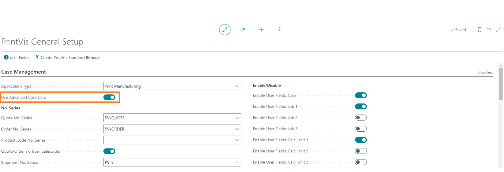

# Advanced Case Card

## Summary

The advanced case card is a different way for users to interact with what used to be the case card and job card combined.

### Structure

The structure of the advanced case card is similar to the standard case card, but the component/job items section of the job card has been added to the case card below the job lines. This allows for the menus of the job lines and the component/job items section to be optimized to reduce duplication that existed because of these sections being on two different pages.

The job menu was updated to include "New Job" to create a blank job line and "Copy Job" to create a new job line that is an exact copy of the highlighted job.

 Example for New/Copy Job/Version

### Setup

The advanced case card is enabled/disabled from the PrintVis General Setup page in the Case Management section.

