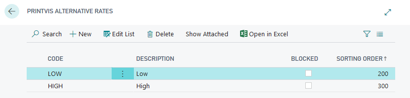
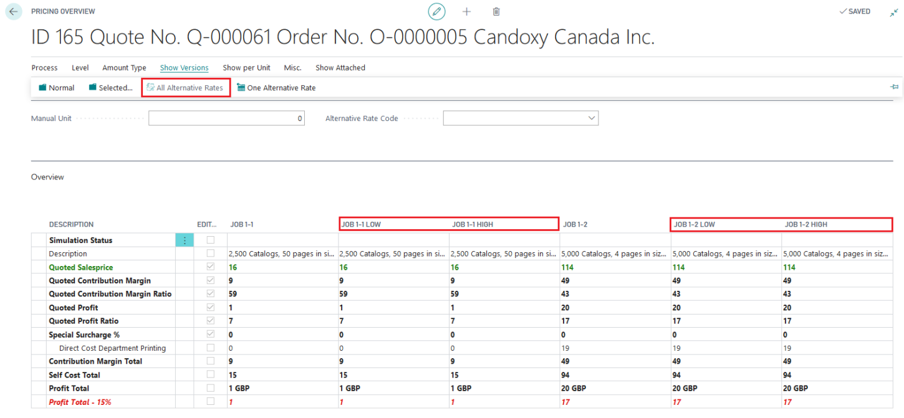

# Alternative Rates Setup

Alternative Rates are used within Additional Rates and Cost Center Rates to define specific rates for different scenarios. These rates can impact the pricing and costing of jobs.

## Summary

Alternative Rates allow for flexible pricing and cost adjustments by defining specific rates that impact job calculations and reports. They provide a way to tailor cost and pricing information based on various criteria.

- **Purpose**:
  - To define individual rates that can influence job costing and pricing.
  - The setup of Alternative Rates Groups affects the entire job when a group is selected on the Job Line.

## Usage:

### Pricing (Decision) Overview:
    - Alternative Cost Center Rates are applicable to calculated values.
    - The Pricing (Decision) Overview displays the calculation based on the Additional Rates.
  

 ### Customer Reports:
    - Additional Rates can be utilized in custom reports, such as special estimation reports or statistics reports.
    - These reports are not included in the standard package and need to be created separately.
