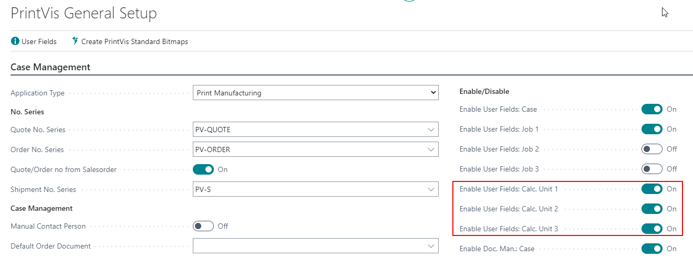
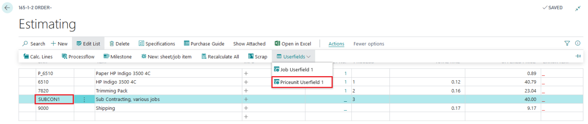
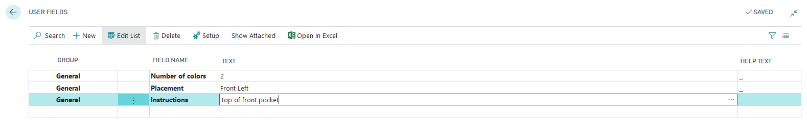
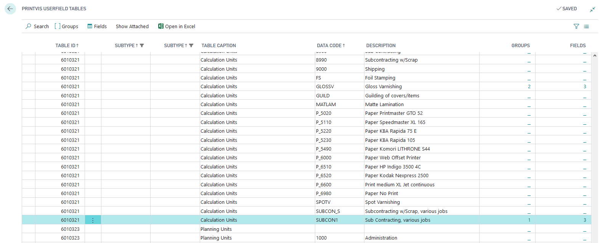
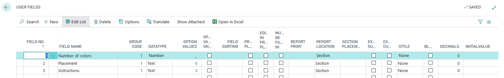

# Calculation Unit User Fields

## Introduction

User Fields is a particularly popular feature in PrintVis and is utilized in all our installations.

The most common functions involve interacting with estimates and determining what is printed on the job ticket.

An average company will have 20-40 user fields for various areas.

Many users may not realize that PrintVis can be configured to provide user fields only when a specific machine or service is added to the estimate with a calculation unit.

This is managed through Calculation Unit User Fields, which are set up for individual calculation units.

Click on each screenshot for an enlarged view.

### Screenshot 1: PrintVis General Setup

Check the Boolean field for Calc. Unit 1, 2, and/or 3 based on the unit level desired to use.

### Screenshot 2: Calculation Unit-Specific User Fields

### Screenshot 3: Setup List

### Screenshot 4: The User Field Setup

Scroll down in the list through the group areas to find the Calculation Unit you are looking for.

This functionality ensures that PrintVis remains relevant to each individual estimate and order description, without requiring the user to navigate through a long list of questions.

