# Calculation Unit Setup

## Introduction
This article explains the setup, purpose, and use of calculation units in PrintVis.

- **Definition**: A calculation unit is essential for performing calculations and is always linked to a cost center.
- **Cost Center**: Specifies a “costing unit” (a workplace or machine).
- **Difference**: A cost center configuration vs. a calculation unit:
  - Often a 1:1 relationship.
  - For flexibility, multiple calculation units can be linked to a single cost center configuration, or one calculation unit can combine multiple cost centers.

---

### Example: 1  ** Cost Center Configuration, Multiple Calculation Units**
A folding machine with various folding types (cross fold, z-fold, roll fold, etc.) may:
- Have 20+ operations in a cost center configuration.
- Instead of complex formulas, create separate calculation units for each folding type.

### Example: 2. ** Cost Center Configurations, 1 Calculation Unit**
Example: A saddle stitcher requires assistant workers based on the number of pockets in use:
- Cost Centers:
  - **Saddle Stitcher** (machine).
  - **Assistant Workers** (different hourly rates).
- The calculation unit combines:
  - Saddle stitcher operations.
  - Assistant worker operations (with required formulas).
  - Outputs a total cost/price for the process.

---

### Material Consumption
Material consumption is linked to cost centers and calculation units:
- Examples:
  - Plate setter: Consumes **plates**.
  - Printing machine: Consumes **paper** and **ink**.
  - Perfect Binder: Consumes **glue**.
  - Packing Workplace: Consumes **boxes**.

Material calculations are assigned to calculation units or cost centers.

---

### List of Calculation Units
- **Definition**: A combination/collection of calculation units.
- **Purpose**:
  - Selectable in Job Items and the Estimating page.
  - Often required for the main press (first line in the list).

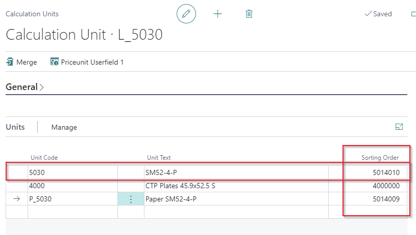

### Price Units
- **Synonym**: Historically, "Price Units" refers to calculation units.

---

## Calculation Unit Setup

 Accessing the Setup
- Search for "Calculation Units" and open the PrintVis Calculation Units List.

 Filtering
- Department-based buttons (e.g., "Printing") filter calculation units linked to specific cost centers.
- "All" releases the filter.

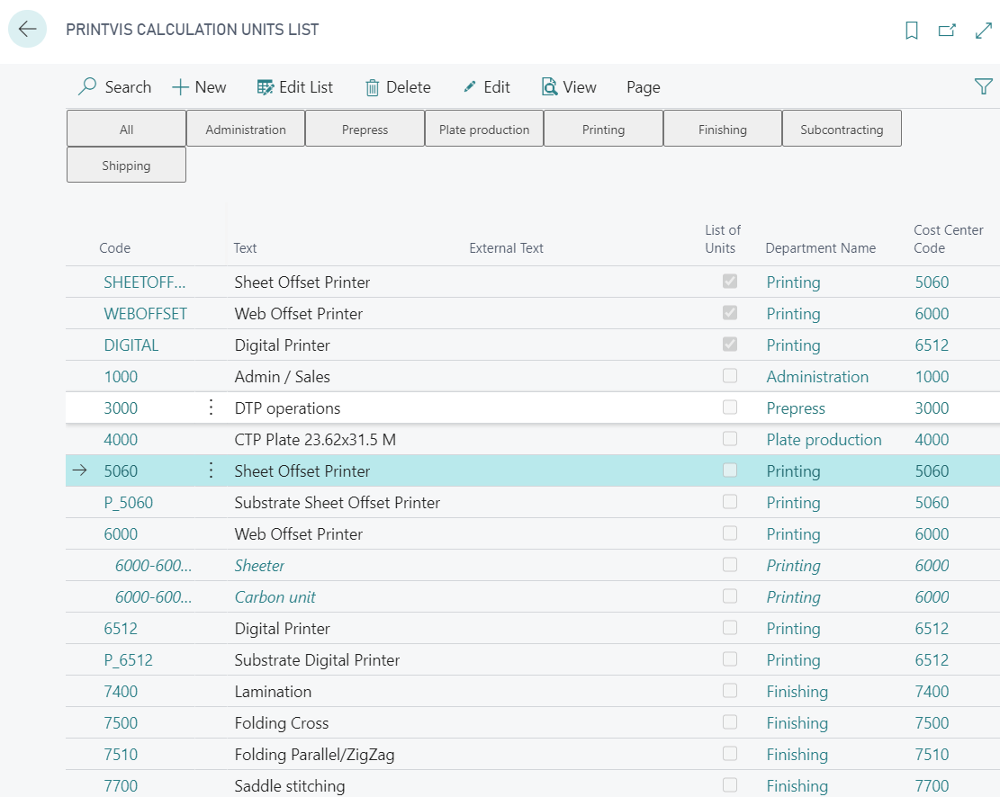

### FastTab: General

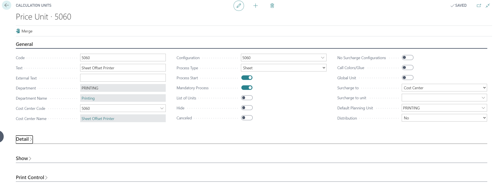

| **Field**                 | **Description**                                                                                                                                                      |
|---------------------------|----------------------------------------------------------------------------------------------------------------------------------------------------------------------|
| **Code**                  | A unique identifier for the Calculation Unit.                                                                                                                       |
| **Text**                  | A description of the Calculation Unit. If left blank, it auto-fills with the cost center description.                                                               |
| **External Text**         | Additional details for display in estimating pages or external documents.                                                                                           |
| **Department**            | Shows the department assigned to the selected cost center.                                                                                                          |
| **Cost Center Code**      | Links the Calculation Unit to a specific cost center.                                                                                                               |
| **Configuration**         | Assigns the Calculation Unit to a cost center configuration.                                                                                                        |
| **Process Type**          | Automatically set by machine type and configuration. Manual changes are discouraged.                                                                                |
| **Process Start**         | Activates process creation for calculations, e.g., scrap consumption. Should only be enabled for primary machines like presses.                                      |
| **Mandatory Process**     | Ensures inclusion in processes, regardless of cost center setup.                                                                                                    |
| **List of Units**         | Allows defining a list of Calculation Units as a single unit (e.g., bills of material for machines).                                                                |
| **Hide**                  | Excludes the Calculation Unit from selection lists, making it accessible only to users who know the code.                                                           |
| **Canceled**              | Deactivates a unit without deleting it, preserving historical data for older jobs.                                                                                   |
| **No Surcharge Configurations** | Prevents opening additional cost center settings during calculations.                                                                                     |
| **Call Colors/Glue**      | Automatically opens the Colors/Adhesive function for relevant processes like printing or binding.                                                                    |
| **Global Unit**           | Designates the unit as applicable across multiple machines or processes.                                                                                            |
| **Surcharge To**          | Defines if the surcharge applies specifically to a cost center or can be used more broadly.                                                                          |
| **Surcharge to Unit**     | Similar to "Surcharge To," but specifies use across multiple machines for a single surcharge.                                                                         |
| **Default Planning Unit** | Links the Calculation Unit to a standard planning unit. Exceptions can be defined for individual lines.                                                             |
| **Distribution**          | Determines if the unit can be exported or imported. Imported units are labeled as "Imported."                                                                       |

---

### FastTab: Details

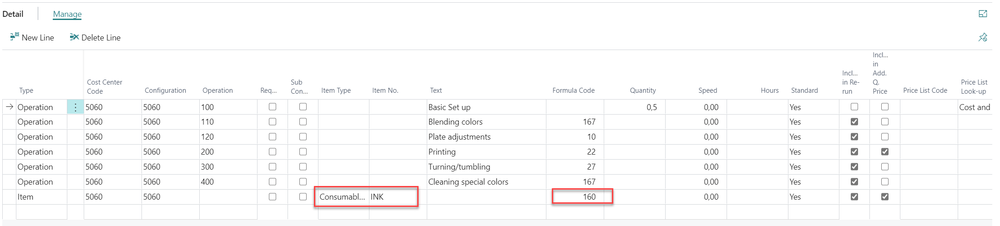

- Select "Operation" or "Item" as type
- Most fields will be copied from the configuration by entering the cost center code and configuration
- Item lines are linked to the cost center only and the item type, item no. and formal must be selected here, because these lines do not exist on the cost center configuration.

| **Field**                    | **Description**                                                                                                                                                                                                                                                |
|------------------------------|------------------------------------------------------------------------------------------------------------------------------------------------------------------------------------------------------------------------------------------------------------|
| **Type**                     | Indicates whether the calculation details contain an operation (time consumption) or an item.                                                                                                                                                              |
| **Cost Center**              | Specifies the cost center code. By default, it reflects the cost center in the header but can be changed to calculate operations across different machines or setups.                                                                                      |
| **Configuration**            | Defines the desired configuration for an operation. Leave blank if an item is selected.                                                                                                                                                                    |
| **Operation**                | Specifies the operation number for the selected cost center and configuration.                                                                                                                                                                             |
| **Request**                  | Excludes certain calculation lines until the user selects them for inclusion. Useful for subcontracting calculations.                                                                                                                                      |
| **Sub Contracting**          | Indicates that the detail value is included in subcontracting calculations.                                                                                                                                                                               |
| **Item Type**                | Defines the item type for the calculation, such as paper or colors. Acts as a filter when selecting items.                                                                                                                                                 |
| **Item No.**                 | Specifies the item number for calculation. Filters apply based on the selected item type.                                                                                                                                                                 |
| **Text**                     | Defaults from the item card or operation line but can be customized for specific lines.                                                                                                                                                                   |
| **External Text**            | Similar to external text on the calculation unit card; used in reports and included in calculations.                                                                                                                                                      |
| **Speed**                    | Defines the fixed speed for an operation, interpreted as units per hour.                                                                                                                                                                                  |
| **Formula Code**             | Specifies the formula for automatic calculations. Guides are available for correct setup.                                                                                                                                                                 |
| **Formula Concept**          | Tags lines for totaling and statistics purposes. Lines with the same code are grouped in reports.                                                                                                                                                         |
| **Quantity**                 | Sets a fixed quantity for an operation, such as preparation.                                                                                                                                                                                              |
| **Speed Table**              | Automatically attaches a speed table if applicable, allowing manual adjustments.                                                                                                                                                                          |
| **Budget of Hours**          | Sets a fixed time suggestion for calculations, overriding other inputs.                                                                                                                                                                                   |
| **Default**                  | Indicates whether the details are included in calculations by default.                                                                                                                                                                                    |
| **Included in Reprinting**   | Automatically selected for items or operations included in reprinting. Manual control for items is allowed.                                                                                                                                               |
| **Apply to Additional Quantity** | Automatically selected for items or operations included in additional quantity calculations.                                                                                                                                                     |
| **Price List Code**          | Links to a price list, which can be created or modified from the line.                                                                                                                                                                                    |
| **Price List Lookup**        | Specifies how cost and sales prices are derived (e.g., from price lists or item cards).                                                                                                                                                                   |
| **Start/Stop Type**          | Defines how production consumption is calculated (e.g., initial, ongoing, or final costs).                                                                                                                                                                |
| **Planning Unit**            | Specifies the planning unit for the calculation line, which can be adjusted.                                                                                                                                                                              |
| **Unit of Measure**          | Indicates the unit of measure for the item or operation, auto-filled by lookup.                                                                                                                                                                           |
| **Item Description**         | Auto-filled from the item table for items or subcontracting.                                                                                                                                                                                              |
| **Show on Job Ticket**       | Controls display of the line on job tickets, showing either time consumption or quantity.                                                                                                                                                                 |
| **Show Lines on Job Ticket** | Used for print control.                                                                                                                                                                                                                                   |
| **Show on Quote**            | Used for print control.                                                                                                                                                                                                                                   |
| **Show Lines on Quote**      | Used for print control.                                                                                                                                                                                                                                   |
| **Show on Purchase Order**   | Used for print control.                                                                                                                                                                                                                                   |
| **Vendor Name**              | Auto-filled from the item card for items or subcontracting if specified.                                                                                                                                                                                 |

---

### FastTab: Show

| **Field**                     | **Description**                                                                                                                                                                                                                                         |
|-------------------------------|-----------------------------------------------------------------------------------------------------------------------------------------------------------------------------------------------------------------------------------------------------|
| **Show in Case Management**   | If selected, this calculation unit is displayed as a column in the right-hand side matrix of the case list.                                                                                                                                          |
| **Hide during Calculation**   | Makes the calculation unit available in the estimating page lookup but prevents it from being selected manually or separately.                                                                                                                       |
| **Sorting Order**             | Defines the sequence for listing calculation units in the estimating window, impacting scrap calculation and production flow. Ensure sorting follows the production sequence (e.g., prepress → print → finishing). Adjust as needed for specific estimates. |
| **Show Calc. Details**        | Options:                                                                                                                                                                                                                                             |
|                               | - Blank: Do not show additional calculation lines at estimation.                                                                                                                                                                                     |
|                               | - Show Additional: Show additional calculation lines at estimation.                                                                                                                                                                                 |
| **Include in Machine Choice** | Options:                                                                                                                                                                                                                                             |
|                               | - Always: Default; displays "List of calc.-units" in the field lookup "List of Unit/Machine" on the job item.                                                                                                                                         |
|                               | - Never: Hides "List of calc.-units" in the field lookup on the job item.                                                                                                                                                                             |
|                               | - Calculate: Displays "List of calc.-units" and calculated values (lines appear in blue). Filters machines by cost, listing cheapest first.                                                                                                         |
| **Show Capacity**             | Specifies what capacity information to show in the "List of Unit/Machine" lookup on the job item. Options:                                                                                                                                           |
|                               | - Blank                                                                                                                                                                                                                                              |
|                               | - Free Capacity                                                                                                                                                                                                                                       |
|                               | - Net Capacity                                                                                                                                                                                                                                        |
|                               | - Planned Capacity                                                                                                                                                                                                                                   |
|                               | - Occupancy %                                                                                                                                                                                                                                        |
| **Show in Quick Quote**        | If enabled, displays the calculation unit in the Quick Quote under "Additional Charges."                                                                                                                                                            |
---

### FastTab Print Control

| **Field**                      | **Description**                                                                                                                                                                                                                                     |
|--------------------------------|-------------------------------------------------------------------------------------------------------------------------------------------------------------------------------------------------------------------------------------------------|
| **Show Unit on Job Ticket**     | Displays a total line without quantity on the job ticket to indicate the calculation unit is used.                                                                                                                                                |
| **Show Time on Job Ticket**     | Displays the estimated time on the job ticket. Requires the "Show on Job Ticket" field to be checked for individual calculation details.                                                                                                           |
| **Show Quantity on Job Ticket** | Displays the estimated quantity on the job ticket. Requires the "Show on Job Ticket" field to be checked for individual calculation details.                                                                                                       |
| **Show Time Group on Job Ticket** | Displays the time group on the job ticket.                                                                                                                                                                                                         |
| **Split Cost Center Group**     | Changes the display on the Estimation Report.                                                                                                                                                                                                     |
|                                 | - **Enabled**: If multiple calculation units with different descriptions exist, separate headers are displayed. If descriptions are the same, only one header is displayed.                                                                       |
|                                 | - **Disabled**: Only one header is displayed regardless of the number of calculation units in the estimate.                                                                                                                                       |
| **Show on Quote**               | Makes the calculation unit available for reports that use information from this field. Often used for custom reports.                                                                                                                             |
| **Specify Quote**               | Displays the calculation unit in the "Additional" section of the quote. Filters for "List of Units" and "Calc.-units" can be applied based on the product group setup.                                                                             |
| **Show on Purchase Order**      | Displays the calculation unit on a PrintVis purchase order, particularly for sub-contracting details to be included for the vendor.                                                                                                               |

Enter a new unit code and unit name for the Calculation Unit or List of Units, then click next:

## Copy Calculation Unit/List of Calculation Units

It is possible to copy Calculation Unit or List of Calculation Units instead of setting one up from scratch. It saves time and takes less time to create Calculation Units that are the same or similar and just need some tweaks.

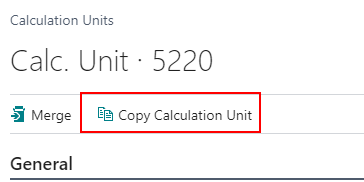

1. Enter a new unit code and unit name for the Calculation Unit or List of Units.

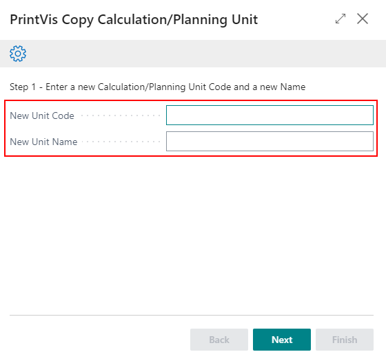

2. Click **Next**.

3. **Copy Price Lists and Copy Speed Tables** options:
   - **Copy Existing**: The system will copy the corresponding information from the cost center being copied and enter a new Unit Code that matches the new Calculation Unit.
   - **Re-use Existing**: The already existing table will be placed in the new Calculation Unit.
   
   For the List of Units, the option to copy price lists and copy speed tables will not be available.

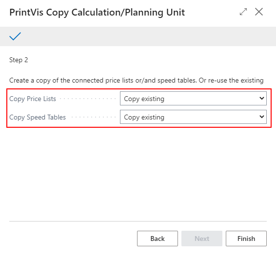

## Appendix

### Example Sorting Order

The sorting is setup to match the most probable production flow sequence.

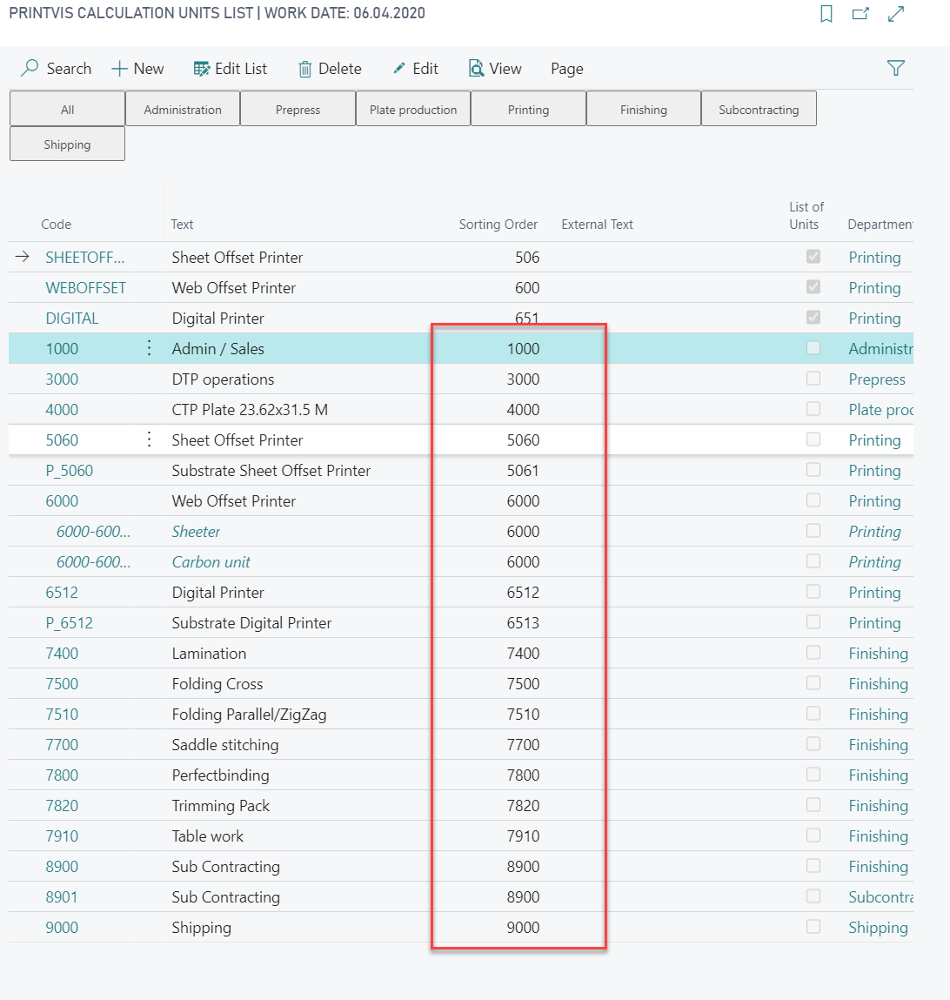

### Example Plate Setter

A plate setter must be set up with the field **Process Start** disabled and be part of the list of units for the press to ensure the process number is equal to the process number of the press. If this is not the case, formula 10 on the plate setter will be =0 and not the calculated number of plates from the press.

- The plate cost center can be just one, but a calculation unit is required for each different plate size if the plate items are set up separately.
- For less detailed calculation, it is also possible to set up just one line with a fixed sales price per plate.

 Plate Setter Calculation Unit

 List of Units for the Press to be selected on job items

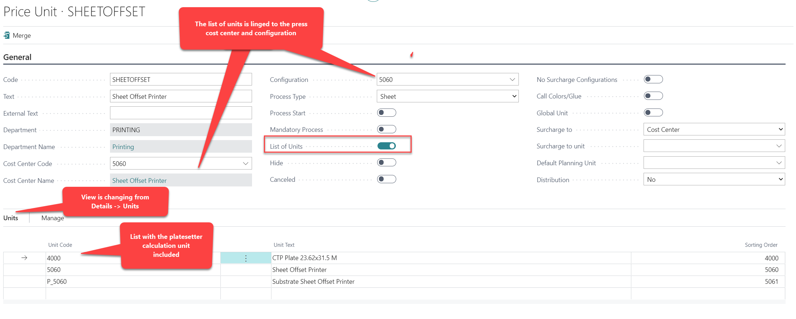

### Example Sheet Offset Press 

A Calculation Unit for the press includes a line that picks all ink items from the color/consumables table from the job item. Formula 160 calculates the weight of ink based on the ink coverage of the final format size usage on the sheet.

- An additional line for paper is possible, but in this example, a separate calculation unit was set up to better visualize the paper cost/price in the calculation.

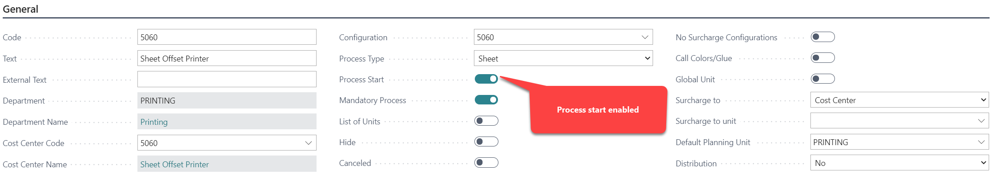
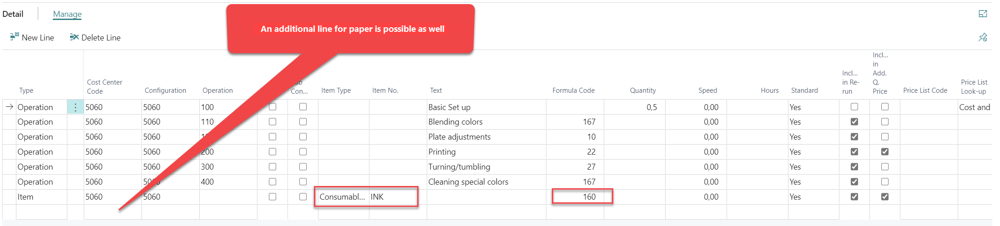

 Separate Calculation Unit for Paper/Print Substrate Calculation

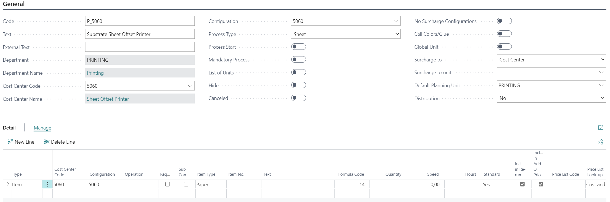

The line in this unit could also be part of the calculation unit for the press. But the result below shows that the paper pricing is listed in an extra line, which is often desired by the estimator. If the line were part of the press, the calculation would already show the paper cost/price included in the sheet offset printer cost/price.

 Result:

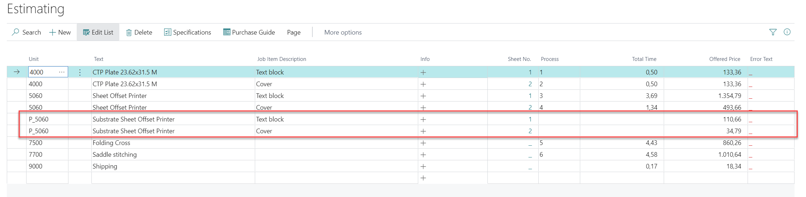

### Example Web Offset Press with Surcharge Units

Surcharge units are set up as surcharge configurations. Calculation Units linked to those surcharge units are listed in blue text color and with indentation of the code.

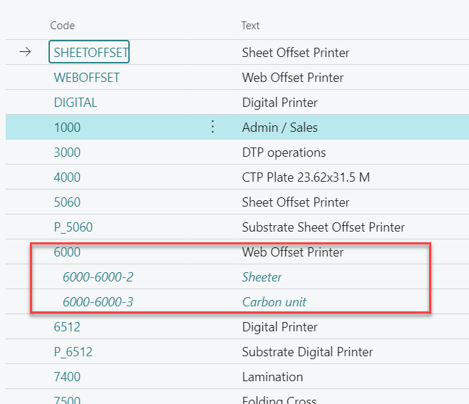

