# Calculation Unit Setup 

## Introduction

This article explains the setup, purpose and use of calculation units.

Without a calculation unit it is not possible to perform calculations.
It is always linked to a cost center. A cost center contains the
specification for a “costing unit” - a workplace or machine - and if an
operation for such a work place or machine needs to be used in the
calculation, a calculation unit needs to be set up. 

Sometimes there is the question “What is the difference between a cost
center configuration and a calculation unit?” Very often there is a 1:1
relationship. This means the calculation unit contains exactly all the
operations of the linked cost center configuration. But for more
flexibility this is not always the case.  

## Example: 1 Cost Center Configuration, Multiple Calculation Units

For example, a folding machine is able to produce cross fold, z-fold
(zig-zag fold), roll fold, gate fold and other folding types. Each type
can have different operations for setup and production, and the result
might be 20 or more possible operations on a cost center configuration,
with different quantity formulas and speed tables. Instead of having one
calculation unit with complex formulas that know when to calculate or
not, it is more practical to set up different calculation units: One for
each mentioned folding type.

## Example: 2 Cost Center Configurations, 1 Calculation Unit only

A calculation unit can also combine operations from different cost
center configurations. For example, a saddle stitcher requires a number
of assistant workers, depending on the number of pockets that are in
use. There can be 2 cost centers:

-   Saddle Stitcher

-   Assistant Workers

    -   Which can be appointed to several machines

    -   Which has a different hourly rate than the machines

The calculation unit for the saddle stitcher could contain the
operations from the saddle stitcher's cost center configuration, some
assistant operations from the assistant worker cost center, along with
formulas which calculate how many assistant workers are required and
which will be using the rate for the assistant's cost center
configuration. The total cost/price for the saddle stitching process is
then a combination of *all* those parameters.

## Material Consumption

A cost center configuration contains operations only. A calculation unit
also provides the possibility to set up material/item lines. In
PrintVis, the material consumption is typically assigned to the cost
center where the material consumption takes place. 

For example a:

-   Plate setter consumes

    -   Plates

-   Printing machine consumes

    -   Paper

    -   Ink

-   Perfect Binder consumes

    -   Glue

-   Packing workplace consumes

    -   Boxes

The lines that calculate the quantity for the required materials are
assigned to their calculation unit, or at least linked to the cost
center.

## List of Calculation Units 

A calculation can be also a list of calculation units which:

-   Is a combination/collection of calculation units 

-   Can be selected in Job Items and the estimating page

-   Is required to select a "List of Units" (which is very often for the
    main press) on job items.

**Important rules:** 

1.  In the setup of the List of Units, it is important for the process
    calculations that the printing machine is the first line in the
    list!  
    

2.  If there are surcharge units linked to any configuration it is
    important that: 

    -   Only 1 calculation unit for the same cost center has the setting
        "Process Start"

    -   Make always sure the "Process Start" is not enabled on the List
        Of Units  
          
          
        If not all of the above is covered, the pop-up windowed that is
        asking for surcharge units might show up several times! 

## Price Units

The term Price Units is *synonymous* with calculation units. There are
historical reasons, and the unit type in the table that stores the
calculation units is named "Price Unit".

## Calculation Unit Setup

Search for "Calculation Units" and open the PrintVis Calculation Units
List.

The buttons in the upper area are created automatically, based on the
departments that are assigned to the linked cost center. They can be
used for filtering long lists. When hitting the "Printing" button, the
list will filter all calculation units linked to cost centers for the
department "Printing." This works likewise for all department buttons.
When hitting the button "All," the filter will be released again.

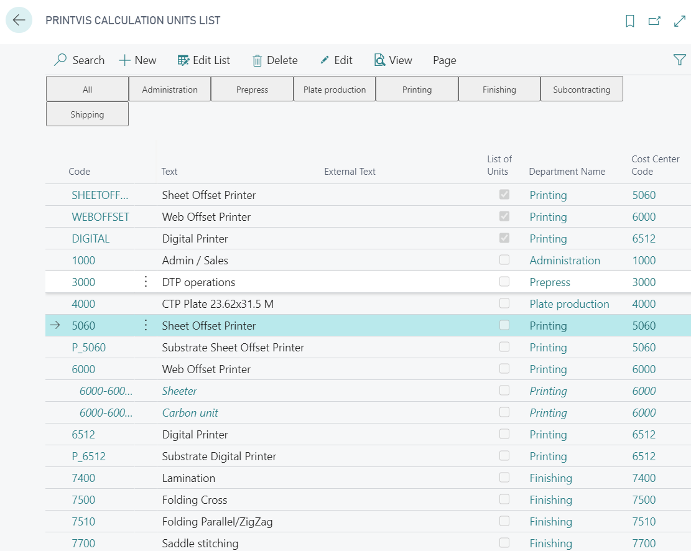

## FastTab General

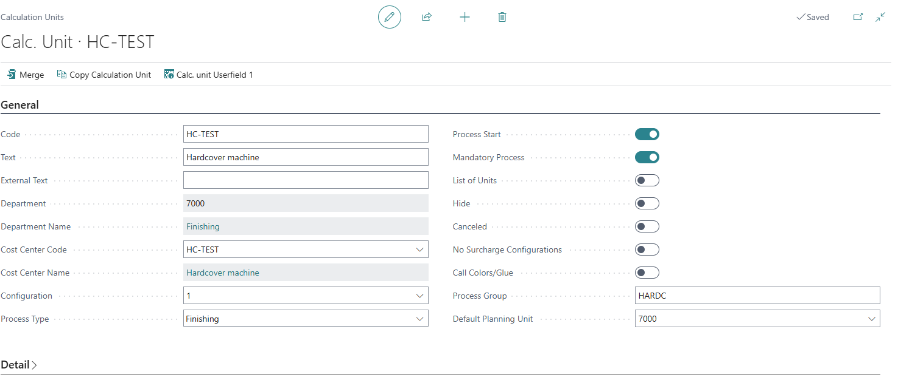

**Available Fields:**

<table>
<colgroup>
<col style="width: 25%" />
<col style="width: 74%" />
</colgroup>
<thead>
<tr>
<th>Code</th>
<th>Enter a code for the Calculation Unit</th>
</tr>
</thead>
<tbody>
<tr>
<th>Text</th>
<td>Enter a description for the Calculation Unit. 
If left blank, the field will be filled automatically with the cost
center description from the selected cost center code.</td>
</tr>
<tr>
<th>External Text</th>
<td>Additional description that will can be displayed in the Estimating
page and could be used for external documents.</td>
</tr>
<tr>
<th>Department</th>
<td>Displays the department that is assigned to the selected cost
center</td>
</tr>
<tr>
<th>Cost Center Code</th>
<td>Select the cost center to which this calculation unit needs to be
assigned</td>
</tr>
<tr>
<th>Configuration</th>
<td>Select the cost center configuration to which this calculation units
needs to be assigned</td>
</tr>
<tr>
<th>Process Type</th>
<td>The process type is set automatically by the type and machine type
settings in the cost center configuration. 
It is not recommended to change this value manually! 
If the value is wrong please change the Type for the printing machine or
finishing machine on the cost center / configuration!</td>
</tr>
<tr>
<th>Process Start</th>
<td>Processes are created for each calculation, for example if a machine
consumes scrap. A process start will create a process no. increment 1
from last process that was created before in the sequence of calculation
units, based on its sorting order. 
This field should be only enabled for main machines. For example, a
press is calculating the no. of plates needed, based on colors and
printing method.</td>
</tr>
<tr>
<th>Mandatory Process</th>
<td>Select this field if you want the calculation unit to be included in
the processes but where the cost center build-up does not indicate that
it is a process.</td>
</tr>
<tr>
<th>List Of Units</th>
<td>If you select this field, the bottom part of the window changes. The
program is now ready to create a list which is a calculation unit -
consisting of other calculation units. Printing machines are, for
example, created as bills of material because they are a block of
calculation units which naturally belong to the process, and therefore
might as well be selected at the same time.</td>
</tr>
<tr>
<th>Hide</th>
<td>You may check this field if you do not want the calculation unit to
be included in the list in which you select calculation units for the
calculation. Then the calculation unit can only be selected by those who
know that it is there - and who remember the code.</td>
</tr>
<tr>
<th>Canceled</th>
<td>Calculation units which are no longer used should not simply be
deleted. This might cause difficulties if you should want to copy from
an old job which contains this type of calculation unit. Therefore this
field is used to block the application of this calculation unit so that
it cannot be used in the calculation.</td>
</tr>
<tr>
<th>No Surcharge Configurations</th>
<td>You select this field if you, via the unit, open a cost center where
additional settings have been created and you do not want these to be
opened in the calculation.</td>
</tr>
<tr>
<th>Call Colors/Glue</th>
<td>If you select this field, the system automatically opens the
Colors/Adhesive on Job item function when the calculation unit is
selected. You may then immediately enter color choices for the printing
process. This function is typically used when creating printing machines
where color must be defined, but is also relevant to open when creating
an Adhesive binder where different types of adhesives are used.</td>
</tr>
<tr>
<th>Global Unit</th>
<td>If you want to use this surcharge unit not to a specific calculation
unit - this can be used for multiple units, then it is a "global"
unit.</td>
</tr>
<tr>
<th>Surcharge to</th>
<td>The default for this field is Cost Center and in this case the
surcharge unit can be used for the cost center on the calculation unit
only. With a setting different to Cost Center it is possible to create
free or "independent" surcharges. This means a surcharge can be used on
different machines - like the same 3-knife cutter can be used for Saddle
Stitcher 1, Saddle Stitcher 2 and Saddle Stitcher 3. 
Field is only available on Calculation Units for Surcharge Units.</td>
</tr>
<tr>
<th>Surcharge to unit</th>
<td>The default for this field is Cost Center and in this case the
surcharge unit can be used for the cost center on the calculation unit
only. With a setting different to Cost Center it is possible to create
free or "independent" surcharges. This means if a surcharge can be used
on different machines like the same 3-knife cutter can be used on Saddle
Stitcher 1, Saddle Stitcher 2 and Saddle Stitcher 3. 
Field is only available on Calculation Units for Surcharge Units.</td>
</tr>
<tr>
<th>Default Planning Unit</th>
<td>By a look-up in this field you define which standard Planning unit
the calculation unit belongs to. However, it is possible to except
individual lines in the Calculation and Item details table or to let
individual lines point to another planning unit.</td>
</tr>
<tr>
<th>Process Group</th>
<td>It is possible to set a default process group that will be
transferred to the job calculation page. This could be useful for
complex hardcover books, when certain machines are used only for certain
components, that can be preset. 
For details about the usage please search for the process group
article. </td>
</tr>
</tbody>
</table>

## FastTab Details

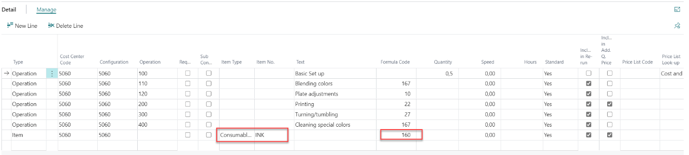

-   Select "Operation" or "Item" as type

-   Most fields will be copied from the configuration by entering the
    cost center code and configuration

-   Item lines are linked to the cost center only and the item type,
    item no. and formal must be selected here, because these lines do
    not exist on the cost center configuration.

**Available Fields:**

<table>
<colgroup>
<col style="width: 25%" />
<col style="width: 74%" />
</colgroup>
<thead>
<tr>
<th>Type</th>
<th>Here you indicate whether the calculation details are to contain an
operation (time consumption) or an item. </th>
</tr>
</thead>
<tbody>
<tr>
<th>Cost center</th>
<td>
Regardless of whether you want to calculate an operation or an
item in the calculation details, you must write the cost center code
here. 

The default setting is to display the Cost center selected in the
header but you may choose to let a calculation unit point to other and
different Cost centers. By a look-up in this field you may select
another Cost center. 

The purpose of selecting another Cost center than the one selected in
the main setup may be that, in some cases, an operation must calculate
runs on several machines - for example that gathering on a Book alley
must take place partly on a separate gathering station if there are more
than a defined number of sections for the job.
</td>
</tr>
<tr>
<th>Configuration</th>
<td>If an operation is defined in the lines, the desired configuration
is selected by a look-up in the field. However, if an Item is selected,
you must leave the field empty as an item cannot not point directly to a
Configuration.</td>
</tr>
<tr>
<th>Operation</th>
<td>If an operation is defined in the lines, the desired number is
selected by a look-up in the field. Using the look-up, you may select
among the operations for the selected Cost center and
Configuration.</td>
</tr>
<tr>
<th>Request</th>
<td>This field is often used for calculation units which, for example,
are used to calculate sub contracting. In the operations or item details
where this field is selected, the amount calculated is not included in
the calculation as long as the field is selected. The user of the
calculation must remove the checkmark in the line (out of several
suggestions) which is to be included in the calculation in future. </td>
</tr>
<tr>
<th>Sub Contracting</th>
<td>This field is updated from the item card or the operation details
and indicates that the detail value is included in sub contacting when
considering the calculation and statistics key figures. </td>
</tr>
<tr>
<th>Item Type</th>
<td>
Here you may indicate in Item details which item type the line
must read by a look-up. By a look-up in this field, you may choose among
the item types created in the system. If, for example, you create a
Calculation unit to calculate the paper consumption for a print process,
the field content must be Paper. 

If no specific item number is selected for the line, the selected
item type is a limiting filter by a look-up in Graphic Item list. Using
the filters, the item numbers are limited and it is easier to find the
correct item. Select using OK. 

You may also select the item type Color table - this is used to
calculate job color consumption by a calculation of the items with item
type Color which form part of the job description (and thus the
calculation). 

The setup is done using a combination of calculation details for the
printing machine calculation unit provided with graphic item type=color
table and of formula code 7 (Formula 7 estimates the process color
consumption in kg.). 

In this setup, the user's practical work is as follows: 

When bill of materials is selected on the job card, a window appears
in which the user may insert the items with item type Color which are to
be included in production. Then the user may adjust the coverage% of the
color for the job as well as the value of ink coverage square meter/kg.
These values are set up for each item in Graphic Item card - the
Format/Color tab. 

On the basis of these parameters, the program now calculates the
value of formula 7 and inserts calculation details with item number and
color consumption in the calculation. 

This may also be combined with formula 13 (Formula 13 calculates the
varnish consumption of the process. For formula 13 to calculate a
result, one or both fields 'Varnish front' and 'Varnish back' on the job
Specifications must be selected). In this setup the same work process
takes places and a line with varnish appears in the desired calculation
unit. 
</td>
</tr>
<tr>
<th>Item No.</th>
<td>Here you indicate for Item details the item number which you want to
calculate in the line, perhaps using a look-up in the field. If you have
selected a specific item type, the system will consider this by a
look-up in Graphic Item list. Using the filters, the item numbers are
limited and it is easier to find the correct item. Select using OK.</td>
</tr>
<tr>
<th>Text</th>
<td>The text is updated from the item card or an operation line.
However, you may change these if necessary. In some cases you choose to
make an operation which is used in several lines below each other, give
them different text and change, for example, speeds and price lists for
each line.</td>
</tr>
<tr>
<th>External Text</th>
<td>Similar to the external text on the calculation unit card, the
external text in the line may be read to external reports and is also
included in the calculation in a parenthesis in the text field.</td>
</tr>
<tr>
<th>Speed</th>
<td>
If an operation may be said to take the same amount of time for
each unit, there is a fixed speed which you may indicate in this field.
It is important that you indicate the speed correctly! 

The program reads the field as: <em>you may produce this many in an
hour. </em>Thus the speed may be 1000 if it is a finishing machine or
2.45 if it is a scan.
</td>
</tr>
<tr>
<th>Formula Code</th>
<td>
You select a formula code for each line which is to make
automatic calculations. The formula selected tells the program how the
calculation figures are to be read and calculated. 

There are many calculation formulas to choose from and the company
may also create additional formulas - so it may be difficult to make a
correct choice. The system also guides you in the setup of printing and
finishing machines - on the Configuration for the selected cost center -
the Calculation formulas tab.
</td>
</tr>
<tr>
<th>Formula Concept</th>
<td>In this field you may put a stamp on the line which may both be used
for Totalingfor statistics purposes and in UserFormulas You write a code
in the field and all lines with the same code are totaled in the system
when you start a report or statistics for this purpose.</td>
</tr>
<tr>
<th>Quantity</th>
<td>You may want to set a fixed quantity for an operation. This means
that that quantity of this operation is always calculated if the
calculation unit is selected. This may, for example, be Preparation
where you will always calculate a Preparation if this calculation unit
is selected.</td>
</tr>
<tr>
<th>Speed Table</th>
<td>If a speed table is attached to the operation, the speed table code
is automatically entered here by the program. By a look-up in this field
you may open the speed table to check the times. You may also attach
another speed table from the list. </td>
</tr>
<tr>
<th>Budget of Hours</th>
<td>If the calculation details in the calculation are to contain a fixed
suggestion for time consumption, you enter this time here. The time in
this field will override all other input for time, quantity, speed,
etc.</td>
</tr>
<tr>
<th>Default</th>
<td>Here yes or no indicate whether the calculation details are to be
included in the calculation per default. Yes is normal but if you select
no, the calculation details are not displayed in the calculation.</td>
</tr>
<tr>
<th>Included in reprinting</th>
<td>
If the item or operation is set up in the system so that it is to
be included in reprinting, the program selects this field itself. 

In the case of an item you may control this choice manually while
operation setup is maintained in the Cost center configuration.
</td>
</tr>
<tr>
<th>Apply to additional quantity</th>
<td>
If the item or operation is set up in the system so that it is to
be included in the calculation of "additional quantity" the program
selects this field itself. 

In the case of an item you may control this choice manually while
operation setup is maintained in the Cost center configuration.
</td>
</tr>
<tr>
<th>Price list Code</th>
<td>
If a price list is attached to the item or operation, the price
list code is transferred from there but it may be created or changed
from this line. By a look-up in the field you open the list of Price
lists. 

In the list of price lists you may view the prices by activating the
Table button.
</td>
</tr>
<tr>
<th>Price list lookup</th>
<td>
The price list look-up establishes what the calculation details
are to read from the price list. 

<em>Sales prices:</em> the cost price in the line derives from
quantity or time multiplied by the cost price on the item card or the
cost center.. The sales price is found in the price list. 

<em>Cost and sales prices</em>: Both cost and sales prices are found
in the price list, regardless of the time calculation/item price on the
card. 

<em>Cost prices</em>: The cost prices are found in a price list while
the sales price is calculated based on time or item
consumption.
</td>
</tr>
<tr>
<th>Start/Stop type</th>
<td>Here you define how production consumption is to be calculated. This
is used for statistics purposes (Price decision overview - 6010364) so
that subsequently, you may view how much consumption derives from
initial costs, ongoing costs, replacement costs or final costs. The
default setting is ongoing.</td>
</tr>
<tr>
<th>Planning unit</th>
<td>If a planning unit is attached to the calculation unit, the program
writes the code here. However, you may change the suggestion so that the
individual line opens another planning unit.</td>
</tr>
<tr>
<th>Unit of Measure</th>
<td>The unit of measure which the item or operation is set up to
measure. This is also written automatically by a look-up of the
item/operation.</td>
</tr>
<tr>
<th>Item description</th>
<td>If the line contains an item or sub contracting, the program fills
in this field itself based on the item number by a look-up in the item
table.</td>
</tr>
<tr>
<th>Show on Job ticket</th>
<td>This field is used in many connections to control that this line is
displayed on job tickets, etc. With either time consumption or quantity
which is determined by which field in the calculation unit card is
selected. Typically, Show Quantity or Show time is selected on the job
ticket.</td>
</tr>
<tr>
<th>Show lines on Job ticket</th>
<td>Used for print control. </td>
</tr>
<tr>
<th>Show on Quote</th>
<td>Used for print control. </td>
</tr>
<tr>
<th>Show lines on Quote</th>
<td>Used for print control. </td>
</tr>
<tr>
<th>Show on Purchase order</th>
<td>Used for print control. </td>
</tr>
<tr>
<th>Vendor Name</th>
<td>If the line contains an item or sub contracting, the program fills
in this field itself based on the item number by a look-up in the item
card if the field is filled in here. </td>
</tr>
</tbody>
</table>

## FastTab Show

**Available Fields:**

<table>
<colgroup>
<col style="width: 25%" />
<col style="width: 74%" />
</colgroup>
<thead>
<tr>
<th>Show in Case Management</th>
<th>If the field is selected, this calculation unit is displayed as a
column in the right-hand side matrix of the case list.</th>
</tr>
</thead>
<tbody>
<tr>
<th>Hide during Calculation</th>
<td>If you select this field, the calculation unit is available on the
lookup in the estimating page even though it can be included in list of
units or from a Template. The purpose if this could be that such
calculation units should not be selected manually and separately.</td>
</tr>
<tr>
<th>Sorting Order</th>
<td>This field defines the sequence how the calculation units are listed
in the estimating window, which also has impact for example in the scrap
calculation. Always make sure to have the sorting order setup based on
the production flow sequence from prepress - print-sheeted finishing
-final finishing. it might be not always possible to preset the sorting
100% right for all kind of estimates. In this case it is possible to
modify the sorting order for each estimate.</td>
</tr>
<tr>
<th>Show Calc. Details</th>
<td>
Select between:

<ul>
<li>
blank -&gt; don't show additional calculation lines at
estimation
</li>
<li>
Show Additional - show the additional calculation lines at
estimation
</li>
</ul></td>
</tr>
<tr>
<th>Include in Machine Choice</th>
<td>
Options: 

<ul>
<li>
Always: The default and you will see the "List of calc.-units",
this on the field lookup "List of Unit/Machine" on the
job-item. 
</li>
<li>
Never: You will NOT see the "List of calc.-units", on the field
lookup, "List of Unit/Machine", on the job-item. 
</li>
<li>
Calculate: You will see the "List of calc.-units", on the field
lookup "List of Unit/Machine", on the job-item and the "List of units"
marked with this will show you calculated values, and the lines will be
in blue color. 

<ul>
<li>
This will sort the List of Units selection by the cheapest
machines from top to the most expensive to the bottom.
</li>
<li>
Be aware that it is possible to make different filter settings
for the lookup on the field "List of Unit/Machine" on the job-item, from
the setup of filter, on the product group
</li>
</ul></li>
</ul></td>
</tr>
<tr>
<th>Show Capacity</th>
<td>
Here you have options of what capacity information to show, when
making a lookup on the field "List of Unit/Machine" on the Job-item.

<ul>
<li>
blank
</li>
<li>
Free Capacity
</li>
<li>
Net Capacity
</li>
<li>
Planned Capacity
</li>
<li>
Occupancy %
</li>
</ul></td>
</tr>
<tr>
<th>Show in Quick Quote</th>
<td>With this option enabled the calculation unit will be displayed on
the quick quote under "Additional Charges"</td>
</tr>
</tbody>
</table>

## FastTab Print Control

**Available Fields:**

<table>
<colgroup>
<col style="width: 25%" />
<col style="width: 74%" />
</colgroup>
<thead>
<tr>
<th>Show Unit on Job Ticket</th>
<th>This field is one of the fields most frequently used for display on
a PrintVis standard job ticket. Shows a total line without quantity on
the job ticket but only to show that the calculation unit is used.</th>
</tr>
</thead>
<tbody>
<tr>
<th>Show Time on Job Ticket</th>
<td>Select this field if you want the estimated time to be displayed on
the job ticket. You must combine this with a check mark in the Show on
Job ticket field in each individual calculation detail which you want
displayed.</td>
</tr>
<tr>
<th>Show Quantity on Job Ticket</th>
<td>Select this field if you want the estimated quantity to be displayed
on the job ticket. You must combine this with a check mark in the Show
on Job ticket field in each individual calculation detail which you want
displayed.</td>
</tr>
<tr>
<th>Show Time Group on Job Ticket</th>
<td>Select this field if you want the time group to be displayed on the
job ticket.</td>
</tr>
<tr>
<th>Split Cost Center Group</th>
<td>
With this field enabled the display on the Estimation Report will
change. 

<ul>
<li>
Enabled: If there are more than 1 of the same calculation units
(with different description text) displayed in the estimate, then there
will be separate headers with estimated information displayed. If there
are more than 1 of the same calculation units (with same description
text) displayed in the estimate, then there will be only 1 header with
estimated information displayed.
</li>
<li>
Disabled: There will only be 1 header with the estimated
information displayed, regardless of the number of calculation units in
the estimate.
</li>
</ul></td>
</tr>
<tr>
<th>Show on Quote</th>
<td>If you select this field, the calculation unit is made available for
any reports which read various information from here. This is used for
specially developed reports.</td>
</tr>
<tr>
<th>Specify Quote</th>
<td>Select this field on a "List of calc.-unit" or a "Calc-unit" and it
will show up on the new frame called "Additional". Be aware that it is
possible to make filter on the "List of units" and the "Calc.-units",
depending of the filter setup on the product group.</td>
</tr>
<tr>
<th>Show on Purchase Order</th>
<td>Select this field if a calculation unit should be shown on a
purchase order if you have a specially developed PrintVis purchase
order. This may be of interest if you want details concerning, for
example, sub contracting to be included on the purchase order for the
vendor.</td>
</tr>
</tbody>
</table>

## Copy Calculation Unit/List of Calculation Units

It is possible to copy Calculation Unit or List of Calculation Units
instead of setting one up from scratch. It saves time and takes less
time to create Calculation Units that are the same or similar and just
need some tweaks. 

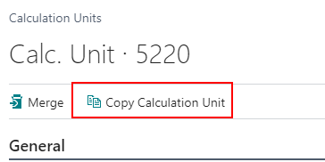

Enter a new unit code and unit name for the Calculation Unit or List of
Units, then click next:

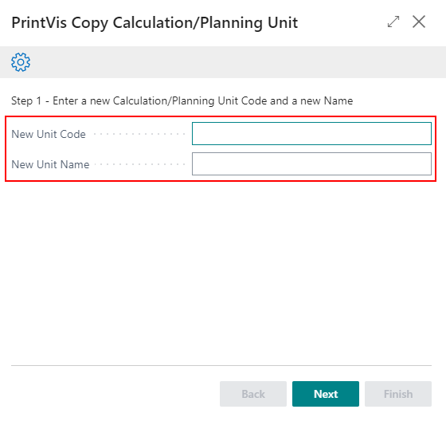

Copy Price Lists and Copy Speed Tables options are copy existing or
Re-use existing. If copy existing is selected, then the system will just
copy the corresponding information from the cost center that is being
copied and enter a new Unit Code that matches the new Calculation Unit.
If re-use existing is selected, then the already existing table will be
placed in the new Calculation Unit. But for List of Units, the option to
copy price lists and copy speed tables will not be available. 

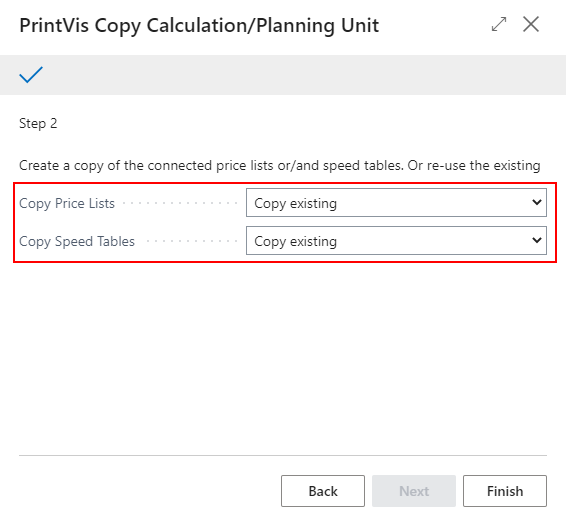

## Appendix

**Example Sorting Order**

The sorting is setup to the most probably production flow sequence.

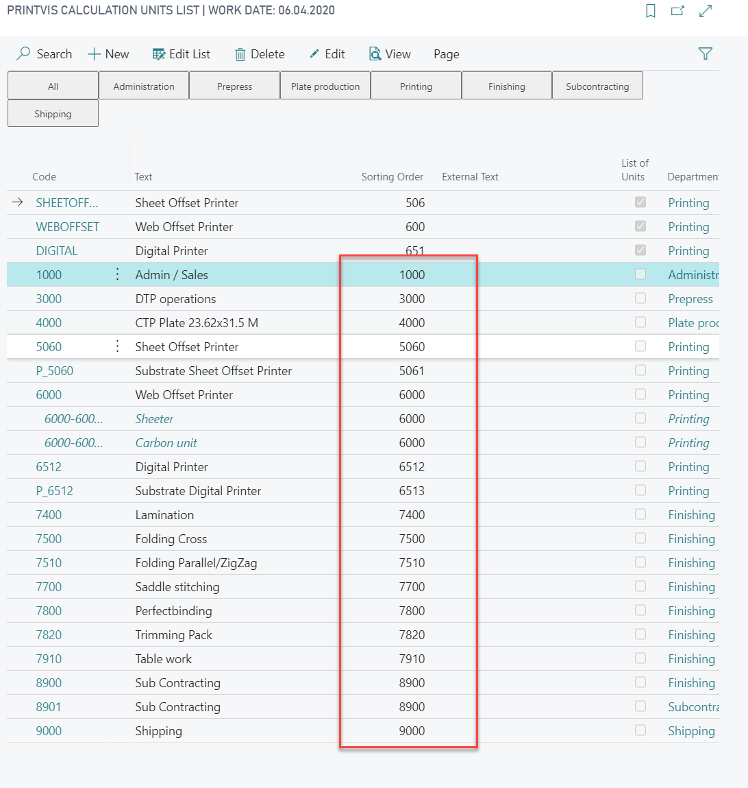

**Example Plate Setter**

A plate setter must be setup with the field "Process Start" disabled and
be part of the list of units for the press to make sure the process no.
is equal to the process number of the press. If this is not the case,
formula 10 on the plate setter will be =0 and not the calculated no. of
plates from the press.

The plate cost center can be just one, but a calculation unit is
required for each different plate size if the plate items are setup
separately.

**Plate Setter Calculation Unit**

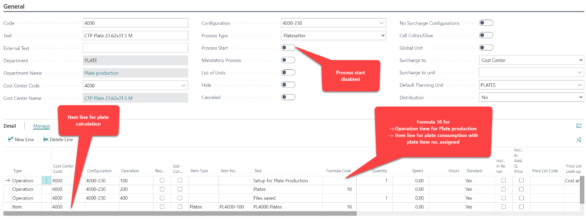

For less detailed calculation it is also possible to setup just 1 line
with a fix sales price per plate.

**List of Units for the press to be selected on job items**

## Example Sheet Offset Press

**Calculation Unit for the press**

-   It contains a line that picks all ink items from the
    color/consumables table from the job item and formula 160 is
    calculating the weight of ink based on the ink coverage of the final
    format size usage on the sheet.

-   An additional line for paper is possible as well but in this example
    a separate calculation Unit was set up for better visualization of
    the paper cost/price in the calculation

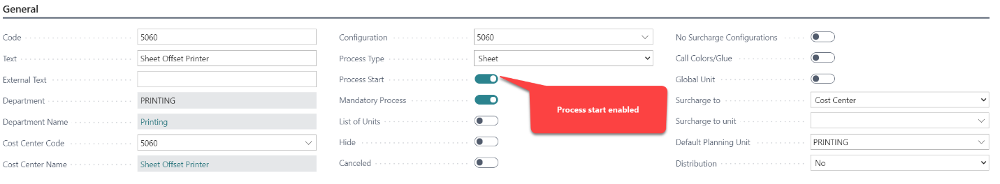

**Separate Calculation Unit for the paper/print substrate calculation**

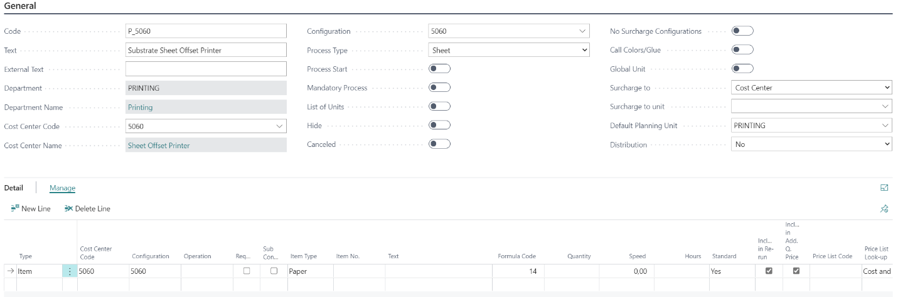

The line in this unit could be also part of the calculation unit for the
press. but the result below shows that the paper pricing is listed in an
extra line, which is often desired from the estimator. If the line would
be part of the press, the calculation would already show the paper
cost/price included in the sheet offset printer cost/price.

**Result:**

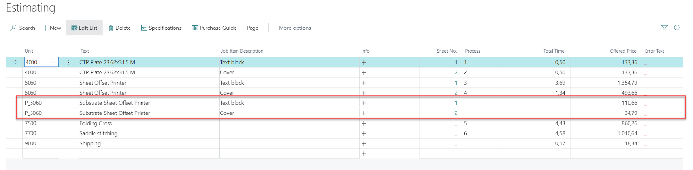

## Example Web Offset Press with Surcharge Units

Surcharge units are setup as surcharge configuration. Calculation Units
linked to those surcharge units are listed in blue text color and with
indentation of the code. 

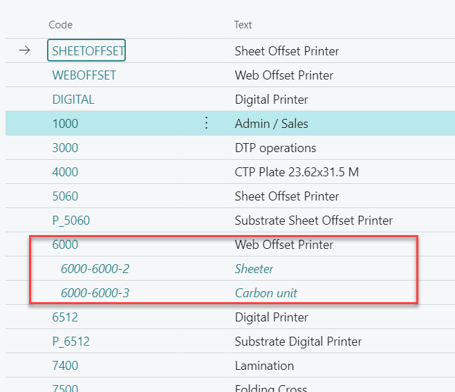
