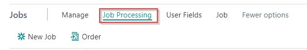

# Case Card and Case List

## Case List

When using Case Management in PrintVis, the Case List will be the basic window for the individual employee. All the daily jobs, depending on their status, will appear in the relevant employees' Case Lists.

The Case Management aspect of the system is designed to be the daily home base of administration for all employees involved with orders. It grants a full view of cases with detailed information on deadlines, delivery dates, customer information, job history, etc. Consider each Case as a repository for all the information of each individual order, from quote to invoice. With Case Management, you control and follow the flow of jobs throughout your company with a full overview of outstanding quotes, confirmed orders, and jobs in progress.

In the Case List, it's possible to use the "list" view as below.

In the Case List, it's also possible to view the orders based on "tile" view with pictures from the Case Card.

## Case Card

Description of the Case Card and the different elements it contains.

### Structure

- Case Menu (see below)
- General tab (main case information like customer, responsibilities, status, etc.)
- Jobs (see Job Line menu/fields)
- Case description (Internal notes divided by departments)
  - This section is a Rich Text Editor with the ability to write continuous text with word wrapping and formatting options assigned to the departments.
 

 - This text information is available on the case card and the shop floor.

The Case Description header provides action to:

- Show an "Internal Summary" which shows all texts for all departments in an overview page (not editable).
- Show a "Shop Floor Summary" which shows all texts (line-based) entered by shop floor staff.

- Invoicing tab with basic information from Customer

- Fact boxes with overview information about the case and project

- Shipment Foreign Trade Group with some information about foreign shipments.

- Info Tab with additional information about the case.

### Case Menu

| Menu                        | Description |
|-----------------------------|-------------|
| Change Status               | Change the case to the next status code. |
| Copy to                     | Copies the active job to a new case - only the highest status job is copied. (Shift+Ctrl+C) |
| Copy from                   | Copy job information from another case into this case. |
| Job Costing                 | View Job Costing for this order. |
| Job Costing Journal         | Open the Job Costing Journal where it is possible to post labor and/or materials to the case. (Shift+Ctrl+B) |
| Job Costing                 | View the job costing and details for the case. (Shift+Ctrl+R) |
| Material Requirement        | View the materials required and inventory available for the case. (Shift+Ctrl+T) |
| Purchase Guide              | A guide to assist with purchasing materials for the case. (Shift+Ctrl+G) |
| User Fields                 | Add, view, or edit user fields associated with the case. |
| Customer User Fields        | Add, view, or edit user fields associated with the customer. |
| Invoicing Guide             | A guide to assist with creating invoices and credit memos for the case. (Shift+Ctrl+I) |
| Folders                     | Open the folders for the case. (Shift+Ctrl+F) |
| Documents                   | Open the documents for this case including request, quote, order confirmation, shipment document, and purchase requisition. (Shift+Ctrl+U) |
| Quote                       | Print or send the Quote letter. |
| Order Confirmation          | Print or preview the order confirmation. |
| Estimation                  | Open or print the Estimation report. |
| Job Ticket                  | Print or preview the Job Ticket/Docket. (Shift+Ctrl+K) |
| Cutting Ticket              | Print or preview the Cutting Ticket. |
| ...                         | Show the rest of the options. |
| Sell-To Customer            | View the Sell-To Customer card. |
| Sell-To Contact             | View the Sell-To Contact card. |
| Sell-To Comments            | View comments associated with the Sell-To Customer. |
| Bill-To Customer            | View the Bill-To Customer card. |
| Bill-To Contact             | View the Bill-To Contact card. |
| Bill-To Comments            | View comments associated with the Bill-To Customer. |
| Actions                     | Open action menu options. |
| Search                      | Search for an order based on specific fields/job information. |
| Case Info                   | Open Case Info menu options. |
| Decision Overview, Pricing  | Simulate profit amounts for several jobs based on different criteria including quantity, level, rates, shifts, etc. (Shift+Ctrl+D) |
| Description                 | View or edit department case description. |
| Questionnaire               | Open the Configuration Questionnaire to give or see the settings. |
| Quick Quote                 | Use the quick quote functionality to create a new quote. |
| Other                       | We've placed the menu items that are already available elsewhere in the action bar here to give you a shorter menu. |
| Job Costing                 | View Job Costing for this order. |
| Job Costing Journal         | Open the Job Costing Journal where it is possible to post labor and/or materials to the case. (Shift+Ctrl+B) |
| Material Requirement        | View the materials required and inventory available for the case. (Shift+Ctrl+T) |
| Use short menu              | Keeps a side menu with the items that are already available elsewhere to help reduce clutter in this menu. |
| Related                     | Open related menu options. |
| Complaints                  | Open the complaints for this case. |
| Web Order                   | View Web Order. |
| Archive                     | Open the Archive for this case. |
| Log                         | View the change log entries for the case. |
| Other                       | We've placed the menu items that are already available elsewhere in the action bar here to give you a shorter menu. |
| Sell-To Customer            | View the Sell-To Customer card. |
| Bill-To Customer            | View the Bill-To Customer card. |
| Sell-To Contact             | View the Sell-To Contact card. |
| Bill-To Contact             | View the Bill-To Contact card. |
| Sell-To Comments            | View comments associated with the Sell-To Customer. |
| Bill-To Comments            | View comments associated with the Bill-To Customer. |
| Use short menu              | Keeps a side menu with the items that are already available elsewhere to help reduce clutter in this menu. |
| Reports                     | Open the Report menu. |
| Print/Send                  | Open Print/Send menu. |
| Order Confirmation          | Print or preview the order confirmation. |
| Other                       | We've placed the menu items that are already available elsewhere in the action bar here to give you a shorter menu. |
| Quote                       | Print or send the Quote letter. |
| Use short menu              | Keeps a side menu with the items that are already available elsewhere to help reduce clutter in this menu. |
| Quote                       | Print or send the Quote letter. |
| Report Selection            | Open the Report list for options and selection. |
| Other                       | We've placed the menu items that are already available elsewhere in the action bar here to give you a shorter menu. |
| Sell-To Customer            | View the Sell-To Customer card. |
| Job Ticket                  | Print or preview the Cutting Ticket. |
| Estimation                  | Open or print the Estimation report. |
| Job Costing                 | View Job Costing for this order. |
| Cutting Ticket              | Print or preview the Cutting Ticket. |
| Order Confirmation          | Print or preview the order confirmation. |
| Use short menu              | Keeps a side menu with the items that are already available elsewhere to help reduce clutter in this menu. |

### Job Line Menu

#### Manage

| Function            | Description |
|---------------------|-------------|
| Delete Line        | Delete the selected Job line. (Remember the Job line must not be "Active".) |
| New Job           | Create a new job if you want to have different jobs on the case. No data is copied. |
| New Version       | Create new version on the job, used often for quantity/page breaks. Data from current line is copied. |
| Copy Job          | Create new Job and Version 1, if you want to have different jobs on the case. Data from current line is copied. |
| Job Card         | Open the job item card page. |
| Estimating       | Open the estimating page. |
| Specifications   | Open the specification page. |
| Shipments        | Open the shipments for the job line you have selected. |
| Scheduling       | Open the scheduling page. |
| Milestones       | Open the milestone page. |
| External Description | View / edit the external description to be used in external documents. |
| Product Parts    | Opens a page where the product can be defined in detail. |

#### Job Processing

| Function | Description |
|----------|-------------|
| New Job  | Create a new job if you want different jobs on the same quote/order. |
| Order    | Define what Version/Job(s) have been converted to an order(s). |

#### User Fields

| Function        | Description |
|-----------------|-------------|
| User Fields 1    | Open User Field 1 page if visible in general setup. |
| User Fields 2    | Open User Field 2 page if visible in general setup. |
| User Fields 3    | Open User Field 3 page if visible in general setup. |

#### Job

| Function              | Description |
|-----------------------|-------------|
| Totals                | Open an overview of the calculated values. |
| Quality Assurance      | Open the QA Checklist (predefined). |
| Intent                | Open the intent creator (needs setup). |
| Commission            | Open access to commission (needs setup). |
| Job Requests          | Open the job request page (needs setup). |
| Log                   | View the job log if defined. |
| Documents             | Open the document page. |
| Copy                  | Copy Alternatives or make more Versions (e.g., quantity/pages). |
| Copy Periodic Job      | Make a copy of orders as periodic and auto plan. |
| Copy Job Fields       | Copy Job fields from one order to another. |
| Job Overview          | Shows the job items. |
| Print                 | Open the print menu. |
| Recalculate All       | Recalculate all jobs in the current case (recommended when a case was copied). |
| Recalculate Job       | Recalculate the current job in the case. |
| Create Items          | Create a Finished Good Item automatically. |
| Create Esko CAD Sheet | Accessible if Esko integration is set up and activated. |

### Job Line Fields

| Field                       | Description |
|-----------------------------|------------|
| Job                         | Job is the internal reference to the PrintVis Job Table automatically assigned by the system when a new job is created. Generally, only one Job will be created for each Case, however for some combined products it can make sense to create multiple Jobs for one Case. You will naturally only be able to have one job even when a case consists of more sheets or job items (typically Content and Cover). Please bear in mind the status for all Jobs follows the status code for the entire Case. |
| Version                     | Version is the internal reference to the possible versions of a Job. Often you will be asked to offer different alternatives of a Job to your customer, which is handled by making multiple Versions. Further new Versions will be created as a Case goes up in Status (from Request to Quote to Order). Please note: if you have created multiple Versions for a quotation, you will need to specify which of these alternatives is to be made the active Order Version. Place your cursor on the required version, make it active, and then activate Job Processing and select Order. |
| Active                      | When a new job or a new version is created for a job, it will be active as the default setting. It is only possible to have one active version of a job within the same Status. Therefore, it is possible to have an active quote version and an active order version of the same job. An active job entails more options and possibilities. First, you may set up the company's status codes to make sure that only active jobs can be edited. Thereby, you make sure that you do not edit the wrong version by mistake. Second, a number of prints will only print the active job(s) within the selected type. For example, the model company's Job Ticket is printed only for the active order version of the job. A job line cannot be active if it is to be deleted. If you want to delete a case, it must not contain any active jobs. |
| Type                        | This is a non-editable field, displaying the type for each Version. The status will change from Request to Quote as the Status code indicates so, for Order and Production Order new versions will be created for these. This will allow you to have and keep complete track of the Job/Version history for the Case. Setup on the Status codes lets you decide which versions are editable, allowing you to ensure that you can only edit information on active Jobs and Versions within the current Status. |
| Alternative                 | By a lookup in the field, you may choose that the version of a job is to be independent. **Blank**: you may choose to define the version is used when the job is an alternative estimate on the basis of changed quantity, page number, colors, or similar. **Alternative**: is used when the job is used for estimating a specific (or more specific) surcharge(s), such as UV varnishing, lamination, or similar. **Additional**: option for the alternative. The information on Alternative and Additional may be used on printed Quotes, for example. The system will then print one line per estimated alternative and one line for each Addition so that Additional Alternative is priced with the price of the line minus the price of the job to which the version is an Addition. Common to both is that the description of the alternative or the addition is described in the External description field. |
| Item No.                    | Item No. relates to the No. field in the Item table. Inserting a specific Item No. for the Job will automatically update the entire Job/Version according to the Template attached to that particular Item. This enables you to have specific templates for individual Items, or a template for a group of Items, and to simply use such a template by writing the Item No. on the Job. This field is also required if releasing finished goods to inventory. |
| Product Code                | The PrintVis Products can be looked up on this field. The PrintVis Products can be used as a template and data carrier for re-runs, in case the product doesn't need to be put on stock and tracked as inventory. In case the product must be put on stock and tracked as inventory, a Business Central Item can be linked with the product and will be added to the case/job as well, to be able to release finished goods to the inventory after the production is finished. |
| Template ID                 | A range of templates can be created for each Product group, and a particular general template even attached to a Product group. When a New Job/Version is created, the template from the Product group is automatically inserted. If you wish to use another template, just look up from the field, and select the required Template. |
| Ordered Quantity            | The number of units the customer ordered, which could possibly be different than the quantity produced and/or shipped. |
| Pages                       | The number of pages in the job. Generally, you state the number of "Pages with Print" or "Total Pages". [See article](https://support365.printvis.com/support/solutions/articles/17000124534-how-to-no-of-pages-pages-with-print) |
| Format Code                 | Indicate the format of the finished item as you would look at it. Formats can be entered either as a Format code (having defined standard formats such as A4, A5, Legal, Letter etc.) or simply entered displaying the format with a multiplicator-sign between the two formats (* or x). The unit used for the formats follows your setup for General Units such as mm, cm, or inches. You may, however, freely combine such formats using cm, mm, or in, behind the given format. |
| Colors Front                | The number of colors for the primary side of the job. |
| Colors Back                 | The number of colors for the secondary side of the job. If there is no print on the secondary side, the field is left empty. |
| Quoted Price                | Price of the job displayed according to the selected price method - the price may be overwritten directly in the field as Fixed Quote Price for Job. |
| Price Method                | The Price Method field is automatically filled in according to the pricing of the job. Options include Calculated, Fixed Quote Price for Job, Contribution Margin Locked, Contribution Margin % Locked, Manually per Calc Unit, Fixed Profit, Fixed Profit %, Addition % Self Cost, Special Addition %, Market Addition %, Fixed unit price, Item price. |
| Product Group               | The product group selected in the case card header is displayed but may be overwritten on the job line. However, the entire case in connection with statistics will act from the product group which has been selected in the case card header. |
| Discount Group              | Discount Group relates to the Code field in the Discount Group table. Discount Groups can be used to grant a special discount for a particular Job/Version, however, most commonly a discount group is inserted on the Case, to have all Jobs/Versions equally estimated with the same discount group. |
| Price per 1000 pieces       | Shows Quoted price per 1000 pieces. |
| Price per piece             | Shows Quoted price per piece. |
| External Description        | The external description is the descriptive text that will be displayed on many of the customer-facing documents. This description often comes from the standard description field from the product group but can be manually added/edited. |
| Manual Description          | If you have edited the description manually, this field is checked. If you remove the check, the automatically created description is displayed again. |
| Date Method                 | The default setting in the field is Date for date method, but by a lookup in the field, you may change this to Week or Time. The date fields of the job will be filled in according to your choice. |
| Requested Shipment Date/Time | The date when the job is to be shipped to the customer. |
| Destination Delivery Date    | The date when the job must arrive at the destination. |
| Destination Delivery Time    | The time when the job must arrive at the destination. |
| Production Status Code       | Displays the current production status of the job based on the planning units marked completed. |
| Quantity Variation Code      | Allows the system to determine how much the final production is allowed to deviate from the ordered quantity. |
| Job Name                    | Used to identify the Case and Job, containing a headline for future reference. |
| Production Status Code      | The production status shows the status of the individual job once a job has reached the planning stage. When all of the planning lines have been marked completed, the status will be listed as the Production Ended status. This new field function as follows:
	- The field should be blank any time the case 'Can Be Planned' boolean is No.
	- When planning lines exist, find the earliest planning line for that job that is not marked complete and display the status code setting for that planning unit.
	- If all planning lines for that job are marked completed, display the status code that has the Production Ended = Yes value. |

The individual employee may work with all his/her cases in the Case list exactly as if the cases were piled on the desk. A Case does not disappear from the list before you have solved it and sent it on in the Case flow. This is a critical component of a print company’s success – to ensure the print job production flow is organized and job information is immediately accessible to each responsible party.

