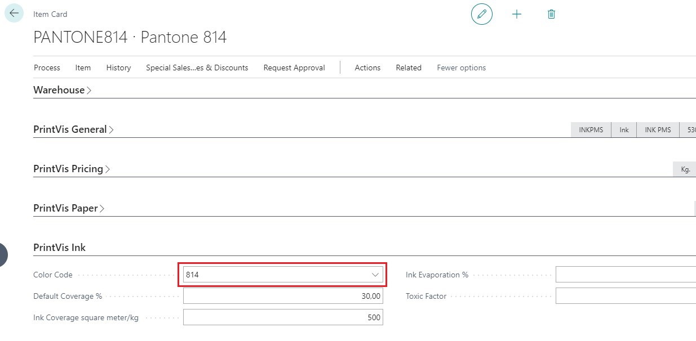

# Color Table

## Summary

In the color table, you will find a list of all Pantone colors, each displayed with an RGB value (the color combination of red, green, and blue) and the color code. This table can be updated and converted into items that can be used in calculations. You can insert new colors into the table by creating a new line, where you enter the code, description, and RGB values.

| Field           | Description                                                                                   |
|-----------------|-----------------------------------------------------------------------------------------------|
| **Code**        | The Pantone name of the color.                                                                |
| **R**           | Red value in the RGB color model. You can define the color yourself by choosing "look up".    |
| **G**           | Green value in the RGB color model. You can define the color yourself by choosing "look up".  |
| **B**           | Blue value in the RGB color model. You can define the color yourself by choosing "look up".   |
| **Mixed Color** | Indicates whether the color is mixed in advance or needs to be mixed by the printing house. This information is used for calculating the time to mix colors. |

| Function         | Description                                                                                   |
|------------------|-----------------------------------------------------------------------------------------------|
| **Create Items** | Sets up colors as item numbers in the system. Filters can be used to select which colors will have an item number. Templates can be attached for predefined information. |
| **Insert Pantone** | Imports standard Pantone colors into the color table.                                        |
| **Insert Process Color** | Imports process colors into the color table.                                               |

## Item Card

The color codes are used in the following fields on the Item card:

- **Pantone Colors:** Displayed with their respective RGB values.
- **Process Colors:** Set up for Cyan, Magenta, Yellow, and Black (CMYK) calculations.

## Process Colors (CMYK)

| Color    | R   | G   | B   |
|----------|-----|-----|-----|
| **Cyan** | 0   | 255 | 255 |
| **Magenta** | 255 | 0   | 255 |
| **Yellow** | 255 | 255 | 0   |
| **Black** | 0   | 0   | 0   |

