# Combined Sheets in PrintVis

## Introduction

This document summarizes the functionality for combining different products on one sheet/section as “Extra Job Item.” It will first explain the generic definition of how a sheet is split into different areas. There are available tools for creating the generic data much more easily for quicker processing, and also to be able to use Component Lists as split-sheet templates.

## Generic Part Sheet Functionality

In PrintVis, it is possible to split a sheet/sprint section into as many parts/areas/Extra Job Items as needed, and each single part/area/Extra Job Item can be filled with a different product. PrintVis calculates the imposition individually for each part/area/Extra Job Item in the sheet/section.

 Example:
A sheet is split into 6 different areas, and each area will be populated with a product of a different size for better visualization.

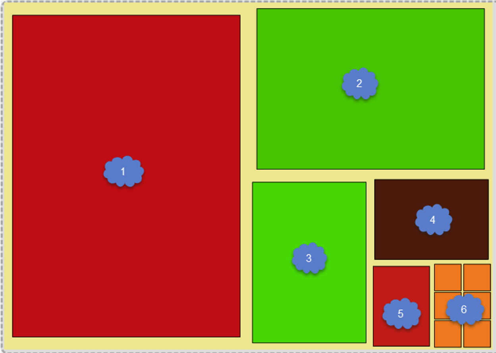

The placement on the sheet has to be seen as coordinates, wherein the upper right corner has the coordinates `[0,0]` and the lower left corner has the coordinates `[1,1]`. The following fields have to be filled with values:

- **PartSheet StartWidth**: This value is where the area starts in width of the sheet.
- **PartSheet Start Length**: This value is where the area starts in length of the sheet.
- **PartSheet Width**: This value is how much space the area takes in width of the sheet.
- **PartSheet Length**: This value is how much space the area takes in length of the sheet.

Values can be entered in decimals or fractions:

### Decimals:

| Job Item No. | Job Item Format Code | PartSheet StartWidth | PartSheet StartLength | PartSheet Width | PartSheet Length |
| ------------ | -------------------- | -------------------- | --------------------- | --------------- | ---------------- |
| 1            | A2                   | 0.5                  | 1                     | -               | -                |
| 2            | A3                   | 0.5                  | 0.5                   | 0.5             | 0.5              |
| 3            | A4                   | 0.5                  | 0.25                  | 0.5             | -                |
| 4            | A5                   | 0.75                 | 0.25                  | 0.25            | 0.25             |
| 5            | A6                   | 0.75                 | 0.125                 | 0.25            | -                |
| 6            | 5X5                  | 0.875                | 0.125                 | 0.25            | -                |

 Fractions:

| Job Item No. | Job Item Format Code | PartSheet StartWidth | PartSheet StartLength | PartSheet Width | PartSheet Length |
| ------------ | -------------------- | -------------------- | --------------------- | --------------- | ---------------- |
| 1            | A2                   | 1/2                  | 1                     | -               | -                |
| 2            | A3                   | 1/2                  | 1/2                   | 1/2             | 1/2              |
| 3            | A4                   | 1/2                  | 1/4                   | 1/2             | -                |
| 4            | A5                   | 3/4                  | 1/4                   | 1/4             | 1/4              |
| 5            | A6                   | 3/4                  | 1/8                   | 1/4             | -                |
| 6            | 5X5                  | 7/8                  | 1/8                   | 1/4             | -                |

## Special Field PartSheet
We have introduced the field “PartSheet” on the Job Item table for a better user experience for simple split-up.

The following input will give the same result as the example before:

| Job Item No. | Job Item Format Code | PartSheet     |
| ------------ | -------------------- | ------------- |
| 1            | A2                   | 1/2X1         |
| 2            | A3                   | 1/2X1/2       |
| 3            | A4                   | 1/4X1/2       |
| 4            | A5                   | 1/4X1/4       |
| 5            | A6                   | 1/8X1/4       |
| 6            | 5X5                  | 1/8X1/4       |

With this field, it is easier to create a combined sheet by entering only the part of the sheet the job item needs to take. If there is available space on the sheet, PrintVis will find the next PartSheet StartWidth/StartLength value and fill the PartSheet Width/Length field as well.

 Result:

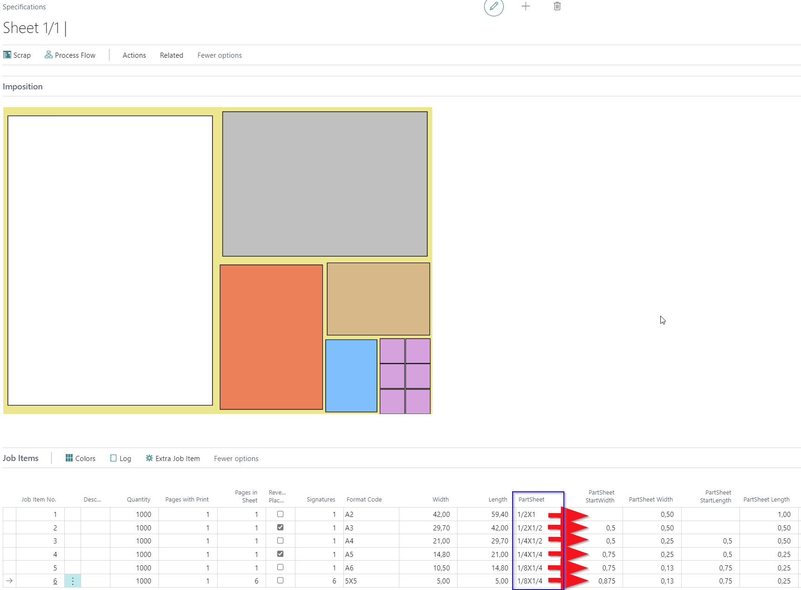

If the items are not displayed as expected, you can make adjustments in **Impose 1** and **Impose 2**.

In this example, the A6 card appears four times by default as 1 x 4, but optimal is 2 x 2. Changes in **Impose 1** and **Impose 2** affect only the display of the specification picture, not the calculation.

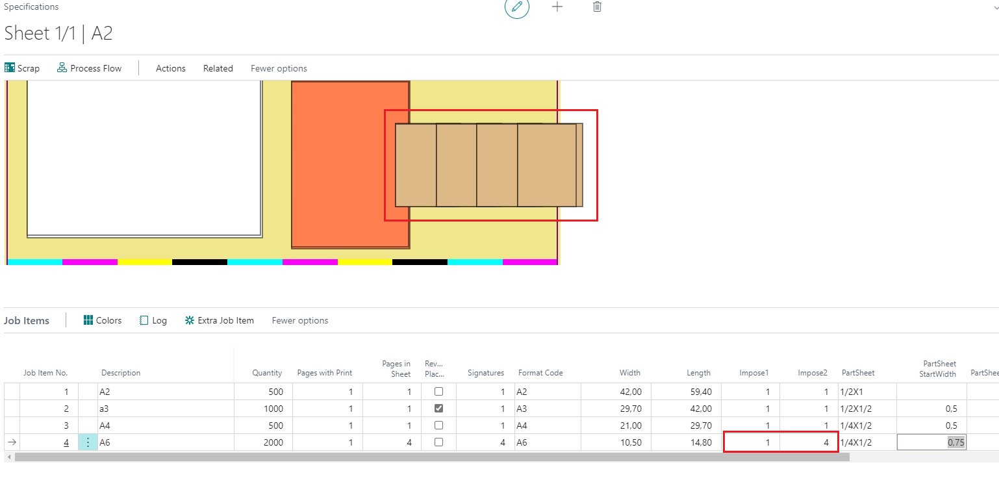

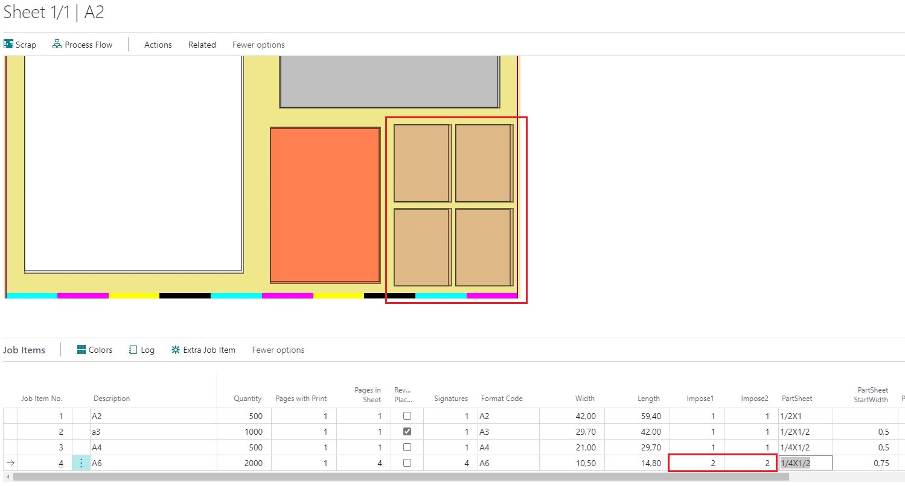

### Different Colors on Job Items
It is possible to have different colors per Job Item. Go to **Page PrintVis Form Color Properties** and change **Foreground Color** for Imposition Job Item 2, 3, 4, etc.

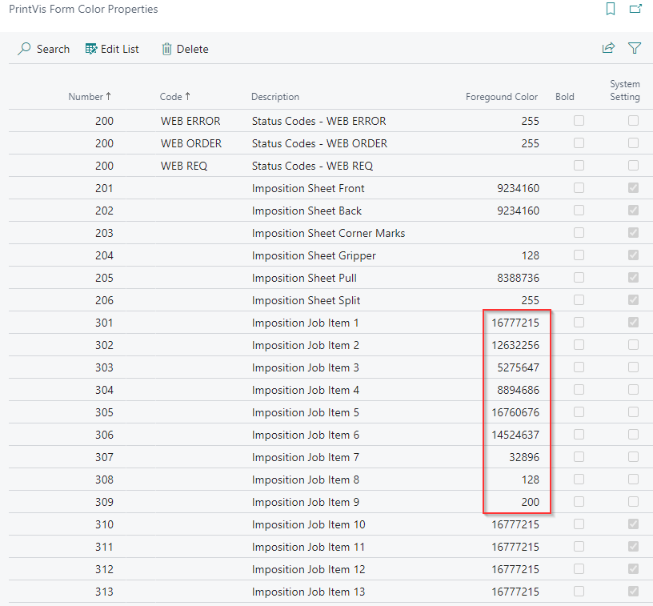

### Special Function: Definition of the # up for a Product
You can specify how many products should fit into the width and length on the sheet. This input only affects the layout if a press/list of units has already been selected. For example, 9 (3X3) ups of a product would fit on the sheet in the press.

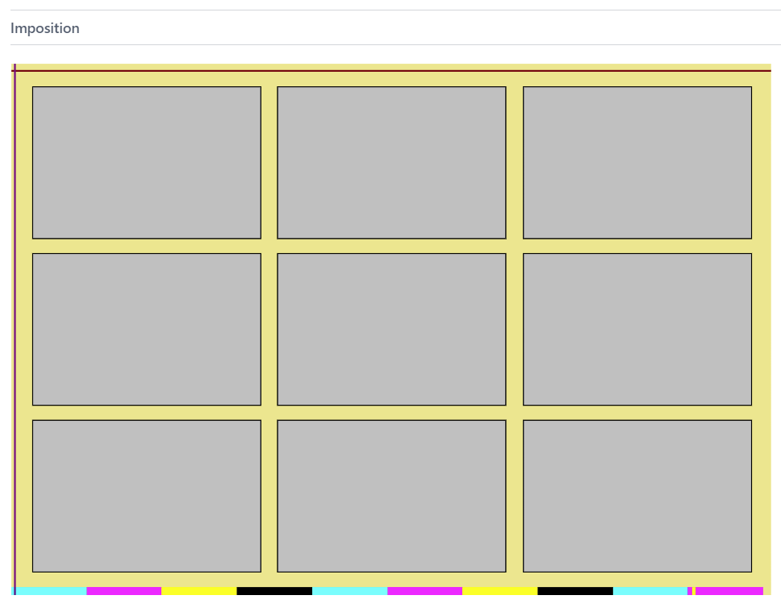

Entering 2X2 into the PartSheet field instructs the system to split the actual area for the job item so that only 2 ups in width and 2 ups in length fit.

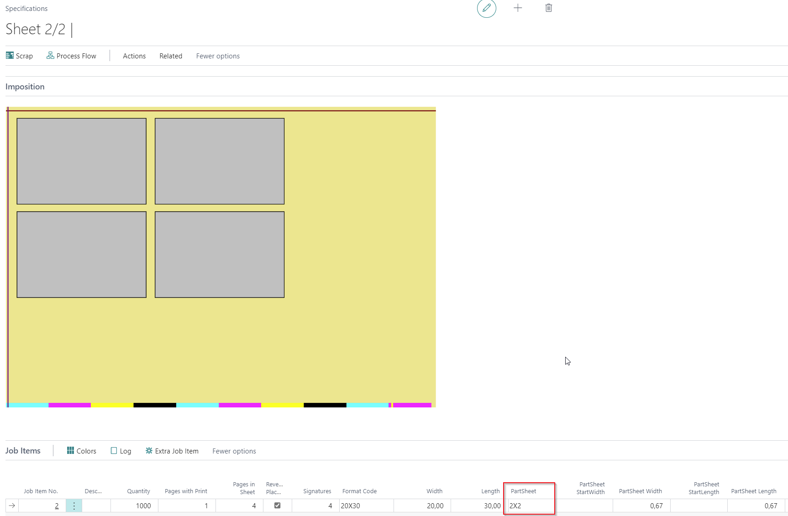

 other examples:

- 1X3:

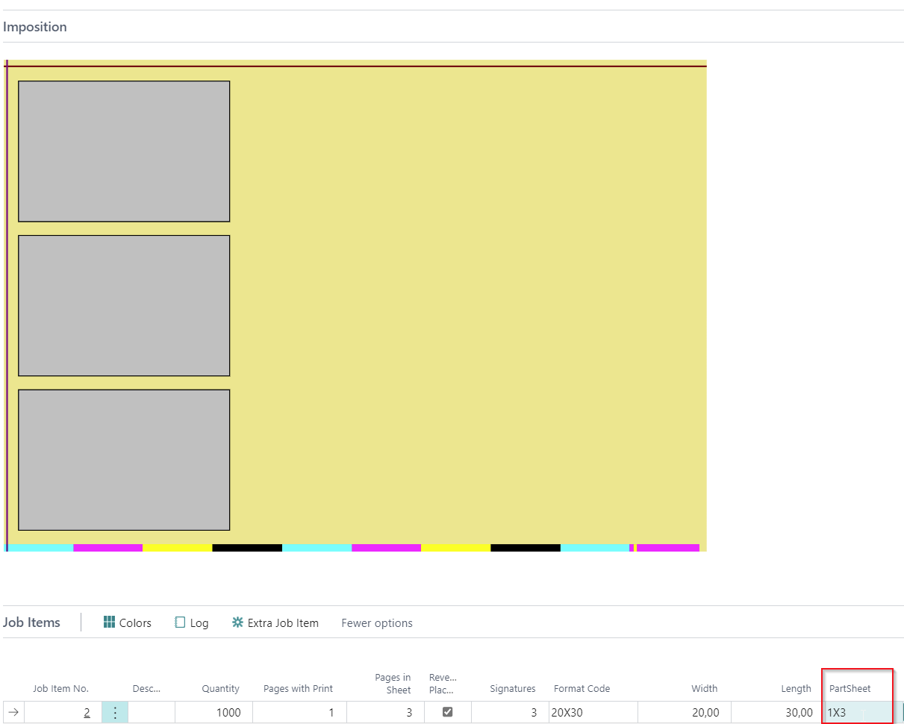  

- 3X2:

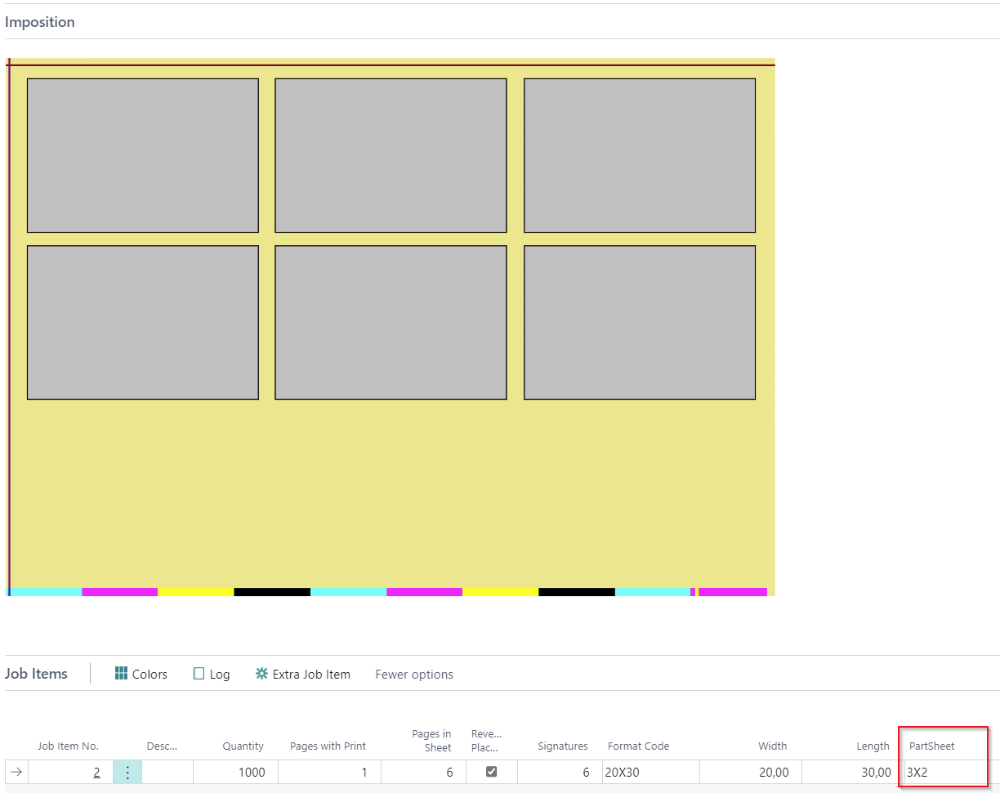

The remaining space can now be used for Extra Job Items.

## PartSheet Field on List of Component Types to Build Templates for Common/Recurring Combined Sheets

It is possible to set up Lists of Components and to add PartSheet information to them. After expanding the List of Components, the PartSheet information is added to the Job Items.

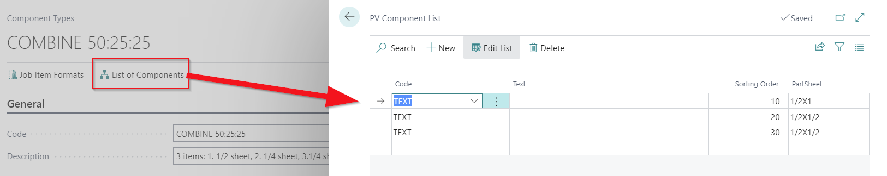

After selecting the component on a Job Item, hit the action **“Expand Components”**.

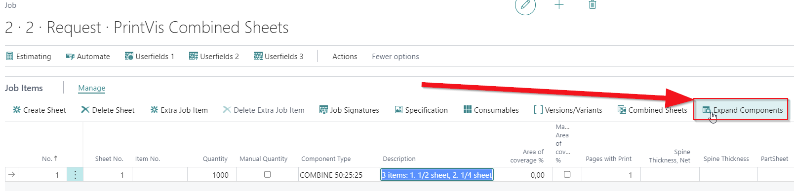

 Result:

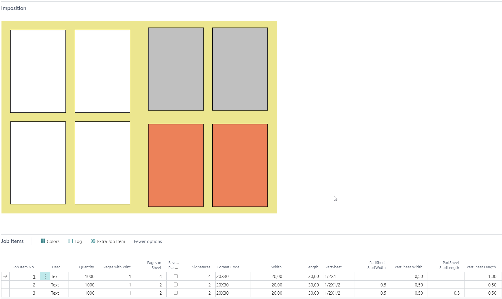

The components are expanded based on the PartSheet information.

### Examples for lists of components:

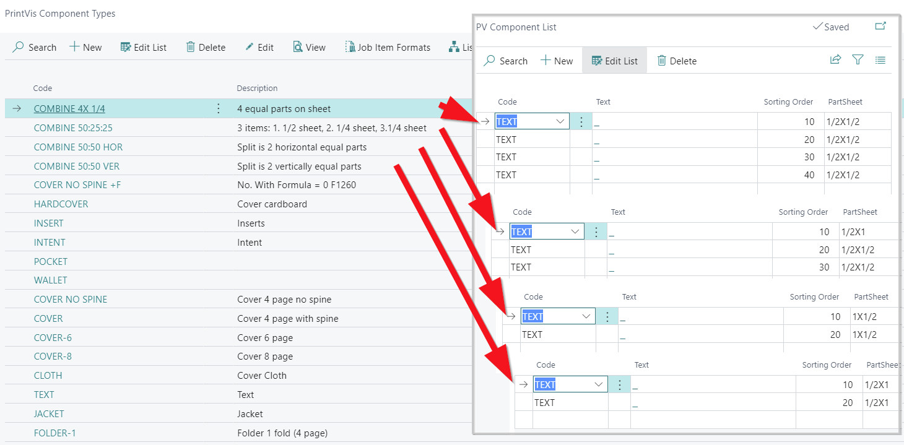
