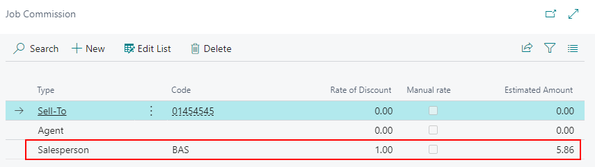

# Commission Rates Setup

## Introduction

In commission calculation, you determine how much to pay in commission to advertising agencies, customers, and salespeople. This is useful when creating a quote or order for a customer. The commission functionality is often supplemented by custom reports to match the specific needs of each PrintVis installation, as printing companies have varying requirements for reporting, kickback calculation, and salesperson payouts.

## Setup

The **Commission Rates Setup** can be accessed by searching: `PrintVis Commission Rates Setup`.

For sales staff, commission costs may already be factored into your Overhead Rates. You may want to specify how the commission is calculated under different circumstances using group setup or minimum amounts.

For customer or agent kick-backs/commissions, you might want to reduce the profit calculated on the job.

The setup possibilities are many, and creative setup can be done for sales staff, customers and agents alike.

| **Field**              | **Description**                                                                                                                                                       |
|-------------------------|-----------------------------------------------------------------------------------------------------------------------------------------------------------------------|
| **Code**               | Select the name of the salesperson from the salesperson/purchaser list. This field identifies the individual eligible for commission.                                  |
| **Product Group**      | Limits the commission calculation to the selected product group. Only sales tied to this group will generate a commission.                                            |
| **Customer Group**     | Restricts the commission calculation to a specific customer group. Commissions are only applied for customers within the chosen group.                                 |
| **Price Group**        | Restricts the commission calculation to a specific price group. Only sales with the specified pricing structure will be eligible.                                      |
| **Cost Center**        | Associates the commission calculation with a specific cost center. Commissions will only be calculated for transactions related to this cost center.                  |
| **Calculation Unit**   | Limits the commission to a specific calculation unit. The commission is calculated only for transactions related to the defined calculation unit.                      |
| **Item No.**           | Restricts the commission calculation to a specific item number. Only sales of the specified item will generate a commission.                                           |
| **From Date**          | Specifies the start date of the commission agreement's validity. Only sales occurring on or after this date will be considered.                                        |
| **Commission Rate**    | The percentage rate at which commission is calculated. This value determines the salesperson’s earnings from eligible sales.                                           |
| **Reduce Profit**      | **Checked**: Adds the commission as a cost, reducing the job’s profit. **Unchecked**: Calculates the commission without including it in job costs, leaving profit unaffected. |
| **Calculation Type**   | Defines which calculations are included for commission: **All**: All types of calculations are included. **Hours**: Only hour-based calculations are included. **Materials**: Only material-based calculations are included. **Subcontracting**: Only subcontracting-related calculations are included. |
| **Base Amount Type**   | Determines the amount on which the commission is based: **Sales Amount**: The price calculated by PrintVis. **Total Cost**: Includes variable, labor, material, subcontracting, and overhead costs. **Direct Cost**: Includes variable, labor, material, and subcontracting costs only. **Total Quoted Price**: The predefined quoted price for the job. **Profit**: Commission is based on the profit of the job. |
| **Minimum Amount**     | Sets a threshold amount. Commissions are only calculated if the order's total meets or exceeds this minimum.                                                           |

On the case card, you can view the commission amount from three places:

1. **Included in Price Calculations**: The commission amount is shown with other price calculations. It provides information for decision-making but does not affect cost and margins calculations.
2. **Drill Down**: Shows how the commission is calculated and which items are included.
3. **Edit Commission Percentage**: You can adjust the commission percentage for the specific job.

 Decision Overview and Pricing

You can see the total commission amount in the Decision Overview, Pricing section on line/formula 176.

## Example: Commission with Base Amount Type "Profit"

If the Base Amount Type is Profit and the Commission Rate is 1%, the commission is calculated based on the Net Profit:

- **Net Profit**: Calculated as Quoted Price - Total Cost
- **Commission**: 1% of Net Profit

For example, with a Net Profit of 585.92 (12357.00 - 11,771.08), the commission would be 5.86 (1% of 585.92).

## Example: Using Multiple Tiers

For multiple tiers:
- **Original Line**: Commission Rate (e.g., 10%)
- **Tier 2**: Additional 2% after reaching a minimum base amount (e.g., 5,000)
- **Tier 3**: Additional 3% after reaching another minimum base amount (e.g., 10,000)

For a Quoted Price of 11,000.48, the total commission might be 1,650.07 (15% of 11,000.48).

## PrintVis Commission Report

- **Report Object Number**: 6010324
- To run the report, search for `PrintVis Commission`.

 Typical Filter for a Salesperson

The report can be filtered by salesperson, and you can also filter by order date range.

 Report Logic

- The report shows commissions based on calculated amounts (PVS Job Commission table).
- A case/job appears in the report if:
  - An amount is calculated
  - An invoice is posted against the case
  - The invoiced amount (or credit memo) must be greater than 0, or "Invoiced Amount >0" must be enabled

This report will include commissions for PrintVis Cases with a "zero-invoice" if the relevant setting is enabled.

