# Component Types and Job Item Format Setup

## Summary

PrintVis Component Types simplify and automate job item setups by presetting default values for sheets, impositions, and finishing settings. These component types can be assigned to Product Groups to ensure relevant options are available.

## Component Types

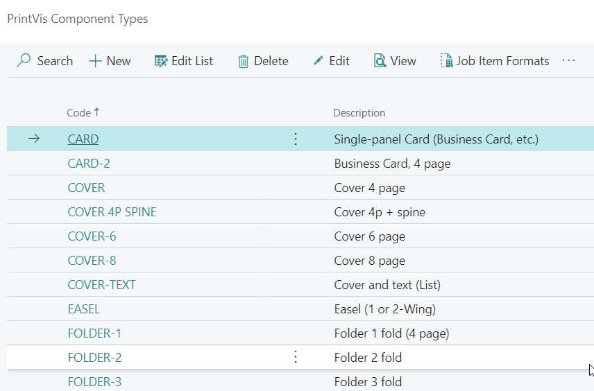

For a cover of a perfect bound book, the fields might include:

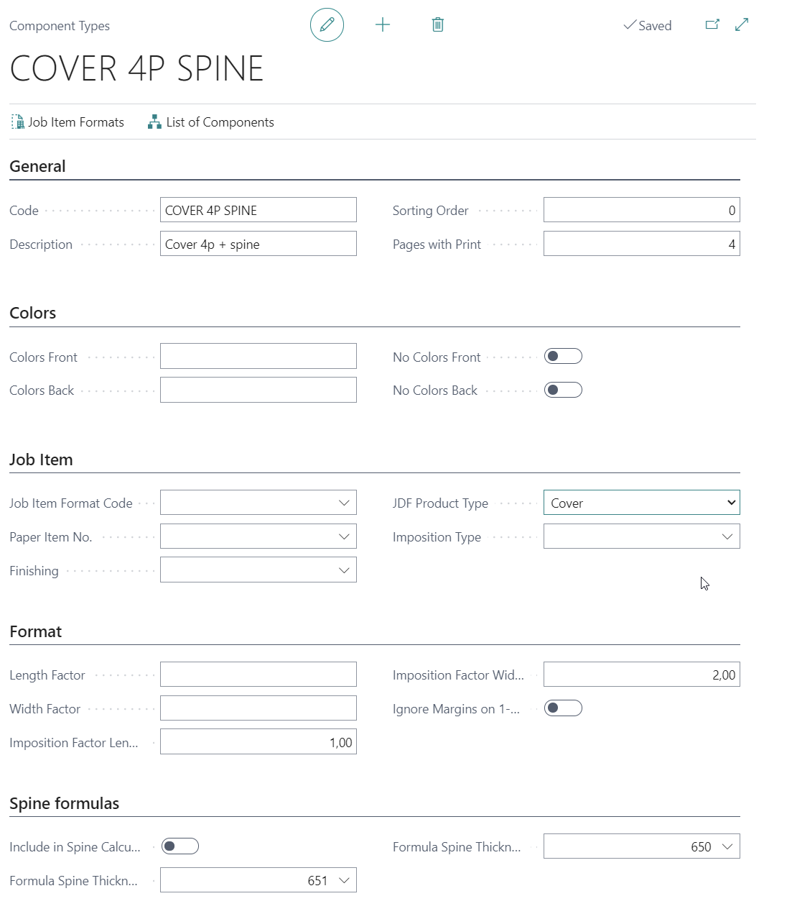

### Fields

| Field | Description |
|--------|------------|
| **Pages with Print** | Number of pages with print this component will have. This number will be transferred to the job item. Useful for a component of type cover that always contains 4 pages instead of using the pages from the job input. |
| **Colors Front** | The number of colors to be printed on the front of the printed item. This value will be transferred to the field "Colors Front" on the job item. |
| **Colors Back** | The number of colors to be printed on the back of the printed item. This value will be transferred to the field "Colors Back" on the job item. |
| **Job Item Format Code** | This field may contain a predefined final format which will be transferred to the job item. Useful if the component acts as a template for a particular product (e.g., Business cards often have the same size). |
| **Paper Item No.** | This value will be transferred to the job items Paper Item Number Field, in case there is a standard paper for this component type. |
| **Finishing** | This value will be transferred to the Finishing field of the Job Item, in case there is a standard finishing type for this component type (e.g., Covers always need trimming). |
| **JDF Product Type** | For a JDF workflow, it may be required to define a Product type. The available options are based on the JDF Specification. The type "Cover" also impacts PrintVis Calculation Formula 107, identifying if the calculation contains a cover. |
| **Imposition Type** | This value will be transferred to the Imposition Type field of the Job Item, in case there is a standard Imposition Type for this component type. |
| **Length Factor** | A multiplier for the final format (size). The value multiplied with the Length of the format code populates the “Length” field of the job item. Example: If the final format is 10x15 (width x length) and the Width Factor is 3 and Length Factor is 2, the final imposition size is 30x30. |
| **Width Factor** | A multiplier for the final format (size). The value multiplied with the Width of the format code populates the “Width” field of the job item. Example: If the final format is 10x15 (width x length) and the Width Factor is 3 and Length Factor is 2, the final imposition size is 30x30. |
| **Imposition Factor Length** | This value will be transferred to the Job Item field "Conjugate Length" to calculate the open format from the Job Item "Length" field. |
| **Imposition Factor Width** | This value will be transferred to the Job Item field "Conjugate Width" to calculate the open format from the Job Item "Width" field. |
| **Ignore Margins on 1-up layouts** | If enabled on the selected component type of the job item, all margins from the cost center configuration (e.g., Gripper, pull-mark, color bar/strip) are set to 0 if the component only includes 1 up. Useful when printing on the final cut format (e.g., envelopes, greeting cards). |
| **Include in Spine Calculation** | Boolean field set to `TRUE` if the component should impact spine thickness for the cover. Formulas 650/651 will include the paper thickness for such components. |
| **Formula Spine Thickness** | Select a formula to calculate the spine thickness of a perfect-bound (or similar) cover. The value is displayed in the "Spine Thickness" field on the Job Item and is used for imposition calculation of the open size of the cover. PrintVis provides formula 651, which adds 8% to the net paper thickness for components with "Include in Spine Calculation" set to `TRUE`. |
| **Formula Spine Thickness Net** | Select a formula to calculate the spine thickness of a perfect-bound (or similar) cover. The value is displayed in the "Spine Thickness, Net" field on the Job Item (informational only). PrintVis provides formula 650, which gives the net paper thickness for components with "Include in Spine Calculation" set to `TRUE`. |

### Lists of Components

You can set up component lists to group related components. For example, a hardcover book might include:

- Hard-cover board
- Hard-cover cloth or paper covering
- Dust Jacket
- Front paper
- Back paper
- Text/body

**Steps:**
1. Create individual component types.
2. Create a component list and assign all necessary components.

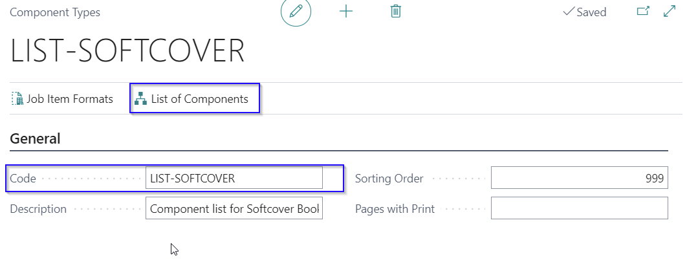

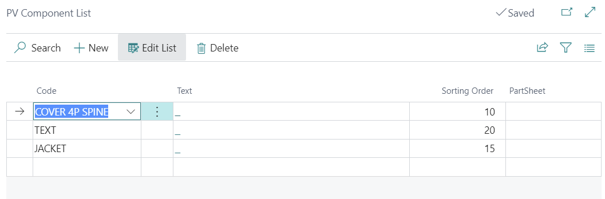

3. On the Job Card, select the list to automatically create all required sheets.

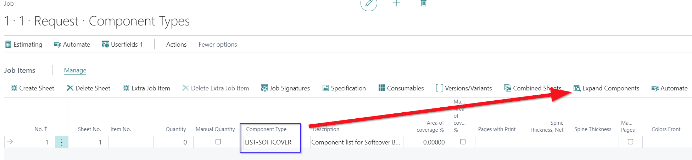

4. Click expand to create all required sheets. Result:

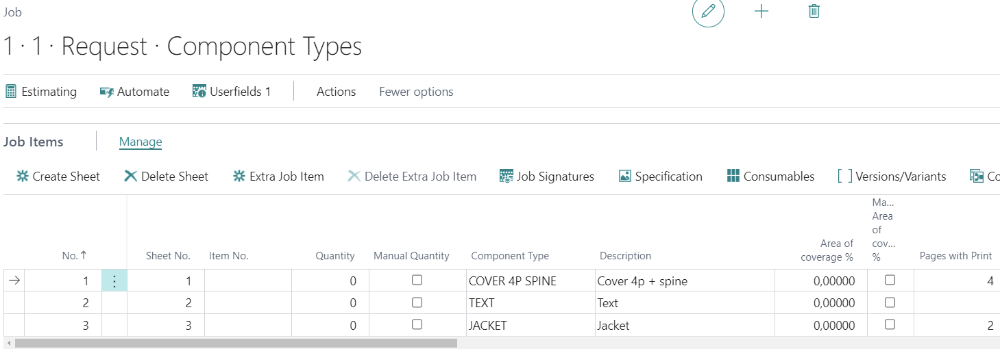

## Job Item Formats

Job Item Formats define additional areas or flaps for packaging products, such as gussets or zippers, to accurately calculate the required print substrate.

### Job Item Format Setup

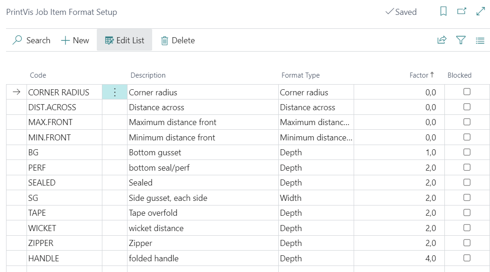

| Field | Description |
|--------|------------|
| **Code** | Enter a code for this Job Item Format Setup. |
| **Description** | Enter a description for this Job Item Format Setup. |
| **Format type** | Select the required format type from the options list. See the format types description below. |
| **Factor** | Enter a factor which will be the multiplier for the given value. |
| **Blocked** | If this field is enabled, the "Job Item Format Setup" is blocked from being used in the system. |

#### Format Types

| Field | Description |
|--------|------------|
| **Depth** | The given value will be multiplied with the factor and added to the length of the product to calculate the open size of the product on the print substrate. |
| **Width** | The given value will be multiplied with the factor and added to the width of the product to calculate the open size of the product on the print substrate. |
| **Minimum distance front** | The minimum distance between the items in the length/circumference for a die. Used in the PrintVis Tools Selection as a preset value and to store a user-modified value for the actual sheet. |
| **Maximum distance front** | The maximum distance between the items in the length/circumference for a die. Used in the PrintVis Tools Selection as a preset value and to store a user-modified value for the actual sheet. |
| **Distance across** | The distance between the items in the width for a die. Used in the PrintVis Tools Selection as a preset value and to store a user-modified value for the actual sheet. |
| **Corner radius** | The corner radius for a die. Used in the PrintVis Tools Selection as a preset value and to store a user-modified value for the actual sheet. |

#### Example: Stand-Up Pouch with Zipper

**Setup:**
- **Bottom Gusset (BG):**
  - Format Type: Depth
  - Factor: 1
- **Side Gussets (SG):**
  - Format Type: Width
  - Factor: 2
- **Zipper:**
  - Format Type: Depth
  - Factor: 2

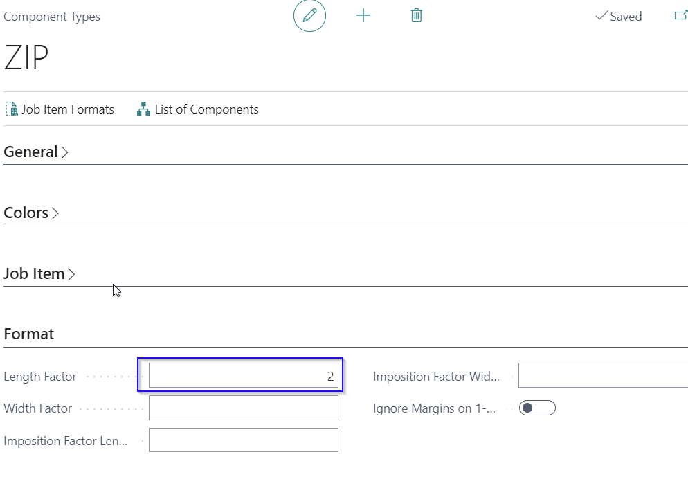

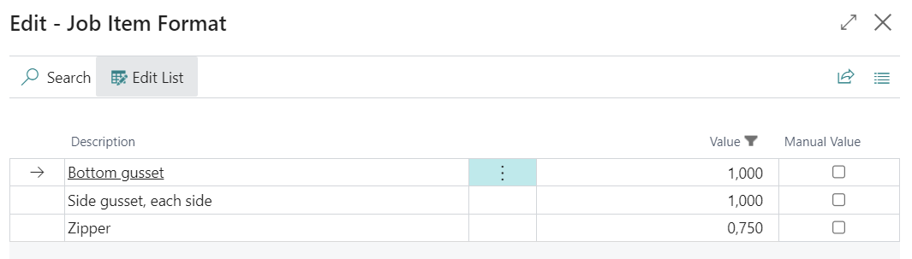

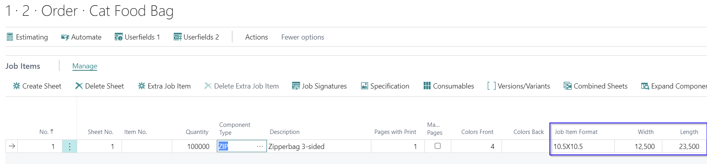

**Calculations:**
- **Length:** ("Job Item Format Length" x "Length Factor") + (Bottom Gusset Value + Factor) + (Zipper Value + Factor)
  - Example: (10.5 x 2) + (1 x 1) + (0.75 x 2) = 23.5
- **Width:** ("Job Item Format Width" x "Width Factor") + (Side Gusset Value + Factor)
  - Example: (10.5 x 1) + (1 x 2) = 12.5

#### Tools Selection Example

**Component Type:** TOOL

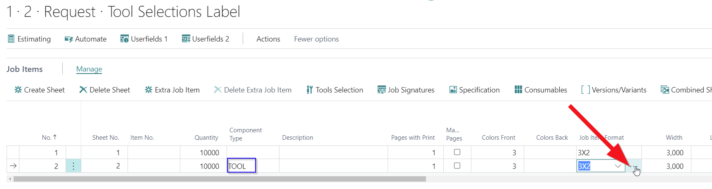

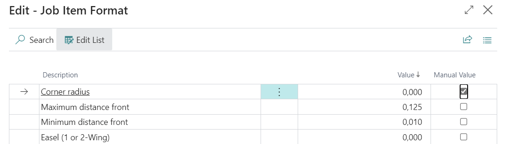

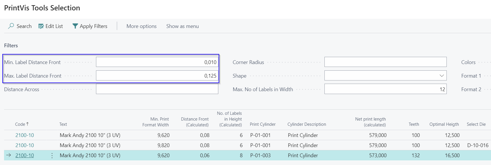

After selecting and editing tool values, the new values are stored on the Job Item formats for the sheet.

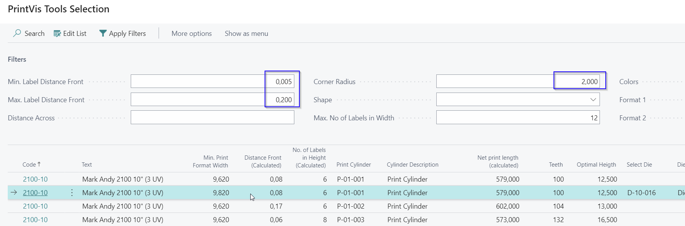

