# Component Types and Job Item Format Setup

## Summary

The PrintVis Component Types can be used to set default for every job
item to automate and simplify the input for the user. The component
types can act as a \"small template\" to preset default sheet,
imposition or finishing settings. The available component types can be
assigned to each Product Group (PrintVis Product Group Lookup Filters)
to ensure that only the relevant ones for the actual product group can
be selected.

By using Lists of Components it is even possible by selecting one list
to enfold all sheets/job items, such as for a hardcover book that
contains:

-   Hard-cover board

-   Hard-cover cloth or paper covering

-   Dust Jacket

-   Front paper

-   Back paper

-   Text/body

On top of the product size (Final Format), it is possible to define
additional flaps or other areas by using the Job Item Format Setup and
assigning them to each component type. This can be relevant for
packaging products in defining areas for gussets, zippers, etc. With
that PrintVis is able to calculate the open size of the product for an
exact calculation of the required print substrate.

## Component Types

A common list for commercial printing might look like this:

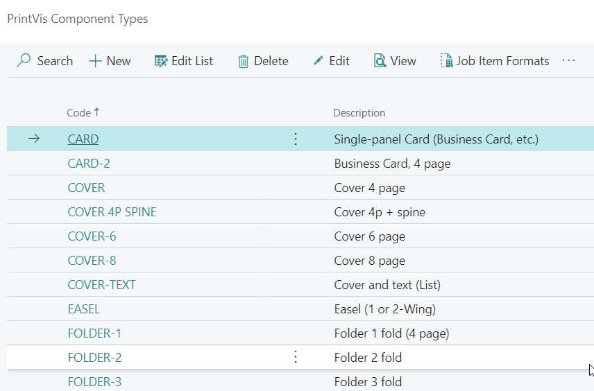

The example below shows a common setup for a cover of a perfect bound
book. Fields that are not filled will retain the default value from the
job or template.

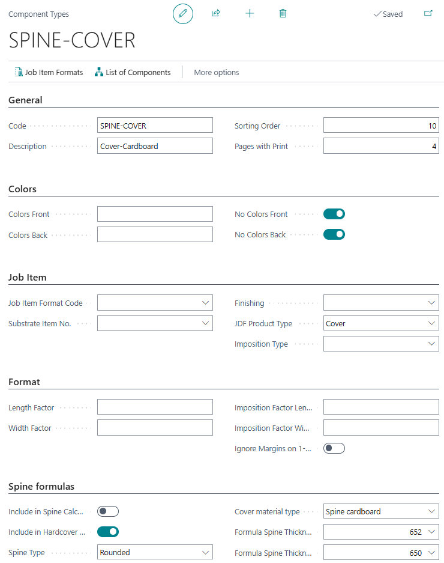

Fields

| Field                        | Description                                                                                                                                                                                                                                                                                                                                                                    |
|-----------------------------|--------------------------------------------------------------------------------------------------------------------------------------------------------------------------------------------------------------------------------------------------------------------------------------------------------------------------------------------------------------------------------|
| Pages with Print            | Number of pages with print this component will have. This number will be transferred to the job item. This can be useful for a component of type cover that always contains 4 pages instead of using the pages from the job input.                                                                                                                                        |
| Colors Front                | The number of colors to be printed on the front of the printed item. This value will be transferred to the field "Colors Front" on the job item.                                                                                                                                                                                                                             |
| Colors Back                 | The number of colors to be printed on the back of the printed item. This value will be transferred to the field "Colors Back" on the job item.                                                                                                                                                                                                                                |
| Job Item Format Code        | This field may contain a predefined final format which will be transferred to the job item. This is mainly used if the component acts as a more complete template for a particular product. Example: Business cards often have the same size.                                                                                                                               |
| Paper Item No.              | This value will be transferred to the job item's Paper Item Number field, in case there is a standard paper for this component type.                                                                                                                                                                                                                                          |
| Finishing                   | This value will be transferred to the Finishing field of the Job Item, in case there is a standard finishing type for this component type. Example: Covers always need trimming.                                                                                                                                                                                             |
| JDF Product Type            | For a JDF workflow it can be required to define a Product Type. The available options are based on the JDF Specification. The type "Cover" also impacts PrintVis Calculation Formula 107, which identifies if the calculation contains a cover.                                                                                                                             |
| Imposition Type             | This value will be transferred to the Imposition Type field of the Job Item, in case there is a standard Imposition Type for this component type.                                                                                                                                                                                                                             |
| Length Factor               | A multiplier for the final format length. The value multiplied with the Length of the format code will populate the "Length" field of the job item. Example: Final format 10x15, Width Factor = 3, Length Factor = 2 → Width = 30, Length = 30. Final size = 30x30.                                                                                                            |
| Width Factor                | A multiplier for the final format width. The value multiplied with the Width of the format code will populate the "Width" field of the job item. Same example as above: Final size = 30x30.                                                                                                                                                                                   |
| Imposition Factor Length    | This value will be transferred to the Job Item field "Conjugate Length," to calculate the open format from the Job Item "Length" field.                                                                                                                                                                                                                                        |
| Imposition Factor Width     | This value will be transferred to the Job Item field "Conjugate Width," to calculate the open format from the Job Item "Width" field.                                                                                                                                                                                                                                          |
| Ignore Margins on 1-up      | If enabled, all margins from the cost center configuration (e.g. Gripper, pull-mark, color bar/strip) are set to 0 for components with only 1-up. Used when printing is made on the final cut format (e.g. envelopes, greeting cards).                                                                                                                                       |
| Include in Spine Calculation| Set to TRUE if the actual component should impact spine thickness for the cover. Formulas 650/651 will include the paper thickness for those components.                                                                                                                                                                                                                      |
| Include in Hardcover Spine Calculation | Enable this field if the component is part of the spine for a hardcover book. Formula 652 calculates spine thickness using paper thickness or setup values in the Job Item Formats.                                                                                                                                                                           |
| Formula Spine Thickness     | Select a formula to calculate the spine thickness of a perfect bound (or similar) cover. Value appears in the "Spine Thickness" field on the Job Item and is used in imposition calculations. Includes a factor on top of paper thickness. Formula 651 adds 8% to net paper thickness for included components. Used for softcover or book block of hardcover books.       |
| Formula Spine Thickness Net | Select a formula to calculate the net spine thickness for a perfect bound cover. Appears in the "Spine Thickness, Net" field for information only. Formula 650 calculates the net paper thickness of all components marked "Include in Spine Calculation" = TRUE.                                                                                                             |

## Lists of Components

You are able to set up a combination of "Component Types" in the "PV
Component List." After setting up all components for a product, they can
be collected in the component list. When choosing this list on a new
sheet and expanding it, all required sheets/Job Items will be created.

This can be useful for a hardcover book that could contain for example:

-   Hardcover board

-   Hardcover cloth or paper covering

-   Dust Jacket

-   Front paper

-   Back paper

-   Text/body

For this follow the steps:

1.  Create all individual component types for a product.

2.  Create a list of components and assign all required components.
    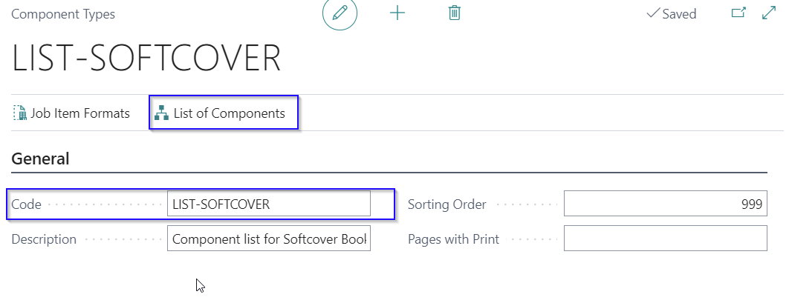
    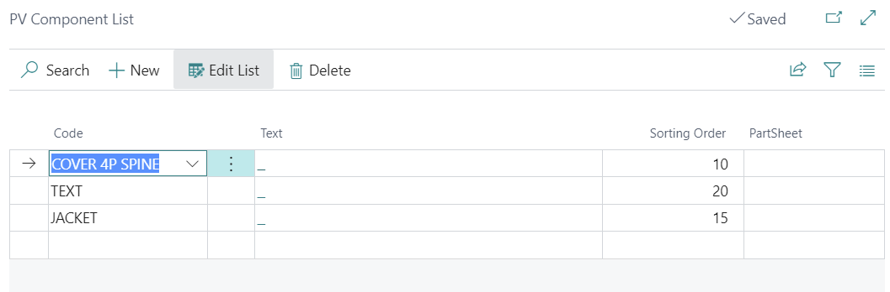

3.  On the Job Card of a case, create a new sheet and select the list of
    components
    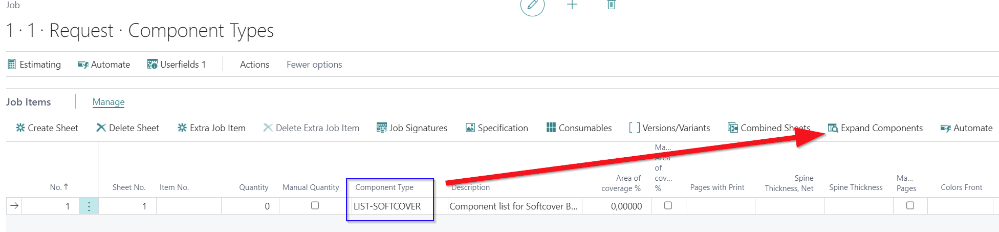

4.  Click expand to create all required sheets. Result:
    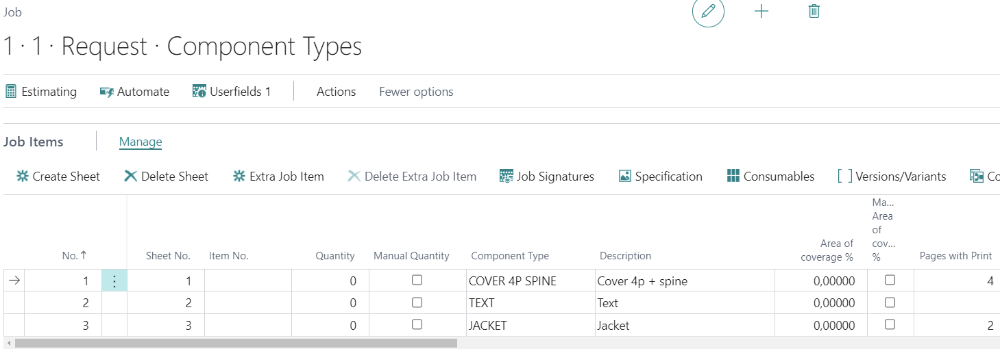

## Job Item Formats

On top of the product size (Final Format), it is possible to define
additional flaps or other areas by using the Job Item Format Setup and
assigning them to each component type. This can be relevant for
packaging products in defining areas for gussets, zippers, etc. With
this PrintVis is able to calculate the open size of the product for an
exact calculation of the required print substrate.

## Job Item Format Setup

Below we show a setup for flexible packaging production (stand up
pouches) or narrow web label production.

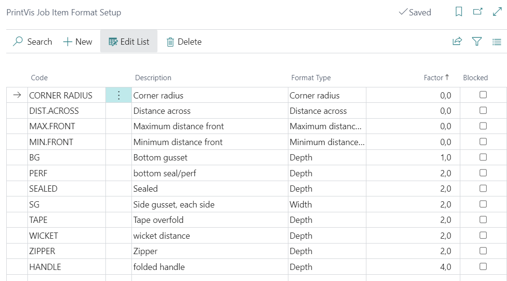

Fields

| Field         | Description                                                                                          |
|---------------|------------------------------------------------------------------------------------------------------|
| Code          | Enter a code for this Job Item Format Setup.                                                         |
| Description   | Enter a description for this Job Item Format Setup.                                                  |
| Format type   | Select the required format type from the options list. See the format types description below.       |
| Factor        | Enter a factor which will be the multiplier for the given value.                                     |
| Blocked       | If this field is enabled, the "Job Item Format Setup" is blocked from being used in the system.      |

## Format Types

| Field                | Description                                                                                                                                                                                                                                                                                                                                                                                |
|----------------------|--------------------------------------------------------------------------------------------------------------------------------------------------------------------------------------------------------------------------------------------------------------------------------------------------------------------------------------------------------------------------------------------|
| Depth                | The given value will be multiplied with the factor and added to the length of the product to calculate the open size of the product on the print substrate.                                                                                                                                                                                                                              |
| Width                | The given value will be multiplied with the factor and added to the width of the product to calculate the open size of the product on the print substrate.                                                                                                                                                                                                                               |
| Minimum distance front| Minimum distance between items in the length/circumference for a die. Used in the PrintVis Tools Selection as a preset value and to store a user-modified value for the actual sheet.                                                                                                                                                                                                  |
| Maximum distance front| Maximum distance between items in the length/circumference for a die. Used in the PrintVis Tools Selection as a preset value and to store a user-modified value for the actual sheet.                                                                                                                                                                                                  |
| Distance across      | Distance between the items in the width for a die. Used in the PrintVis Tools Selection as a preset value and to store a user-modified value for the actual sheet.                                                                                                                                                                                                                       |
| Corner radius        | Corner radius for a die. Used in the PrintVis Tools Selection as a preset value and to store a user-modified value for the actual sheet.                                                                                                                                                                                                                                                 |
| Spine Book block     | Enter book block thickness for a cover component. If value = 0, formula 652 uses components with "Include in Spine Calculation = TRUE" to calculate the thickness.                                                                                                                                                                                                                        |
| Spine cardboard      | Enter cardboard thickness for a hardcover component. If value = 0, formula 652 uses components with "Cover material type = Spine cardboard" to calculate the thickness.                                                                                                                                                                                                                   |
| Spine cover / cloth material | Enter thickness of cover cloth material for a hardcover. If value = 0, formula 652 uses components with "Cover material type = Spine cover / cloth material" to calculate the thickness.                                                                                                                                                                             |
| Spine front (end) paper | Enter thickness for end paper for a hardcover book. If value = 0, formula 652 uses components with "Cover material type = Spine front (end) paper" to calculate the thickness.                                                                                                                                                                                                       |
| Spine back (end) paper | Enter thickness for end paper for a hardcover book. If value = 0, formula 652 uses components with "Cover material type = Spine back (end) paper" to calculate the thickness.                                                                                                                                                                                                          |
| Spine jacket         | Enter thickness for jacket of a hardcover. If value = 0, formula 652 uses components with "Cover material type = Spine jacket" to calculate the thickness.                                                                                                                                                                                                                                |
| Spine glued/threaded | Enter cardboard thickness for a hardcover component. If value = 0, formula 652 uses components with "Cover material type = Spine cover / cloth material" to calculate the thickness.                                                                                                                                                                                                     |
| Spine per folding sheet | Enter a margin to be added to each folding sheet that is part of the book block. Formula 652 adds this margin × number of folding sheets to the spine. Typically, a folded sheet is thicker than just the paper thickness after folding.                                                                                                                                            |
| Spine side glue      | Enter a margin to be added to spine thickness in case of side glue. Formula 652 adds this margin to the spine.                                                                                                                                                                                                                                                                            |

## Example for a stand-up pouch with a zipper

A stand-up pouch with a zipper needs on top of the final size extra
material for the 

-   Bottom gusset

    -   BG setup 

        -   Format type = Depth

        -   Factor = 1

-   2 side gussets

    -   SG setup 

        -   Format type = Width

        -   Factor = 2

-   Zipper

    -   Zipper setup 

        -   Format type = Depth

        -   Factor = 2

Value for the actual Component type:

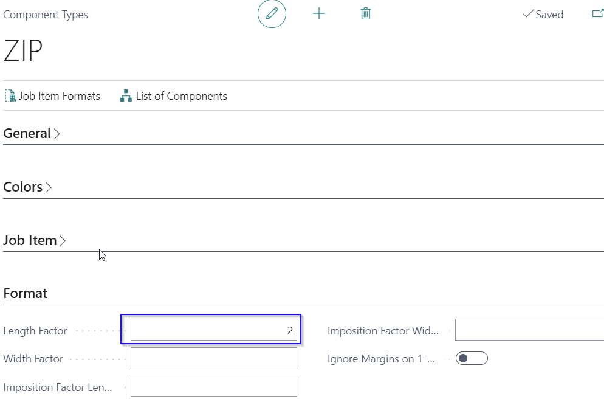

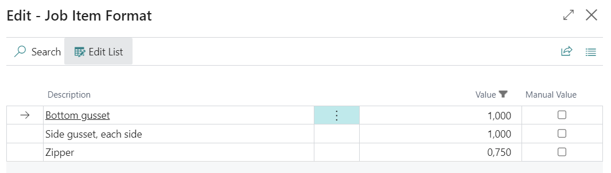

**Result in Width and Length on Job item:**

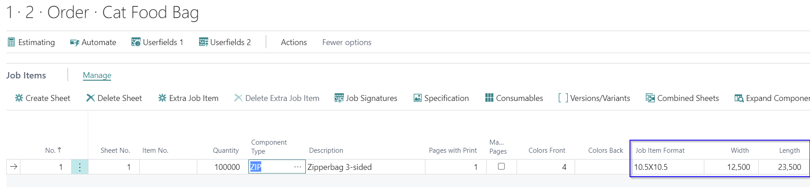

Length is calculated: 

-   (\"Job Item Format Length\" x \"Length factor\") + (Bottom Gusset
    Value+ Factor) + (Zipper Value+ Factor)\
    (10.5 x 2 = 21)+( 1 x 1 = 1) + (0.75 x 2 = 1.5) = 23.5

Width is calculated: 

-   (\"Job Item Format Width\" x \"Length factor (if not setup, value
    =1)\") + (Side Gusset Value+ Factor)\
    (10.5 x 1 = 10.5)+( 1 x 2 = 2) = 12.5

## Example for the Tools Selection

Component type = TOOL

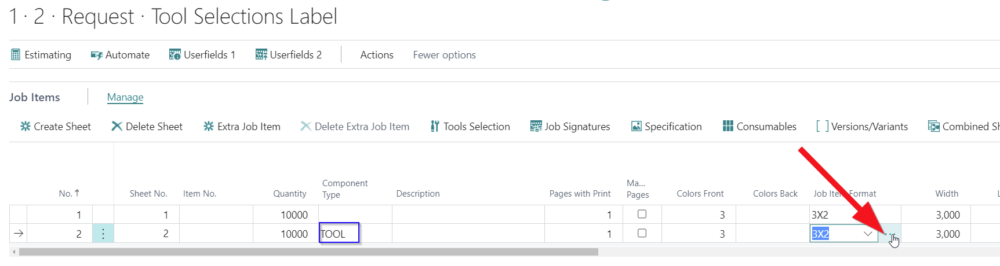

Values:

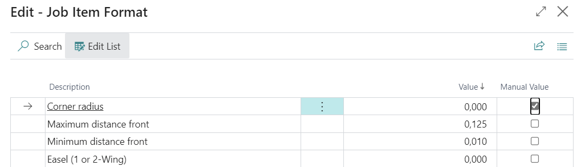

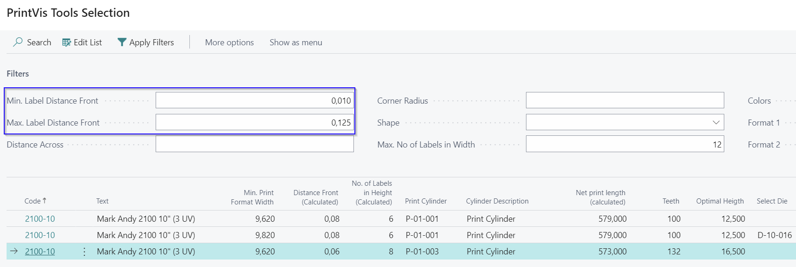

After editing the values and selecting a tool combination, the new
values are stored on the Job Item formats for this sheet.

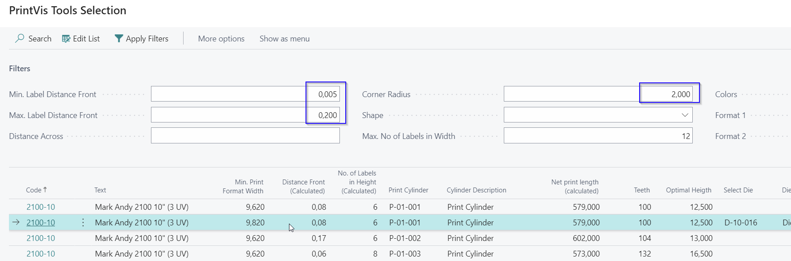

## Example for a hardcover book

For hardcover books there are several parts that must be included into
the calculation for the spine thickness. Calculation formula 652 is
calculating the total spine thickness from these values.

Step 1: Setup Job Item Formats

Description below explains how it calculates with formula 652

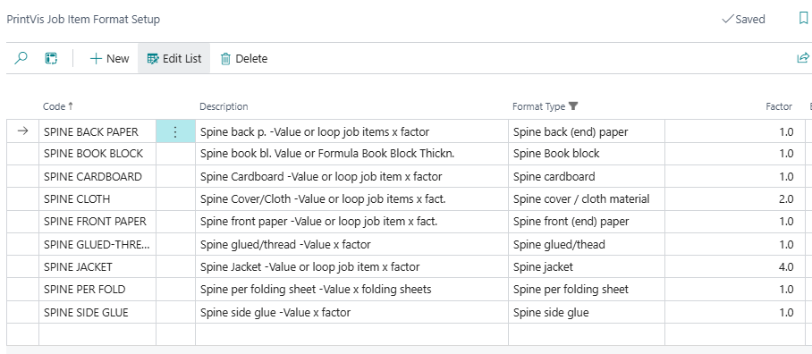

Step 2: Setup the required Component Types

Setup a Component Type for each component that should be included in the
hardcover spine thickness. Make sure to set the required Cover material
type.

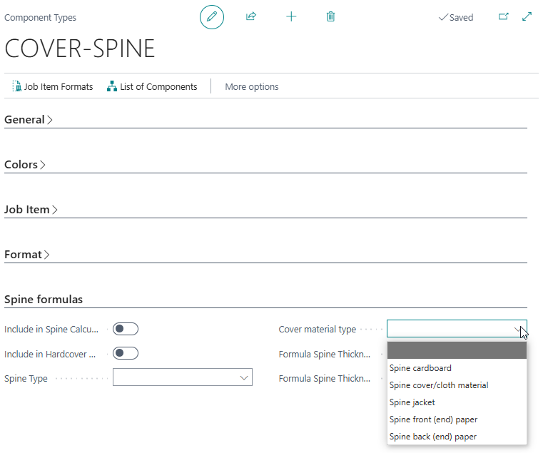

Step3: Setup on the components that represents/contains the spine
formula 652 in the spine thickness field.

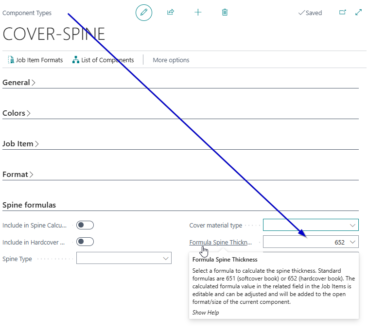

Step 4: Setup on the components that represents/contains the spine,
values for the spine elements on action Job Item Formats. Keep the value
= 0 if it should be calculated from a component that must be created in
a case as job item(s). 

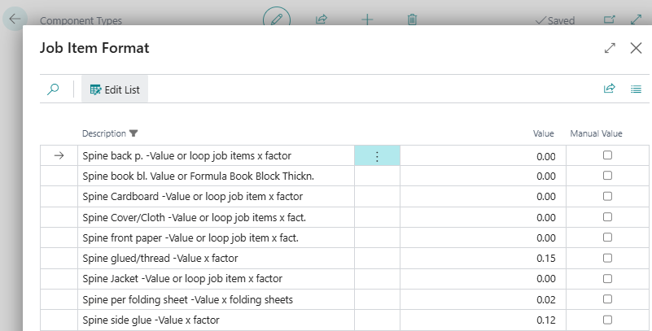

Step 5:

Create you estimate with the components for your book.

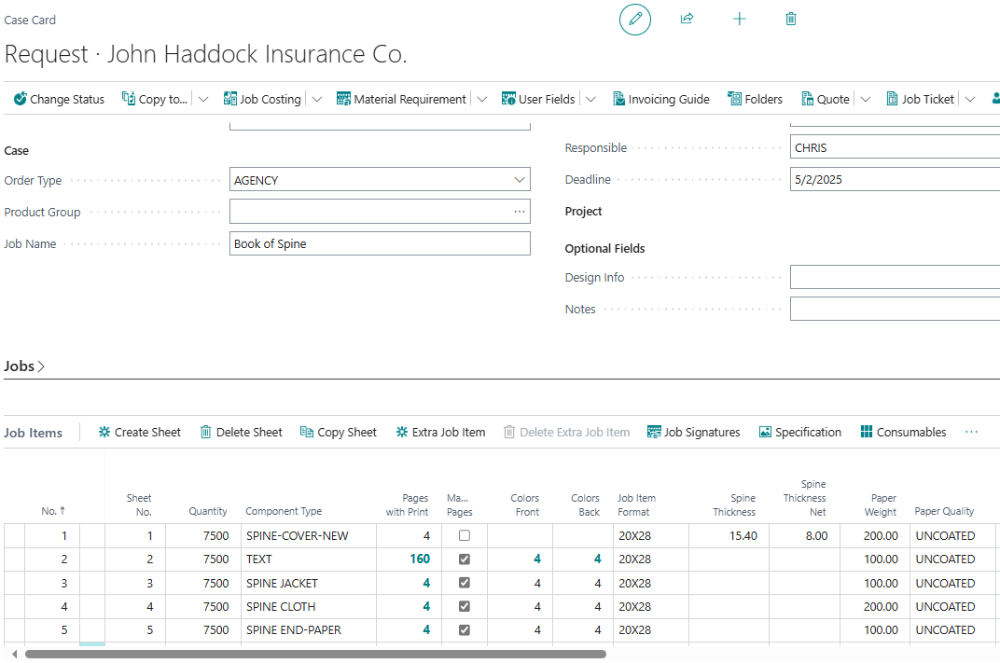

Step 6:

Edit the values if required. It is possible to lookup and adjust the
values with the lookup in the spine thickness field.

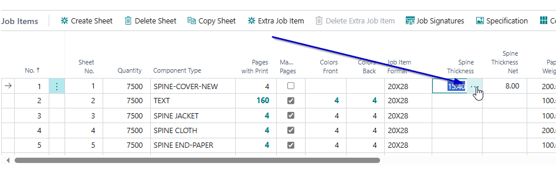

Adjust the values as required. It is possible to personalize the page
for the ability to edit the factor value which is most probably not
needed for the estimator/CSR. The changes are for the current job item
only.

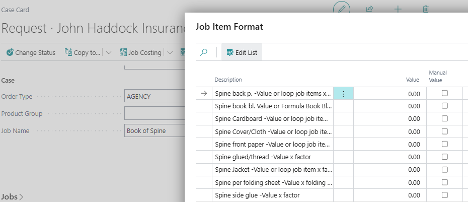

The Spine Thickness value on the job item will be recalculated
accordingly.
