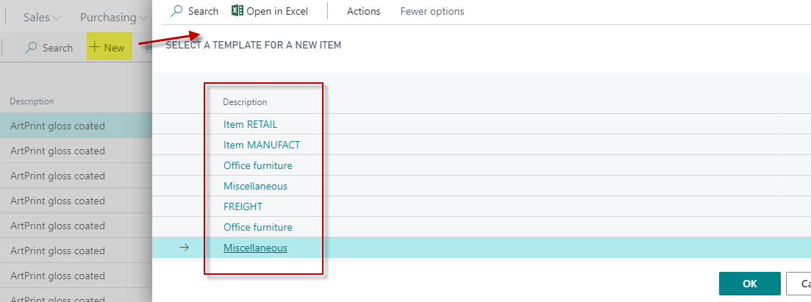
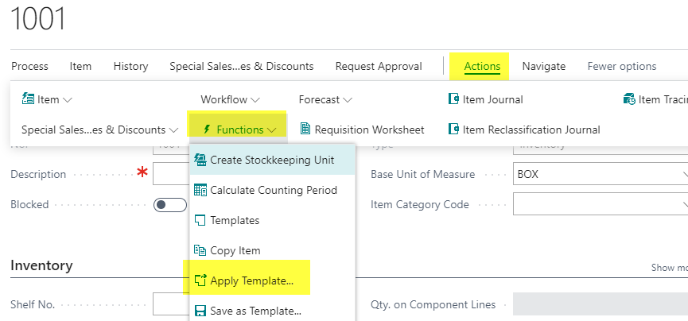
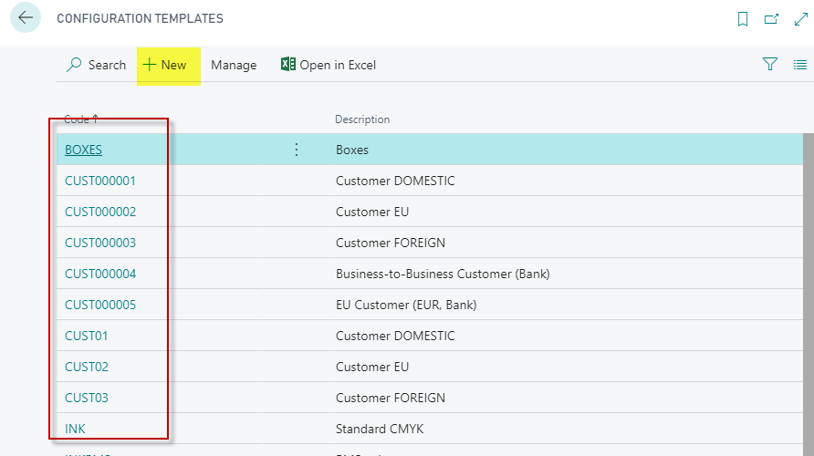
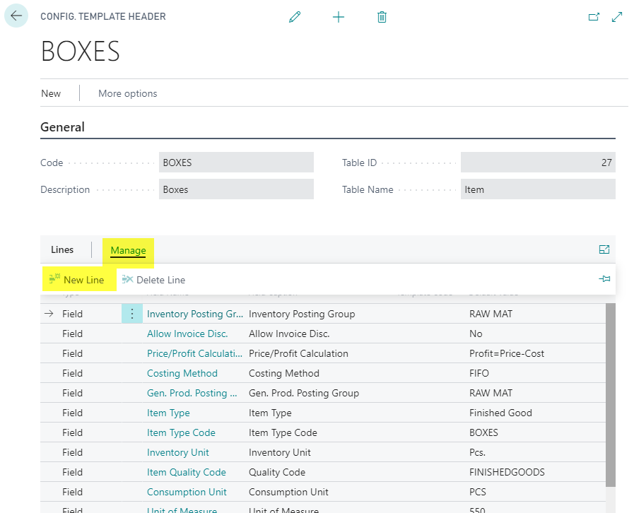
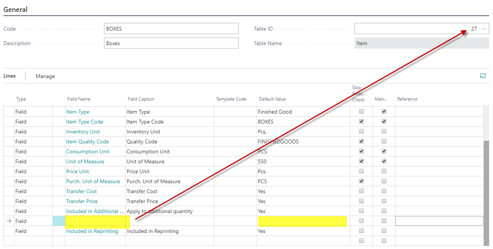
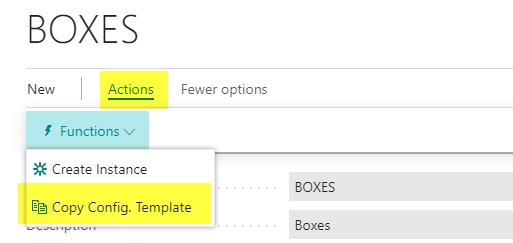
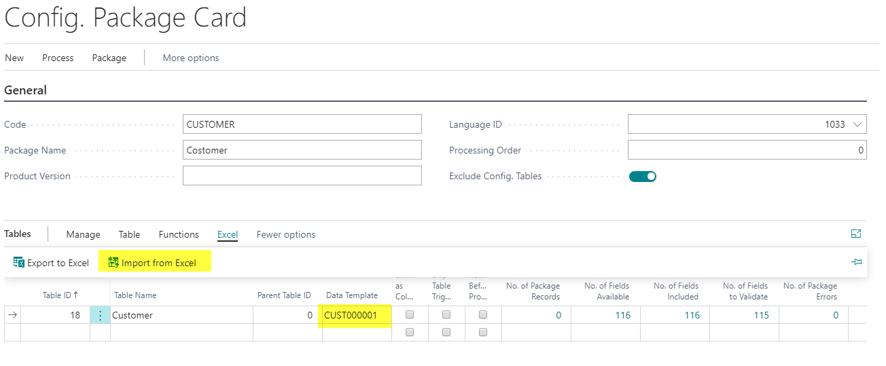

# Configuration Template Enhancements

## Introduction

This article provides an overview of the adaptation of PrintVis to the enhanced functionality of creating Configuration Templates.

This functionality, originally part of standard NAV, is now enhanced by PrintVis, enabling the use of templates by default. This makes setting up and creating items, customers, and vendors much easier. Default PrintVis fields are now available as well.

## Overview of the Configuration Template Setup and Usage

Configuration templates are extremely useful when creating new records such as Items, Customers, or Vendors. By applying a template to a record, the template fields are automatically filled with the specified values from the template. This simplifies the process for users who may not be familiar with posting-, inventory-, or tax-groups. Setting up Configuration Templates for each major group of items, customers, and vendors helps avoid mistakes.

Examples of templates for customers and vendors might include:
- **Local** (for local tax settings)
- **EU** (for tax settings in the EU)
- **EXPORT** (for export tax settings)

For example, a Configuration Template might be used to set up a new paper item.

When you click the "Apply Template" action button after creating a record with its code/number, templates for table 27 (Items) will be displayed for selection.

After selecting the template, the field values in the template will be applied to the item card.

## Setup Templates

 Creating or Modifying a Template

1. Open the template.

2. Select a field name (based on the table) and add the default value.

It is also possible to copy an existing template and modify the default values.

## Templates in Configuration Packages

Templates are used when importing data from Excel via configuration packages. All fields from the template with the same content are automatically filled in.

