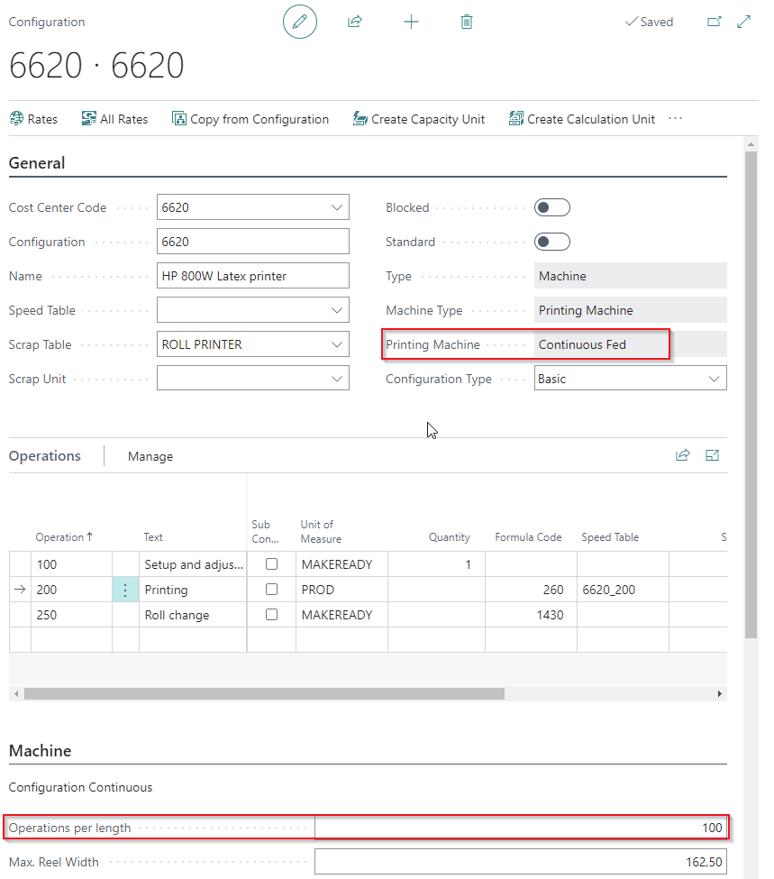

# How to setup a Continuous Fed Press

## Summary
A **continuous fed press** is primarily used for wide-format printing. Unlike sheet-fed presses, the standard formulas in PrintVis, particularly **Formula 22**, calculate differently. For a continuous fed press, Formula 22 calculates the number of print head movements based on the printed material's length, rather than the number of prints on a sheet.

## Setup
- **Operations per Length**: Defines the number of print head movements for each unit of length, typically 1 meter (metric) or 1 foot (imperial), based on the **Reel Length** set in the **Units of Measure**.

- Formula 22 calculates the total number of print head movements for a job item. A speed  table provides the number of head movements per hour.

Alternative formulas, such as **Formula 260** or **240**, can still calculate by area or length along with the corresponding speed.

## Example
- If **Operations per Length** is 1 (minimum print length section = 1 meter), and the total print length is 1525 mm, it rounds up to 2000 mm.
- If **Operations per Length** is 100 (minimum print length section = 1 cm), it rounds up to 1530 mm.

It's essential to set a realistic **Operations per Length** value to ensure accurate calculations for machine speed and material consumption on a continuous fed press.
