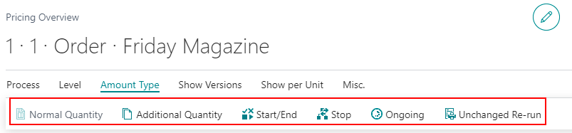

# Decision Overview / Pricing and Job Figures Setup

## Introduction

The Decision Overview tool in PrintVis provides a comprehensive view of the costing structure for one or multiple jobs/versions. It allows users to explore different levels of detail, offering a flexible way to analyze and present costing information. This tool supports up to 4 levels of detail and can be customized for different users, customer order types, and scenarios.

### Options on Decision Overview Page

 Display Levels of Detail

1. **Level 0 (All Details Collapsed):**
   - Overview similar to the PrintVis Job Card.
   - Displays two alternative rates (LOW/HIGH).

2. **Level 3 (List Max. Expanded):**
   - Shows all details set up for this view.
   - Includes additional totals:
     - Totals for paper
     - Totals by department

- **Full Order Quantity:** Default view showing total quantities.
- **Additional Quantity:** Shows costs for additional quantities.
- **Just Setup:** Displays costs based on setup (Start-Stop setting).
- **Shift:** Costs for version changes (Shift setting).
- **Running:** Costs for ongoing production (Ongoing setting).
- **Unchanged Reprint:** For re-orders, showing excluded setup parts.

## Setup Options

1. **Navigate to "PrintVis Decision Overview, Pricing Views" Page:**
   - Create different View Codes.
   - Use Setup Page to define custom views for each View Code.
   - Use Assignments Page to assign views based on role, user ID, order type, product group, or customer.

### Setup 

   - Select which lines to display using existing formulas.
   - Customize styles and colors for values outside of limits.
   - Copy lines to show details and totals as needed.
   - Create custom formulas for specific data displays.

Example Result

- **Direct Cost Material:** Shows units of measure for ink and paper.

- **Direct Cost Labor:** Displays different cost centers.

- Copy lines to show both details and totals.

- Create new formulas for specific ranges or sales prices.

### Assignments

Assign different views based on:
- Role Center
- User ID
- Order Type
- Product Group
- Customer

This allows tailored views for various scenarios, such as different sales prices or margin levels.

