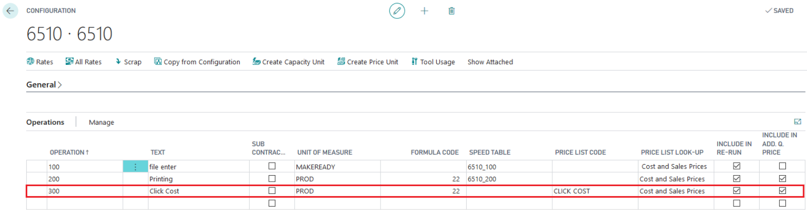
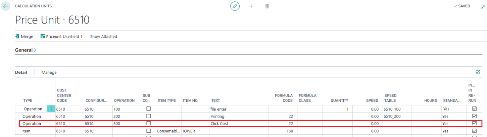
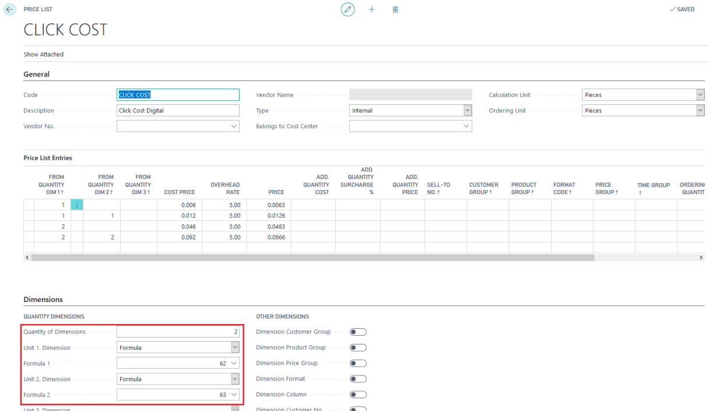
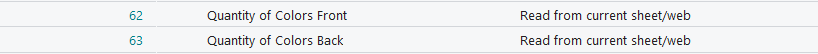
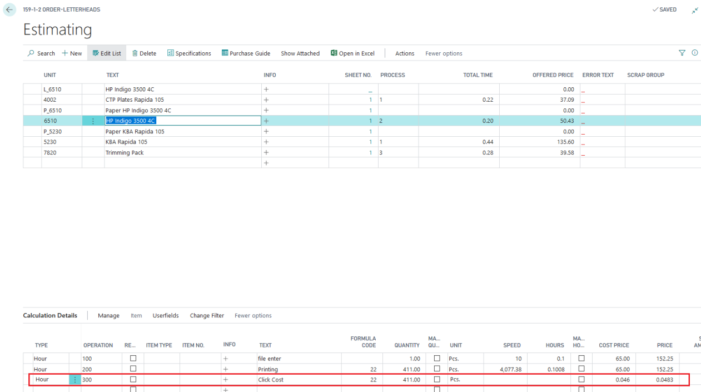

# Cost per click in Digital printing

**Click Costs Setup for Digital Printing Machines**

This article explains how to set up click costs for digital printing machines.

 Calculation Unit Setup

There are two methods for setting up click costs at the calculation unit level:

1. **As Line Type "Item"** with a price list and no consumption posting at the item card.
2. **As Line Type "Operation"** with a price list based on color front and back.

## Example Setup as Operation

### Cost Center / Calculation Unit

### Price List

## Result

## Auto consumption 
Auto consumptions does not work for click cost lines as they do not have a time associated with them. Therefore, the Hours field in the job costing journal line is expected to be filled in.

To work around this, enter a value of 0.01 in the Hours field for the ClickCharge Operation line to trick the system.

