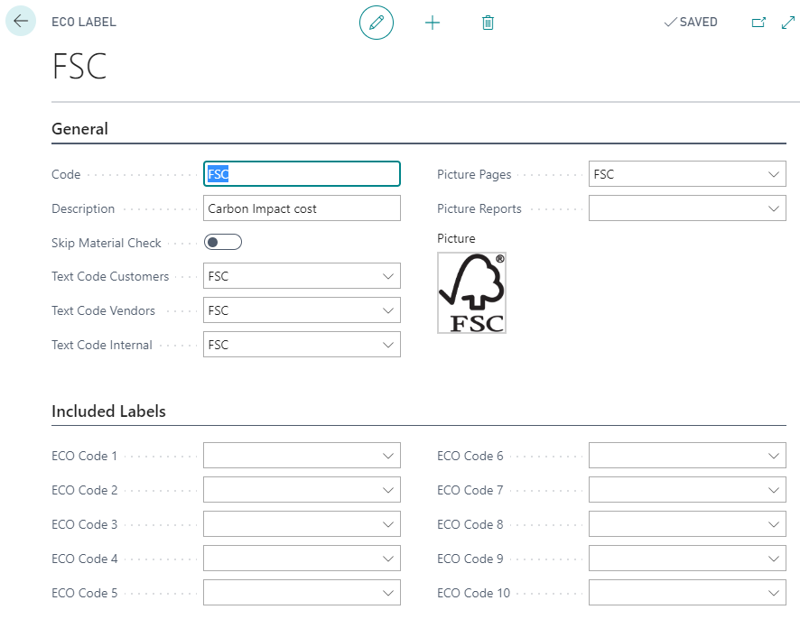
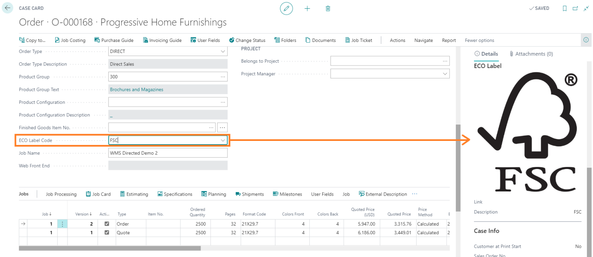
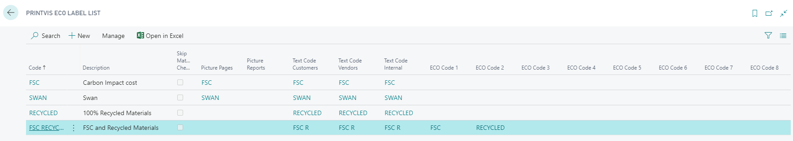
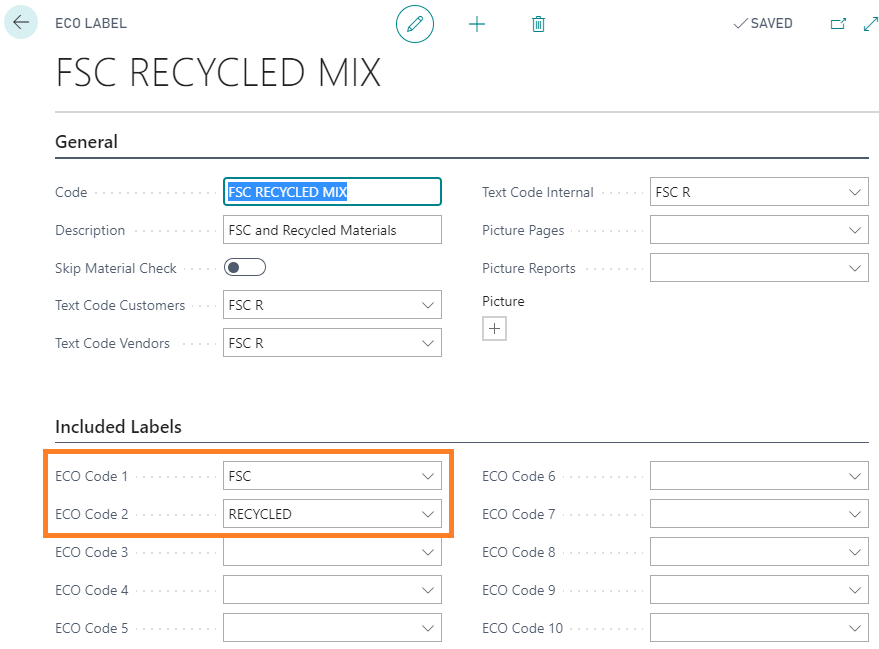
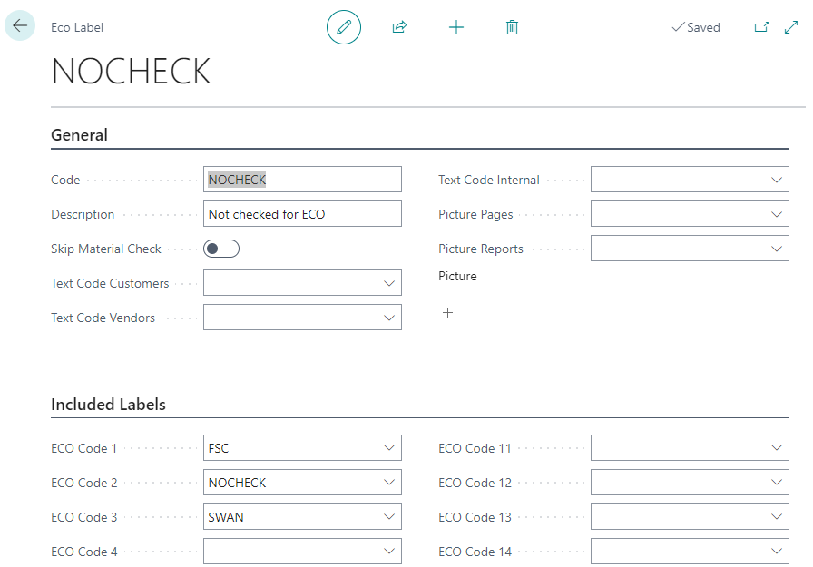
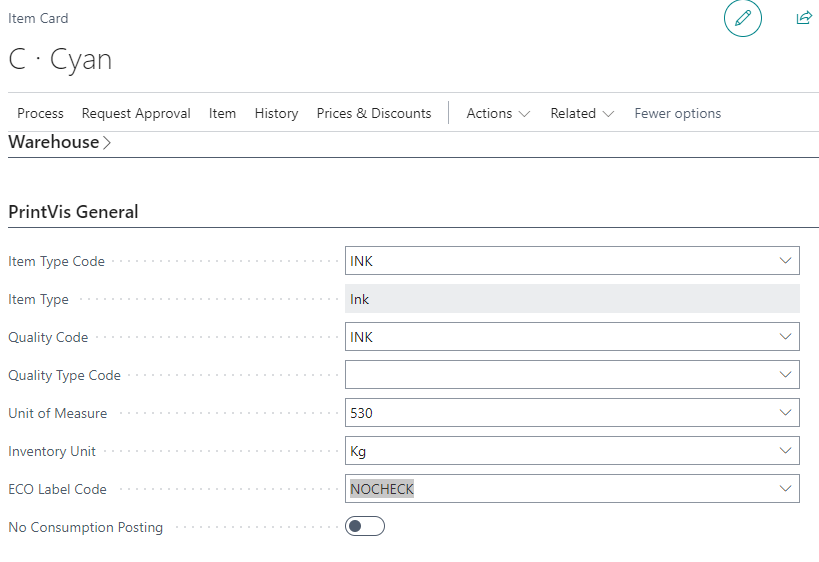

# ECO Label Setup

## Summary

Environmental protection has become increasingly important for manufacturing facilities of all types, and the print industry is no exception. For a print company to demonstrate that it is FSC (Forest Stewardship Council) certified is not only beneficial for the environment but also advantageous for business, as more consumers prefer to support environmentally responsible businesses. FSC certification assures a print company's customers that the paper products they use have undergone a certified chain of custody, contributing to conservation efforts. The good news is that setting this up with PrintVis is straightforward.

## Setup

### Eco Label Setup Page

Search for **“PrintVis ECO label list”** and then click **New**.

For example, if a customer requests an FSC-certified product, set it up with an ECO Label for FSC as follows:

**Note:** If the field **"Skip Material Check"** is checked, it will not give warnings if material is used without an ECO label.

Attached to related items and cases, it is only possible to select raw material for a job that fulfills the requirements.

The **Case Card** and the **Job Ticket** will display the selected label picture by default.

### Mixed Labels

If a mixed label is required, such as both FSC and recycled materials for a product, follow these steps:

1. Set up all labels that need to be included on the mixed ECO Label.
2. Set up the mixed ECO Label and include the ones that are covered by this ECO Label.

Now, all items related to the ECO Label setup can be chosen for a job, related to the ECO Label itself and the included labels.

### Setup Example

All labels are set up:

This is the setup of the mixed label. See the “Included Labels”:

### Important Note

When ECO checks are used, it checks against all items added to the estimate. If you are using materials that should not trigger an ECO warning when added to an ECO-specific estimate, these items will need to be assigned a **"NOCHECK"** type mixed ECO label that includes all ECO labels your company might assign.

For example, if your company uses FSC and SWAN standards, create a mixed ECO label that includes both of these in the included list:

Then assign this ECO label to any item you want to skip when performing an ECO check.

