# Estimation Automation in PrintVis

## Summary

This article summarizes Estimation Automation Setup and Usage.

The intention of this article is to describe how the PrintVis Estimation Automation works and what to expect from its functionality. The focus in this article is on how the system finds the best-fit printing press and the best-fit paper for that press within the set filters.

### Setup Prerequisites

To have the Estimation Automation properly working, please ensure the following:

<ol>
  <li>
    At least one <strong>(General)</strong> entry in the PrintVis Estimation Automation must be set up.
  </li>

  <li>
    To automatically suggest paper, please ensure that you mark the field
    <strong>“Auto Paper.”</strong>
    <ul>
      <li>
        Also mark <strong>“Stock Paper”</strong> if only house qualities are to be regarded.
      </li>
      <li>
        Or mark <strong>“Only paper on Stock”</strong> if only actual paper on hand is to be regarded.
      </li>
    </ul>
  </li>

  <li>
    Please ensure the Lists of Units for the Printing Presses are all set with the field
    <strong>“Include in Machine Choice”</strong> to <strong>Calculate</strong>.
    <ul>
      <li>
        If set to <strong>Always</strong> or <strong>Never</strong>, the unit is disregarded.
      </li>
    </ul>
  </li>

  <li>
    The Lists of Units must have a Configuration attached for the selected Cost Center, and this
    Configuration must be of type <strong>Basic</strong>.
    This Calculation Unit can have the setting <strong>Calculate</strong> in Machine Choice, but it is not required.
  </li>

  <li>
    The field <strong>“Max. Number of Colors”</strong> on the Configuration must have a value (not zero).
  </li>

  <li>
    Each Printing Press must have <strong>Fixed Rates</strong> only.
    <ul>
      <li>
        If even one machine is set up with <strong>Surcharge Rates</strong>, the automation will error and cannot
        calculate properly.
      </li>
    </ul>
  </li>

  <li>
    Rotation- or Web Presses must have a <strong>fixed Cutoff</strong> attached to the selected
    <strong>Basic Configuration</strong>.
  </li>

  <li>
    To further fine-tune the setup, please set the required <strong>Item Group</strong> and
    <strong>Lookup Filters</strong> for each Product Group accordingly.
  </li>

  <li>
    As the entire process is calculated in <strong>temporary tables</strong>, certain formulas will work,
    whereas <strong>local formulas</strong> or results of <strong>Formula Reports</strong> often will not.
  </li>

  <li>
    All standard formulas (<strong>1–990</strong>) will work; however, for the following processes,
    only specific formulas are supported (controlled within <strong>Codeunit 6010332</strong>):
    <ul>
      <li>
        <strong>Print:</strong> Formulas <strong>22</strong> and <strong>220</strong>
        (not <strong>240, 250, 260</strong>, etc., or user formulas)
      </li>
      <li>
        <strong>Plates:</strong> Formulas <strong>8</strong> and <strong>10</strong>
        (if a varnish plate is required, include it as a separate calculation detail line)
      </li>
      <li>
        <strong>Number of Sheets:</strong> Formula <strong>9</strong>
      </li>
    </ul>
  </li>

  <li>
    Everything included in the List of Units that can be calculated using the formulas above
    will be included.
  </li>

  <li>
    <strong>Finishing processes</strong> are not included.
  </li>
</ol>

### Prerequisites at the Time of Looking Up the Printing Press / List of Units

#### When performing the Lookup for a Press, please notice:

- If no Final format and/or No. of colors Front and Back are missing, all machines are presented, and no sorting as per cheapest machine is made.
- No. of colors (expecting front and back colors will be the same, i.e., CMYK, etc.) must fit within the Max No. of colors for a Press. Thus, a 4-color job will not be calculated and suggested on a 1- or 2-color Press.

### The Way It Works

#### Important Knowledge on How the Automation Works

When the lookup is done into the List of Units from the Job Item, during the seconds it takes to open the Page, each List of Units is calculated. When the Machine list is populated, the sorting is such that the Machines are displayed, sorted per the calculated price for the process according to the sum of prerequisites mentioned, with the least expensive machine options at the top of the list.

PrintVis goes through the following steps during the temporary estimation that takes place:

<ol>
  <li>
    Builds the list of Machines, considering:
    <ul>
      <li>
        The allowed Machines from the Product Group Lookup Filters.
      </li>
      <li>
        Machines where the Max No. of Colors &gt;= Job Item Colors.
      </li>
      <li>
        Machines where the Max formats &gt;= the Job Item size (uncut format).
        <ul>
          <li>
            Unless a specific paper is already selected, then to fit paper formats as “max”.
          </li>
          <li>
            If no paper is found within the selected filters of paper weight, Item Quality, and Item Type, then calculate the imposition from the largest paper available within the filter.
          </li>
        </ul>
      </li>
      <li>
        Lists of Units where the Process Type = a Printing Process (1 to 8).
      </li>
    </ul>
  </li>

  <li>
    Calculates a fictitious sheet and residual sheet temporarily.
    <ul>
      <li>
        If an Imposition Type is selected prior to the lookup that does not fit any machine or the Job Item, the process is skipped and no machines are found.
      </li>
    </ul>
  </li>

  <li>
    Calculates No. of Sheets (incl. scrap), Plates, and No. of Impressions (see Formulas).
  </li>

  <li>
    Calculates the entire set of Lists of Units through temporarily calculating each Detail Line which can be estimated (again, as some formulas might not give any result).
  </li>

  <li>
    Sorts the list with the least expensive machine on top of the list.
  </li>
</ol>

### What Is NOT Considered During the Temporary Calculation Process

#### Please also note the following, which is NOT considered:

- The price of consumables (Ink, Varnish) is NOT calculated in this temporary calculation.
- The Print Process, if it uses any other Formula than 22 or 220.
- Plates and Plate Mounting, if it uses any other Formula than 8 or 10.
- Any additional Process (Finishing, etc.) as these are not inserted yet, and thus cannot be calculated temporarily.

## Setup

Go to Page "PrintVis Estimation Automation Setup".

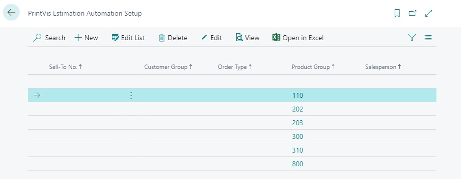

Actions

| Action | Description |
|--------|-------------|
| New    | Create new  |
| Edit   | Edit        |
| View   | View the setup on a current |

This is the setup page for the automation of suggesting paper when choosing a printing press and for Quick Estimation:

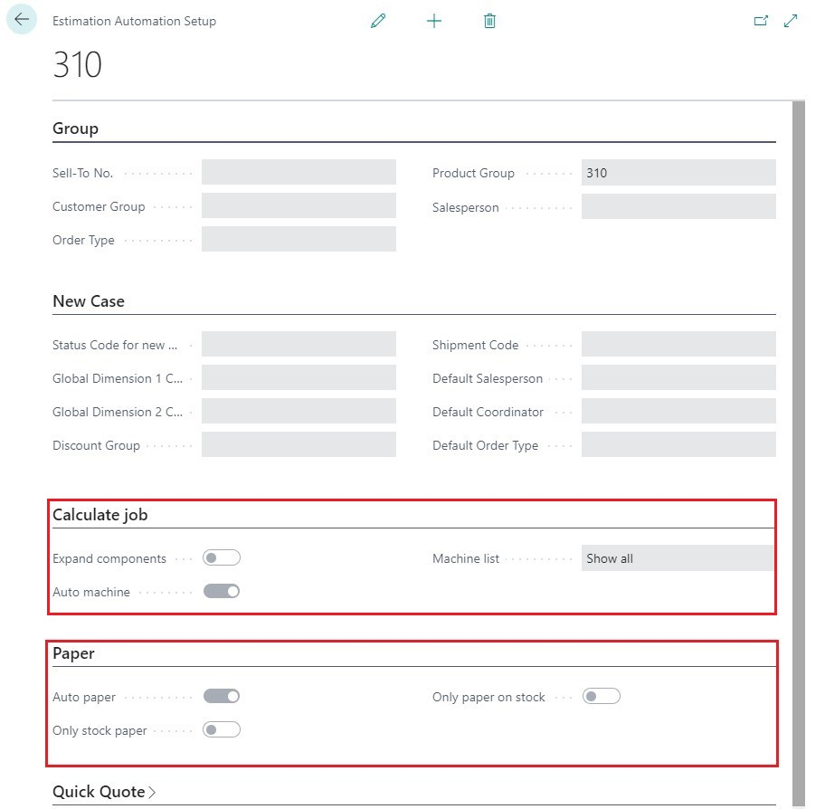

| Field                | Description |
|----------------------|-------------|
| **Expand Components** | Marking this field will expand the "List of components", which is described separately. |
| **Auto machine**      | This must be marked if you want the system to suggest the printing press. Normally, the best machine (cheapest machine) is at the top of the list. |
| **Machine list**      | Lookup on the field "Machine list". There are 2 options:   - **Show all**: Suggests paper for all machines possible to print this job.   - **Calculated**: Suggests paper only for machines marked with "Calculate" on the "list of calculation unit". |
| **Auto paper**        | This must be marked if you want the system to suggest paper. Ensure there is paper in the right format for the machines and that you have filled out the field "Paper Weight" and "Paper Quality" on the Job Item line before choosing the List of Unit. Eco labels are taken into consideration.   **NOTE**: In countries where you use "Weight Unit" on the Item Card, this field must also be filled in on the Job Item line before choosing the List of Unit. |
| **Only stock paper**  | This must be marked if you want the system to suggest paper marked as “Inventory Item” = “House Quality” on the Item Card. |
| **Only paper on stock** | This must be marked if you want the system to only suggest available paper on stock. If an item has inventory and is not displayed in the list, it is because PrintVis checks whether the inventory is reserved for other orders (PrintVis Orders and Sales Orders). |

## Function on Job Card

There are several methods by which you can apply this feature from the Job Card.

When all information about Quantity, Pages with Print, Number of Colors Front / Back, Job Item Format, Paper Weight, and Paper Quality is filled in, you can do the following:

### Open List of Units  
   Here you will see all the combinations that are within the selected setup.

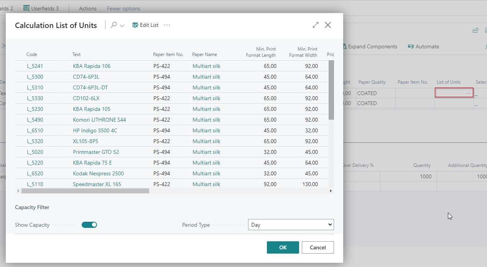

### Automate per Sheet  
   Use this Automate, and PrintVis takes the least expensive (top) machine/paper.

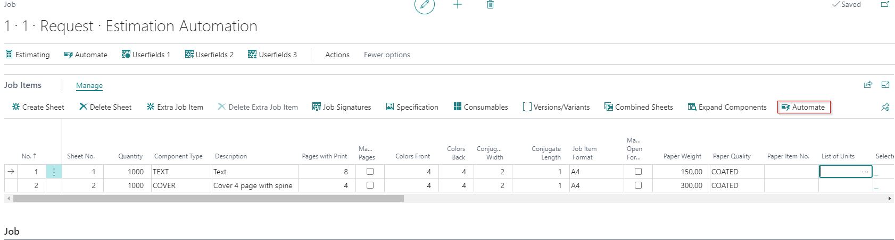

### Automate all Sheets  
   If you have multiple sheets, you can use this Automate, and PrintVis selects the least expensive machine/paper for all sheets. It is also possible to use the Automatic per sheet, one by one.

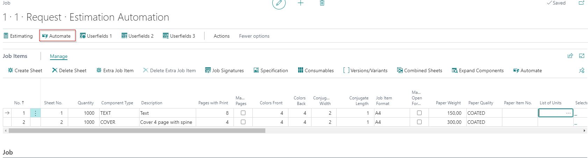

### New Version
   If you create a New Version with a different quantity or Pages with Print, just hit "Automate" again, and PrintVis will perform a new calculation and select the cheapest paper/machine. PrintVis will NOT consider any other types of finishing types/machines. If you use the "Copy Alternatives" function for different quantity, Pages with Print, or Number of Colors, then you must afterwards enter the Job Card and use "Automate" for each individual alternative.

###Certain Paper 
   If you want a specific paper item number, customer paper, or residue to be used, you can override the selected PrintVis suggestion at Open List of Units:
   - Insert the desired paper item number in the Paper Item No., and make a lookup in the List of Units.
 
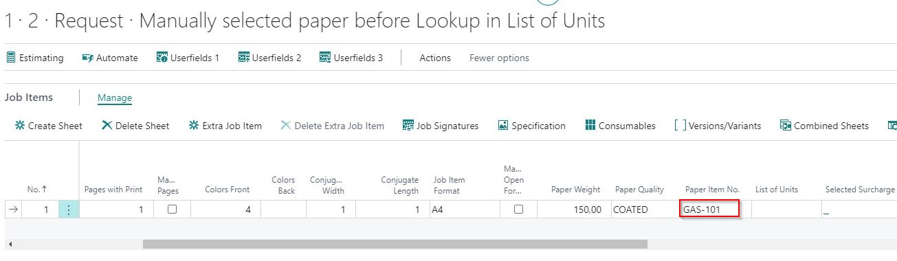

  - At the top in List of Units, you can select the "Clear Paper" function, and all the selected Paper Item numbers are removed from the list. You can now select a machine.

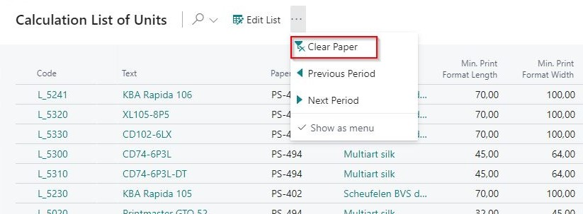

   - Your fixed Paper Item No. is now used in the calculation together with the selected machine.
   
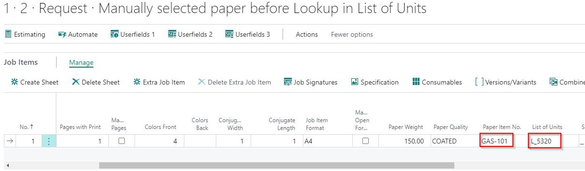

- You also have the option to change the Paper Item No. after selecting List of Units.

## Troubleshooting

### If the Estimation Automation List Does Not Show All Fields Anymore After an Update

In newer versions of PrintVis, the pages have changed. Now, the list page only shows the grouping fields. For each line, there is a Setup Card page that aims to better assist with the setup. This is for easier input and less confusion. The automation functionality remains the same.

### Paper Assigned to a Press by PrintVis Estimation Automation Setup

Sometimes we get questions about why a selected paper has changed on the Job Item. This is related to the PrintVis Estimation Automation Setup. If this is unwanted by the user, you can do the following:
- Choose the machine first before the paper selection is done.
- Select the desired paper again after selecting the press.
- Change the Estimation Automation Setup to not suggest paper.

**Explanation:** When there is a paper weight and quality selected on the Job Item, PrintVis can choose the best paper for each machine that is enabled for auto-selection. 

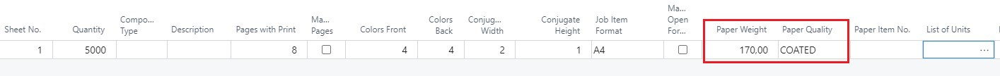

PrintVis is able to suggest a press by sorting it by the best price—meaning the least expensive machine is shown at the top of the list. Furthermore, you can see that some lines have paper information and minimum print size information. 

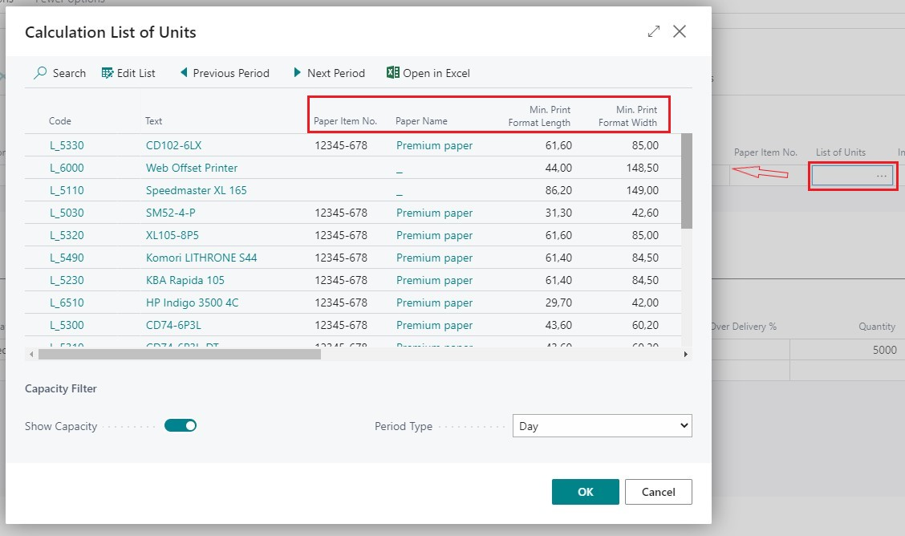

If you don't want PrintVis to suggest paper, simply disable the "Auto paper" option.

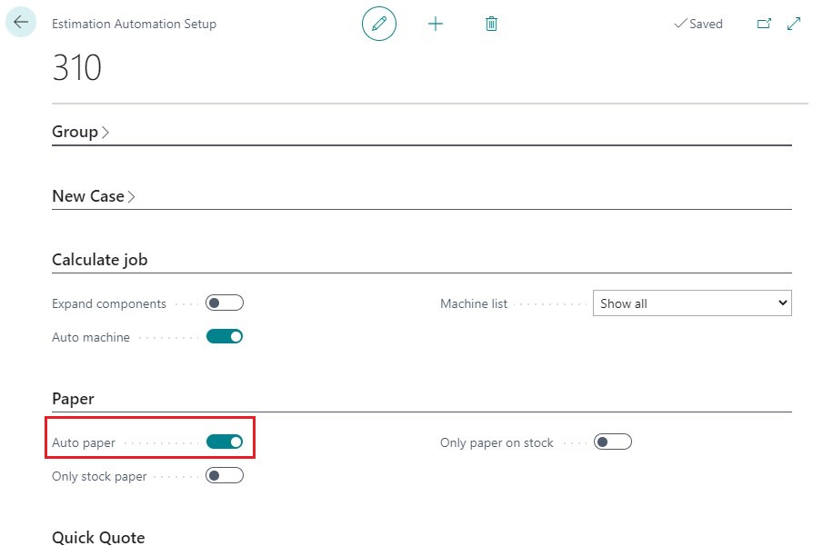
