# Creating an Estimate

## Summary
Estimating in PrintVis involves calculating a quoted price for a requested product, such as a brochure. This estimate forms the basis for actions like:
- Printing a quote
- Creating an order
- Planning production

The estimate uses **calculation units**—definitions of production processes linked to cost center operations and items. All production processes influencing the quoted price must be included in the **calculation unit setup**.

 Case Card and Case List
To calculate the quoted price, key information such as **job quantity, sheets, and pages** must be entered. The user selects the necessary processes (calculation units) for producing the product.

## Case (Estimation) Workflow
The entire workflow is accessible from the **Case Card**. For experienced users, it’s easy to access the necessary areas. However, for new users, it's recommended to follow this structured flow:

1. **Case Card**: Open the Job Card.
2. **Job Card**: Create sheets and enter job item details.
3. **Estimating**: Select calculation units and input operational data.
4. **Specification**: Open this page for each sheet, check data, and amend details.
5. Close all pages and review pricing on the **Estimation tab** in the Job Card.
6. Create versions for additional price breaks, and edit user fields.

## Case Card

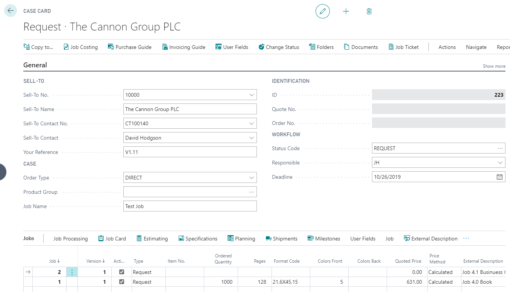

Each request is created as a new case in the PrintVis **Case Card**.

 Fill in or Select:
- Sell-To No.
- Order Type
- Product Group
- Job Name

Check or select other entries :
- Salesperson
- Estimator
- Responsible
- Deadline

 Job Line Fields:
- Quantity
- Pages
- Format Code
- Colors Front
- Colors Back
- Paper selection

**Warning**: Only inactive job lines can be deleted.

Proceed to the **Job Card** by pressing the “Job Card” button.

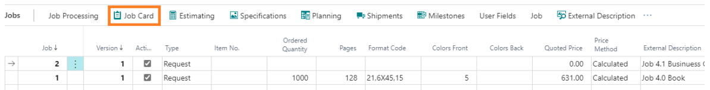

## Job Card
In the **Job Card**, the product parts are defined. Press the **Create Sheet** or **Extra Job Item** buttons.

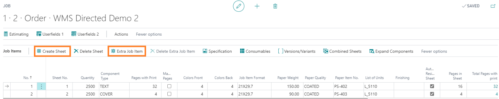

 Fill in:
- Sheet Type
- List of Units (select the printing machine)

Open the calculation window by pressing **Estimating**.

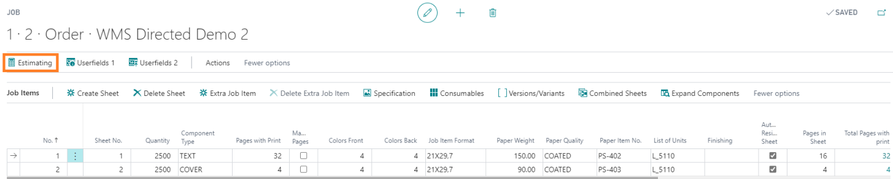

## Estimating
The first three calculation units come from the selected printing machine. 

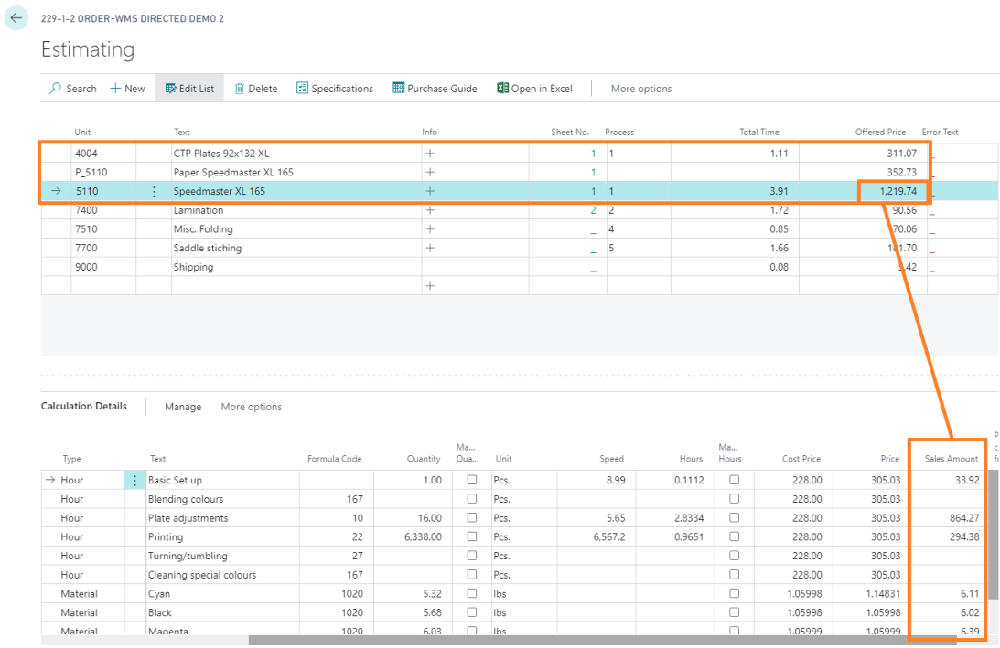

Prices are composed of the calculation lines.

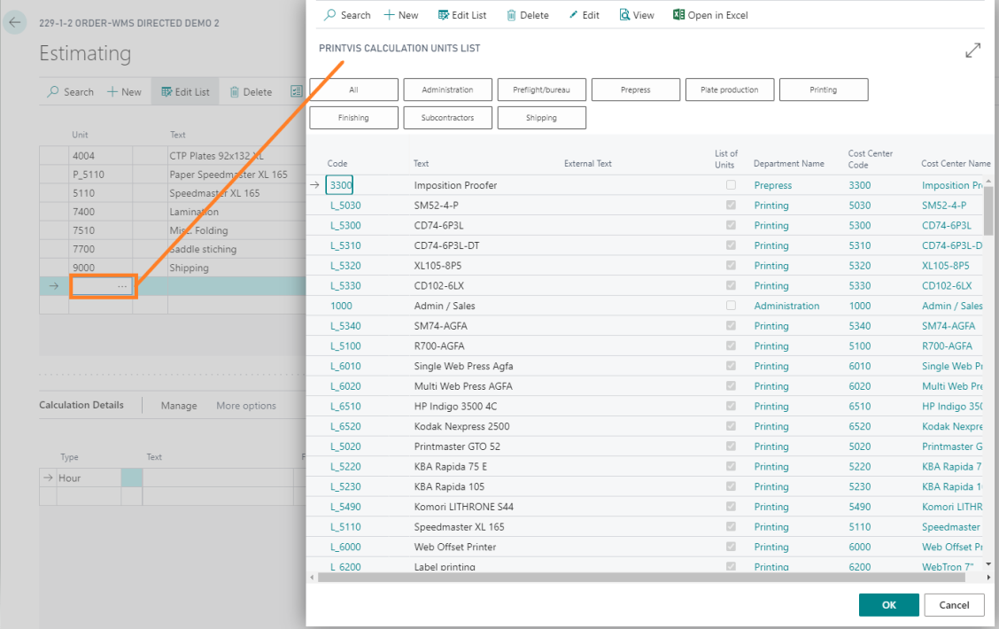

Add remaining machines (calculation units) necessary for production. For example, estimate time for **Pre-press (DTP)** with 0.5 hours.

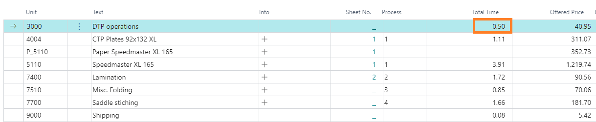

Proceed to the **Specification** window.

## Specification
In this window, all inputs are checked.

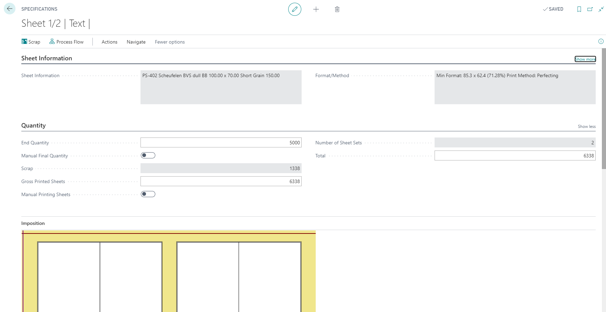

Return to the **Job Card** to view the results of the calculation.

## Calculation Results
The **Job Card** shows the results of the calculation. 

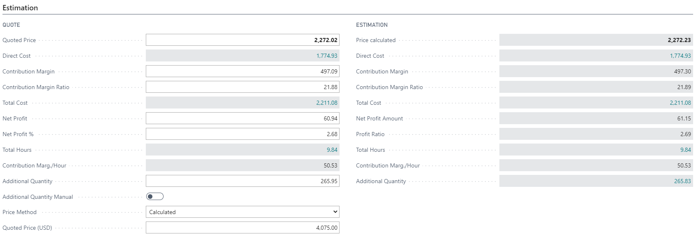

Prices are based on these calculations:
- The right column is not editable.
- The left column has fields that can be altered.

The **Quoted Price** is displayed on the **Case Card**.

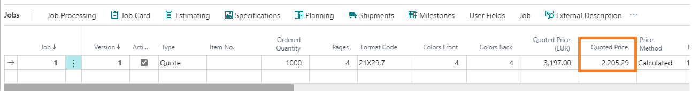

## User Fields

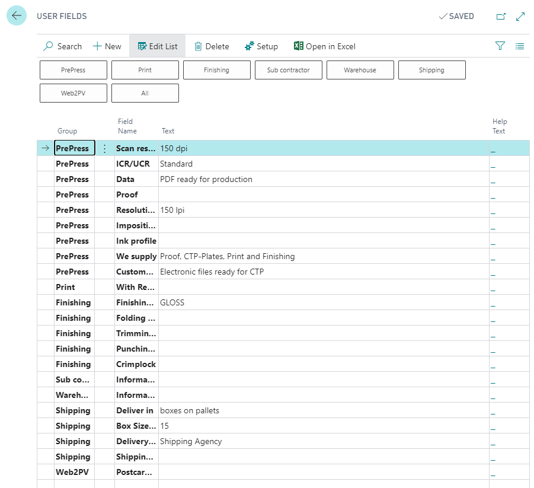

From the **Case Card**, input additional job information via **User Fields**. This data can be printed on job tickets, quote letters, etc.

