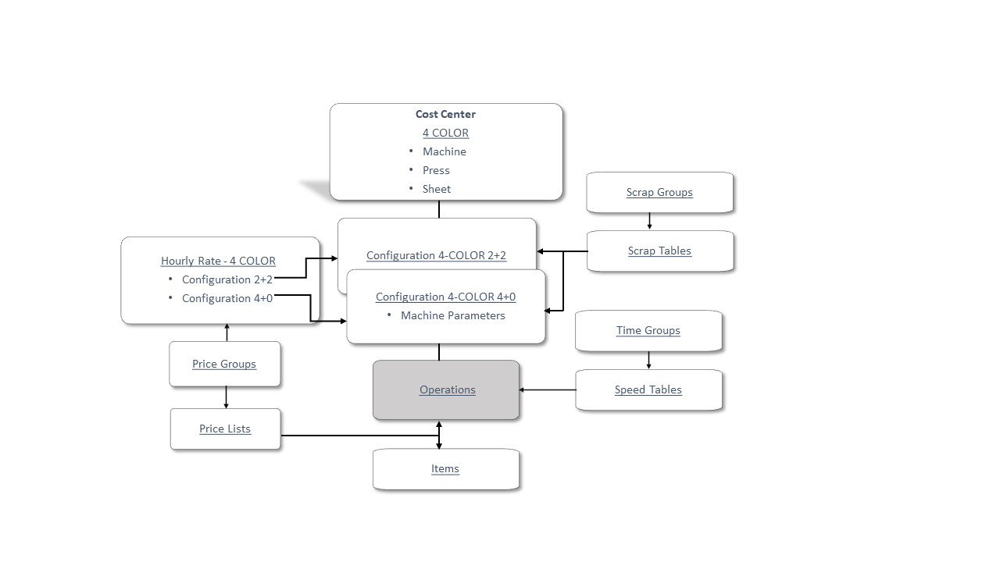
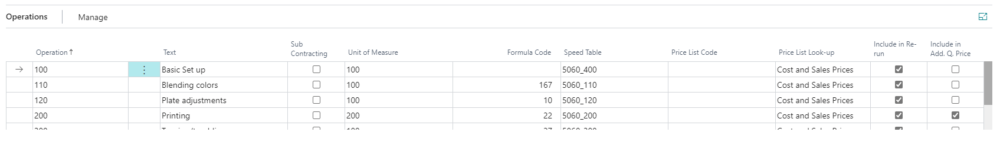
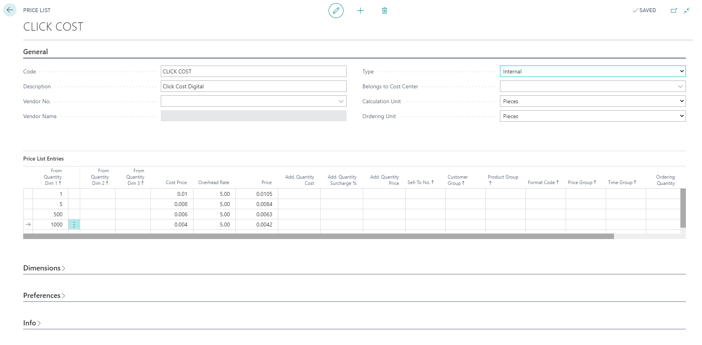

# Estimation Master Data


## Estimation Master Data
Apart from the data used for the actual calculation, the estimation can create data that is used in the following areas:

- Planning
- Job Costing
- Analysis

It is crucial to create a systematic, well-structured set of master data. Careful preparation ensures that the calculation is done as intended and simplifies future maintenance. Properly set up master data leads to efficient work processes, allowing you to focus on the quality of the calculation.

## General Construction of the Estimation Master Data

The estimation is constructed from two layers:
 
	- Master data
	- Calculation units 

Parallels can be drawn to the construction of a house:

### Foundation 
The first layer is a solid and thoroughly thought-out foundation. This includes the total functionality of the system, similar to planning the distribution of rooms, water, heating, electricity, and sewage in a house.

### Functions
The second layer contains all the functions of the system, which consist of various elements such as walls, roof, windows, and so on. These elements are combined creatively to meet the total needs and ensure practical functionality.


### Master Data
The foundation of estimation is a structured and well-thought-out master data system that accurately reflects the rules and prices the company uses as a basis for calculations. A calculation determines the actual cost for the company to produce a given task.

Master data consists of detailed information about your company within the following categories:

- Cost centers (machines, etc.)
- Hourly rates
- Price lists
- Speeds
- Scrap
- Items

The different categories of master data are created and maintained separately. They are joined to form a whole through the cost centers and the items.


### Calculation Units
Calculation Units are based on the master data and function like electronic building blocks—small spreadsheets that calculate specific parts of a task. They ensure uniform calculations across the company and are not dependent on the individual performing the calculation.

Example
- **CTP Time**: Open document (preparation, imposition, terminal time, etc.)
- **CTP Time**: PDF (preparation, imposition, control time, etc.)
- **CTP 52 x 74**: CTP plate production
- **CTP 72 x 104**: CTP plate production

By creating these CTP calculation units, you can calculate the price for CTP work on an order by selecting the relevant combinations.

## General View

We will elaborate on the estimation's main elements, starting with master data, then moving to calculation units and their application in order calculation. This overview will provide insight into content, principles, and relationships before detailing master data setup.

### Master Data General Content

### Cost Center
A cost center calculates the cost of time spent on a task and is essential in master data. It can represent a machine, location, or person and always has a fixed hourly rate.

### Configuration
Each cost center can have one or more configurations. Each configuration must include all operations required for pre-calculation. For instance, a machine cost center might include details about machine parameters related to a specific print process.

### Operations
Each configuration includes all the operations to be pre-calculated. The level of detail should reflect how you would manually pre-calculate.

### Other Master Data
From a cost center (or its configurations and operations), you can access other files containing calculations about department, hourly rates, speeds, scrap, and price lists.

### Item Card
The item card is central to master data, used to calculate material and subcontractor usage. It includes special terms regarding prices, price lists, quality, format, warehouse treatment, and bookkeeping.

## Example of Master Data
To calculate the cost of printing with a 4-color printer, the following master data is required:

### Printer 
Used for producing 4-color print and 2-color brochures. Includes setup time and different hourly rates for perfection.

###Cost Center 
Created as a "Printing machine" type.

### Configurations
Defined for different states of the printer with varying hourly rates and machine parameters.

### Operations 
Includes all operations to pre-calculate for each configuration.

### Hourly Rates 
Set up for both 2-color and 4-color operations.

### Items
Includes materials used in printing (ink, paper).

The diagram below illustrates the chosen master data.


Once the necessary decisions about master data are made and entered into PrintVis, the company can perform an estimation.

## How Master Data and Calculation Units are Related

When performing calculations, users need to select and combine relevant data to calculate the task at hand. This requires filtering and combining extensive master data into manageable units called Calculation Units. Each Calculation Unit calculates a specific subset of the task.


Calculation Units
To accurately calculate tasks in a print example, you need to create a Calculation Unit for each cost center configuration. Each Calculation Unit must be linked to the cost center, utilizing the configuration, selected operations, and materials from items to pre-calculate the printing process.

### Calculation Units and List of Units

Combining Calculation Units (e.g., a printer and paper) into a List of Units simplifies system use. The user selects the relevant List of Units, and the system transfers all Calculation Units in the list to the estimate, performs the calculation, and displays the result.


### Using the Estimation Functionality

When first using the estimation for a task, the user selects the List of Units and Calculation Units based on the customer’s needs. The estimation calculates total costs, both internal and external, and displays the result. Once created, this data can be reused and adjusted for future tasks and customers.

### Setting Up Master Data

Setting up master data involves maintaining a general view of the process while managing details of master items. 

## The workflow of setting up Master Data for Estimation

The process consists simply of these sub-tasks:

	- Defining the purpose of the company's use of the calculation system
	- Collecting information
	- Transforming the collected information
	- Entering the information into PrintVis


### The Purpose
Review and decide which existing calculation rules to carry over into the new system. This defines the framework for automation and manual decision-making.
   
### Collecting
 Gather details of the production system, including functions, hourly rates, speeds, and procedures.

### Transforming 
Prepare collected information based on new system rules, adapting it to fit PrintVis capabilities. This requires a deep understanding of both the old and new systems.

### Data Entry
Enter the transformed data into the new system. Knowledge of relevant tables and data entry methods is essential.

**Note**: It is crucial to address all sub-tasks with equal priority. Any errors should be identified and corrected promptly to maintain the integrity of the process.

## Descriptions of Master Data Categories

The relationship between different master data categories must be understood. Each category's data must be transformed to fit the system's structure.


### Cost Center


Cost centers are created in a single table. Essential fields include:

- **Code**
- **Name**
- **Department**
- **Type**


### Configurations


Details are defined in the Configuration window, which consists of a card and a table. 

### Card 
Includes tabs for General, Machine, Planning, Calculation, and Info. Typically, you fill in the General and Machine tabs, with the Calculation tab being auto-filled by the system.

#### General Tab 


Basic configurations relevant if a machine can operate in different states with varying hourly rates or parameters.

#### Machine Tab 


Specific details about the machine's operations.

#### Operations




Operations define the time units used at a cost center. For example:

- **Printing Machines**: Setting up, blending colors, place adjustment, printing.
- **CTP and Film Output**: Setting up, imposition, terminal time, CTP-output, film-output, filing.
- **Finishing**: Various fold-types a machine can handle.

**Example**: A table of operations for a 4-color printer.



### Calculation of Time Consumption

Operations focus on the duration of events and are calculated using the equation:

\[ \text{Number of times} \times \text{Time used per operation} \times \text{Price} \]

For each "time calculation line" in a calculation, the following factors need to be defined:

#### Number of Times the Operation is Done

| **Type**           | **Description**                                                                                                                                                        |
|--------------------|------------------------------------------------------------------------------------------------------------------------------------------------------------------------|
| **Possibly automatic** | The value of this field can either be a fixed number that you input, or a reference to a formula in the system's collection of formulas.                                  |
| **Not automatic**    | The user must indicate a value to be used in the pre-calculation.                                                                                                      |
| **Missing Inputs**   | If neither Formula Code nor Quantity is filled in, and if the price calculations need a figure, the pre-calculation will stop and display a red *. The user must then enter a value. |


#### Time Used per Operation

| **Type**           | **Description**                                                                                                                                                         |
|--------------------|-------------------------------------------------------------------------------------------------------------------------------------------------------------------------|
| **Possibly automatic** | This factor is obtained by either binding a Speed Table to the operation or by entering a fixed speed into the field Speed or by entering a fixed number of hours into the Hours field. |
| **Not automatic**    | The user needs to make an estimate and enter a value in the field Time Consumption when pre-calculating. If neither Speed Table, nor Speed nor Hours are filled in, and if the price calculations need a figure, the pre-calculation will stop and display a red *. The user must then enter a value. |


#### Price

Typically derived from hourly rates in the cost center configurations. Special hourly rates for specific operations can be created, or prices can be picked from a price list.

#### Automatic Calculation

The program will only calculate operations automatically if the factors in the formula

[ Number of times * Time used per operation * Price ] consist of the following combinations of field input:


| **Number of times** | **Time used per operation** | **Price**                  | **Formula**  |
|---------------------|-----------------------------|----------------------------|--------------|
| Speed table         | Hour Rate or Price list     | Formula                    | Speed        |
| Hour Rate or Price list | Quantity                  | Speed table                | Hour Rate or Price list |
| Quantity            | Speed                       | Hour Rate or Price list     | Hours        |


#### Speed Tables


Speed tables define how time is calculated for operations. The Speed Tables window is divided into an upper part (overview of created speed tables) and a lower part (lines in the selected table).


#### Specification of Speed in Table

Specify the speed by combining two fields: Unit of Time and Hours.

### Examples

| **From quantity** | **Unit of time** | **Hours** | **Formula**        |
|-------------------|------------------|-----------|--------------------|
| 1                 | 5000             | 1         | = 5000 units/hour  |


| **From quantity** | **Unit of time** | **Hours** | **Formula**        |
|-------------------|------------------|-----------|--------------------|
| 1                 | 1                | 0.5       | = 1 unit / 0.5 hours |


#### Differentiating Table Lines

You can specify when a speed changes by using the From Quantity field, which indicates when a given speed table line should be used:

| **From quantity** | **Unit of time** | **Hours** | **Formula**           |
|-------------------|------------------|-----------|-----------------------|
| 1                 | 3000             | 1         | = 3000 units per hour |
| 1001              | 8000             | 1         | = 8000 units per hour |
| 5001              | 8300             | 1         | = 8300 units per hour |
| 10001             | 8700             | 1         | = 8700 units per hour |


**Note**: You can also differentiate by Product Group, Time Group, Format Code, Paper Quality, Weight, and Number of Sections.

| **Weight** | **From quantity** | **Unit of time** | **Hours** |
|------------|-------------------|------------------|-----------|
| 1          | 3000              | 1                |           |
| 1001       | 8000              | 1                |           |
| 5001       | 8300              | 1                |           |
| 170        | 1                 | 3000             | 1         |
| 170        | 1001              | 7500             | 1         |
| 170        | 5001              | 7800             | 1         |
| 250        | 1                 | 3000             | 1         |
| 250        | 1001              | 6000             | 1         |
| 250        | 5001              | 6500             | 1         |

From the information about the paper's weight the program will choose the speed table lines that must be used to calculate the required time.


The program can show an overview of the different speed tables in the system. The overview contains not only the fields Code and Text, but also a number of fields that offer extended possibilities for setting up each table:

	- Format Type
	- Find best format
	- Formula 1
	- Formula 2	
	- Per process
	- Speed Principle
	- Calculation


#### Scrap Tables


Scrap tables define how scrap is calculated for a process. They are primarily used for printing machines, finishing machines, and possibly other sections.

Scrap Tables Window

The Scrap Tables window is similar to the Speed Tables window, with an upper part for the list of created scrap tables and a lower part for the lines in the selected table.


Apart from the fields Code and Description, the overview only contains the field Format type. The format can be an important parameter in scrap calculations; as there many format terms when calculating a job, the Format type field is used to indicate exactly which format is meant.


The fields in each table line can be broken up into two groups according to their function in the table:

	- Fields that are used to differentiate the system's choice of table lines for scrap calculation.
	- Fields that are used directly to calculate scrap.

#### Fields used to differentiate the system's choice of table lines

1. **Fields to Differentiate Table Lines**: Scrap Group, Format Code, Sheet Weight, Number of Runs, From Quantity (net print).

#### Fields to Calculate Scrap
   - Per Processing Scrap
   - Sheet Scrap and Following Sheet Scrap
   - Plate Scrap and Following Plate Scrap
   - Per Shift Scrap
   - Per Plate in Shift Scrap
   - Scrap % Running

**Note**: The same scrap is usually calculated for all plates unless specified otherwise.

#### Hourly Rates


Each cost center has a basic hourly rate used for calculations. You may need to create rates for additional configurations or operations.

Cost Center Rates Table


The table includes fields for general descriptions and rate entries, with some fields used for calculation and others for illustration.

### Groups for Differentiating


The estimation system includes groups for differentiating tables:

- **Time Groups**: Affect speeds and time calculations.
- **Scrap Groups**: Affect scrap calculations.
- **Price Groups**: Affect hourly rates and price lists.

Time groups: The groups can differentiate speeds and thereby the calculated time for the operations they influence. This, of course, influences cost and/or sales prices indirectly.

Scrap groups: The groups can differentiate scrap and thereby paper usage. This influences costs and/or prices indirectly.
Time and scrap groups are oriented towards production and are typically called 'EASY', 'DIFFICULT', etc.

Price groups: The groups can differentiate hourly rates and price lists. They are therefore oriented toward marketing and are often called 'CAMPAIGN', 'SPECIAL COLOR', etc.


**Note**: Time and Scrap Groups are typically oriented towards production, while Price Groups are marketing-oriented.

#### Additional Rate Groups

Create general additional rates for item costs, self-cost, and sales prices. These can be used to influence calculations, such as adding a percentage for rush orders.


The upper part of the window consists of a table where you can create the rate groups. In the middle, the three types of additional rates you can choose between, and in the lower part a table where you can create additional rates for the type selected in the middle part.

	- Surcharge on cost price is the percentage that should cover storage costs, etc.
	- Surcharge on own price is the extra percentage that you will earn in addition to e.g. storage costs etc.

Note: The group with standard additional rates should be created with a blank code field. 
This causes this rate to be chosen if nothing else is given.

#### Differentiating

The window includes a table for creating rate groups, types of additional rates, and a table for entering additional rates.

- **Surcharge on Cost Price**: Percentage for storage costs, etc.
- **Surcharge on Own Price**: Extra percentage for earnings beyond storage costs.

**Note**: Create a blank code field for standard additional rates, which will be chosen if no other rate is specified.

Differentiating Additional Rates

Each additional rate can be differentiated by product group, customer group, item quality, and item number for detailed control.

#### Items

In this manual, we deal with how items are set up in relation to the calculation.


The items that the calculation typically revolves around are:

- Paper
- Plates
- Film
- Color
- Sub-contracting

To pre-calculate, you need to consider the following questions for each item and enter your conclusions into the system:

- Which attributes shall the item have?
- According to which principles shall the price calculation be based?

 Attributes to Consider

- **Item Type**
- **Quality**
- **Calculation Unit**

### Setting Up for Price Calculation

For use in a price calculation, you can set up the following:

1. **Price List Code**: Attach to the item in the field `Price list code` on the General tab.
2. **Rate per Calculation Unit**: Enter on the Invoicing tab.
3. **Cost Price**: Use the field `Cost Price`, and for the sales price, either the field `Additional %` or `Price`.


#### The Calculation of Prices of Items

The program calculates cost, own, and sales prices for items based on the data entered on the tab `Invoicing` on the item and the data in the `Additional Rate Groups` table.

| #  | Type       | Additional Rate | Cost Price Calculation   | Self Cost Calculation | Sales Price Calculation          | Additional Sales Price |
|----|-----------|----------------|--------------------------|-----------------------|----------------------------------|------------------------|
| 1  | Transfers | Additional Rate | Cost Price + Additional Rates | Additional Rates   | Self Cost + Additional Rate      | Additional Rate        |
| 2  | Transfers | Additional Rate | Cost Price + Additional Rates | Calculated        | Sales Price from Item Card       | Additional Rate        |
| 3  | Transfers | Additional Rate | Cost Price + Additional Rates | Calculated        | Cost Price + Additional % from Item | Additional Rate        |

 Cost Price Calculation Details

 Cost Price
The cost price is always used by the calculation, either from the **Cost Price** field on the item or from a price list attached to the item.

 Additional Costs
The additional cost and sales prices are always taken from the **Additional Rate Groups** table. The addition to **Self Cost** is generally from the **Additional Rate Groups** table.

 Exceptions
The addition to **Self Cost** will be calculated as:

```
( (Sales Price – Self Cost) / Self Cost ) * 100
```

...when either the field **Additional %** or **(Sales) Price** is set for transfer to the calculation.

(Sales) Price Calculation
The value in the **Price** field can be obtained in three ways:

1. **Generally:**
   ```
   Self Cost + Additional Rate
   ```

2. **If the field Price is set to transfer on the item:**
   ```
   The value from Price on the item
   ```

3. **If the field Additional % is set on the item:**
   ```
   Cost Price + (Additional % on the item * Cost Price)
   ```

 Example 1
Additional **Cost Price** and **Self Cost** are fetched from the **Additional Rate Groups** table.

| Cost Price | Additional Cost Price | Self Cost | Additional % | (Sales) Price |
|------------|----------------------|-----------|--------------|---------------|
| 1          | 100                  | 20%       | 120          | 10%           | 132           |

Example 2 Additional cost price is fetched from the Additional Rate Groups table. The value 200 from the field Price is set to transfer on the item. Finally, Additional Self Cost is calculated "backwards" as

[ (Price- Self Cost)/ Self Cost * 100 ] :

| Cost Price | Additional Cost Price | Self Cost | Additional % | (Sales) Price |
|------------|----------------------|-----------|--------------|---------------|
| 1          | 100                  | 20%       | 66.66%       | 200           |

Example 3 Additional cost price is fetched from the Additional Rate Groups table. The value 50% from the field Additional % on the item card is set to transfer, so (sales) Price is calculated as

 

[ Cost price + Cost price * 50% ]

Finally, Additional Self Cost is calculated backwards like so:


 [ (Price- Self Cost)/ Self Cost * 100 ] :

| Cost Price | Additional Cost Price | Self Cost | Additional % | (Sales) Price |
|------------|----------------------|-----------|--------------|---------------|
| 1          | 100                  | 20%       | 25%          | 150           |


### Price Lists


Using price lists, you can specify how the system must calculate the (sales) price of a given item or operation. Price lists are typically used only in connection with items, but you can also connect a price list to an operation (which calculates the sales price while the cost price is calculated from the hourly rates).

#### Example of a Price List

We would like the price list to be constructed in such a way that the sales price of the item *Plates* depends on the quantity ordered. The greater the quantity, the lower the price. The cost price in the example is the same, independent of price.

The price list must have the following intervals and prices:

| From Quantity | Cost Price | Sales Price |
|---------------|------------|-------------|
| 1             | 25         | 35.00       |
| 5             | 25         | 33.75       |
| 10            | 25         | 32.50       |
| 15            | 25         | 31.25       |


####Dimensions / Differentiating

In the example, the price is dependent upon the number of plates in the order. The price list, therefore, has only one dimension: quantity. Below is an example of a price list created in the Price List Headers window:



- Calculation unit
- Ordering unit
- No. dimensions
- 1st dimension item
- 2nd dimension item
- 3rd dimension item
- Other dimensions

#### Example of the use of many dimensions

We will now add CTP plates to the above example (which only had traditional plates). We create the two following price groups so that the program can distinguish between the two plate types:

- `PLATES` - for traditional plates
- `PLATES CTP` - for CTP-plates

#### Dimension Price Group

We are able to create and maintain prices for traditional and CTP-plates in the same table by using the dimension Price Group with `From Quantity`:

| From Quantity | Dim 1       | Price Group | Cost Price | Sales Price |
|---------------|-------------|-------------|------------|-------------|
| 1             | PLATES      | 25.00       | 35.00      |
| 5             | PLATES      | 25.00       | 33.75      |
| 10            | PLATES      | 25.00       | 32.50      |
| 15            | PLATES      | 25.00       | 31.25      |
| 1             | PLATES CTP  | 90.00       | 135.00     |
| 5             | PLATES CTP  | 90.00       | 130.50     |
| 10            | PLATES CTP  | 90.00       | 126.00     |
| 15            | PLATES CTP  | 90.00       | 121.50     |

#### Dimension with Formula

We would also like to differentiate the price of CPT-plates based upon the length of the printing run (i.e., quantity), so that the plates within the indicated intervals become cheaper as the run length increases.

As the length of a print run is a quantity, we can add another dimension: `From Quantity Dim 2`. PrintVis has a formula collection that can obtain the run length. We can choose Formula as the unit for this dimension and connect the formula that gets the run length to it.

In the price list, we now have three dimensions:

- From quantity dim 1 - Unit: Item
- From quantity dim 2 - Unit: Formula = Quantity (run length)
- Price group - PLATES or PLATES CTP

**On Paper**:

| Price Group | From Quantity Dim 1 | From Quantity Dim 2 | Cost Price | Sales Price |
|-------------|-----------------------|-----------------------|------------|-------------|
| PLATES      | 1                     |                       | 2.50       | 3.50        |
| PLATES      | 5                     |                       | 2.50       | 3.35        |
| PLATES      | 10                    |                       | 2.50       | 3.25        |
| PLATES      | 15                    |                       | 2.50       | 3.15        |
| PLATES CTP  | 1                     | 1                     | 9.00       | 13.50       |
| PLATES CTP  | 1                     | 5001                  | 9.00       | 13.05       |
| PLATES CTP  | 1                     | 10001                 | 9.00       | 12.60       |
| PLATES CTP  | 1                     | 20001                 | 9.00       | 12.15       |
| PLATES CTP  | 1                     | 50001                 | 9.00       | 11.70       |
| PLATES CTP  | 5                     | 1                     | 9.00       | 13.05       |
| PLATES CTP  | 5                     | 5001                  | 9.00       | 12.60       |
| PLATES CTP  | 5                     | 10001                 | 9.00       | 12.15       |
| PLATES CTP  | 5                     | 20001                 | 9.00       | 11.70       |
| PLATES CTP  | 5                     | 50001                 | 9.00       | 11.20       |
| PLATES CTP  | 10                    | 1                     | 9.00       | 12.60       |

When using multiple dimensions in a price list, it’s important to note that the program reads the dimensions from left to right when calculating.


### Formula Collection

The system contains a comprehensive collection of formulas you can use when constructing your calculation system. The formulas read and use data that is either registered in or calculated by the system depending on the task at hand.

 Standard Formulas

| **Code** | **Name**                         | **Formula**                                                                                                      |
|----------|----------------------------------|------------------------------------------------------------------------------------------------------------------|
| 1        | Quantity                         | Quantity                                                                                                         |
| 2        | Quantity of Colors               | The largest of color front or back or total colors                                                               |
| 3        | Quantity of Color Flows          | (Quantity of Colors Front / Max. Machine Colors) + (Quantity of Colors Back / Max. Machine Colors)               |
| 4        | Quantity of Washups              | Total Quantity of Colors * Number of Sheet Sets                                                                  |
| 5        | Quantity of Films                | Printed format / film format * number of plates                                                                  |
| 6        | Kg. color without scrap          | Net square meter printed sheets / number of square meters per kg color from the item card * colors in total * %factor / 100 |
| 7        | Kg. color with scrap             | Qty. of full sheets incl. scrap / m² per kg color from the product sheet * total colors * %factor / 100          |
| 8        | Qty. of Layout Plates            | (Pages with Print / Pages per Print Sheet) x (Colors Front + Colors Back)                                       |
| 9        | Qty. of Sheets                   | Number of similar sheets rejected from the assembled pages with print                                          |
| 10       | Qty. of Layouts                  | Equals number of plates                                                                                         |
| 11       | Number of net printed sheets     | (Quantity x Qty. of Pages with Print / Qty. of Printed Sheet Pages) + (Qty. of Sheets / Section x Scrap Sheets per Sheet/Section) + (Continuous Scrap% x Qty. of Printed Sheets) |
| 12       | Kg. varnish without scrap        | Net square meter printed sheets / number of square meters per kg varnish from the item card * (varnish F + B) * %factor / 100 |
| 13       | Kg. varnish with scrap           | Qty. of full sheets incl. scrap / m² per kg varnish from the product sheet * (varnish F + B) * %factor / 100      |
| 14       | Qty. of full sheets with scrap   | (End Quantity for Sheet + Scrap Sheet) / Printed Sheet/Full Sheet                                               |
| 15       | Kg. paper with scrap             | (End Quantity for Sheet + Scrap Sheet) / Printed Sheet/Full Sheet * Grammage/Square Meter                       |
| 16       | Qty. of full sheets with scrap   | (End Quantity for Sheet + Scrap Sheet) / Printed Sheet/Full Sheet                                               |
| 17       | Kg. paper with scrap             | (End Quantity for Sheet + Scrap Sheet) / Printed Sheet/Full Sheet * Grammage/Square Meter                       |
| 18       | Number of Plates Shifts          | Number of Plates Shifts                                                                                          |
| 19       | Number of Shifts                 | Number of Shifts                                                                                                 |
| 21       | Qty. of scrap sheets             | Total Scrap this process from scrap table                                                                        |
| 22       | Number of prints incl. scrap     | (Net printed sheets + scrap this process + following process) * pass                                            |
| 24       | Estimate & further Printing       | Indicates if the printing process is perfect & printing                                                          |
| 25       | Turning                          | Indicates if the printing process is turning                                                                     |
| 26       | Tumbling                         | Indicates if the printing process is turning or tumbling                                                         |
| 27       | Turning or Tumbling              | Get from the current sheet connected to the unit                                                                  |
| 28       | Number of Intermediary Edges     | Get from the current sheet connected to the unit                                                                  |
| 29       | Number of Trimmings              | Get from the current sheet connected to the unit                                                                  |
| 30       | Quantity from Job Unit           | Get from current price/planning unit                                                                              |
| 31       | Hours from job unit              | Get from current price/planning unit                                                                              |
| 32       | Hours from job unit allocated    | Get from current price/planning unit and distribute on the calculation lines                                      |
| 33       | Number of and hours from job unit| Get from current price/planning unit                                                                              |
| 40       | Quantity from Job Unit (u. following rules) | Quantity from Job Unit (u. following rules)                                                         |
| 50       | Total Pages with Print           | Get from the items of the job                                                                                     |


