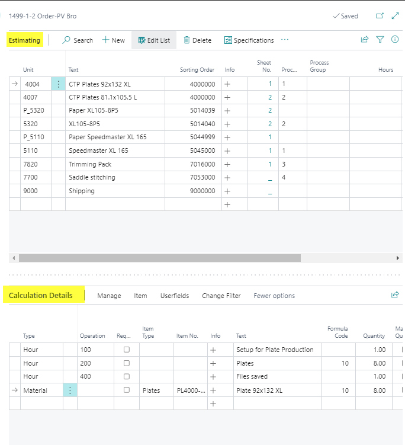
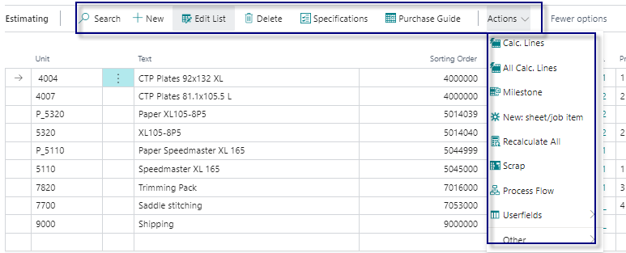
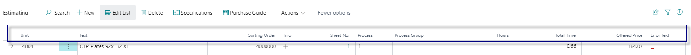
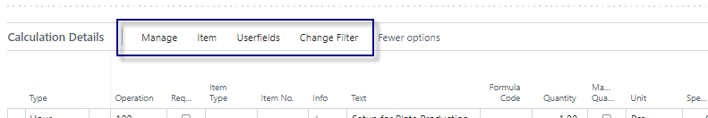
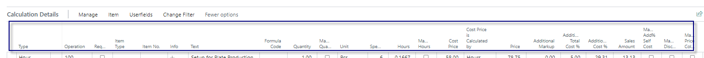

# Estimating Page

## Introduction 

Estimating in PrintVis is the process of calculating a quoted price for a product, such as a brochure. The estimation lays the groundwork for:
- Printing a quote
- Creating an order
- Planning production

The **Estimating page** pulls data from **Job Card** units/finishing types and allows users to add additional calculation units. Templates can also be set up to automate this process.

## Page 
The page is divided into two main sections:

- **Estimating**: Displays calculation units (machines/cost centers) in the order of production processes.
- **Calculation Details**: Provides details on operations and materials for each calculation unit.

## Estimating

### Menu

| Function           | Description                                                                                       |
|--------------------|---------------------------------------------------------------------------------------------------|
| Search             | Search for a calculation unit on the page.                                                         |
| New                | Add a new calculation unit to the workflow.                                                        |
| Edit List          | Edit the existing entries on the page.                                                             |
| Delete             | Delete the selected row.                                                                           |
| Specification      | Open the Specification page for technical details.                                                 |
| Purchase Guide     | Open the Purchase Guide for materials and subcontractors.                                          |
| Calc Lines         | View detailed calculation lines for the selected unit.                                             |
| Milestone          | Manage milestones for the case.                                                                    |
| New sheet/job item | Create a new Sheet/Web or Job item for the current unit.                                            |
| Recalculate All    | Recalculate all jobs/versions. Recommended after copying a case due to potential data changes.     |
| Recalculate Job    | Recalculate the current job. Less intensive than recalculating all jobs.                           |
| Scrap              | Open advanced technical specifications.                                                           |
| Process Flow       | Display the process flow for the case.                                                            |
| Userfields         | View/edit Job Userfields and Price Unit Userfields.                                                |
| Other              | Shorter access menu to frequently used functions.                                                |

### Table Fields

| Field           | Description                                                                                          |
|-----------------|------------------------------------------------------------------------------------------------------|
| Unit            | Displays the selected Calculation Unit code. Additional units can be added here.                      |
| Text            | Shows the name of the selected Calculation Unit, including any 'External Text'.                       |
| Sorting Order   | Displays the production order. Can be manually adjusted.                                              |
| Info            | Displays additional info or sum of underlying entries.                                                |
| Sheet No.       | Shows the sheet number of the job.                                                                    |
| Process         | Displays the Job Process Number.                                                                      |
| Process Group   | Shows the grouping of units and processes in the Process Flow.                                         |
| Hours           | Some units may require manual input to estimate correctly.                                             |
| Total Time      | Displays the calculated total time for the unit.                                                      |
| Offered Price   | Displays the calculated price. This field can sometimes be edited.                                     |
| Error Text      | Displays error messages when calculation lines have issues.                                            |

## Calculation Details

### Menu

| Function       | Description                                                                                           |
|----------------|-------------------------------------------------------------------------------------------------------|
| New Line       | Create a new calculation detail line.                                                                  |
| Delete Line    | Delete the selected calculation detail line.                                                           |
| Price List     | Open the price list for the current line.                                                              |
| Item Card      | Open the item card if the line is a material with an item number.                                       |
| Item Availability | Check the availability of items in the line.                                                       |
| Userfields     | Edit the user fields for the calculation detail.                                                       |
| Change Filter  | Set filters for viewing specific calculation details (e.g., quantity-based or additional lines).       |

### Table Fields

                  |
| Field                     | Description |
|---------------------------|------------|
| **Type**                  | Type indicates if the current line is an Operation (Hour) or an Item Line (Material). |
| **Operation**             | Displays the Operation No. Operations are defined to a Cost Center's Configuration. |
| **Request**               | The 'Request' field can be used to estimate different variations. For example, External Finishing can have 3 different sub-contractors that are offering their services and pricing for such. Another example could be for packaging, where 3 different Carton-sizes are presented, but only the most commonly used is normally estimated. Then the remaining 2 options could be marked as 'Request'. Once ticked, the 'Quantity' is not estimated from the attached Formula, and the line is disregarded when calculating the Offered Price. From the Calculation Unit Setup, certain lines can be marked as 'Request' by default to give the options, but initially Un-Estimated unless unchecked by the user on the Estimating page. |
| **Item Type**             | Shows the item type of the used item in this line. |
| **Item No.**              | Once a line is created with type 'Material', the Item No. field is open for input. Generally, the Item No. is given from the setup of the Calculation Unit, or from which paper is selected for a printing process, but it can be modified or filled in from the Detail Line. |
| **Info**                  | This is a calculated Flow Field. The field can show the sum of the underlying entries or simply display a text from another table that relates to this field. Order No. is displayed once the case reaches Order-status. |
| **Text**                  | Displays the Operation or Item Name/Description for whichever is selected to a line. |
| **Formula Code**          | Formula Code relates to the "Code" field in table "Formula Setup". Formulas are set up for the operations belonging to a Calculation Unit, to automatically estimate the correct quantity for each Detail Line. |
| **Quantity**              | Quantity is automatically filled in from either the Formula attached to the line or from a fixed quantity given for the line (e.g., Setup = 1 always). If no formula or fixed quantity exists, you may be required to fill in the quantity manually. If the estimated quantity is incorrect, you may also manually correct it. Be cautious when copying jobs with manual input, as the overwritten input stays as manually entered. |
| **Manual Quantity**       | When ticked, indicates that the Quantity has been entered manually. |
| **Unit**                  | Displays the 'Quantity Unit' for calculation. The options are: Pcs., 1000 pcs., Kg or lbs, Sqm or sq ft, Meter or ft, Liter or Gallon. For operations, the unit is given from the selected Formula. For Items, from the field 'PrintVis Calc. Unit'. The unit selected on the Item itself must match with the unit from the formula. |
| **Speed**                 | The Speed of an Operation is determined either by a fixed speed (qty per hour) or a calculated speed based on setup from an attached SpeedTable. The speed indicates how many of the current operation can be made per hour or calculates how many hours are needed in total for the operation. The speed can be adjusted manually, but such overwritten information is carried over if the job is copied. |
| **Hours**                 | Based on the quantity calculated for the Line and the speed indication given for the operation, the quantity of Hours will be filled in. Hours are displayed in 1/100 of an Hour, so 1.5 hours represents 1 hour and 30 minutes. |
| **Manual Hours**          | When ticked, indicates that the Hours have been entered manually. |
| **Cost Price**            | Displays the Cost Price per 'unit' (see 'Price calculated from'). For operations, generally, the Rates per Hour are given for the Cost Center's Configuration. The cost price for operations is a summarization of Direct Variable costs and Labor costs per Hour. For Items, either Item Cost Price or a Price List Lookup. |
| **Cost Price is Calculated by** | Enter the unit for the result of the formula. This field is crucial for the calculation and impacts cost/price calculations. The unit must match the unit on a price list or item. If PrintVis cannot calculate between the quantity (formula) and the item/price list unit, the calculated price will be zero. Available options: Hours, Pieces, 1000 pieces, Kilo or lbs, Sqm or sq ft, Meter or ft, Liters or Gallons, 100 kg or 100 lbs, 1000 kg or 1000 lbs, Total amount. |
| **Price**                 | Displays the Sales Price per 'unit' (see 'Price calculated from'). For operations, generally, the Rates per Hour are given for the Cost Center's Configuration. For Items, either Item Cost Price or a Price List. |
| **Additional Markup**     | Displays the Additional Markup (see article "Additional Rates Setup"). |
| **Additional Total Cost %** | Displays the percentage added to the Total Cost of the line. If an operation, the percentage is taken from the Rates per Hour for the selected Cost Center's Configuration. If it is a material Line, it is either taken from the Item Card directly or from the setup of Additional Rates Mark Up. |
| **Additional Cost %**     | Displays the percentage added to the Direct Cost of the line. If an operation, the percentage is taken from the Rates per Hour for the selected Cost Center's Configuration. If it is a material Line, it is either taken from the Item Card directly or from the setup of Additional Rates Overhead. |
| **Sales Amount**          | Displays the Summarized Sales Price for the given Quantity/Hours calculated for the Line. |
| **Manual Add% Self Cost** | When ticked, indicates that the Add% Self Cost has been entered manually. |
| **Manual Discount %**     | When ticked, indicates that the Discount % has been entered manually. |
| **Manual Price Column**   | When ticked, indicates that the Price Column has been entered manually. |
| **Manual Speed**          | When ticked, indicates that the Speed has been entered manually. |
| **Manual Cost**           | When ticked, indicates that the Cost has been entered manually. |
| **Manual Price**          | When ticked, indicates that the Price has been entered manually. |
| **Price calculated from** | Displays how the Price is estimated based on quantity, time, pricelists, etc. The options are: Hours, Pieces, 1000 pieces, Kilo or lbs, Sqm or sq ft, Meter or ft, Liters or Gallons, 100 kg or 100 lbs, 1000 kg or 1000 lbs, Total amount. Operations are generally priced by 'Hours' if nothing specific is set up. |

 Price Calculation Units
The following units are used to calculate cost and price:
- Hours
- Pieces
- Kilograms/Pounds
- Square meters/feet
- Meters/feet
- Liters/Gallons
