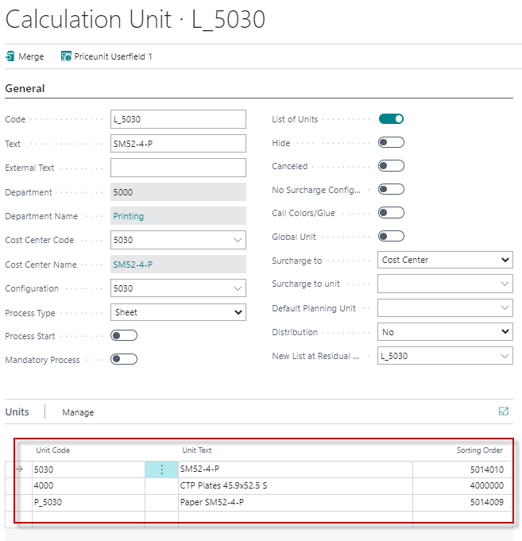

# Introduction to Estimation Setup

## Summary

The primary purpose of the Calculation Module is to ensure that a company can estimate with a complete, uniformly-constructed basis for giving quotes. At the same time, the work required in the calculation should be easier, faster, and more reliable than before, and it should also be easier to maintain the master data in the future.

The Calculation Module is constructed from two layers:

1. **Master Data**
2. **Calculation Units**

 Master Data

Well thought out and well-documented master data that accurately reflects the rules and prices that the company will use as a basis for calculation is the data foundation. With this, you ensure that your company has a complete basis for the pre-calculation necessary for giving quotes.

 Calculation Units

In the Calculation Units, you set up the functions that ensure that the basis for giving quotes is uniformly constructed — independent of the person who is doing the calculation. At the same time, it should be easier, faster, and more reliable than before to do a calculation.

It is important that you create a systematic, well-structured set of master data. You need to work through it very carefully, and only then will you be sure that the calculation is done as you intended. It will also make it easy to maintain the master data in the future. The result of your efforts at this early stage will be simplified and efficient work-processes later, which will enable you to focus on the quality of the calculation.

### The Function of the Calculation Units

Calculation Units are used with regard to estimating time- and/or item consumption. Calculation units can be compared to a series of little spreadsheets, where each calculates a limited part of a given task, based on master data. How calculation data are printed on the job ticket is also controlled through the calculation units.

In other words, the function of the calculation units is to control how preselected master data is:

- **Calculated together**
- **Printed on the job ticket**

If the master data is well prepared with regard to how operations are to be calculated, then the biggest challenge while working with Calculation Units lies in composing and presenting data so that the actual calculation work is as user-friendly as possible.

A high degree of user-friendliness means that the user, doing the daily calculation work, can quickly and surely select and combine exactly the right calculation units that are relevant for the job at hand. This makes calculation work easier and saves time with each and every one.

### Master Data and Calculation Units are Related

In order to estimate time consumption and/or item consumption, you need to connect every calculation unit to the cost center, the configuration, and the selected operations (time). Then you have to connect possible items from the items table — and only then are you able to estimate.

Via Calculation Units, you filter, select, and combine elements from the enormous amount of master data into smaller, more manageable portions. Each of these then calculates master data according to the setup you have decided upon.

### Using the Calculation Unit

The user estimates a job in the system by selecting the calculation units that, together, contain all the calculation lines that describe and calculate the costs that the company will incur, internally and externally, in connection with the production of the job.

Where the lines in the calculation unit do not calculate the use of time or consumables usage, then the user needs to manually enter the necessary information into the pre-calculation.

When a task has been calculated, there are a number of possibilities for reusing and modifying the calculation in connection with the same, or other customers.

## Setting up Calculation Units

The basics of a calculation are laid when the master data is constructed. This is done on the basis of the rules for the calculation system that have been decided upon. This set of rules is transformed and built into the new system’s master data. Afterwards, you use the calculation units to select the degree of detail that you need. The individual company naturally decides upon the degree of detail.

Therefore, working with the construction of calculation units is largely a creative process. You need to be sure that a calculation has the correct degree of detail; at the same time, you need to focus on ensuring that when the end-user is working with a calculation, it is manageable, fast, and not prone to error.

As a consequence of this, there are no ready-made solutions in the delivered system. All the calculation units in the supplied material are meant as examples of how, in a given situation, one might come to a given decision—but they are not answers to all your problems!

### The Way Calculation Units are Set Up

The work process is basically figuring out which calculation units you need in order to estimate functions of a given Cost Center as flexibly and transparently as possible.

The calculation units also need to be designed in such a way that the cost centers you later (in post-calculation) want to see consumption data for, are displayed. Then you create and test the calculation unit.

It is a good idea to break the process up into two areas of focus:

1. What must the calculation unit calculate?
2. Which elements of the calculation unit must be displayed—and where?

For both focus areas, you can take the following approach:

1. Define what the calculation unit has to calculate (or display or print).
2. Set up the relevant parts of the calculation unit.
3. Test your setup of the calculation unit.
4. Correct any errors and test again.

When you have to decide which calculation units you need, you should start off by trying to imagine how the workflow in the company’s cost centers is in practice, and which material is used.

### An Example of Setting up Calculation Units

A printing works has a CTP machine for the production of plates. The plates are made in two different sizes: 52 x 74 and 72 x 104 (cm). The job is either based on an open document from the customer (that needs treatment on a computer first) or directly, in the form of a finished PDF document.

The company wants to separate output and plates from preparation and imposition etc. Therefore, the following cost centers, operations, and items have been created as master data for the CTP area:

Master Data

| **Category**         | **Details**                                |
|----------------------|--------------------------------------------|
| **CTP TIME (Place/Person)** | **Operations:**                           |
|                      | Preparation                                |
|                      | Imposition                                 |
|                      | Terminal time                              |
|                      | Control time                               |
|                      | Archiving                                  |
| **CTP (Machine)**    | **Operations:**                           |
|                      | CTP output                                 |
| **PLOT (Place/Person)** | **Operation:**                            |
|                      | Plot                                       |
| **Items:**           | Color plot                                 |
|                      | CTP plates 52x74                           |
|                      | CTP plates 72x104                          |

### Define what the calculation unit has to calculate.

Based on the master data above, we must now try to make a number of calculation units that calculate according to the rules we have defined – and at the same time are transparent, fast, and safe in use.

The company wants to calculate CTP-TIME and CTP (Machine) independently. This means that we must create at least one calculation unit for each of these.

CTP TIME

CTP TIME varies depending upon whether we are using an open document that needs terminal time, or a PDF document that can be used directly. So we need to create two CTP-TIME calculation units, one for each document type.

Time and material needed for the Color plot is added to each CTP-TIME calculation unit to ensure that it is included in the calculation.

CTP Machine

The total price for CTP output and plates is defined in a price list that is differentiated according to the number of plates used and the quantity needed.

You could choose to use one calculation unit that you could use for all CTP plates, or you could use one calculation unit for each plate format. You might choose the latter if you take the need for statistics into account.

 Calculation Units

The company might therefore create and test the following calculation units within the area of CTP:

- CTP TIME (open document): (planning, output, terminal time etc., Plot time, and Color plot)
- **CTP TIME PDF:** (planning, output, control time etc., Plot time, and Color plot)
- **CTP, 52 x 74:** (CTP output and plates)
- **CTP, 72 x 104:** (CTP output and plates)

Based on order requirements, an end-user will be able to choose, quickly and easily, exactly the combination of CTP-time and output units that is needed.

### Setting up Relevant Parts of a Calculation Unit

Below is an example of the filing card for Calculation Units:

| **Field**              | **Comments**                                                                                                                                                               |
|------------------------|---------------------------------------------------------------------------------------------------------------------------------------------------------------------------|
| **Code**               | Code for the calculation unit. Try to keep it short.                                                                                                                       |
| **Text**               | A more descriptive text that explains more about the unit for users.                                                                                                      |
| **Cost Center**        | Connect a calculation unit to a Cost Center. When you have connected a cost center, the program will fill in the department field itself. If the cost centre has a type machine, the program will also fill in the fields Process type and Process start. |
| **Configuration**      | Connect the configuration that the calculation unit has to calculate.                                                                                                     |
| **Configuration type** | The program indicates automatically which type of configuration has been chosen. The configuration type can be either default basic, or additional.                        |
| **Process type**       | The cost center’s type decides the process type. The program automatically finds the process type when the cost center of the machine type is connected to the calculation unit. |
| **Process start**      | The field is checked automatically if the type is machine.                                                                                                                |
| **Forced process**     | For more information about the field, see the section "Processes."                                                                                                         |
| **List of Unit**       | Check this field if the calculation unit is to be a List of Unit.                                                                                                         |
| **Hidden**             | Check this field if the calculation unit is not to be shown on the list where calculation units are selected for calculation.                                               |
| **Cancelled**          | Check this field if the calculation unit is no longer to be used.                                                                                                        |

### Calculation Lines

A calculation line can calculate either an operation (time usage) or an item (material usage).

If the master data is well-conceived with regard to how operations and items should be calculated, and you have decided upon which operations and items must be calculated, then you can quickly create the unit’s calculation lines.

For each calculation line you create, you need to consider the following fields:

| **Field**              | **Comments**                                                                                                                                                               |
|------------------------|---------------------------------------------------------------------------------------------------------------------------------------------------------------------------|
| **Type**               | Indicate whether the line applies to an operation or an item.                                                                                                             |
| **Cost Center**        | All operations and items need to be connected to a Cost Center.                                                                                                           |
| **Configuration**      | All operations and items need to be connected to a configuration of the selected cost center.                                                                             |
| **Operation**          | All operations need to be connected to an operation in the selected configuration.                                                                                         |
| **Request**            | Tick the field if the line must not be used in the calculation.                                                                                                            |
| **Sub-contracting**    | This field is updated automatically with the value from the cost center.                                                                                                 |
| **Item type**          | If the line is an item, enter the item type. If the line is an operation, leave this field blank.                                                                          |
| **Item number**        | Connect to the item number to be used in the calculation.                                                                                                                  |
| **Text**               | The field is automatically updated from the corresponding field on either the operation or item card. Can be freely changed.                                              |
| **Formula code**       | Attach a formula to this field if the calculation (dependent upon the current task) can and must use a specific value here.                                               |
| **Quantity**           | The field is filled in automatically from the Cost Center.                                                                                                                |
| **Speed**              | The field is filled in automatically from the Cost Center.                                                                                                                |
| **Speed table**        | The field is filled in automatically from the Cost Center.                                                                                                                |
| **Hours**              | The field is filled in automatically from the Cost Center.                                                                                                                |
| **Included if reprint**| The field is filled in automatically from the Cost Center.                                                                                                                |
| **Price list code**    | The field is filled in automatically from the cost center or item card.                                                                                                  |
| **Price list lookup**  | You can choose if the calculation is to use both cost and sales price, only sales price, or only cost price.                                                             |

### Processes

Processes are three types of index cards that can be created relative to a job or calculation.

The system is programmed to automatically calculate and present values in some of the fields on the index card and simultaneously transfer data from the job card to other fields.

You can see an example below of information from the printing process and a description of the sheet on the job card.

The data is used in two ways:

1. In the calculation where you can pick up the value of a field, using diverse formulas, and have it used when the calculation line is calculated.
2. In the collective description of the job, e.g., on the job ticket.

#### Process Start

If you bind cost centers of the machine types Print machine, Finishing, and Shipment to a calculation unit, it will be marked as process start.

The type of cost center decides:

- Which type of process it is.
- Which calculation rules are to be applied, e.g., max. formats.
- Which formulas should be used.
- That the field process start is automatically checked.
- **It can be seen that the cost center attached to the calculation unit is a defining factor.**

If a calculation unit is not marked as process start automatically from the cost center, but you want it to start a new process, you can tick the field **Process Start** on the General tab of the calculation unit.

#### Example

If you have a calculation unit that is only used for plate production, it will typically have a calculation line containing formula code 10: Number of Plates.

This calculation unit needs a process, and the idea is that it be attached to a print process that has already been started in the cost center Print Machine.

If you now were to manually tick **Process Start**, then a new process for the cost center Plate Production will be started instead. This will not calculate any plate consumption, and the correct number of plates will not be calculated. The job ticket will be completely wrong too, of course, as there are too many processes.

If the field **Process start** is not ticked, then the calculation unit will just attach itself to an existing process.

#### Forced Process

There are a few occasions where we need to have a calculation unit start a process—even if there is not a single line in the calculation unit that needs the data that the process will calculate.

You can need this when there is:

- A desire for more information on the job ticket.
- To create an extra scrap consumption so there is extra paper usage on some of the other calculation units.

 Example 1

A calculation of a digital print will typically be based on the quantity alone, and this will not be picked up from a process, but from a job. However, you would still like to have a printing process on the job ticket.

 Example 2

Calculations for external book covers are often based upon quantity. But maybe you would like to cater for scrap at the bindery while calculating the printing process. In this case, you need to assign a finishing process.

In these cases, you can combine a tick on **Process Start** with a tick on **Forced Process** in the calculation unit. This forces the creation of a process, regardless of whether any calculation lines need one.

#### Application

When you perform a calculation with the calculation unit, some of the formulas connected to the calculation lines read data from the jobs sheet processor and bind the relevant processes to the calculation unit. For example:
- The number of print plates
- Print quantity
- Number of scrap sheets, etc.

### Test Your Calculation Unit Setup

The purpose of a test is to find out if the calculation unit, in isolation, works as you expect, as defined in the rules set by the company.

To do a thorough test, you need to be able to use the program to do the following:
- Create a query
- Describe jobs with regard to sheets, print machine, pieces, colors, etc.
- Check the technical specifications or make changes in the different sheets in the job regarding paper, format, printing method, pieces, imposition type, etc.
- Add calculation units to the calculation window and check the calculations.

These techniques are covered in depth in the course "Calculation – Application," but in the appendix to this document, the four windows you use for testing are covered very briefly.

Correct possible errors and test again.

If you discover an error in your calculation unit, you will probably correct it immediately. Remember to test it again!

### Null Price List – What Is It and How Can You Use It?

A **null-price list** is used to calculate a sales price of £0.00 (zero).

A null price list can be useful when creating calculation units. Below is an example of when you might need it and how to use it:

#### Example

In the example with CTP calculation units, we saw that the operation **Output** and the item **plates** were created as calculation lines in the same calculation unit. Output is picked up from the Cost Centre CTP, and its cost price, self-cost, and sales price are calculated from the Cost Centre’s Hour Rate. In the price list attached to **Plates**, the sales price ("Price") contains output time and plates.

In order to avoid changing the price list for output, there is a need for some technique where the calculation of the sales price for output results in zero, while the cost price is still calculated on the basis of the Hour Rate of the operation output.

 Solution

For use in this and similar situations, you can create a very simple price list with one line that, for **From Quantity 0**, has a sales price of £0.00 (zero).

Then, when you have connected the calculation line to the price list (**Price List Code**), you must select **Prices in Price List Lookup**.

Now, the (sales) price will be pulled from the price list, and the cost and self-cost will be derived from the Hour Rate.

### Setting up a Calculation Unit with Reference to Display and Printout

You are able to control to which degree a given calculation unit or calculation line should be shown on selected screens and/or included in specified printouts. This is done via the **Display** and **Print Control** tabs and a couple of fields on the calculation line.

 Proceed like this:
1. Define how the calculation unit is to be displayed and shown in printouts.
2. Set up the display and print control parameters in the calculation unit.
3. Test the new setup of the calculation unit.

Introductory Remarks to the Field **Order**
This field gives you the possibility of deciding in which order your calculation units are to be shown in the list of units and in the window you use when calculating the job.

We recommend that you carefully consider a numbering system that consists of sufficiently large intervals, which allow you to edit the order and perhaps insert new units between existing ones. Use an order that mirrors the course of events in the company's production.

A system like the above makes it easier for users to have a general view of and to negotiate the calculation units.

In the following, we will cover the function of the tabs **Display** and **Print Control** with regard to setting up, displaying, and printing calculation units.

 Display Tab

| Field                | Comment                                                                                                                                         |
|----------------------|-------------------------------------------------------------------------------------------------------------------------------------------------|
| **Hide during calculation** | Check this field if the calculation unit should not be shown in the calculation window. You will, however, always be able to view the calculation lines to see how the total price is arrived at. |
| **Order**            | This field offers you the possibility of deciding in which order your calculation units are to be shown in the list of units and in the window you use when calculating the job. Enter a number. |
| **Show Calculation Lines** | Here you indicate whether the individual calculation lines are to be shown, line by line, during every calculation. |

 Print Control Tab

| Field                         | Comment                                                                                      |
|-------------------------------|----------------------------------------------------------------------------------------------|
| **Show time on the job ticket** | Check this field if you would like the calculated time from the calculation line shown on the job ticket. However, only times from lines with the field **Show on job ticket** checked will be shown. |
| **Show quantity on the job ticket** | Check this field if you would like the calculated quantity from the calculation line shown on the job ticket. However, only times from lines with the field **Show on job ticket** checked will be shown. |
| **Show on the job ticket**     | Used with bespoke printouts.                                                                  |
| **Show on the quote**          | Used with bespoke printouts.                                                                  |
| **Itemize quote**              | Used with bespoke printouts.                                                                  |
| **Show on Purchase Order**     | Used with bespoke printouts.                                                                  |

 Calculation Lines

| Field                         | Comment                                                                                      |
|-------------------------------|----------------------------------------------------------------------------------------------|
| **Show on the job ticket**     | Check this field if a calculated time and/or quantity can be shown on the job ticket. You have to check **Show time on the job ticket** and/or **Show quantity on the job ticket** (see above) to actually have the data on the printout. |
| **Show on the quote**          | Used with bespoke printouts.                                                                  |
| **Show on Purchase Order**     | Used with bespoke printouts.                                                                  |

### Setting up a List of Unit

A **List of Unit** is the expression used in PrintVis for special calculation units that function as umbrellas for other calculation units that are always chosen together for a specific job. Using **List of Unit** simplifies the choice of calculation units when performing a calculation. Obviously, all the creation units that are part of a **List of Unit** have to be created first.

The most used **List of Unit** are used to select the printing machine and, as a minimum, consist of one calculation unit for the machine and one for the paper form that is associated with the machine.

The index card of a **List of Unit** resembles pretty much other calculation units. The card part, however, has a new field, **New List of Unit at Residual**, and the table part is limited to your being able to add the calculation units that make up the **List of Unit**.

As a **List of Unit** exists solely as an umbrella for calculation units, the amount of data that can be entered is limited. For the same reason, we recommend that you do not give your **List of Unit** a running number, as the calculation units are already numbered. All **List of Unit** will then receive a number null (0) and will be shown together at the top of lists of calculation units.

On the next page, you will find a description of the fields you need to fill in when creating a **List of Unit**.

 General Tab

| Field                      | Comment                                                                                           |
|----------------------------|---------------------------------------------------------------------------------------------------|
| **Code**                   | Code for the **List of Unit**. Try to keep it short.                                              |
| **Text**                   | A more descriptive text that explains more about the unit for users.                             |
| **List of Unit**           | Check this field if the calculation unit is to be a **List of Unit**.                             |
| **New LoU at Residual**    | If residual has to be automatically created on the job card in order to figure on another **List of Unit**/machine, then you need to attach it to this field. |

Unit Lines

On the unit lines, you must attach the calculation units that have to be in the **List of Unit**.

| Field               | Comment                                                                                       |
|---------------------|-----------------------------------------------------------------------------------------------|
| **Unit**            | Via a look-up in the list of calculation units, you can attach the calculation unit that has to be part of the **List of Unit**. |
| **Unit text**       | Is filled in automatically with the value from the text field on the **General tab** of the selected calculation unit. |
| **Order**           | Is filled in automatically with the value from the **Order** field on the **Show** tab of the selected calculation unit. |

### Important:
You should always put the printing machine as the first in the list of units. This means that you should put the price units that have a process start first and then all price units that do not have a process start, but are related to this process.

 Setup Example

The column "Sorting Order" regulates the order in the Estimation.

 Wrong Setup:

## Summary of Rules for Processes, Process Start, and Process Mandatory

### List of Units
  - Process start or Process mandatory should never be set on a PrintVis **List of Units** (Fields must be Unchecked/False).
  - **Why?** Because a list is to pull calculation units into the estimate but they never calculate, so they should never create a process.
  - If a **List of Units** contains a press, plates, and/or finishing machines, make sure the press is the first line in the **List of Units**.

Example:

 
### Calculation Unit
- Prepress and all cost centers that are not a machine and are not producing printed products.  
  - **Process Start** = Unchecked/False  
  - **Process Mandatory** = Unchecked/False  
  
If a plate process is not calculating (e.g., formulas 8, 10, 18, 19) but is calculating on the press, the plate process is often set to process start. This will provoke a different process number than the press, meaning the plate process cannot read from the process of the press what plates are required.

**Presses, Finishing, Shipment Units**  
- **Process Start** = Checked/True  
- **Process Mandatory** = Optional  

PrintVis creates a process anyway if a formula calculates scrap.

Platesetter :

Press:

Finishing :

---

## Appendix 1 - Test of Calculation Units

###Orders

You need to create an order on a Case Card before you can test your calculation unit in a calculation and on a job ticket. On the card, you must enter customer number and maybe Product Group and Job Name too. It can be a good idea to use the **Job Name** as a description of what you are testing. Then you can also give **Status Code** the status **O-CONFIRM**, so the job is defined as an order.

None of the other fields on the card are relevant to the test of a calculation. On the job line, you need to enter data into the fields:
- **Quantity**
- **Pages**
- **Format**
- **Color front**
- **Color back**
- **Paper**

 Test of Calculation Units

From the **Case Card**, you can, via the **Estimation** button, come to the window **Estimation 2**, where you can test your calculation units.

 Test of List of Unit

From the **Case Card**, you can also, via the **Job Card** button, come to the window **Job** where you can describe the job. It is in this window you can attach a **List of Unit** to your job.

### Calculation

The window **Estimation** consists, broadly speaking, of two tables:
- At the top, you can enter a calculation unit on each line.
- At the bottom, you can see the calculation lines that the highlighted calculation unit contains.

After supplying a reference to a calculation unit (via the **Unit** field), you can check and evaluate the calculation lines it contains. You can, of course, change the lines in any way you wish.

### Correct Possible Errors and Test Again

When you have changed something in a calculation unit, you must return to the window **Estimation** and supply the name of the calculation unit again in order to test your changes.

The easiest way to do this is:
1. Place the cursor in the **Unit** field of the calculation unit you will test again.
2. Hit the **F2** key and then **ENTER** to update the calculation unit with your changes.

You will now be able to check the changes in the bottom of the **Estimation** window.

### The Job

Most of the information relevant for a job is transferred from the **Case Card** to the **Job Card**. Click on the button **Create Sheet** under the table lines to the right and middle area of the window. The program will transfer all the information about the sheet from the **Case Card’s** job line.

In the field **List of Units**, you can connect the **List of Unit** you will use in the print process. The calculation units that are contained in the **List of Unit** will now have been transferred to the **Estimation** window and calculated.

The necessary data about the job have now been entered, and a test of a calculation can be performed. If you would like to take a look at technical details concerning the job, you can, via a click on the button **Specifications**, come to the window **Specifications**, where you can check the details.

### Specifications

Here you can check the technical specifications of the calculation. You can also make changes.

You can make changes in the individual sheets in the job concerning paper, format, and printing method on the left part of the window. You can make changes concerning color, format, and output, etc., in the middle area of the window. In the right part of the window, you can see how the imposition of each subject looks on the sheet.

Please note that the program still has not calculated scrap. **Scrap** is calculated only when the printing machine has been selected.

As it has not yet been chosen, there is naturally no scrap.

Via the **Advanced** button, you can obtain detailed information concerning **Sheet**, **Subjects**, and **Processes**. These are entered into the system when the printing process is calculated and therefore only then become available.

Close the **Technical Specifications** window when you are satisfied with the specifications. Afterwards, the program will return to the **Job Card**. From the **Job Card**, you can click on the **Estimation** button to come to the **Estimation** window where you can test the calculation unit.

