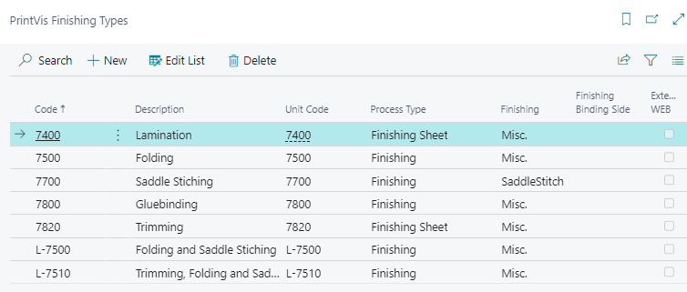
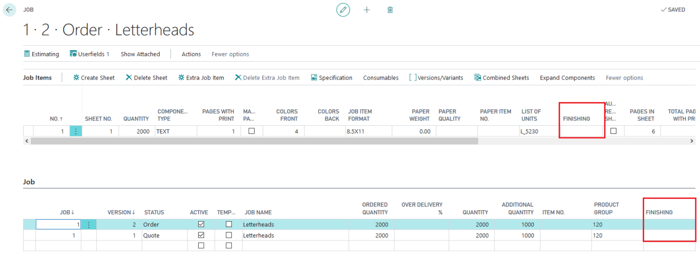
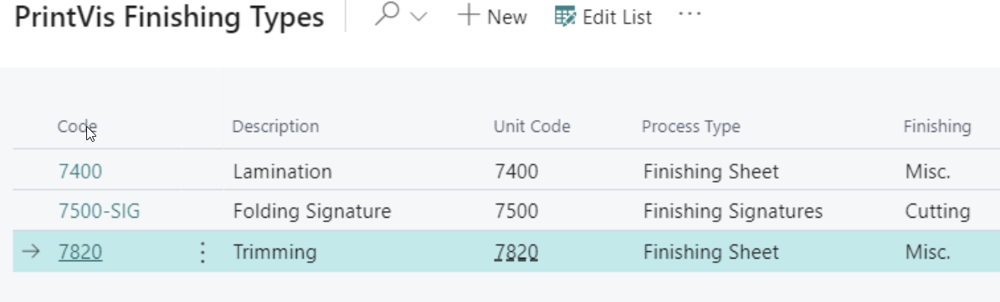
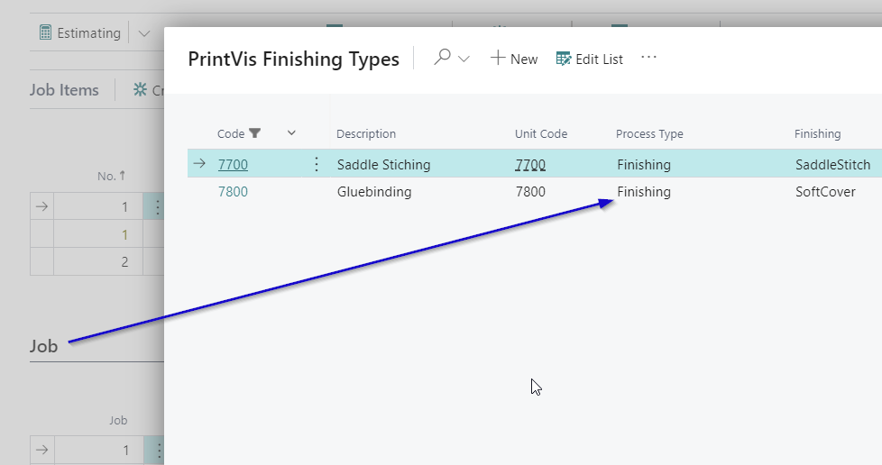

# Finishing Types

## Summary

Finishing or postpress types streamline access to predefined "List of Calculation Units" related to finishing. The setup of Finishing Types is divided into two fields: one for job-related finishing and one for sheet-related finishing. This separation simplifies the selection process compared to earlier versions of PrintVis, which only had one finishing-type field.

 **Finishing Types**

Finishing Types can be found by searching: `PrintVis Finishing Types`

1. **Finishing Job Field:**
   - Related to the entire job.
   - Allows for job-level finishing units.

2. **Finishing Sheet Field:**
   - Related to individual sheets within the job.
   - Provides access to sheet-specific finishing units.

Setup Example

- **Finishing Job:** Filters for processes that apply to the entire job.
- **Finishing Sheet:** Filters for processes specific to sheets.

**Example:**
- **Processes on Job Item Lookup:** Filtered by "Finishing Sheet" and "Finishing Signature."
- **Processes Type on Job Lookup:** Filtered by "Finishing" only, focusing on job-level processes not tied to specific sheets.

Applying Filters

Filters can be applied based on product groups to narrow down the available finishing types for selection.

