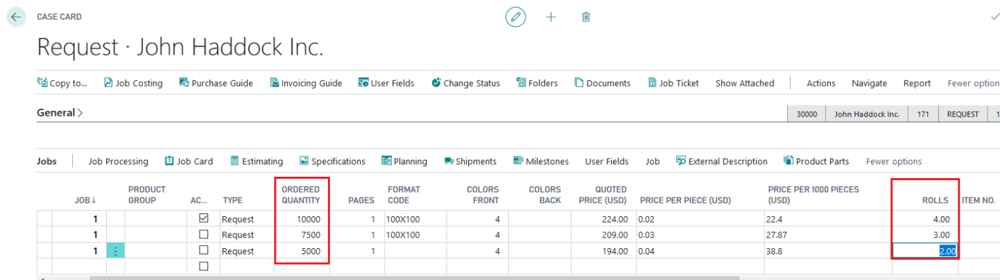
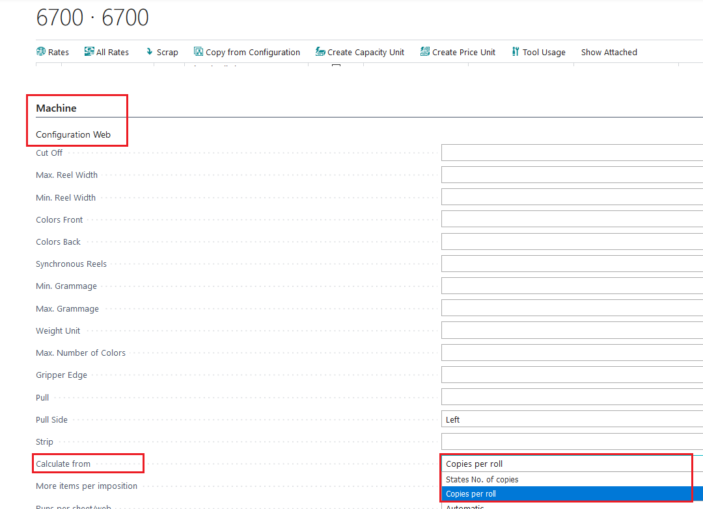
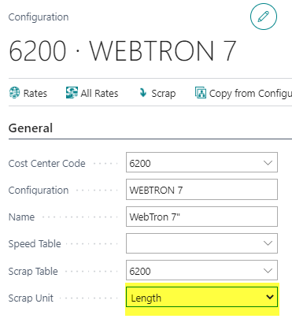

# Flexo Print Setup, Copies per roll, Scrap

## Copies per Roll

The concept of **"Copies per Roll"** is used to estimate the total number of good prints from printing entire rolls. This calculation considers the roll length and imposition. The number of good prints is reduced by the scrap from each process. For example, if an extra process like a slitter is used, which generates additional scrap, the available quantity produced from a roll is further reduced by this scrap.

 Formula

The formula for calculating the quantity is:

Quantity = (No. of rotations (Reel length/cut off) X No. of up) - Scrap.

- **Number of Rotations**: Calculated as the reel length divided by the cut-off length.
- **Number of Up**: Refers to the number of copies printed per roll.
- **Scrap**: The amount of material wasted during the process.

Instead of manually entering the quantity, simply enter the number of raw material rolls, and PrintVis will calculate the quantity for you.

 Setup

To configure this in PrintVis:

1. Go to the press configuration.
2. Set the field **"Calculate from"** to **"Copies per roll"**.

## Scrap

Scrap values should be understood in feet rather than rotations to ensure accurate calculations of the quantity of good prints.

