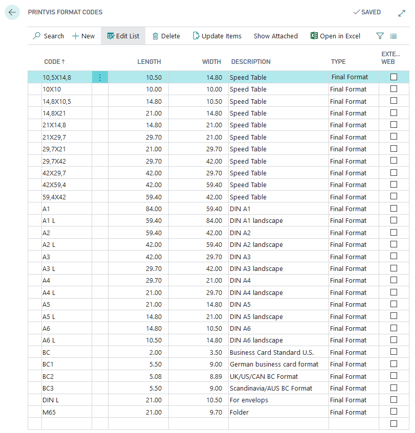
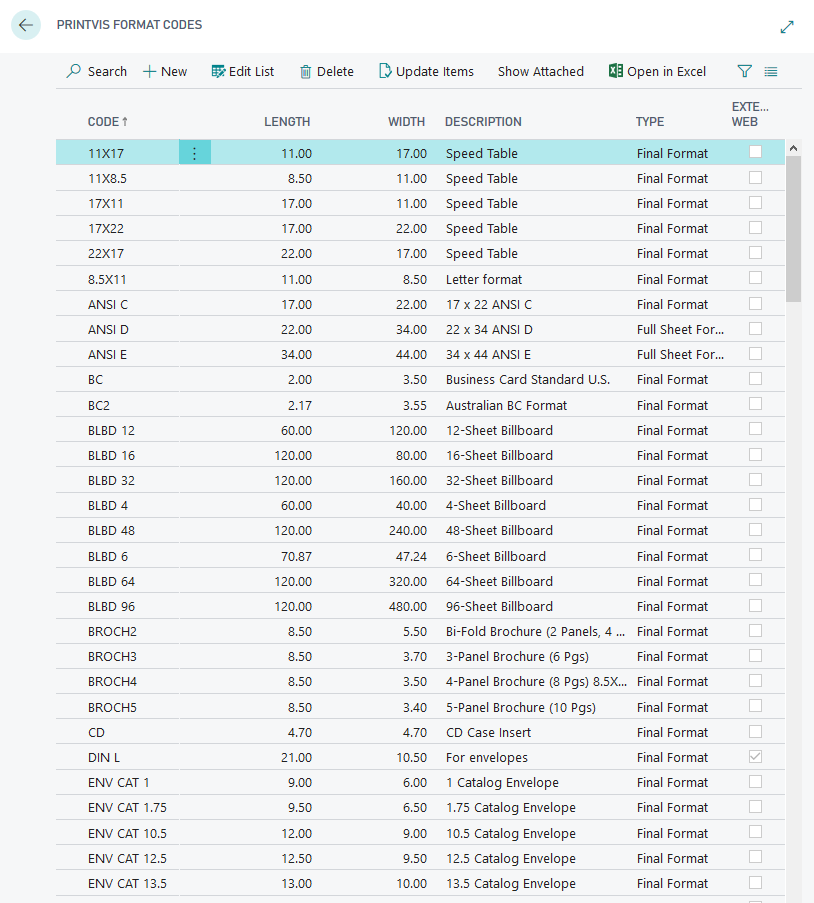
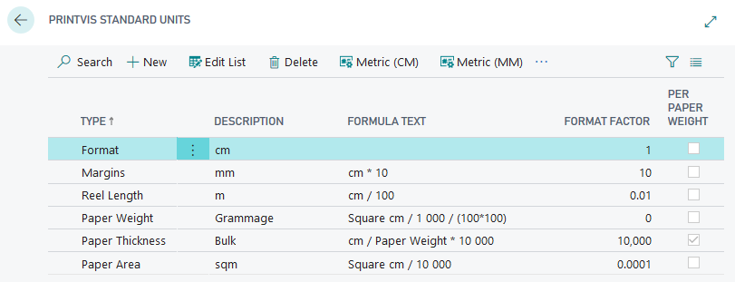
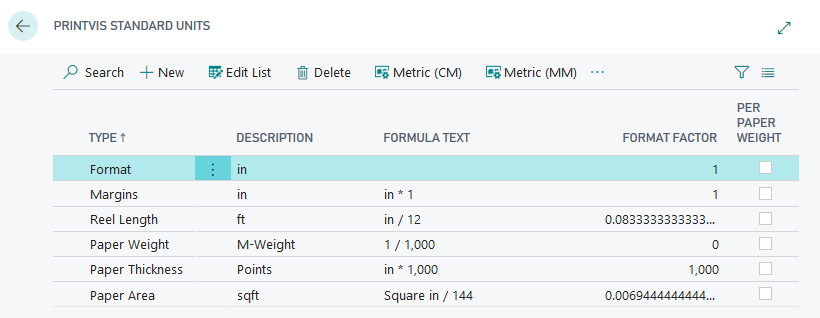

# Format Codes Setup

## Summary

Format codes are essential for various calculations and parameters in PrintVis. They are used for imposition calculations, speed tables, price lists, scrap tables, and more. The visual representation on the right-hand side of the setup window helps verify the correct format dimensions.

## Format Code Setup

- Search for "PrintVis Format Codes" to access the setup.

Format Code Setup

| **Field**       | **Description**                                                                                                                                                                                                                 |
|------------------|-----------------------------------------------------------------------------------------------------------------------------------------------------------------------------------------|
| **Code**         | Identification field for the Format Code. Maximum length: 20 characters.                                                                                                                |
| **Depth**        | Represents the format depth.                                                                                                                                                             |
| **Width**        | Represents the format width.                                                                                                                                                             |
| **Description**  | A meaningful description to help the user understand the purpose or context of the format.                                                                                              |
| **Type**         | Defines the type of format being used. Available options:                                                                                                                                |
|                  | - **Miscellaneous:** Used for unspecified formats across various contexts.                                                                                                              |
|                  | - **Final Format:** Describes the job item format in production, forming the basis of sheet imposition in graphic production (most commonly used).                                       |
|                  | - **Printed Sheet:** Used for machines requiring special measurements for printed sheets. The system typically calculates this format based on the paper sheet format and machine setup. |
|                  | - **Full Sheet Format:** Used for machines requiring specific measurements for both paper and printed sheets. Reads the paper sheet format from the case card.                           |
|                  | - **Plates:** Used for plates with special formats.                                                                                                                                     |
|                  | - **Film:** Used for film with special formats.                                                                                                                                         |
### PrintVis Standard Units

- The units used are from the PrintVis Standard Units list.

- Note: Once set up, changes to the company setup are not possible. Reconfiguration requires setting up from scratch.

