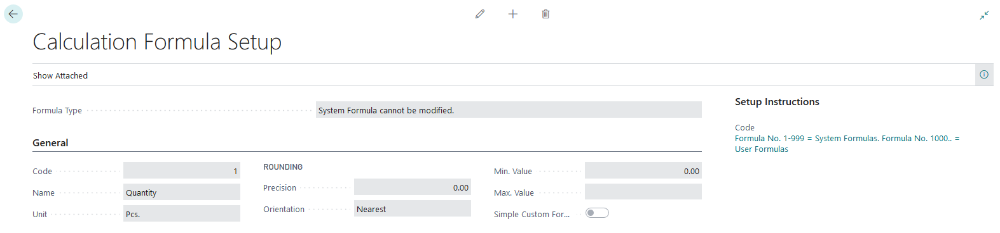
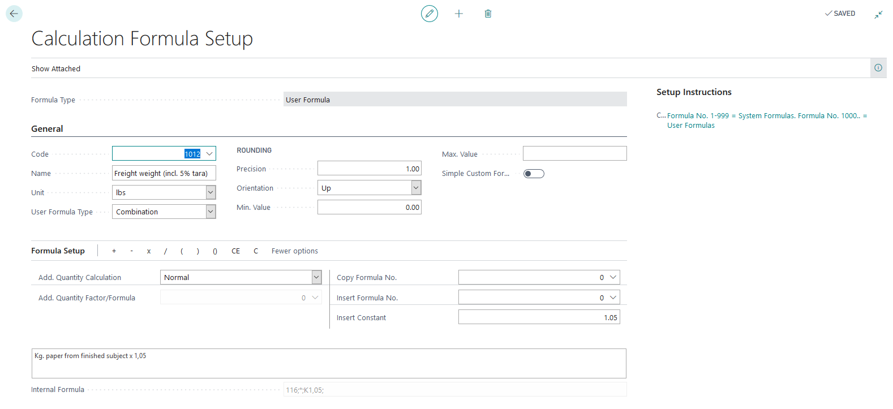
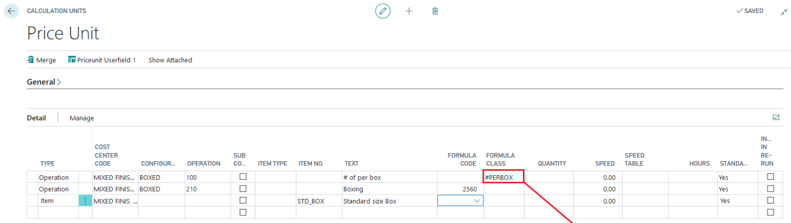
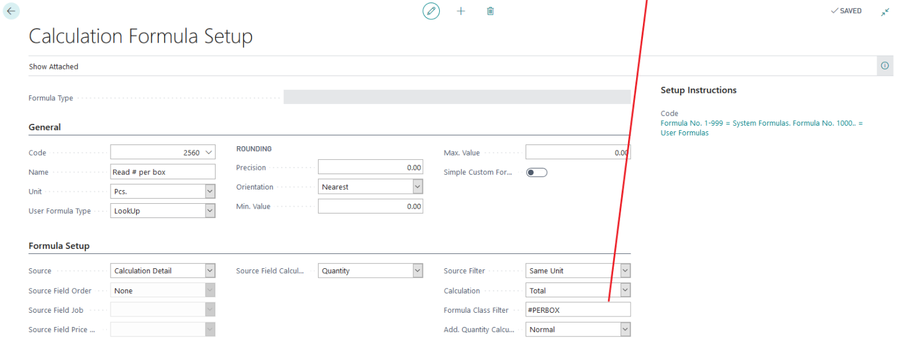
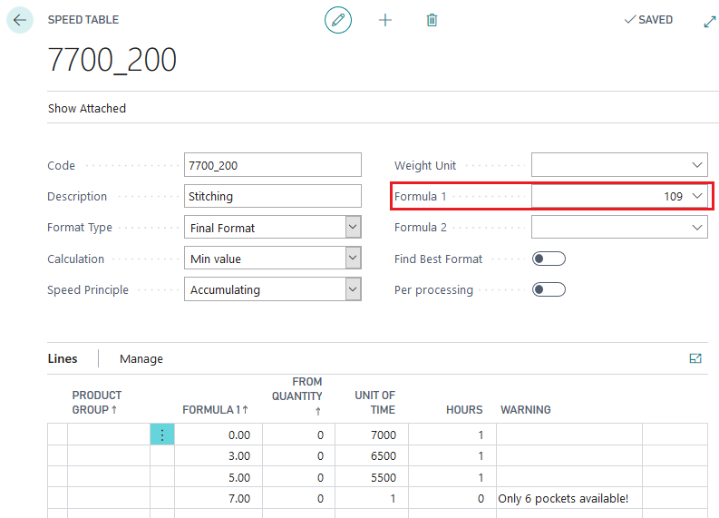
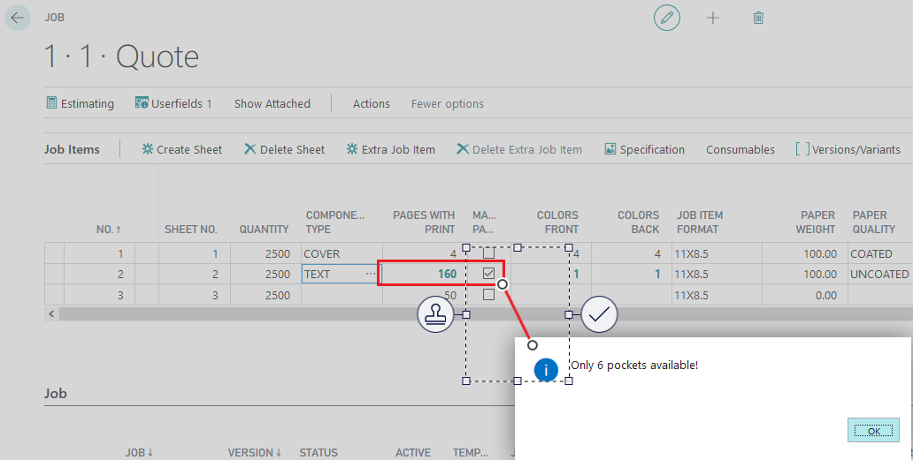
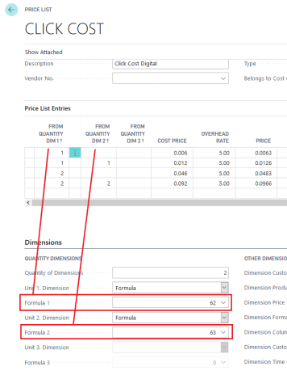
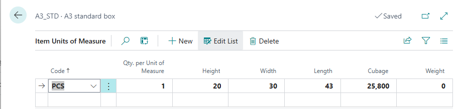
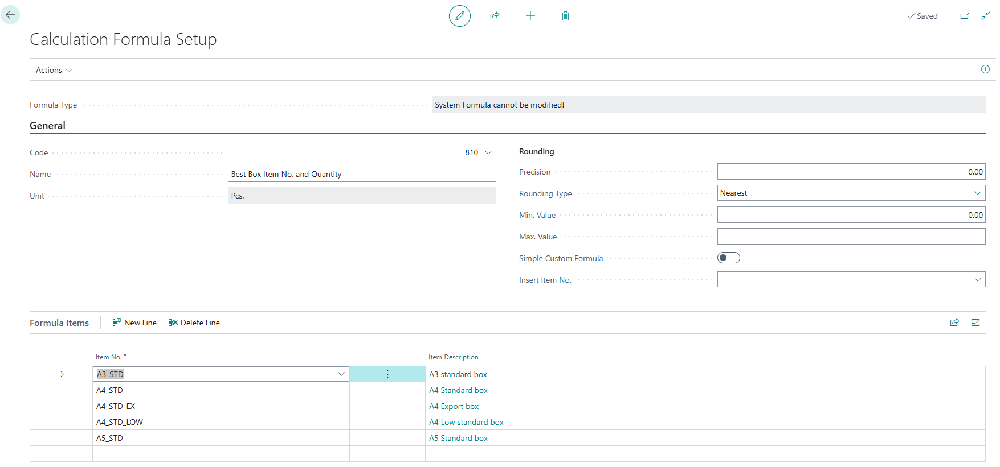
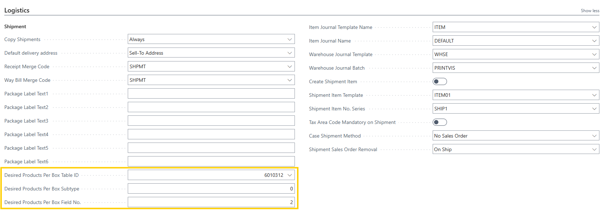

# Calculation Formula setup

PrintVis Calculation Formulas are powerful tools for calculating quantities and numbers from various values, which can be used across different areas in PrintVis. Learning how to use and set up these formulas can significantly enhance your ability to manage calculations within the system.

## Formula Types

- **System Formulas (1-999)**: These are predefined formulas that cannot be edited.
- **Custom Formulas (1000 and above)**: These formulas can be customized or created from scratch. To create a new formula, use a number >= 1000.

To restore missing system formulas (1-999), use the **Rebuild All System Formulas** button in the menu.

## Where to Use Formulas

Formulas can be used in several places, including:

- **Operations and Material Lines** in the setup of Calculation Units and Cost Center Configurations.
- **FastTab "Calculation"** on Cost Center Configurations.
- **Speed Tables**
- **Scrap Tables**
- **Price Lists**

## Formula Numbers / Codes

- **Formula 1**: System formula providing the quantity from the job.

- **Formula 1012**: Custom formula used to calculate product weight by adding 5% to the paper weight.

## Setup Fields

| **Field**                    | **Description**                                                                                                                                                                                                                                                                                                                                                                         |
|------------------------------|-----------------------------------------------------------------------------------------------------------------------------------------------------------------------------------------------------------------------------------------------------------------------------------------------------------------------------------------------------------------------------------------|
| Code                         | Code is a system primary key for the Formula Setup. 1-999 = System Formulas (cannot be edited) 1000..= Custom formulas                                                                                                                                                                                                                                                             |
| Name                         | Enter a Name/Description for the formula. Ensure the name clearly describes the formula's function for easy identification.                                                                                                                                                                                                                                                          |
| Precision                    | Enter the precision for the calculated value. Example: The calculated value is: 12.12345 Options -> Results: 1.00 -> 12.00 0.10 -> 12.10 0.01 -> 12.12 0.00 -> 12.12345                                                                                                                                                                                                |
| Formula Internal             | Stores the formula in a system-readable form. Example (Combination type): Internal Formula: `K1;+;(;22300;/;K0,5;);*;K5;` Formula in words: Constant Value 1 + (Value of Formula 22300 / Constant Value 0.5) x Constant Value 5 Example (non-Combination): Internal Formula: `22300;` Formula in words: This value is just the formula number. |
| Formula                      | Displays the formula in a readable form. If an existing formula is used in this formula, its name is displayed instead of the formula number.                                                                                                                                                                                                                                          |
| Constant                     | Enter a constant value to be added to the formula. The value will be added to the existing formula once the cursor leaves the field.                                                                                                                                                                                                                                                    |
| Rounding Type                | Options for rounding the calculated value: **Up**: Rounds up to the given precision **Nearest**: Rounds to the nearest value for the precision Example: Precision = 0.1 1.44 -> 1.4 1.45 -> 1.5 **Down**: Rounds down to the given precision                                                                                                                              |
| Min. Value                   | Enter the minimum value if the calculated value must be limited.                                                                                                                                                                                                                                                                                                                        |
| Max. Value                   | Enter the maximum value if the calculated value must be limited.                                                                                                                                                                                                                                                                                                                        |
| Simple Custom Formula        | Applicable to "User Formula Types" (e.g., "Report" or "CodeUnit"). If set to "No," job data is buffered for use by the report/codeunit. If not needed, set to "Yes" for better performance.                                                                                                                                                                                              |
| Insert Substrate No.         | Determines how substrate details are handled: **Substrate from Sheet**: Pulls paper item no. from the sheet and applies it to the Calculation Details. **Item from Job**: Pulls item no. from the job for use in the Calculation Details.                                                                                                                                           |
| Unit                         | Enter the unit for the formula's result (e.g., pcs, lbs, sqm). This unit must match the unit on the price list or item for proper cost/price calculation.                                                                                                                                                                                                                                |
| Add. Quantity Calculation    | Defines additional quantity calculation behavior: **Normal**: Based on the first formula in the structure. **None**: No additional quantity calculation. **Proportional**: Proportional to the total formula calculation. **Vary single link**: Specifies a term in the formula to vary. **Special formula**: Uses a specific formula for calculation. **As mainline**: Same as the main line. |
| Add. Quantity Factor/Formula | Specifies the term or formula for additional quantity calculation when "Vary single link" or "Special formula" is selected.                                                                                                                                                                                                                                                              |
| External Object              | Visible when "User Formula Type" is "Report" or "CodeUnit." Allows selection of the object number for the specified type.                                                                                                                                                                                                                                                                |
| User Formula Type            | Defines the formula type, determining available tabs/fields: **Combination**: Operations like +, -, ×, ÷ with constants/formulas. **LookUp**: Reads values from other tables. **Conditional**: Depends on another formula's result. **Report**: Custom coding via reports. **Codeunit**: Custom coding via codeunits. **Any Field**: Accesses all fields of selected tables. **Box Calculation**: Formulas to assist in calculating the number of boxes/pallets needed for an order. |

## Example for a calculation Formula of type Look Up

In this example the user has to key in how many labels will fit into a box. The formula will filter on the formula class filter "#PERBOX" find the line and come back with the total of the quantity field. This value can be used to calculate the # of boxed needed.

## Formulas Used in Speed tables

For a saddle stitcher, the speed depends on the number of feeders/pockets:
- **0-3 feeders/pockets**: Speed = 7000 sheets/hour
- **4-5 feeders/pockets**: Speed = 6500 sheets/hour
- **6-7 feeders/pockets**: Speed = 6000 sheets/hour
- **>7 feeders/pockets**: Speed = 0 sheets/hour, with a warning message

## Formulas Used in Price lists

In a price list for click costs, the price depends on:
- **Number of colors** on the front and back pages.
- **Printing mode**: simplex or duplex.

Formulas used:
- **Formula 62**: Number of colors on the front page.
- **Formula 63**: Number of colors on the back page.

**Price List Examples**:
- B/W job printed simplex
- B/W job printed duplex
- Color job (more than 1 color) printed simplex
- Color job (more than 1 color) printed duplex

## Special Box Calculation Formula

Formula 810 is a formula to assist in calculating the number of boxes needed for an order. This system formula is unique in that some setup is required.

<ol>
  <li>
    <strong>Box item setup</strong>

    

      In order for the formula to be able to calculate the box dimensions, the item units of measure
      for the box must have the Height, Width, and Length values filled in for the base unit of measure:
    

    

      
    

    

      This can be found on the Item card by going to
      <em>Related → Item → Units of Measure</em>.
    

  </li>

  <li>
    <strong>Formula Setup</strong>

    

      On the setup page for formula 810, there is a unique section called
      <em>Formula Items</em>:
    

    

      
    

    

      This is where you select all the box items that you want this formula to consider when
      deciding the box to use for a case.
    

  </li>

  <li>
    <strong>Calculation Unit Setup</strong>

    

      On the Calculation Unit, this formula can be used like any other item formula.
      Add it to the formula field on a calculation detail item line where you want the
      item number added and number of boxes calculated.
    

  </li>

  <li>
    <strong>User field Setup</strong>

    

      In the logistics section of the PrintVis General Setup page there are 3 fields
      (<em>Table ID, Subtype, Field No.</em>) to set which user field holds the desired
      quantity per box value:
    

    

      
    

  </li>
</ol>

This allows a user to tell the calculation for a specific case, we want X number of products per box. The system will then use this max quantity for each box rather than the calculated quantity per box. If this user field is left blank, the system will use the optimal number of products per box.

Formula 810 Calculation

This formula will look at the dimensions of the box, the cost of the box, and the dimensions of the product to determine which box to use and the number of boxes needed. 

First, it compares the length and width of the product against both directions of the box to determine how many products will fit flat in the box. Then, it calculates the thickness of the product x ordered quantity to determine overall thickness and compare that with the height of the box. It will determine the quantity that will fit in each box and check if that is greater than the desired quantity per box. Finally, it takes the cost of each box and the number of boxes needed, to determine which box to use based on the lowest overall cost.

It will add the item number of the selected box and the quantity to the calculation detail line.